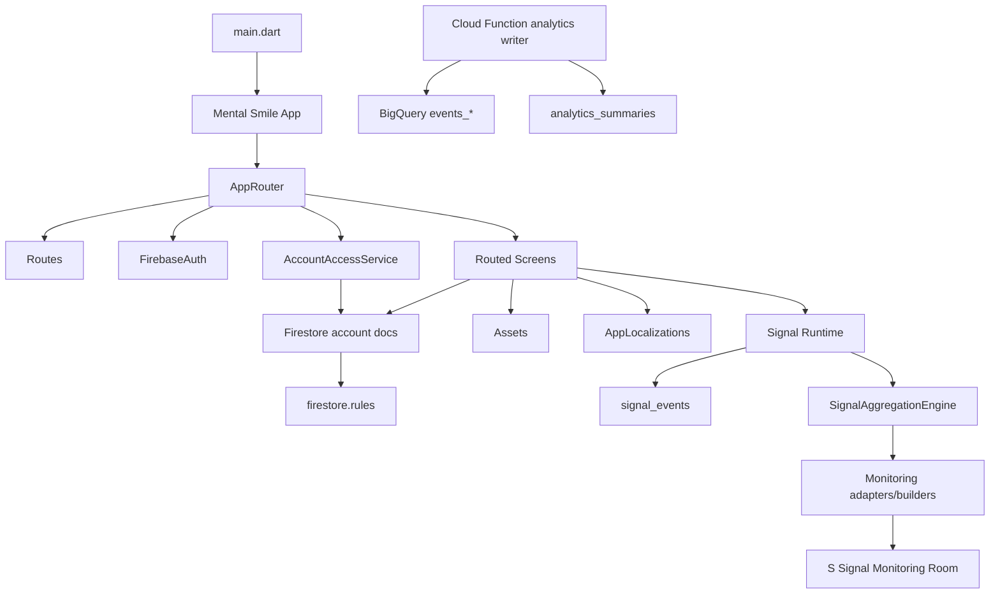

# Mental Smile Project Reality Snapshot

Extraction date: 2026-06-12  
Mode: observe only  
Source scope: current working tree filesystem plus git status for deleted/transitional surfaces  
Output purpose: future Guide generation and Governance mapping

## 0. Extraction Doctrine

This file records the actual system as it exists in the repository today. It does not propose a redesign. It does not refactor. It does not implement missing pieces.

Classification vocabulary:

| Classification | Meaning used in this snapshot |
| --- | --- |
| ACTIVE | Present in current filesystem and reachable or importable by active runtime code. |
| TRANSITIONAL | Present in current filesystem but partly duplicated, partly replaced, partly placeholder, or not fully wired. |
| LEGACY | Exposed by git status, docs, names, or old package shape as historical system residue. |
| FROZEN | Deleted from current working tree or explicitly write-disabled/holdback in rules, but still relevant to governance history. |
| ORPHANED | Present but no observed route, registry owner, or consumer. |
| UNKNOWN | Present but insufficient ownership or consumption evidence was found in this pass. |

Object fields used below:

| Field | Meaning |
| --- | --- |
| ID | Stable inferred identifier. |
| Name | Human-readable object name. |
| Type | Feature, route, screen, card, signal, registry, asset group, role, collection, tool, or integration. |
| Owner | Inferred governing role or surface. |
| Consumers | Screens, routes, services, registries, or docs consuming object. |
| Dependencies | Code, collections, assets, roles, or registries required by object. |
| Produces | Outputs, records, snapshots, signals, or UI. |
| Consumes | Inputs, Firestore data, user action, assets, or localization. |
| Surface | Public, residential, commercial, owner, monitoring, administrative, shared, or unknown. |
| Status | Observed runtime status. |
| Classification | ACTIVE, TRANSITIONAL, LEGACY, FROZEN, ORPHANED, UNKNOWN. |

## 1. System Topology

### Runtime Root Objects

| ID | Name | Type | Owner | Consumers | Dependencies | Produces | Consumes | Surface | Status | Classification |
| --- | --- | --- | --- | --- | --- | --- | --- | --- | --- | --- |
| app.main | Flutter application entry | Runtime | Shared platform | Flutter runtime | `lib/main.dart`, Firebase options, app shell | App boot | Firebase initialization, localization, router | Shared | Present | ACTIVE |
| app.router | AppRouter | Router | Shared platform | `MaterialApp` route generation | `Routes`, `FirebaseAuth`, `AccountAccessService`, `VisibilityReadiness`, screens | Route decisions, role gates, login redirects, blocked account redirects | `RouteSettings`, Firebase user, custom app-side access docs | Shared | Present and central | ACTIVE |
| app.routes | Routes | Route registry | Shared platform | `AppRouter`, screens, navigation buttons | Static constants | Route names | None | Shared | Present and central | ACTIVE |
| app.localization | AppLocalizations | Localization runtime | Shared language | UI screens | ARB files, generated Dart localizations | EN/AR text getters | Locale provider and Flutter localization | Shared | Generated and present | ACTIVE |
| app.assets | AppAssets | Asset registry | Shared visual system | Branding widgets | `assets/branding/*` | Logo asset constants | Asset files | Shared | Small code registry only | ACTIVE |
| app.design_system | App design system | UI kit | Shared visual system | Most screens | `AppColors`, widgets, asset fallback | Visual primitives, cards, shells, badges | Assets, theme constants | Shared | Present | ACTIVE |
| firebase.client | Firebase client SDK | Integration | Shared platform | Auth, Firestore services, signal storage | `firebase_core`, `firebase_auth`, `cloud_firestore` | Auth state, Firestore reads/writes | Project config in `firebase_options.dart` | Shared | Present | ACTIVE |
| firebase.functions | Scheduled analytics summary writer | Backend integration | Monitoring/admin | Firebase deployment | `functions/index.js`, BigQuery, Firestore Admin SDK | `analytics_summaries` docs | BigQuery Firebase Analytics export | Monitoring | Present | ACTIVE |
| firestore.rules | Firestore security rules | Policy surface | Owner/security | Firebase project | custom claims, rules functions | collection access policy | request auth token role, document data | Administrative | Present | ACTIVE |
| clean_core.package | `mental_smile_clean_core` dependency | Local package | Shared/core | pubspec dependency | local path package | Imported package capability | unknown in this pass | Shared | Present as local package | UNKNOWN |

### Feature Inventory by Runtime Files

| ID | Name | Type | Owner | Consumers | Dependencies | Produces | Consumes | Surface | Status | Classification |
| --- | --- | --- | --- | --- | --- | --- | --- | --- | --- | --- |
| feature.assistant | Assistant panel | Feature | Shared UX | Unknown direct route | UI kit | bounded assistant widget | none observed | Shared | 1 Dart file, no route | ORPHANED |
| feature.auth | Auth | Feature | Shared account | Login, client registration | Firebase Auth, Firestore, signals | login, client account docs, client signals | credentials, client signal selections | Shared/residential | Routed | ACTIVE |
| feature.centers | Centers | Feature | Center owner/commercial | center routes, center discovery, declaration review | Firestore centers, center model, pricing | center dashboards, lists, profile requests | center docs, profile forms | Commercial | Routed | ACTIVE |
| feature.chat | Chat | Feature | Support/safety | chat route, clinician inbox, escalation report | Firestore chat threads/messages/escalations, AI policy/service | chat threads, messages, escalations, reports | messages, participant uid, safety signals | Support/monitoring | Routed | ACTIVE |
| feature.client | Client dashboard | Feature | Residential | client dashboard route | Firestore clients/saved_destinations, locale provider, assets | client room UI, tool cards, signal summaries | client profile docs, saved destinations | Residential | Routed | ACTIVE |
| feature.clinician | Clinician room | Feature | Provider/commercial | clinician room route | Firestore clinicians/profile change requests | clinician operations room, profile request | clinician profile docs | Commercial | Routed | ACTIVE |
| feature.contact_requests | Contact requests | Feature | Support/commercial | center/specialist flows | Firestore provider/center request collections | contact request records | client/provider/center IDs | Commercial/support | Importable, repository present | ACTIVE |
| feature.home | Home/menu | Feature | Shared navigation | `/menu`, `/home` | routes, auth access, analytics, assets | menu cards, primary role shortcut | role docs, localization | Shared | Routed | ACTIVE |
| feature.language | Language page | Feature | Localization | `/language` | locale provider/storage | language selector | locale storage | Shared | Routed | ACTIVE |
| feature.library | Library | Feature | Residential/content | `/library`, `/web/library`, portal library | assets, signal metadata, analytics | library cards, policy page | category args, assets | Residential/public | Routed | ACTIVE |
| feature.localization | Federation localization | Feature/contracts | Localization owner | unknown direct route | models, registries | localization profiles/maps | report/contact language standards | Shared/governance | Importable only | TRANSITIONAL |
| feature.modules | Support modules | Feature | Residential/support | addiction, special needs, support selector | routes, Firestore support_requests | support entry cards, structured support requests | support type args, user selections | Residential/support | Routed | ACTIVE |
| feature.monitoring | Monitoring | Feature | Monitoring operator | `/s/capital/signal-monitoring-room`, signal pipelines | signals, aggregate registries | monitoring feeds, snapshots, reports | signal aggregates/packages | Monitoring | Present dual-path | TRANSITIONAL |
| feature.recommendations | Signal magnet recommendations | Feature/contracts | Residential/commercial intelligence | no direct route observed | signal/resource/candidate registries | recommendation candidate models | signal fingerprints/resources | Shared/intelligence | Importable, no route | TRANSITIONAL |
| feature.safety | Safety escalations | Feature | Support observer | `/chat/escalations` | Firestore chat_escalations | escalation list | escalation docs | Support/monitoring | Routed | ACTIVE |
| feature.saved_destinations | Saved destinations | Feature | Residential | client dashboard, repository consumers | Firestore saved_destinations, signal runtime | saved destination docs, destination_saved signal | save actions | Residential | Repository active | ACTIVE |
| feature.signals | Signals | Feature | Signal governance | registration, saved destinations, personal space, monitoring | signal registries, Firestore signal_events | signal packages/events/aggregates | user activity, signal metadata | Shared/monitoring | Active | ACTIVE |
| feature.specialists | Specialists | Feature | Provider/commercial | specialists routes | clinician catalog, Firestore clinicians | specialist categories/list/details | category args, clinician docs | Commercial/public | Routed | ACTIVE |
| feature.splash | Splash | Feature | Branding | `/splash` | branding assets | splash page | assets, locale | Shared | Routed | ACTIVE |
| feature.s_capital | Federation capital | Surface feature | Monitoring/admin | `/s/capital/*` | operations office page, monitoring room page | capital cards, monitoring cards | route focus enums | Monitoring/administrative | Routed | ACTIVE |
| feature.s_city | Public city | Surface feature | Public/commercial | `/s/city/*` | city district page, generic web surface page | city district cards | public route names | Public/commercial | Routed | ACTIVE |
| feature.s_owner | Sovereign owner | Surface feature | Owner | `/s/owner/*` | owner district focus enum | owner district cards, capsule cards | route focus | Owner | Routed and role-protected | ACTIVE |
| feature.s_personal_space | Personal space | Surface feature | Client | `/s/personal-space` | Firestore clients, signal board | personal cards, signal board | client doc, signal_events | Residential | Routed and role-protected | ACTIVE |
| feature.s_registry_room | Registry room | Surface feature | Registry steward/owner | `/s/registry-room` | system domain registry/service | registry domain cards | system_domains | Administrative/governance | Routed and role-protected | ACTIVE |
| feature.s_support_room | Support room | Surface feature | Support observer/owner | `/s/support-room` | support requests collection | support request cards | support_requests | Support/administrative | Routed and role-protected | ACTIVE |
| feature.s_declaration_review_room | Declaration review room | Surface feature | Declaration reviewer/owner | `/s/declaration-review-room` | clinicians, centers, profile change requests | declaration record cards, summary cards | declaration signals/profile docs | Administrative/commercial | Routed and role-protected | ACTIVE |
| feature.s_web_surfaces | Generic S web surface | Surface feature | Shared platform | public S routes placeholders | route metadata | surface navigation cards/placeholders | route descriptions/items | Public/shared | Routed for placeholder surfaces | TRANSITIONAL |
| feature.trust | Trust read model | Domain feature | Commercial trust | tests/providers | fake provider trust provider | provider trust summary | fixtures/maps | Commercial/governance | Importable, no route | TRANSITIONAL |
| feature.web_portal | Public portal skeleton | Feature | Public web | `/`, `/about`, `/request/*`, `/contact` | portal skeleton pages | public portal pages | none observed | Public | Routed skeleton | TRANSITIONAL |
| feature.web_registration | Web registration | Feature | Provider/center onboarding | web and alias registration routes | Firebase Auth/Firestore, declaration readiness, draft store | clinician/center registrations, readiness fields | forms, local draft storage, Firestore docs | Commercial/admin | Routed | ACTIVE |

## 2. Surface Topology

### Surface Objects

| ID | Name | Type | Owner | Consumers | Dependencies | Produces | Consumes | Surface | Status | Classification |
| --- | --- | --- | --- | --- | --- | --- | --- | --- | --- | --- |
| surface.public.portal | Public portal | Surface | Public/web owner | `Routes.portal*` | `PortalHomePage`, `PortalAboutPage`, request/contact pages | marketing/information screens | route navigation | Public | Skeleton | TRANSITIONAL |
| surface.public.city | Public City Web [S] | Surface | Public/commercial | `/s/city/*` | `SCityDistrictPage`, `SWebSurfacePage` | discovery placeholders for services/tools/library/providers/centers/orgs/programs/marketplace | route item lists | Public/commercial | Active placeholders | TRANSITIONAL |
| surface.residential.client_dashboard | Client dashboard | Surface | Client/residential | `/client/dashboard` | client Firestore doc, saved destinations, UI kit | client federation content, tool cards, signal summaries | `clients`, `saved_destinations` | Residential | Active | ACTIVE |
| surface.residential.personal_space | S Personal Space | Surface | Client/residential | `/s/personal-space` | client Firestore doc, `SignalCommunicationBoard` | personal overview, signal health, district cards, lane cards | `clients`, `signal_events` | Residential | Active | ACTIVE |
| surface.commercial.specialists | Specialist discovery | Surface | Provider/commercial | specialists module routes | Firestore clinicians, catalog assets | categories, lists, details | route args, clinician docs | Commercial/public | Active | ACTIVE |
| surface.commercial.centers | Center discovery | Surface | Center/commercial | centers module routes | Firestore centers, assets | center categories, lists, details | route args, center docs | Commercial/public | Active | ACTIVE |
| surface.commercial.registration | Web registration | Surface | Declaration/commercial | web and alias register routes | declaration readiness, Firestore clients/clinicians/centers | registration records, declaration signals | form steps | Commercial/admin | Active | ACTIVE |
| surface.provider.clinician_room | Clinician room | Surface | Clinician | `/clinician/room` | Firestore clinician doc | clinician operations room, profile request entry | clinician profile | Commercial/provider | Active | ACTIVE |
| surface.center.center_dashboard | Center dashboard | Surface | Center | `/center/dashboard` | Firestore centers | dashboard sections, gallery cards | center profile | Commercial/center | Active | ACTIVE |
| surface.center.center_room | Center room | Surface | Center | `/center/room` | Firestore centers/profile change requests | center operations room, edit request entry card | center profile | Commercial/center | Active | ACTIVE |
| surface.support.chat | Chat support | Surface | Support | `/chat` | Chat page, chat services | chat threads/messages, safety metadata | user messages | Support/residential | Active | ACTIVE |
| surface.support.safety | Safety escalations | Surface | Support observer | `/chat/escalations`, `/chat/escalation/report` | chat_escalations, reports subcollection | escalation cards/reports | escalation docs | Support/monitoring | Active | ACTIVE |
| surface.support.room | S Support Room | Surface | Support observer/owner | `/s/support-room` | support_requests collection | support request cards | support requests | Administrative/support | Active | ACTIVE |
| surface.monitoring.capital | Federation capital | Surface | Monitoring/admin | `/s/capital/*` | operations office page, signal monitoring page | control cards, district cards, monitoring cards | route focus and static content | Monitoring/administrative | Active | ACTIVE |
| surface.monitoring.signal_room | Signal monitoring room | Surface | monitoring_operator | `/s/capital/signal-monitoring-room` | signal/monitoring concepts | control cards, section cards | static monitoring doctrine | Monitoring | Active UI, no observed Firestore feed in page | TRANSITIONAL |
| surface.owner.district | Sovereign owner district | Surface | owner | `/s/owner/*` | owner focus enum | owner cards, district cards, capsule cards | route focus | Owner | Active and role protected | ACTIVE |
| surface.registry.room | Registry room | Surface | registry_steward/owner | `/s/registry-room` | domain registry/service | registry domain cards | system_domains docs | Administrative/governance | Active | ACTIVE |
| surface.declaration_review.room | Declaration review room | Surface | declaration_reviewer/owner | `/s/declaration-review-room` | clinicians, centers, profile change request collections | record cards, summary cards | profile declarations | Administrative | Active | ACTIVE |
| surface.localization | Localization registry/docs | Surface | Localization owner | generated l10n, docs/registry/localization | ARB, generated Dart, docs registries | localized strings and governance reports | hardcoded/generated strings | Shared/governance | Split between runtime and docs | TRANSITIONAL |

### Surface To Owner

| Surface | Owner |
| --- | --- |
| Public portal | Public/web owner unknown in code |
| Public City Web [S] | Public/commercial owner unknown in code |
| Client dashboard | client role |
| Personal space | client role |
| Library | client/public content owner unknown in code |
| Specialist discovery | provider/commercial owner unknown in code |
| Center discovery | center/commercial owner unknown in code |
| Web registration | clinician/center self-registration plus declaration reviewer governance |
| Clinician room | clinician role |
| Center dashboard/room | center role |
| Chat | signed-in participants, support observer for monitoring |
| Safety escalations | support_observer, recommended clinician for some reads |
| S Support Room | owner/support_observer |
| S Registry Room | owner/registry_steward |
| S Declaration Review Room | owner/declaration_reviewer |
| S Capital Signal Monitoring | monitoring_operator |
| S Owner District | owner |

## 3. Room Topology

| ID | Name | Type | Owner | Consumers | Dependencies | Produces | Consumes | Surface | Status | Classification |
| --- | --- | --- | --- | --- | --- | --- | --- | --- | --- | --- |
| room.client_dashboard | Client Dashboard Room | Room/screen | client | `Routes.clientDashboard` | Firestore `clients`, `saved_destinations` | header, theme catalog, active tools frame, signal grid, guidance grid | client signals, saved destinations | Residential | Active | ACTIVE |
| room.personal_space | Personal Space Room | Room/screen | client | `Routes.sPersonalSpace` | Firestore `clients`, `SignalCommunicationBoard` | personal overview card, signal summary, district cards, health card, signal board | client profile, signal events | Residential | Active | ACTIVE |
| room.clinician | Clinician Room | Room/screen | clinician | `Routes.clinicianRoom` | Firestore `clinicians`, profile change requests | clinician operations/profile edit request | clinician doc | Commercial/provider | Active | ACTIVE |
| room.center_dashboard | Center Dashboard | Room/screen | center | `Routes.centerDashboard` | Firestore `centers` | profile/dashboard/gallery sections | center doc | Commercial/center | Active | ACTIVE |
| room.center | Center Room | Room/screen | center | `Routes.centerRoom` | Firestore `centers`, `center_profile_change_requests` | center edit/profile request cards | center doc | Commercial/center | Active | ACTIVE |
| room.support | Support Room | Room/screen | support_observer/owner | `Routes.sSupportRoom` | `support_requests` | request cards | structured support requests | Support/admin | Active | ACTIVE |
| room.registry | Registry Room | Room/screen | registry_steward/owner | `Routes.sRegistryRoom` | `DomainStatusService`, `system_domains` | registry domain cards | domain status docs | Administrative | Active | ACTIVE |
| room.declaration_review | Declaration Review Room | Room/screen | declaration_reviewer/owner | `Routes.sDeclarationReviewRoom` | `clinicians`, `centers`, profile request collections | summary cards, declaration record cards | readiness/declaration signals | Administrative | Active | ACTIVE |
| room.signal_monitoring | Signal Monitoring Room | Room/screen | monitoring_operator | `Routes.sSignalMonitoringRoom` | static monitoring UI, signal concepts | section/control cards | no observed Firestore stream | Monitoring | UI active, data feed absent | TRANSITIONAL |
| room.owner | Owner District | Room/screen | owner | owner routes | `SOwnerDistrictPage` focus enum | owner overview, district cards, capsule cards | route focus | Owner | Active | ACTIVE |
| room.capital_operations | Capital Operations Office | Room/screen | admin/monitoring | capital routes | `SCapitalOperationsOfficePage` focus enum | capital overview, district cards | route focus | Monitoring/admin | Active | ACTIVE |
| room.city | City District | Room/screen | public/commercial | city route | `SCityDistrictPage` | city overview and district cards | static knowledge area lists | Public/commercial | Active | ACTIVE |
| room.chat | Chat Room | Room/screen | support/client | `/chat` | chat page, chat services | messages, safety metadata | thread args, entry context | Support | Active | ACTIVE |
| room.safety_escalations | Chat Escalations | Room/screen | support_observer | `/chat/escalations` | `chat_escalations` collection | escalation list cards | escalation docs | Support/monitoring | Active | ACTIVE |

## 4. Route Topology

### Route Registry

| Route ID | Path | Screen/Handler | Feature | Owner | Surface | Status | Classification |
| --- | --- | --- | --- | --- | --- | --- | --- |
| Routes.portalHome | `/` | `PortalHomePage` | web_portal | Public | Public portal | Routed | TRANSITIONAL |
| Routes.portalAbout | `/about` | `PortalAboutPage` | web_portal | Public | Public portal | Routed | TRANSITIONAL |
| Routes.portalLibrary | `/library` | `LibraryPage` | library | Public/content | Public/residential | Routed | ACTIVE |
| Routes.portalProviderRegister | `/register/provider` | `WebClinicianRegisterPortalPage` | web_registration | clinician/commercial | Public registration | Routed | ACTIVE |
| Routes.portalServiceRequest | `/request/service` | `PortalServiceRequestPage` | web_portal | Public | Public portal | Routed skeleton | TRANSITIONAL |
| Routes.portalPackageRequest | `/request/package` | `PortalPackageRequestPage` | web_portal | Public | Public portal | Routed skeleton | TRANSITIONAL |
| Routes.portalContact | `/contact` | `PortalContactPage` | web_portal | Public | Public portal | Routed skeleton | TRANSITIONAL |
| Routes.splash | `/splash` | `SplashPage` | splash | Branding | Shared | Routed | ACTIVE |
| Routes.sIndex | `/s` | `SSurfaceIndexPage` | s_web_surfaces | Shared | S index | Routed | ACTIVE |
| Routes.sPersonalSpace | `/s/personal-space` | `SPersonalSpacePage` | s_personal_space | client | Residential | Role protected | ACTIVE |
| Routes.sSupportRoom | `/s/support-room` | `SSupportRoomPage` | s_support_room | owner/support_observer | Support/admin | Role protected | ACTIVE |
| Routes.sRegistryRoom | `/s/registry-room` | `SRegistryRoomPage` | s_registry_room | owner/registry_steward | Administrative | Role protected | ACTIVE |
| Routes.sDeclarationReviewRoom | `/s/declaration-review-room` | `SDeclarationReviewRoomPage` | s_declaration_review_room | owner/declaration_reviewer | Administrative | Role protected | ACTIVE |
| Routes.sCityHome | `/s/city` | `SCityDistrictPage` | s_city | Public | Public city | Routed | ACTIVE |
| Routes.sCityServices | `/s/city/services` | `SWebSurfacePage` | s_web_surfaces | Public/commercial | Public city | Placeholder | TRANSITIONAL |
| Routes.sCityTools | `/s/city/tools` | `SWebSurfacePage` | s_web_surfaces | Public/commercial | Public city | Placeholder | TRANSITIONAL |
| Routes.sCityLibrary | `/s/city/library` | `SWebSurfacePage` | s_web_surfaces | Public/content | Public city | Placeholder | TRANSITIONAL |
| Routes.sCityProviders | `/s/city/providers` | `SWebSurfacePage` | s_web_surfaces | Provider/commercial | Public city | Placeholder | TRANSITIONAL |
| Routes.sCityCenters | `/s/city/centers` | `SWebSurfacePage` | s_web_surfaces | Center/commercial | Public city | Placeholder | TRANSITIONAL |
| Routes.sCityOrganizations | `/s/city/organizations` | `SWebSurfacePage` | s_web_surfaces | Public/commercial | Public city | Placeholder | TRANSITIONAL |
| Routes.sCityPrograms | `/s/city/programs` | `SWebSurfacePage` | s_web_surfaces | Public/programs | Public city | Placeholder | TRANSITIONAL |
| Routes.sCityMarketplace | `/s/city/marketplace` | `SWebSurfacePage` | s_web_surfaces | Commercial | Public city | Placeholder | TRANSITIONAL |
| Routes.sCapitalHome | `/s/capital` | `SCapitalOperationsOfficePage` | s_capital | Monitoring/admin | Capital | Routed | ACTIVE |
| Routes.sCapitalOperationsOffice | `/s/capital/operations-office` | `SCapitalOperationsOfficePage(focus: operationsOffice)` | s_capital | Monitoring/admin | Capital | Routed | ACTIVE |
| Routes.sCapitalIncidents | `/s/capital/incidents` | `SCapitalOperationsOfficePage(focus: incidents)` | s_capital | Monitoring/admin | Capital | Routed | ACTIVE |
| Routes.sCapitalMaintenance | `/s/capital/maintenance` | `SCapitalOperationsOfficePage(focus: maintenance)` | s_capital | Monitoring/admin | Capital | Routed | ACTIVE |
| Routes.sCapitalBroadcasts | `/s/capital/broadcasts` | `SCapitalOperationsOfficePage(focus: broadcasts)` | s_capital | Monitoring/admin | Capital | Routed | ACTIVE |
| Routes.sCapitalEmergencyBrief | `/s/capital/emergency-brief` | `SCapitalOperationsOfficePage(focus: emergencyBrief)` | s_capital | Monitoring/admin | Capital | Routed | ACTIVE |
| Routes.sSignalMonitoringRoom | `/s/capital/signal-monitoring-room` | `SSignalMonitoringRoomPage` | s_capital/monitoring | monitoring_operator | Monitoring | Role protected | ACTIVE |
| Routes.sCapitalDepartments | `/s/capital/departments` | `SWebSurfacePage` | s_web_surfaces | Administrative | Capital | Placeholder | TRANSITIONAL |
| Routes.sTrustSafety | `/s/capital/trust-safety` | `SWebSurfacePage` | s_web_surfaces/safety | support_observer | Capital/support | Role protected placeholder | TRANSITIONAL |
| Routes.sCapitalReports | `/s/capital/reports` | `SWebSurfacePage` | s_web_surfaces | monitoring_operator | Capital/reporting | Role protected placeholder | TRANSITIONAL |
| Routes.sOwnerHome | `/s/owner` | `SOwnerDistrictPage` | s_owner | owner | Owner | Role protected | ACTIVE |
| Routes.sOwnerRoom | `/s/owner/room` | `SOwnerDistrictPage(focus: ownerRoom)` | s_owner | owner | Owner | Role protected | ACTIVE |
| Routes.sSovereignIntelligence | `/s/owner/sovereign-intelligence` | `SOwnerDistrictPage(focus: executiveIntelligence)` | s_owner | owner | Owner | Role protected | ACTIVE |
| Routes.sStrategicMemory | `/s/owner/strategic-memory` | `SOwnerDistrictPage(focus: strategicMemory)` | s_owner | owner | Owner | Role protected | ACTIVE |
| Routes.sSovereignVault | `/s/owner/sovereign-vault` | `SOwnerDistrictPage(focus: sovereignVault)` | s_owner | owner | Owner | Role protected | ACTIVE |
| Routes.sConstitutionalMemory | `/s/owner/constitutional-memory` | `SOwnerDistrictPage(focus: constitutionalMemory)` | s_owner | owner | Owner | Role protected | ACTIVE |
| Routes.sRecoveryConsole | `/s/owner/recovery-console` | `SOwnerDistrictPage(focus: recoveryConsole)` | s_owner | owner | Owner | Role protected | ACTIVE |
| Routes.sOwnerCapsules | `/s/owner/capsules` | `SOwnerDistrictPage(focus: capsules)` | s_owner | owner | Owner | Role protected | ACTIVE |
| Routes.sOwnerRegeneration | `/s/owner/regeneration` | `SOwnerDistrictPage(focus: regenerationBoard)` | s_owner | owner | Owner | Role protected | ACTIVE |
| Routes.webCenterRegister | `/web/center/register` | `WebCenterRegisterPortalPage` | web_registration | center | Commercial registration | Routed | ACTIVE |
| Routes.webCenterProfile | `/web/center/profile` | `WebCenterProfilePage` | web_registration | center | Commercial registration | Routed | ACTIVE |
| Routes.webCenterMedia | `/web/center/media` | `WebCenterMediaPage` | web_registration | center | Commercial registration | Routed | ACTIVE |
| Routes.webCenterPricing | `/web/center/pricing` | `WebCenterPricingPage` | web_registration | center | Commercial registration | Routed | ACTIVE |
| Routes.webCenterDocuments | `/web/center/documents` | `WebCenterDocumentsPage` | web_registration | center | Commercial registration | Routed | ACTIVE |
| Routes.webClinicianRegister | `/web/clinician/register` | `WebClinicianRegisterPortalPage` | web_registration | clinician | Commercial registration | Routed | ACTIVE |
| Routes.webClinicianProfile | `/web/clinician/profile` | `WebClinicianProfilePage` | web_registration | clinician | Commercial registration | Routed | ACTIVE |
| Routes.webClinicianDocuments | `/web/clinician/documents` | `WebClinicianDocumentsPage` | web_registration | clinician | Commercial registration | Routed | ACTIVE |
| Routes.webLibrary | `/web/library` | `LibraryPage` | library | content | Web/residential | Routed | ACTIVE |
| Routes.webLibraryPolicy | `/web/library/policy` | `LibraryPolicyPage` | library | content/legal | Web/residential | Routed | ACTIVE |
| Routes.webRegistrationSuccess | `/web/register/success` | `WebRegistrationSuccessPage` | web_registration | clinician/center | Registration | Routed | ACTIVE |
| Routes.language | `/language` | `MkLanguagePage` | language | localization | Shared | Routed | ACTIVE |
| Routes.home | `/home` | `MenuPage` | home | shared | Shared | Alias to menu | ACTIVE |
| Routes.login | `/login` | `LoginPage` | auth | shared account | Shared | Routed | ACTIVE |
| Routes.blockedAccount | `/account-blocked` | `AccountBlockedPage` | auth/core | shared account | Shared/security | Protected | ACTIVE |
| Routes.menu | `/menu` | `MenuPage` | home | shared | Shared | Routed | ACTIVE |
| Routes.clientRegister | `/register/client` | `ClientRegisterPage` | auth | client | Residential registration | Routed | ACTIVE |
| Routes.clinicianRegister | `/register/clinician` | `WebClinicianRegisterPortalPage` | web_registration | clinician | Alias | Routed alias | ACTIVE |
| Routes.centerRegister | `/register/center` | `WebCenterRegisterPortalPage` | web_registration | center | Alias | Routed alias | ACTIVE |
| Routes.clinicianRoom | `/clinician/room` | `ClinicianRoomPage` | clinician | clinician | Provider | Role protected | ACTIVE |
| Routes.clinicianProfileEditRequest | `/clinician/profile-edit-request` | `ClinicianProfileEditRequestPage` | clinician | clinician | Provider | Role protected | ACTIVE |
| Routes.clinicianChatInbox | `/clinician/chat-inbox` | `ClinicianChatInboxPage` | chat/clinician | clinician | Provider/support | Role protected | ACTIVE |
| Routes.clientDashboard | `/client/dashboard` | `ClientDashboardPage` | client | client | Residential | Role protected | ACTIVE |
| Routes.centerDashboard | `/center/dashboard` | `CenterDashboardPage` | centers | center | Center | Role protected | ACTIVE |
| Routes.centerRoom | `/center/room` | `CenterRoomPage` | centers | center | Center | Role protected | ACTIVE |
| Routes.centerProfileEditRequest | `/center/profile-edit-request` | `CenterProfileEditRequestPage` | centers | center | Center | Role protected | ACTIVE |
| Routes.chat | `/chat` | `ChatPage` | chat | support/shared | Support | Public/support entry, argument driven support room mode | ACTIVE |
| Routes.chatEscalations | `/chat/escalations` | `ChatEscalationsPage` | safety | support_observer | Support monitoring | Role protected | ACTIVE |
| Routes.chatEscalationReport | `/chat/escalation/report` | `ChatEscalationReportPage` | chat/safety | support_observer/recommended clinician | Support monitoring | Requires escalationId arg | ACTIVE |
| Routes.addiction | `/module/addiction` | `SupportEntryPage.addiction` | modules | residential support | Residential | Routed | ACTIVE |
| Routes.specialNeeds | `/module/special_needs` | `SupportEntryPage.specialNeeds` | modules | family support | Residential | Routed | ACTIVE |
| Routes.supportIssueSelector | `/module/support-issue-selector` | `SupportIssueSelectorPage` | modules | support | Support | Validates supportType arg | ACTIVE |
| Routes.specialists | `/module/specialists` | `SpecialistsCategoriesPage` | specialists | provider/commercial | Commercial | Routed | ACTIVE |
| Routes.specialistsList | `/module/specialists/list` | `SpecialistsListPage` | specialists | provider/commercial | Commercial | Requires args map | ACTIVE |
| Routes.specialistDetails | `/module/specialists/details` | `SpecialistDetailsPage` | specialists | provider/commercial | Commercial | Requires args map | ACTIVE |
| Routes.centers | `/module/centers` | `CentersLandingPage` | centers | center/commercial | Commercial | Routed | ACTIVE |
| Routes.centersList | `/module/centers/list` | `CentersListPage` | centers | center/commercial | Commercial | Requires category arg | ACTIVE |
| Routes.centerDetails | `/module/centers/details` | `CenterDetailsPage` | centers | center/commercial | Commercial | Accepts CenterModel or centerId | ACTIVE |
| Routes.library | `/module/library` | `LibraryPage` | library | content | Residential | Routed | ACTIVE |

### Route Protection Matrix

| Route set | Required role(s) | Gate behavior |
| --- | --- | --- |
| Owner routes | `owner` | Requires non-anonymous sign-in, resolves account, blocks if role mismatch or blocked. |
| Signal monitoring/report routes | `monitoring_operator` | Requires non-anonymous sign-in and role match. |
| Support observer routes | `support_observer` | Used for trust-safety, chat escalations, escalation report. |
| Support room | `owner`, `support_observer` | Scoped protected route. |
| Registry room | `owner`, `registry_steward` | Scoped protected route. |
| Declaration review room | `owner`, `declaration_reviewer` | Scoped protected route. |
| Clinician routes | `clinician` | Also requires visibility readiness ready for clinician role. |
| Center routes | `center` | Also requires visibility readiness ready for center role. |
| Client routes | `client` | Requires non-anonymous sign-in and role match. |

## 5. Card Topology

### Screen To Cards

| Screen | Cards / card-like objects | Signals | Consumers | Status | Classification |
| --- | --- | --- | --- | --- | --- |
| `MenuPage` | `_MenuCardData`, `_MenuCircleButton`, `_MenuLibraryTeaserHearts`, `_MenuComingSoonHeart`, `_FloatingProfileButton` | analytics `module_entry`, `path_selected`, chat open context | public/shared navigation | Active | ACTIVE |
| `ClientDashboardPage` | `_ThemeCatalogCard`, `_ToolCard`, `_SignalSummaryCard`, `_SavedSummaryCard`, `_NextStepsCard`, `_GuidanceCard`, `_Panel`, `_SignalChip`, `_StepTile` | consumes clientSignals, enabledToolKeys, saved_destinations | client | Active | ACTIVE |
| `SPersonalSpacePage` | `_PersonalSpaceOverviewCard`, `_SignalSummaryCard`, `_SignalHealthCard`, `_PersonalDistrictCard`, `_PlaceholderDistrictCard`, `_SurfaceCard`, `SignalCommunicationBoard` lanes | consumes `signal_events`; displays signal health | client | Active | ACTIVE |
| `SignalCommunicationBoard` | `_LaneCard` x4: Signal Notes, Safety Notices, Recommendations, Resource Updates | consumes latest `SignalPackage` objects; branches on `destination_saved`, `goal_selected`, interest target IDs | personal space | Active | ACTIVE |
| `SCapitalOperationsOfficePage` | `_CapitalOverviewCard`, `_CapitalCard`, `_DistrictCard` | static operational monitoring concepts | capital routes | Active UI | ACTIVE |
| `SSignalMonitoringRoomPage` | `_ControlCard`, `_SectionCard` | static sections for signal monitoring | monitoring operator | Active UI, no observed stream | TRANSITIONAL |
| `SCityDistrictPage` | `_CityOverviewCard`, `_CityCard`, `_DistrictCard` | static discovery concepts | public city | Active UI | ACTIVE |
| `SOwnerDistrictPage` | `_OwnerOverviewCard`, `_OwnerCard`, `_DistrictCard`, `_CapsuleCard` | static owner/governance concepts | owner routes | Active | ACTIVE |
| `SRegistryRoomPage` | `_RegistryDomainCard` | consumes domain status docs | registry room | Active | ACTIVE |
| `SSupportRoomPage` | `_SupportRequestCard` | consumes support request docs | support room | Active | ACTIVE |
| `SDeclarationReviewRoomPage` | `_DeclarationRecordCard`, `_SummaryCard` | consumes declaration/profile signals | declaration review room | Active | ACTIVE |
| `SWebSurfacePage` / `SSurfaceIndexPage` | `_SurfaceNavigationCard`, generic surface item cards | none observed | S placeholder routes | Active placeholders | TRANSITIONAL |
| `LibraryPage` | `_LibraryFeaturedHeartCard`, `_LibraryCarouselCard` | library category opened via signal factory elsewhere; analytics path selection | library routes | Active | ACTIVE |
| `LibraryPolicyPage` | `_PolicyCard` | none observed | library policy route | Active | ACTIVE |
| `SupportEntryPage` | `_SupportPathCard`, `_AddictionCard` | support path selection can lead to support request/chat | addiction/special needs routes | Active | ACTIVE |
| `CentersLandingPage` | `_CenterCategoryCard` | center discovery route selections | centers module | Active | ACTIVE |
| `CenterDetailsPage` | `_sectionCard`, `_MiniContactCard`, `_GridInfoCard` | center profile open/contact signals possible via repository/factory | center details | Active | ACTIVE |
| `CenterDashboardPage` | `_SectionCard`, `_CenterGalleryCard` | readiness/profile signals | center dashboard | Active | ACTIVE |
| `CenterRoomPage` | `_buildProfileEditRequestEntryCard`, section cards | declaration/profile change request signals | center room | Active | ACTIVE |
| `SpecialistsCategoriesPage` | `_SpecialistCategoryCard` | specialist/category discovery | specialists module | Active | ACTIVE |
| `SpecialistDetailsPage` | `_InfoMiniCard` | provider profile/contact signals possible via repository/factory | specialist details | Active | ACTIVE |
| `WebClinicianRegisterPortalPage` | `_ProviderSignalOption` sections | providerSignals, declaration readiness | registration | Active | ACTIVE |
| `ClientRegisterPage` | `_ClientSignalOption`, `_ClientSignalSection` | emits goal, interest, accessibility, communication signals | client registration | Active | ACTIVE |
| `WebCenter*` pages | center form sections, media/pricing/document readiness cards | center declaration signals | center registration | Active | ACTIVE |

### Card Ownership

| Card family | Owner | Registry present? | Signal relationship | Classification |
| --- | --- | --- | --- | --- |
| Client dashboard cards | Client/residential | No runtime card registry; docs contain `S_CARD_REGISTRY_V1.md` | Consume `clientSignals`, saved destinations | ACTIVE with missing runtime registry |
| Personal space cards | Client/residential | No runtime card registry | Consume `clients`, `signal_events` | ACTIVE with missing runtime registry |
| Signal board lane cards | Signal governance/residential | No runtime card registry | Consume `SignalPackage` stream | ACTIVE |
| S capital cards | Monitoring/admin | No runtime card registry | Static signal doctrine | TRANSITIONAL |
| Owner capsule cards | Owner | Docs/legacy owner capsule registry deleted from lib | Static capsules: Commercial, Residential, Monitoring, Archive | TRANSITIONAL |
| Support request cards | Support observer | No runtime card registry | Consume support request docs | ACTIVE |
| Declaration record cards | Declaration reviewer | No runtime card registry | Consume declaration/profile request docs | ACTIVE |
| Menu module cards | Shared navigation | No runtime card registry | Analytics only | ACTIVE |
| Library cards | Content/residential | No runtime card registry | Category/path analytics | ACTIVE |
| Registration signal option cards | Declaration/commercial/residential | No runtime card registry | Produce declaration/client/provider/center signals | ACTIVE |

## 6. Signal Topology

### Signal Registries

| ID | Name | Type | Owner | Consumers | Dependencies | Produces | Consumes | Surface | Status | Classification |
| --- | --- | --- | --- | --- | --- | --- | --- | --- | --- | --- |
| registry.signal_type | SignalTypeRegistry | Signal registry | Signal governance | factories, validators, monitoring adapters | none | 11 canonical runtime signal types | none | Shared | Active | ACTIVE |
| registry.signal_category | SignalCategoryRegistry | Signal registry | Signal governance | factories, aggregation engine | none | 12 signal categories | none | Shared | Active | ACTIVE |
| registry.signal_routing_target | SignalRoutingTarget | Signal registry | Signal governance | factories | none | 5 routing targets | none | Shared/monitoring | Active | ACTIVE |
| registry.signal_privacy_level | SignalPrivacyLevel | Signal registry | Signal governance | factories, validators | none | 4 privacy levels | none | Shared/security | Active | ACTIVE |
| registry.signal_retention_class | SignalRetentionClass | Signal registry | Signal governance | factories | none | 4 retention classes | none | Shared/governance | Active | ACTIVE |
| registry.signal_aggregation_category | SignalAggregationCategoryRegistry | Signal registry | Signal governance | aggregation engine, monitoring validator | none | 6 aggregate categories | none | Monitoring | Active | ACTIVE |
| registry.residential_monitoring | ResidentialMonitoringRegistry | Monitoring registry | Monitoring operator/residential | residential router | SignalTypeRegistry | signal-to-aggregate kind mapping | signal type | Residential monitoring | Active | ACTIVE |
| registry.commercial_monitoring | CommercialMonitoringRegistry | Monitoring registry | Monitoring operator/commercial | commercial router | SignalTypeRegistry | commercial signal groups | signal type | Commercial monitoring | Active | ACTIVE |
| registry.monitoring_category_residential | ResidentialMonitoringCategoryRegistry | Monitoring category registry | Monitoring operator | generic monitoring adapter | none | readable residential feed categories | none | Monitoring | Active | ACTIVE |
| registry.monitoring_category_commercial | CommercialMonitoringCategoryRegistry | Monitoring category registry | Monitoring operator | generic monitoring adapter | none | readable commercial feed categories | none | Monitoring | Active | ACTIVE |
| registry.recommendation_candidate | RecommendationCandidateRegistry | Recommendation registry | Intelligence/recommendations | signal magnet models | none | required candidate fields | none | Intelligence | Contract only | TRANSITIONAL |
| registry.resource_fingerprint | ResourceFingerprintRegistry | Recommendation registry | Intelligence/recommendations | signal magnet models | none | required resource fields | none | Intelligence | Contract only | TRANSITIONAL |
| registry.signal_fingerprint | SignalFingerprintRegistry | Recommendation registry | Intelligence/recommendations | signal magnet models | none | required signal fingerprint fields | none | Intelligence | Contract only | TRANSITIONAL |
| docs.signal_registry | docs/registry/SIGNAL_REGISTRY_V1.md | Documentation registry | Governance | docs | docs only | declared signal documentation | none | Governance | Present docs | TRANSITIONAL |
| docs.client_signal_registry | docs/registry/CLIENT_SIGNAL_REGISTRY_V1.md | Documentation registry | Governance | docs | docs only | client signal documentation | none | Governance | Present docs | TRANSITIONAL |

### Runtime Signal Types

| Signal ID | Category | Domain | Default Source | Target Type | Routing Target | Producer | Consumer | Classification |
| --- | --- | --- | --- | --- | --- | --- | --- | --- |
| `goal_selected` | goal | residential | `client_room` | `client_signal` | `residential_monitoring` | Client registration factory | Residential monitoring, signal board | ACTIVE |
| `interest_selected` | interest | residential | `client_room` | `client_signal` | `residential_monitoring` | Client registration factory | Residential monitoring, signal board recommendations | ACTIVE |
| `accessibility_interest` | accessibility | residential | `client_room` | `client_signal` | `residential_monitoring` | Client registration factory | Residential monitoring | ACTIVE |
| `communication_preference_selected` | communication | residential | `client_room` | `client_signal` | `residential_monitoring` | Client registration factory | Signal events, no aggregation category in engine | TRANSITIONAL |
| `destination_saved` | destination | residential | `saved_destinations` | provider/center/libraryItem/tool | `residential_monitoring` | SavedDestinationRepository | Signal board, monitoring | ACTIVE |
| `provider_contact_started` | contact | commercial | `provider_contact_requests` | provider | `commercial_monitoring` | SignalPackageFactory | Commercial monitoring | ACTIVE |
| `center_contact_started` | contact | commercial | `center_contact_requests` | center | `commercial_monitoring` | SignalPackageFactory | Commercial monitoring | ACTIVE |
| `support_started` | support | support | `support_requests` | support | `support_monitoring` | SignalPackageFactory | Residential monitoring registry includes support, generic aggregation engine lacks support category | TRANSITIONAL |
| `library_category_opened` | library | residential | `library` | library_category | `residential_monitoring` | SignalPackageFactory | Residential monitoring | ACTIVE |
| `provider_profile_opened` | capability | commercial | `provider_discovery` | provider | `commercial_monitoring` | SignalPackageFactory | Commercial monitoring registry | ACTIVE |
| `center_profile_opened` | capability | commercial | `center_discovery` | center | `commercial_monitoring` | SignalPackageFactory | Commercial monitoring registry | ACTIVE |

### Declaration Signals

| Signal group | Signal IDs | Producer | Consumer | Status | Classification |
| --- | --- | --- | --- | --- | --- |
| Client self-expression | `need_specialist`, `need_center`, `recovery_support`, `family_guidance`, `general_help`, interests, accessibility, communication | `ClientRegisterPage` | `clients.clientSignals`, signal runtime emits first selected per group | Active | ACTIVE |
| Clinician readiness required | `clinician.identity.role_declared`, `display_name`, `email`, `professional_title`, `specialty`, `documents.submitted`, `documents.identity_file`, `documents.certificate_file` | `DeclarationReadiness.clinicianPayload` | Firestore clinicians doc, route visibility readiness | Active | ACTIVE |
| Clinician readiness optional/extra | `clinician.profile.photo`, `bio`, provider signal groups, extra file, safety.not_blocked | `DeclarationReadiness.clinicianPayload` | readiness metadata | Present but not all required | ACTIVE |
| Center readiness required | `center.identity.role_declared`, `name`, `email`, `category`, `center_type`, `profile.manager_name`, `profile.phone`, `location.city`, `location.address`, `profile.description`, media slots, pricing.ready, documents, documents.ready | `DeclarationReadiness.centerPayload` | Firestore centers doc, route visibility readiness | Active | ACTIVE |
| Center readiness optional/extra | `center.profile.whatsapp`, `location.area`, `capability.detox_unit`, `signals.capabilities`, safety.not_blocked | `DeclarationReadiness.centerPayload` | readiness metadata | Present but not all required | ACTIVE |
| Chat safety signals | `recommendedSignals`, `routingSignals`, `safetyEscalationLevel`, risk/safety fields | Chat AI/service and chat Firestore service | `chat_escalations`, `chat_threads` | Active | ACTIVE |

### Signal Ownership

| Signal family | Owner | Consumer | Missing ownership? |
| --- | --- | --- | --- |
| Client self-expression | Client/residential | Client dashboard, residential monitoring, personal space | Runtime registry for option keys absent. |
| Provider declaration | Declaration/commercial | Clinician profile, declaration review | Option keys live inside page, not registry. |
| Center declaration | Declaration/commercial | Center profile, declaration review | Option keys partly page/domain, no unified registry. |
| Saved destination | Client/residential | saved destinations repository, residential monitoring | Owner clear. |
| Contact request | Commercial/support | contact request repository, commercial monitoring | Owner partially implicit. |
| Chat safety | Support observer/safety | chat escalation pages, Firestore rules | Owner clear in rules but not centralized registry. |
| Monitoring aggregate | Monitoring operator | monitoring adapters/builders/pages | Dual registry paths create ownership drift. |

## 7. Asset Topology

### Runtime Asset Groups

| ID | Name | Type | Owner | Consumers | Dependencies | Produces | Consumes | Surface | Status | Classification |
| --- | --- | --- | --- | --- | --- | --- | --- | --- | --- | --- |
| assets.branding.root | `assets/branding/*.png` | Asset group | Branding/shared | logos, splash/menu/client pages | pubspec asset dirs | logos and core brand visuals | image files | Shared | Present | ACTIVE |
| assets.branding.shared | `assets/branding/shared/logo`, shared navigation | Asset group | Branding/shared | shell actions/navigation | pubspec | shared logo/back/logout visuals | image files | Shared | Present | ACTIVE |
| assets.branding.menu | menu desktop/tablet/mobile backgrounds | Asset group | Shared navigation | `MenuPage` | pubspec | menu background | image files | Shared | Present | ACTIVE |
| assets.branding.client_dashboard | client dashboard responsive backgrounds | Asset group | Residential | client dashboard | pubspec | dashboard backgrounds | image files | Residential | Present | ACTIVE |
| assets.branding.library | library cards/backgrounds | Asset group | Content/residential | `LibraryPage` | pubspec | library visuals | image files | Residential/public | Present duplicated with web path | TRANSITIONAL |
| assets.branding.web.library | web library cards/backgrounds | Asset group | Public/content | web library | pubspec | web library visuals | image files | Public/content | Present duplicated with non-web path | TRANSITIONAL |
| assets.branding.web.registration.centers | center registration responsive step images | Asset group | Center onboarding | web center registration pages | pubspec | center registration visuals | image files | Commercial registration | Present | ACTIVE |
| assets.branding.web.registration.clinicians | clinician registration responsive step images | Asset group | Provider onboarding | web clinician registration pages | pubspec | clinician registration visuals | image files | Commercial registration | Present | ACTIVE |
| assets.branding.web_registration | legacy alternate web_registration path | Asset group | Registration/legacy | pubspec still includes both paths | duplicated path naming | same step visuals | image files | Commercial registration | Present duplicate | TRANSITIONAL |
| assets.c5 | C5 visual asset system | Asset group | Legacy visual system | pubspec, docs manifests | `ASSETS_C5_MANIFEST.json` | avatars/icons/status/buttons/badges | image files | Shared/legacy | Present | LEGACY |
| assets.c6_library | C6 library visual system | Asset group | Library/content | pubspec | `ASSETS_C6_LIBRARY_MANIFEST.json` | library hero/categories/states/ui | image files | Residential/content | Present | ACTIVE |
| assets.c7_branding | C7 branding system | Asset group | Branding | pubspec | logo/home/buttons/splash | image files | Shared/branding | Present | TRANSITIONAL |
| assets.images.addiction | addiction support images | Asset group | Residential support | SupportEntryPage/modules | pubspec | support action visuals | image files | Residential | Present | ACTIVE |
| assets.images.family_support | family support images | Asset group | Residential family support | SupportEntryPage/modules | pubspec | support action visuals | image files | Residential | Present | ACTIVE |
| assets.images.specialists | specialist category images | Asset group | Commercial provider | specialists pages | pubspec | specialist category visuals | image files | Commercial | Present | ACTIVE |
| assets.images.centers | center category images | Asset group | Commercial center | centers pages | pubspec | center category visuals | image files | Commercial | Present | ACTIVE |
| assets.images.dashboard.actions | center/client/clinician action assets | Asset group | Role dashboards | dashboard pages | pubspec | dashboard action visuals | image files | Role surfaces | Present | ACTIVE |
| assets.animations | animations folder | Asset group | Unknown | pubspec includes folder | `.gitkeep` only observed | none | none | Unknown | Empty | ORPHANED |
| assets.icons | icons folder | Asset group | Unknown | pubspec includes folder | `.gitkeep` only observed | none | none | Unknown | Empty | ORPHANED |

### Asset Ownership Focus

| Domain | Assets | Owner | Status |
| --- | --- | --- | --- |
| Residential assets | client dashboard backgrounds, library visuals, addiction/family support images, personal-space UI via code | Client/content owner | Active but duplicated library paths. |
| Commercial assets | specialist images, center images, web registration center/clinician step visuals | Commercial onboarding/provider/center | Active. |
| Monitoring assets | no dedicated runtime monitoring image group observed; docs registry has monitoring room assets | Monitoring operator | Missing runtime asset group. |
| Owner assets | no dedicated runtime owner image group observed; owner room is code-rendered | Owner | Missing runtime asset group. |
| Administrative assets | navigation/back/logout/logo shared assets | Shared admin/navigation | Active. |
| Shared assets | branding root, shared logo/navigation, C7 branding, UI kit | Shared branding | Active/transitional. |
| Legacy assets | C5, duplicated `web_registration` vs `web/registration`, deleted `admin_control_room_bg.png` | Legacy/governance | Present/deleted mix. |

## 8. Tool Topology

| ID | Name | Type | Owner | Consumers | Dependencies | Produces | Consumes | Surface | Status | Classification |
| --- | --- | --- | --- | --- | --- | --- | --- | --- | --- | --- |
| tool.client.active_tools | Client active tools frame | UI tool surface | client | `ClientDashboardPage` | `_ToolSpec`, enabledToolKeys | tool cards | `clients.enabledToolKeys` | Residential | Active UI | ACTIVE |
| tool.client.add_tool_placeholder | Add Tool | UI tool placeholder | client | `_ToolSpec.fromKey` fallback | `_ToolCard` | add-tool tile | none | Residential | Placeholder | TRANSITIONAL |
| tool.client.library | Library tool | UI tool | client/content | client dashboard | `Routes.library` | navigation action | route | Residential | Active | ACTIVE |
| tool.client.saved | Saved destinations tool | UI tool | client | client dashboard | `saved_destinations` | saved summary | saved docs | Residential | Active | ACTIVE |
| tool.client.support | Support tool | UI tool | client/support | client dashboard/sidebar | support route | support navigation | supportType | Residential/support | Active | ACTIVE |
| tool.client.city | City/explore tool | UI tool | client/public | client dashboard | city routes | navigation | route | Residential/public | Active or placeholder depending key | TRANSITIONAL |
| tool.signal_board | Signal communication board | Monitoring/communication tool | client/signal governance | personal space | Firestore `signal_events` | four lane cards | latest signals | Residential/monitoring | Active | ACTIVE |
| tool.analytics_summary_writer | BigQuery analytics summary writer | Backend tool | Monitoring/admin | Firebase scheduler | BigQuery events, Firestore Admin | `analytics_summaries` docs | GA4 event export | Monitoring | Active if deployed/env configured | ACTIVE |
| tool.domain_status_seeder | Domain status seeder | Dev/admin tool | Owner/registry | dev only | Firestore `system_domains` | seed docs | domain registry | Administrative | Present dev tool | TRANSITIONAL |
| tool.ai_policy_seeder | AI policy seeder | Dev/admin tool | Admin/AI policy | dev only | Firestore `ai_policies` | seed docs | local seed data | Administrative | Present dev tool | TRANSITIONAL |
| tool.deleted_tool_registry | Deleted tool registry | Runtime registry | Unknown/tool_meter | git status deleted | deleted `lib/features/tools/tool_registry.dart` | none current | none | Tool governance | Deleted | FROZEN |
| tool.deleted_tool_meter | Deleted tool meter federation | Monitoring/commercial tool registry | Monitoring/commercial | git status deleted | deleted tool_meter package | none current | none | Monitoring/commercial | Deleted | FROZEN |

## 9. Registry Topology

### Runtime Registries

| ID | Name | Type | Owner | Consumers | Dependencies | Produces | Consumes | Surface | Status | Classification |
| --- | --- | --- | --- | --- | --- | --- | --- | --- | --- | --- |
| registry.routes | `Routes` | Route registry | Shared platform | `AppRouter`, navigation widgets | none | route constants | none | Shared | Active | ACTIVE |
| registry.roles | `RoleNames` | Role registry | Auth/governance | role gateway, access gates | none | role constants | none | Shared/admin | Active | ACTIVE |
| registry.reviewer_types | `ReviewerTypes` | Contract registry | Declaration/review | review/domain consumers | none | reviewer constants | none | Administrative | Active | ACTIVE |
| registry.request_kinds | `RequestKinds` | Contract registry | Request governance | contact/request consumers | none | request kind constants | none | Shared | Active | ACTIVE |
| registry.pricing_units | `PricingUnits` | Contract registry | Commercial | center pricing | none | pricing units | none | Commercial | Active | ACTIVE |
| registry.center_types | `CenterTypes` | Contract registry | Center/commercial | center registration/details | none | center type constants | none | Commercial | Active | ACTIVE |
| registry.domain | `DomainRegistry` | System domain registry | owner/registry_steward | domain status service, registry room | domain definitions/capabilities | domain definitions | none | Administrative | Active | ACTIVE |
| registry.domain_status | `DomainStatus` | Status registry/model | owner/registry_steward | domain status service | Firestore `system_domains` | status objects | Firestore docs | Administrative | Active | ACTIVE |
| registry.visibility_readiness | `VisibilityReadiness` | Visibility status registry | Declaration/security | route gate/account access | Firestore account docs | readiness enum/value | account docs | Shared/security | Active | ACTIVE |
| registry.assets.app | `AppAssets` | Asset registry | Branding | logo widgets | asset paths | logo constants | none | Shared | Active but minimal | ACTIVE |
| registry.signal_type | `SignalTypeRegistry` | Signal registry | Signal governance | signals/monitoring | none | signal constants | none | Shared | Active | ACTIVE |
| registry.monitoring.residential | `ResidentialMonitoringRegistry` | Monitoring registry | Monitoring/residential | residential router | SignalTypeRegistry | signal grouping | signal type | Monitoring | Active | ACTIVE |
| registry.monitoring.commercial | `CommercialMonitoringRegistry` | Monitoring registry | Monitoring/commercial | commercial router | SignalTypeRegistry | signal grouping | signal type | Monitoring | Active | ACTIVE |
| registry.recommendations | signal magnet registries | Recommendation registries | Intelligence | recommendation models | none | required fields | none | Intelligence | Contract-only | TRANSITIONAL |
| registry.localization.report | `ReportLocalizationMap` | Localization registry | Localization | unknown direct route | localized models | report localization map | none | Governance | Importable | TRANSITIONAL |
| registry.localization.contact_language | `ContactLanguageStandard` | Localization registry | Localization | unknown direct route | localized models | contact language standard | none | Governance | Importable | TRANSITIONAL |

### Documentation Registries

| Registry path | Domain | Status | Classification |
| --- | --- | --- | --- |
| `docs/registry/SIGNAL_REGISTRY_V1.md` | Signals | Present | TRANSITIONAL |
| `docs/registry/CLIENT_SIGNAL_REGISTRY_V1.md` | Client signals | Present | TRANSITIONAL |
| `docs/registry/S_CARD_REGISTRY_V1.md` | Cards | Present | TRANSITIONAL |
| `docs/registry/assets/*` | Assets | Present many asset registries/cards | TRANSITIONAL |
| `docs/registry/localization/*` | Localization | Present many policy/reports/term cards | TRANSITIONAL |

### Missing Runtime Registries

| Missing registry | Evidence | Impact |
| --- | --- | --- |
| Runtime card registry | Cards are private widget classes and docs registry exists separately | Card ownership and signal mapping are not code-governed. |
| Runtime client signal option registry | Client signal option keys live in `ClientRegisterPage` and labels in dashboard helper | Client signals are duplicated across UI and labels. |
| Runtime provider signal option registry | Provider signal options live in `WebClinicianRegisterPortalPage` | Declaration ownership is page-local. |
| Runtime center capability/signal registry | Center readiness exists in `DeclarationReadiness`, page-local center capabilities also exist | Center signal/capability ownership split. |
| Runtime asset domain registry | `AppAssets` only covers root logos; pubspec owns many asset dirs | Most assets are not code-owned. |
| Runtime tool registry | `lib/features/tools/tool_registry.dart` is deleted in git status | Tool ownership is currently UI-local. |
| Runtime localization ownership registry | Generated l10n exists, docs registry exists, active hardcoded/mojibake strings remain | Localization governance is split. |
| Runtime collection registry | Collection names are string literals across services/rules | Firestore ownership is scattered. |

## 10. Dependency Graph

### High-Level Runtime Graph

### Screen To Card To Signal To Consumer

| Screen | Cards | Signal/record produced or consumed | Consumer |
| --- | --- | --- | --- |
| `ClientRegisterPage` | `_ClientSignalSection` | emits `goal_selected`, `interest_selected`, `accessibility_interest`, `communication_preference_selected`; writes `clients.clientSignals` | `signal_events`, client dashboard, monitoring |
| `ClientDashboardPage` | `_SignalSummaryCard`, `_ToolCard`, `_SavedSummaryCard` | consumes `clientSignals`, `enabledToolKeys`, `saved_destinations` | client residential UI |
| `SPersonalSpacePage` | personal cards and `SignalCommunicationBoard` | consumes `clients`, `signal_events` | client personal space |
| `SavedDestinationRepository` consumer screens | save actions | writes `saved_destinations`; emits `destination_saved` | signal_events, monitoring, client dashboard |
| `SupportIssueSelectorPage` | support issue cards/form | writes `support_requests` | support room, support observer |
| `ChatPage` | chat UI | writes `chat_threads/messages`; updates safety fields | chat escalations, support observer, clinician inbox |
| `ChatFirestoreService` | service layer | writes `chat_escalations/reports` | safety pages, Firestore rules |
| `WebClinicianRegisterPortalPage` | `_ProviderSignalOption` groups | writes providerSignals, declaration readiness | clinicians docs, declaration review, route visibility |
| `WebCenter*` pages | form/media/pricing/document cards | writes center readiness fields | centers docs, declaration review, route visibility |
| `SDeclarationReviewRoomPage` | `_DeclarationRecordCard` | consumes declarations/profile requests | declaration reviewer |
| `SRegistryRoomPage` | `_RegistryDomainCard` | consumes `system_domains` | registry steward/owner |
| `SSupportRoomPage` | `_SupportRequestCard` | consumes `support_requests` | support observer |
| `SSignalMonitoringRoomPage` | `_ControlCard`, `_SectionCard` | static monitoring doctrine; no observed `signal_events` stream | monitoring operator |

### Registry To Cards

| Registry | Cards/surfaces using it | Status |
| --- | --- | --- |
| `Routes` | menu cards, sidebar buttons, registration success buttons, S index cards | Active |
| `RoleNames` and router role sets | role-specific shortcut cards and protected screens | Active |
| `SignalTypeRegistry` | signal board, monitoring adapters, factories | Active |
| `ResidentialMonitoringRegistry` | residential router/aggregate kind selection | Active |
| `CommercialMonitoringRegistry` | commercial router/aggregate kind selection | Active |
| `DomainRegistry` | registry room cards | Active |
| Docs `S_CARD_REGISTRY_V1.md` | no observed runtime consumer | Transitional |
| Docs asset registries | no observed runtime consumer | Transitional |

### Tool To Surface

| Tool | Surface |
| --- | --- |
| Client active tools | Client dashboard |
| Signal communication board | Personal space |
| Support issue selector | Residential/support |
| Saved destination repository | Client dashboard, details pages, library/provider/center destinations |
| Analytics summary writer | Monitoring/admin backend |
| Domain status seeder | Registry/admin dev surface |
| AI policy seeder | Admin/dev surface |

## 11. Drift Candidates

| ID | Drift candidate | Evidence | Surface | Classification |
| --- | --- | --- | --- | --- |
| drift.dirty_tree_large_deletion | Large number of deleted legacy/federation/admin files | git status shows deleted admin_surface, guidance, surfaces, launch, owner capsule, tool meter, observatory, etc. | Administrative/governance | FROZEN |
| drift.routes_vs_deleted_navigation | New `/s` routes replace many deleted navigation/federation route registries | deleted `features/navigation/federation/*`, active `Routes` direct constants | Shared routing | TRANSITIONAL |
| drift.admin_surface_deleted | Old admin surface files deleted while new S rooms active | deleted `lib/features/admin_surface/*`; active `s_support_room`, `s_registry_room`, `s_declaration_review_room`, `s_capital` | Administrative | FROZEN/TRANSITIONAL |
| drift.operational_monitoring_deleted | Operational monitoring package deleted while residential/commercial monitoring remain | deleted `monitoring/operational/*`; active residential/commercial/generic monitoring | Monitoring | FROZEN |
| drift.monitoring_storage_deleted | Monitoring storage package deleted while rules expose `signal_aggregates` read-only | deleted `monitoring/storage/*`; active `signal_events`, in-memory aggregation | Monitoring/storage | FROZEN/TRANSITIONAL |
| drift.tool_registry_deleted | Tool registry deleted while client dashboard has UI-local `_ToolSpec` | deleted `features/tools/tool_registry.dart`; active `_ToolSpec` | Residential/tools | TRANSITIONAL |
| drift.owner_capsule_deleted_vs_owner_cards | Owner capsule package deleted while owner screen shows static capsule cards | deleted `owner/capsule/*`; active `_CapsuleCard` | Owner | TRANSITIONAL |
| drift.asset_path_duplication | `assets/branding/web/registration` and `assets/branding/web_registration` both included | pubspec includes both; files exist under both | Assets/registration | TRANSITIONAL |
| drift.library_asset_duplication | `assets/branding/library` and `assets/branding/web/library` both exist | duplicate library card/background paths | Assets/library | TRANSITIONAL |
| drift.localization_mojibake | Active UI has mojibake Arabic strings while ARB exists | observed many strings like `Ø...` in runtime files | Localization | ACTIVE debt |
| drift.generated_l10n_plus_hardcoded | ARB has 205 EN and 205 AR keys, but active screens still use hardcoded strings | docs localization reports also present | Localization | TRANSITIONAL |
| drift.firestore_rules_duplicate_function | `isMonitoringOperator()` defined twice in rules | `firestore.rules` duplicates function | Security/rules | ACTIVE debt |
| drift.signal_aggregation_gap | `communication_preference_selected` and `support_started` exist but generic aggregation engine does not map communication/support categories | `SignalAggregationEngine.aggregationCategoryFor` lacks communication/support | Signals/monitoring | TRANSITIONAL |
| drift.signal_events_timestamp_type | signal package stores ISO timestamp, service adds server `createdAt`; queries order by `timestamp` | `SignalStorageService.watchLatestEvents` orders timestamp | Signals/Firestore | ACTIVE risk |
| drift.signal_aggregates_read_only | rules expose read-only `signal_aggregates`, but client aggregation is in-memory and write disabled | `firestore.rules` write false; `SignalAggregationEngine` memory map | Monitoring | TRANSITIONAL |
| drift.route_skeletons | Many S public/capital routes use generic placeholder `SWebSurfacePage` | router items and descriptions only | Public/admin | TRANSITIONAL |
| drift.docs_registry_not_runtime | docs registries exist but runtime code does not import them | `docs/registry/*` only docs | Governance | TRANSITIONAL |

## 12. Missing Ownership

| Object | Missing ownership detail | Current inferred owner | Classification |
| --- | --- | --- | --- |
| Public portal pages | No explicit code owner/role | Public/web | UNKNOWN |
| City services/tools/library/providers/centers/org/programs/marketplace placeholders | Owner implied by labels, no registry owner | Public/commercial | TRANSITIONAL |
| Library content categories | Content owner not centralized | Residential/content | TRANSITIONAL |
| Client tool keys | Tool owner and lifecycle absent in runtime registry | Client/residential | TRANSITIONAL |
| Asset folders beyond `AppAssets` logos | Owner inferred by path only | Mixed | TRANSITIONAL |
| Localization hardcoded strings | Owner unknown for many active strings | Localization/shared | ACTIVE debt |
| Recommendation signal magnet | No route/product owner in runtime | Intelligence/recommendations | TRANSITIONAL |
| Trust domain | No route owner | Commercial trust | TRANSITIONAL |
| Assistant bounded panel | No route/consumer owner observed | Shared UX | ORPHANED |
| Empty assets/animations and assets/icons | No producer/consumer observed | Unknown | ORPHANED |
| Cloud function analytics summaries | Monitoring/admin owner implied but no Flutter consumer observed | Monitoring/admin | TRANSITIONAL |

## 13. Missing Registries

| Registry needed | Current substitute | Impact |
| --- | --- | --- |
| Runtime card registry | private widget classes + docs registry | Cannot trace card ownership mechanically. |
| Runtime route metadata registry | `Routes` constants + router switch + deleted navigation federation registries | Route status/classification lives in docs/manual analysis. |
| Runtime surface registry | path naming and router group comments | Surface ownership is inferred. |
| Runtime tool registry | `_ToolSpec` local code + deleted tool registry | Tool lifecycle and monitoring ownership missing. |
| Runtime client signal option registry | page-local options in `ClientRegisterPage` | Client signal labels duplicated in dashboard helper. |
| Runtime provider signal registry | page-local options in `WebClinicianRegisterPortalPage` | Provider declaration governance is page-local. |
| Runtime center signal/capability registry | `DeclarationReadiness` and page-local center data | Center declarations not unified. |
| Runtime asset registry | pubspec paths and docs registries | Asset ownership inferred by folder. |
| Runtime Firestore collection registry | string literals in services/pages/rules | Collection ownership scattered. |
| Runtime localization ownership registry | ARB + generated classes + docs reports | Hardcoded strings not governed at runtime. |
| Runtime analytics event registry | `AppAnalytics` maps and Cloud Function allowed lists | Event ownership split between app and function. |

## 14. Unknown Objects

| ID | Name | Type | Why unknown | Status | Classification |
| --- | --- | --- | --- | --- | --- |
| unknown.clean_core | `mental_smile_clean_core` | Local dependency | Dependency exists in pubspec but package internals were not exhaustively mapped here | Present | UNKNOWN |
| unknown.assistant.consumer | `BoundedAssistantPanel` | Widget | No direct route or clear consumer observed in this pass | Present | ORPHANED |
| unknown.ai_policies | `ai_policies` collection | Firestore collection | Seeder exists; rules do not expose explicit match; runtime consumer not observed | Present in dev seeder | UNKNOWN |
| unknown.analytics_summaries_consumer | `analytics_summaries` collection | Firestore collection | Cloud Function writes it; Flutter consumer deleted or absent | Backend writer present | TRANSITIONAL |
| unknown.assets.animations | `assets/animations` | Asset folder | `.gitkeep` only observed | Empty | ORPHANED |
| unknown.assets.icons | `assets/icons` | Asset folder | `.gitkeep` only observed | Empty | ORPHANED |
| unknown.docs.history | docs/history | Documentation | Present but not tied to runtime | Docs | UNKNOWN |
| unknown.package_node_root | root `package.json` | Node tooling | Node deps present; runtime relation to Flutter app not mapped | Present | UNKNOWN |
| unknown.test_node | `test/package.json` | Test tooling | Present; test workflow not mapped | Present | UNKNOWN |

## 15. Firebase Integrations

### Collections

| Collection | Owner | Producers | Consumers | Rules status | Surface | Classification |
| --- | --- | --- | --- | --- | --- | --- |
| `clients` | client/residential | `ClientRegisterPage`, client updates | `ClientDashboardPage`, `SPersonalSpacePage`, account access | Client self read/create/update constrained | Residential | ACTIVE |
| `clinicians` | clinician/declaration | web clinician registration/profile/docs | specialists, clinician room, declaration review, account access | self create/update until ready, public read only if visibility ready, declaration reviewer read | Commercial/provider | ACTIVE |
| `centers` | center/declaration | web center registration/profile/media/pricing/docs | centers pages, center dashboard/room, declaration review, account access | self create/update until ready, public read only if visibility ready, declaration reviewer read | Commercial/center | ACTIVE |
| `clinician_profile_change_requests` | declaration reviewer | clinician room/profile edit | declaration review room, clinician self | create-only by clinician, read by owner self/declaration reviewer | Administrative/provider | ACTIVE |
| `center_profile_change_requests` | declaration reviewer | center room/profile edit | declaration review room, center self | create-only by center, read by owner self/declaration reviewer | Administrative/center | ACTIVE |
| `support_requests` | support observer | support issue selector | support room, self-created user | create by signed-in structured support, read by support observer or creator | Support | ACTIVE |
| `provider_contact_requests` | support/commercial | contact request repository | support observer/client/provider | create by client, read by support observer/client/provider | Commercial/support | ACTIVE |
| `center_contact_requests` | support/commercial | contact request repository | support observer/client/center | create by client, read by support observer/client/center | Commercial/support | ACTIVE |
| `saved_destinations` | client/residential | `SavedDestinationRepository` | client dashboard, repository watchers | create/update by client, read by support observer/client | Residential | ACTIVE |
| `chat_threads` | support/chat | chat page/service | chat page, support observer | participant/support observer reads; participant/support safety updates | Support | ACTIVE |
| `chat_threads/{threadId}/messages` | support/chat | chat page/service | chat page, support observer | signed-in create, participant/support read | Support | ACTIVE |
| `chat_escalations` | support/safety | chat service/safety escalation creation | safety pages, clinician recommended providers | support observer/recommended clinician read/update resolved | Support/monitoring | ACTIVE |
| `chat_escalations/{id}/reports` | support/safety | chat service/report page | report page/support/recommended clinician | signed-in create, restricted read | Support/monitoring | ACTIVE |
| `system_domains` | owner/registry steward | dev seeder/backend ops | registry room, domain status service | read owner/registry steward, write false in client rules | Administrative/governance | ACTIVE |
| `signal_events` | signal governance | signal storage service | personal signal board, monitoring readers | create by actor, read actor/owner/monitoring/support | Monitoring/shared | ACTIVE |
| `signal_aggregates` | monitoring operator | none observed client-side; write disabled | monitoring/owner read | read owner/monitoring, write false | Monitoring | TRANSITIONAL |
| `analytics_summaries` | monitoring/admin | Cloud Function scheduled writer | no Flutter consumer observed | no explicit rules match, falls to deny for client | Monitoring/backend | TRANSITIONAL |
| `ai_policies` | admin/AI policy | dev seeder | no runtime consumer observed | no explicit rules match | Administrative | UNKNOWN |

### Firebase Products

| Product | Usage | Owner | Status | Classification |
| --- | --- | --- | --- | --- |
| Firebase Auth | login, route protection, current user identity | Shared account | Active | ACTIVE |
| Cloud Firestore | profiles, requests, chat, signals, registry domains | Shared data governance | Active | ACTIVE |
| Firebase Analytics | app dependency and BigQuery scheduled summary function | Monitoring/admin | Present | ACTIVE |
| Firebase Functions | scheduled analytics summary writer | Monitoring/admin | Present | ACTIVE |
| BigQuery | analytics export input for Cloud Function | Monitoring/admin | External dependency | ACTIVE |
| Firebase Storage | `firebase.json` references `storage.rules`, but no `storage.rules` file observed in root listing | Storage/admin | Config drift | UNKNOWN |

## 16. Legacy, Frozen, Transitional Systems

### Frozen/Deleted Systems Visible In Git Status

| System | Deleted paths observed | Former domain | Current replacement or residue | Classification |
| --- | --- | --- | --- | --- |
| Admin surface | `lib/features/admin_surface/*`, `lib/features/admin/*` | Administrative control room | S support/registry/declaration/capital rooms | FROZEN |
| Booking legacy | `lib/features/booking/*`, `booking_ownership_inventory`, booking statuses | Booking/request operations | support/contact/profile request flows | FROZEN |
| Federation guidance | `lib/features/guidance/federation/*` | Guidance cards | docs registries and hardcoded guidance cards | FROZEN |
| Client federation | `lib/features/client/federation/*` | Residential federation | active client dashboard/personal space | FROZEN |
| Center federation | `lib/features/center/federation/*` | Center governance | active centers + declaration readiness | FROZEN |
| Provider federation | `lib/features/provider/federation/*` | Provider governance | active web clinician registration/trust domain | FROZEN |
| Owner capsule | `lib/features/owner/capsule/*` | Owner governance | static owner district capsule cards | FROZEN |
| Observatory | `lib/features/observatory/*` | Operational observatory | S capital/signal monitoring room | FROZEN |
| Operational monitoring | `lib/features/monitoring/operational/*` | Operational monitoring | residential/commercial/generic monitoring | FROZEN |
| Monitoring storage | `lib/features/monitoring/storage/*` | Storage governance | signal_events + read-only signal_aggregates | FROZEN |
| Tool meter | `lib/features/tool_meter/*` | Tool metering | UI-local client tool specs | FROZEN |
| Tools registry | `lib/features/tools/*` | Tool registry | deleted, no runtime replacement | FROZEN |
| Navigation federation | `lib/features/navigation/federation/*` | route metadata | direct `Routes` and `AppRouter` | FROZEN |
| Surface federation/launch/construction | `lib/features/surfaces/*` | surface governance | S route groups + docs | FROZEN |
| Reports federation | `lib/features/reports/federation/*` | report schema | docs and Cloud Function summaries | FROZEN |
| Readiness federation | `lib/features/readiness/federation/*` | readiness audit | `DeclarationReadiness`, `VisibilityReadiness` | FROZEN |
| Reputation public | `lib/features/reputation/public/*` | public reputation | trust domain fixtures only | FROZEN |
| Service coordination/provider contact domains | `lib/features/service_coordination/*`, `provider_contact/*` | service coordination | `contact_requests` active package | FROZEN |
| Habits/journal/mood/onboarding/settings placeholders | `.gitkeep` feature trees deleted | Personal app modules | none current | FROZEN |

### Transitional Systems Still Present

| System | Evidence | Why transitional |
| --- | --- | --- |
| S web surfaces | Generic placeholder page serves many routes | Surface exists before feature-specific implementation. |
| Monitoring | typed residential/commercial aggregates plus generic adapter plus in-memory aggregation | Multiple overlapping monitoring models. |
| Localization | ARB/generation plus hardcoded strings plus docs governance | Runtime and governance not unified. |
| Assets | pubspec paths, docs registries, duplicates, minimal `AppAssets` | Ownership not centralized. |
| Recommendations | signal magnet contracts with no route | Foundation exists before product surface. |
| Trust | provider trust model/tests, no route | Domain exists before public runtime surface. |
| Owner capsule concepts | static owner cards, deleted owner capsule package | Concept remains after package deletion. |

## 17. Recommended Guide Domains

| Guide domain | Why it is needed | Primary objects |
| --- | --- | --- |
| Routing and Surface Governance Guide | Routes are central and mixed active/placeholder/protected | `Routes`, `AppRouter`, S surfaces |
| Role and Access Guide | Roles are enforced in router and Firestore rules | `RoleNames`, `AccountAccessService`, custom claims, route sets |
| Firestore Collections Guide | Collection strings are scattered across pages/services/rules | clients, clinicians, centers, requests, chat, signals |
| Signal Governance Guide | Signals are central and split across runtime registries, declarations, docs | `SignalTypeRegistry`, factories, declaration readiness, monitoring registries |
| Residential Surface Guide | Client dashboard and personal space are active signal consumers | client dashboard, personal space, saved destinations |
| Commercial Surface Guide | Provider/center discovery and registration are active | specialists, centers, web registration |
| Monitoring Surface Guide | Monitoring has active UI and transitional aggregation | signal room, monitoring registries, signal_events, signal_aggregates |
| Owner Surface Guide | Owner district is active but capsule package is deleted | S owner routes, owner cards, owner role |
| Administrative Surface Guide | Admin surface migrated/deleted into S rooms | support room, registry room, declaration review, capital |
| Card Ownership Guide | Cards are private widgets with no runtime registry | menu cards, dashboard cards, S room cards |
| Asset Ownership Guide | Asset paths are duplicated and docs registries are not runtime-owned | branding, web registration, C5/C6/C7, images |
| Localization Ownership Guide | ARB parity exists but hardcoded/mojibake strings remain | l10n, docs registry/localization, active screens |
| Legacy/Frozen Systems Guide | git-deleted packages still define governance history | deleted federation/admin/monitoring/tool packages |
| Tool and Recommendation Guide | tool registry deleted, signal magnet is contract-only | `_ToolSpec`, recommendations registries, saved destinations |
| Analytics and Backend Guide | Cloud Function writes monitoring summaries outside Flutter routes | functions/index.js, BigQuery, analytics_summaries |

