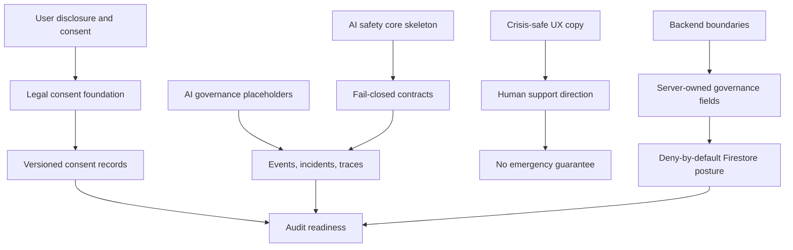

# Compliance Traceability Graph

## Status

Draft documentation only. Requires legal and compliance review before production use.

## Traceability Flow

## Compliance Themes

- User safety: calm support copy, human-support direction, no diagnosis claims.
- Privacy: data minimization, no raw AI conversation storage by default, no diagnosis fields.
- Auditability: consent versions, AI event placeholders, policy snapshot placeholders.
- Store readiness: clear limits, no emergency-service claim, no treatment claim.
- Future governance: backend-owned operations for lifecycle, escalation, policy, and AI safety decisions.
