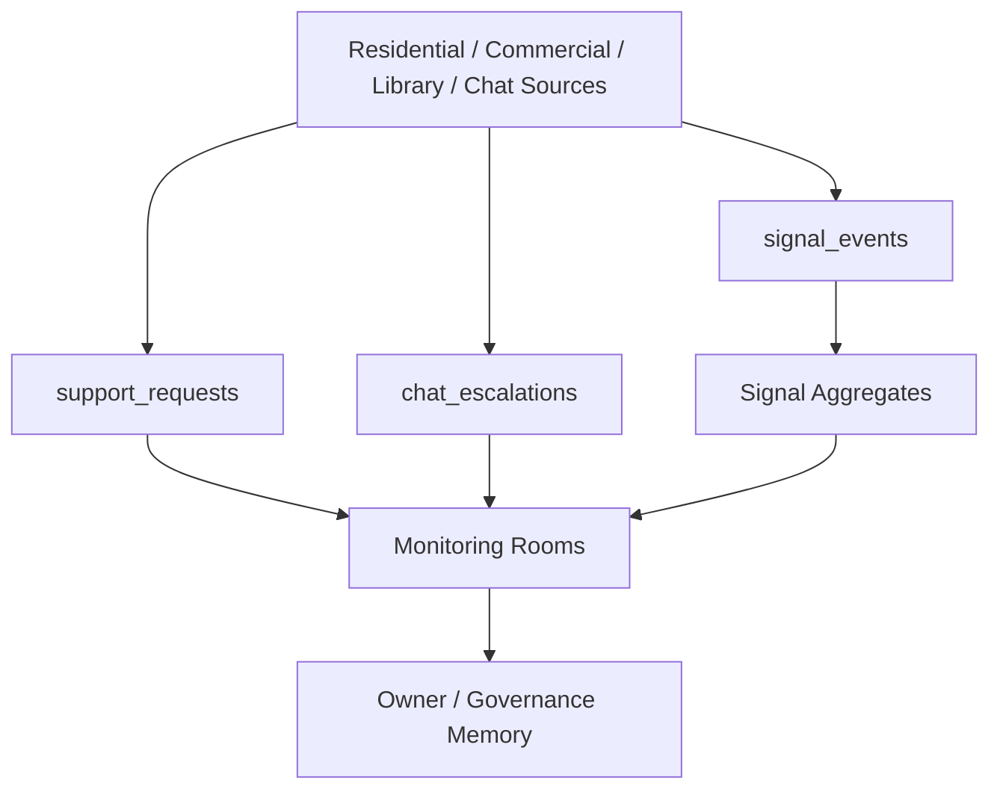

# MONITORING_SIGNAL_REPORT_V1

Status: ACTIVE_DOMAIN_AUDIT
Phase: 7E
Runtime effect: none

## Signal Sources

| Source | Output | Classification |
| --- | --- | --- |
| Personal Space / saved destinations | `signal_events` | ACTIVE |
| Library category opens | `signal_events` | ACTIVE |
| Provider/center contact starts | signal aggregates/contact categories | ACTIVE |
| Support Issue Selector | `support_requests` and fail-soft signal emission | ACTIVE |
| Chat runtime | `chat_threads`, `chat_escalations`, escalation reports | ACTIVE |
| Domain status service | `system_domains` | ACTIVE |

## Signal Models and Registries

| Item | Purpose | Classification |
| --- | --- | --- |
| `SignalPackage` | versioned signal event package | ACTIVE |
| `SignalAggregate` | aggregate read model item | ACTIVE |
| `SignalTypeRegistry` | signal type constants | ACTIVE |
| `SignalCategoryRegistry` | signal category constants | ACTIVE |
| `SignalAggregationCategoryRegistry` | aggregate category constants | ACTIVE |
| `SignalPrivacyLevel` | privacy classification | ACTIVE |
| `SignalRetentionClass` | retention classification | ACTIVE |
| `SignalRoutingTarget` | monitoring routing targets | ACTIVE |
| `SignalPackageValidator` | signal validation | ACTIVE |
| `SignalAggregationValidator` | aggregate validation | ACTIVE |

## Monitoring Aggregates

| Aggregate Area | Evidence | Classification |
| --- | --- | --- |
| Residential aggregates | `lib/features/monitoring/residential/aggregates/residential_signal_aggregate.dart` | ACTIVE |
| Residential snapshots | `residential_monitoring_snapshot_builder.dart`, models | ACTIVE |
| Commercial aggregates | `lib/features/monitoring/commercial/aggregates/commercial_signal_aggregate.dart` | ACTIVE |
| Commercial intelligence report | `commercial_intelligence_report.dart` | ACTIVE |
| Monitoring snapshot builder | `lib/features/monitoring/domain/builders/monitoring_snapshot_builder.dart` | ACTIVE |
| Monitoring aggregate validator | `monitoring_aggregate_validator.dart` | ACTIVE |

## Observability Flow

## Measures

| Classification | Items |
| --- | --- |
| Active | signal packages, registries, events, escalations, support observation, aggregates |
| Legacy | Control vs Monitoring naming residue |
| Dead | none confirmed |
| Duplicate | support/risk signals observed in Support Room and Monitoring topology |
| Unknown | aggregate persistence strategy and Owner approval path for interventions |

## Signal Health

Signal architecture is strong and already has registries in code. Governance still needs a formal monitoring authority registry and a clear distinction between aggregate visibility, escalation reporting, and intervention.
