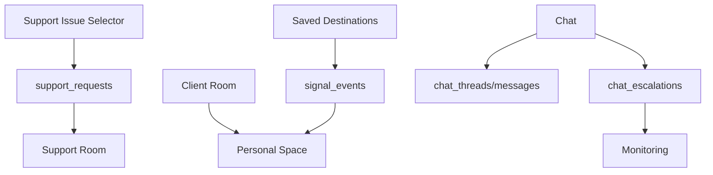

# RESIDENTIAL_SIGNAL_FLOW_REPORT_V1

Status: ACTIVE_DOMAIN_AUDIT
Phase: 7A
Runtime effect: none

## Signal Sources

| Source | File/Surface | Output | Classification |
| --- | --- | --- | --- |
| Client Room signal snapshot | `client_dashboard_page.dart` | reads `clientSignals` from `clients` | ACTIVE |
| Personal Space signal board | `signal_communication_board.dart` | reads `signal_events` | ACTIVE |
| Support Issue Selector | `support_issue_selector_page.dart` | writes `support_requests`; emits signal package fail-soft | ACTIVE |
| Saved Destinations | `saved_destination_repository.dart` | saved destination with `signalTags`; emits destination saved signal | ACTIVE |
| Chat | `chat_page.dart`, `chat_firestore_service.dart` | chat messages and escalation routing | ACTIVE |

## Signal Consumers

| Consumer | Purpose | Classification |
| --- | --- | --- |
| Client Dashboard | preview goal, interest, accessibility, communication signals | ACTIVE |
| Personal Space | read-only signal overview | ACTIVE |
| Support Room | observe structured support signals | ACTIVE |
| Chat Escalation surfaces | review escalation/report flow | CROSS_DOMAIN |

## Signal Collections

| Collection | Classification |
| --- | --- |
| `signal_events` | ACTIVE |
| `support_requests` | ACTIVE |
| `saved_destinations` | ACTIVE |
| `chat_threads` | ACTIVE |
| `chat_escalations` | CROSS_DOMAIN |

## Signal Flow

## Measures

| Classification | Items |
| --- | --- |
| Active | client signals, personal-space signals, support signals, saved destination signals, chat signals |
| Legacy | none confirmed |
| Dead | none confirmed |
| Unknown | dedicated signal registry |
| Duplicate | support signal language appears in Support Entry, Support Issue Selector, Chat, and Support Room |
| Missing | Residential Signal Ownership Registry |
