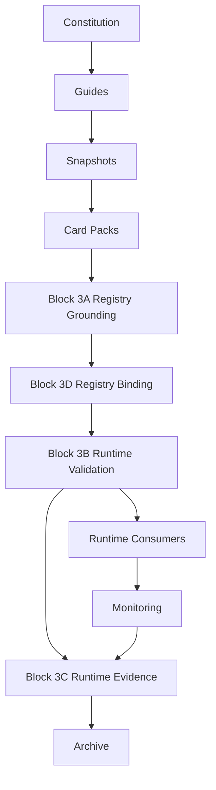

# Mental Smile Block 3 Runtime Governance Era Creation Freeze Report

## Document Control

| Field | Value |
|---|---|
| Document ID | BLOCK_3_RUNTIME_GOVERNANCE_REPORT |
| Block | BLOCK_3 |
| Era | RUNTIME_GOVERNANCE_ERA |
| Scope | Registry grounding, runtime validation, runtime evidence, registry binding |
| Runtime Implementation | NONE |
| Firebase Changes | NONE |
| Flutter Changes | NONE |
| Code Changes | NONE |
| Version | v1.0.0 |
| Final Result | BLOCK_3_RUNTIME_GOVERNANCE_COMPLETE |

## Block 3 Completion Report

| Block | File | Purpose | Status |
|---|---|---|---|
| Block 3A | MASTER_REGISTRY_GROUNDING_CONSTITUTION_V1.md | Define all runtime registries and their ownership, lifecycle, validation, dependencies, evidence | COMPLETE |
| Block 3B | RUNTIME_VALIDATION_ENGINE_CONSTITUTION_V1.md | Define runtime validation, validity, invalidity, unknown state, drift, block, lifecycle, ownership, signals, evidence | COMPLETE |
| Block 3C | RUNTIME_EVIDENCE_CONSTITUTION_V1.md | Define evidence classes, registry, lifecycle, ownership, escalation, retention | COMPLETE |
| Block 3D | REGISTRY_TO_RUNTIME_BINDING_CONSTITUTION_V1.md | Bind registries to Flutter, Firebase, signal streams, tools, localization, assets, and authority consumers | COMPLETE |

## Runtime Governance Topology

## Registry Topology

| Registry | Grounded By | Feeds Runtime |
|---|---|---|
| Ownership Registry | Authority Decomposition + Registry Grounding | Authority consumers, all registry ownership |
| Route Registry | Route cards + Ownership Registry | Flutter routes |
| Collection Registry | Collection cards + Ownership Registry | Firestore collections |
| Signal Registry | Signal cards + Monitoring doctrine | Signal streams |
| Tool Registry | Tool cards + Technical Verification | Runtime tools |
| Localization Registry | Language policies + Legal Governance | Flutter localization |
| Asset Registry | Asset cards + Storage custody | Flutter assets, Firebase Storage |
| Snapshot Registry | Guide snapshots | Pack Registry |
| Pack Registry | Snapshot Registry | Distribution, Activation, Runtime Bridge |
| Distribution Registry | Pack Registry | Activation |
| Activation Registry | Distribution Registry | Runtime Bridge |

## Validation Topology

| Stage | Input | Output | Owner |
|---|---|---|---|
| Validation Requested | Runtime object | Validation request evidence | Runtime Bridge Steward |
| Source Trace Checked | Runtime object + source candidate | Source trace evidence | Compliance |
| Registry Match Checked | Runtime object + registry entry | Registry match evidence | Registry Steward |
| Runtime Validated | Passing checks | Runtime validated signal | Compliance |
| Runtime Mismatch | Failed checks | Runtime mismatch signal | Compliance |
| Runtime Drift Detected | Observed divergence | Drift signal/evidence | Monitoring |
| Runtime Block Triggered | Critical mismatch/drift/unknown | Block signal/evidence | Compliance |
| Validation Archived | Final validation result | Archive evidence | Archive |

## Evidence Topology

| Evidence Class | Producer | Validator | Archive Consumer |
|---|---|---|---|
| Validation Evidence | Compliance / Technical Verification | Compliance | Archive |
| Distribution Evidence | Distribution Steward | Compliance | Archive |
| Activation Evidence | Activation Steward / Compliance | Compliance | Archive |
| Drift Evidence | Monitoring | Compliance | Archive |
| Compliance Evidence | Compliance | Compliance / Legal if needed | Archive |
| Archive Evidence | Archive | Archive custody validation | Owner / Compliance |

## Runtime Binding Topology

| Registry Source | Runtime Binding | Runtime Consumer | Drift Detector |
|---|---|---|---|
| Route Registry | Route -> Flutter Route | Flutter | Monitoring / Technical Verification |
| Collection Registry | Collection -> Firestore Collection | Firebase | Compliance / Technical Verification |
| Signal Registry | Signal -> Signal Stream | Firebase / Monitoring | Monitoring |
| Tool Registry | Tool -> Runtime Tool | Technical / Flutter / Firebase | Compliance / Technical Verification |
| Localization Registry | Term -> Localization Runtime | Flutter | Legal Governance / Compliance |
| Asset Registry | Asset -> Asset Runtime | Flutter / Firebase Storage | Registry / Monitoring |
| Ownership Registry | Owner Domain -> Authority Consumer | Flutter / Firebase / Governance | Compliance |

## Phase 12 Readiness Report

| Phase 12 Need | Block 3 Output | Readiness |
|---|---|---|
| Identity Authority Attestation | Ownership Registry grounding and authority consumer binding | READY AS DOCTRINE |
| Claim/domain traceability | Ownership Registry and Registry-to-Runtime Binding | READY AS DOCTRINE |
| Admin removal prerequisite | Admin is excluded from registry authority and binding doctrine | READY AS DOCTRINE |
| Hidden authority prevention | Binding validation forbids hidden authority | READY AS DOCTRINE |
| Runtime authority validation | Runtime Validation Engine defines source trace and block | READY AS DOCTRINE |
| Evidence chain | Runtime Evidence Constitution defines evidence lifecycle | READY AS DOCTRINE |
| Firebase mapping | Registry-to-Runtime Binding defines Firestore, Storage, Functions, Auth, Indexes | READY AS DOCTRINE |
| Flutter mapping | Registry-to-Runtime Binding defines route, surface, widget/tool, localization, asset | READY AS DOCTRINE |

## Block 3 Pass Conditions

| Pass Condition | Result |
|---|---|
| All Registries Defined | PASS |
| Registry Ownership Defined | PASS |
| Registry Validation Defined | PASS |
| Runtime Validation Defined | PASS |
| Runtime Drift Defined | PASS |
| Evidence Model Defined | PASS |
| Evidence Ownership Defined | PASS |
| Registry Binding Defined | PASS |
| Flutter Mapping Defined | PASS |
| Firebase Mapping Defined | PASS |
| No Admin Authority Exists | PASS AS DOCTRINE |
| No Hidden Authority Exists | PASS AS DOCTRINE |
| No Runtime Governance Exists | PASS |
| All Runtime Objects Trace To Constitutional Sources | PASS AS DOCTRINE |

## Handoff

Block 3 hands off to Phase 12 with the constitutional foundation required for Identity Authority Attestation:

| Handoff Item | Receiving Phase |
|---|---|
| Registry grounding model | Phase 12 Identity Authority Attestation |
| Runtime validation model | Phase 12 claim/domain validation |
| Evidence model | Phase 12 authority evidence |
| Registry-to-runtime binding | Phase 12 authority consumer binding |
| No Admin / no hidden authority doctrine | Phase 12 authority purification |

Final result: `BLOCK_3_RUNTIME_GOVERNANCE_COMPLETE`.
