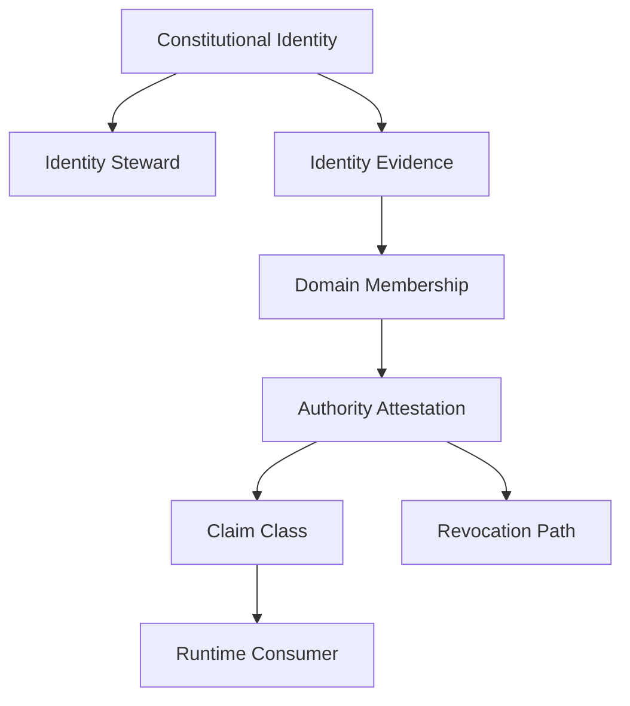

# Mental Smile Block 4 Identity Authority And Custody Era Report

## Document Control

| Field | Value |
|---|---|
| Document ID | BLOCK_4_IDENTITY_AUTHORITY_REPORT |
| Block | BLOCK_4 |
| Era | IDENTITY_AUTHORITY_CUSTODY_ERA |
| Scope | Identity, authority, attestation, domain membership, claims mapping, custody, sensitive access, validation evidence |
| Firebase Auth Implementation | NONE |
| Claims Implementation | NONE |
| Runtime Changes | NONE |
| Firebase Changes | NONE |
| Code Changes | NONE |
| Final Result | BLOCK_4_IDENTITY_AUTHORITY_CUSTODY_COMPLETE |

## Block 4 Completion Report

| Block | File | Purpose | Status |
|---|---|---|---|
| Block 4A | CONSTITUTIONAL_IDENTITY_CONSTITUTION_V1.md | Define identity types, lifecycle, suspension, revocation, expiration, recovery | COMPLETE |
| Block 4B | AUTHORITY_ATTESTATION_CONSTITUTION_V1.md | Define authority classes, attestation lifecycle, source/evidence/owner/steward/revocation | COMPLETE |
| Block 4C | DOMAIN_MEMBERSHIP_CONSTITUTION_V1.md | Define domain membership, entry, exit, suspension, evidence, cross-domain rules | COMPLETE |
| Block 4D | CLAIMS_AND_DOMAIN_MAPPING_CONSTITUTION_V1.md | Define identity -> domain membership -> authority attestation -> claim -> runtime consumer | COMPLETE |
| Block 4E | CUSTODY_AND_SENSITIVE_ACCESS_CONSTITUTION_V1.md | Define custody classes, sensitive data classes, custody boundaries | COMPLETE |
| Block 4F | AUTHORITY_VALIDATION_AND_EVIDENCE_CONSTITUTION_V1.md | Define validation, mismatch, revocation, suspension, escalation, drift | COMPLETE |

## Identity Topology

## Authority Topology

| Authority Class | Source | Evidence | Owner | Revocation |
|---|---|---|---|---|
| Authorization Authority | Owner doctrine | Owner authorization evidence | Owner | Owner revocation |
| Review Authority | Domain membership | Review evidence | Domain Owner | Domain suspension/revocation |
| Validation Authority | Compliance doctrine | Validation evidence | Compliance | Compliance revocation |
| Observation Authority | Monitoring doctrine | Observation evidence | Monitoring | Monitoring suspension/compliance block |
| Custody Authority | Custody constitution | Custody evidence | Custody owner | Custody revocation |
| Distribution Authority | Distribution constitution | Distribution evidence | Owner / Compliance | Distribution block |
| Activation Authority | Activation constitution | Activation evidence | Owner / Compliance | Activation block |

## Membership Topology

| Domain | Membership Function | Authority Limit |
|---|---|---|
| Owner | Final authorization membership | Cannot self-certify compliance or technical state |
| Legal | Legal interpretation membership | Cannot execute runtime |
| Compliance | Validation membership | Cannot authorize final business action |
| Technical Verification | Technical verification membership | Cannot authorize or govern |
| Monitoring | Observation membership | Cannot modify or authorize |
| Archive | Custody membership | Cannot approve live state |
| Registry | Registry stewardship membership | Cannot approve business decision |
| Declaration | Declaration review membership | Cannot override Owner/Legal/Compliance |
| Support | Support observation membership | Cannot adjudicate authority |

## Claims Topology

| Chain Stage | Meaning |
|---|---|
| Identity | Who the actor/object is |
| Domain Membership | Which constitutional domain recognizes the identity |
| Authority Attestation | Why the identity is allowed |
| Claim Class | Runtime-consumable representation of attested authority |
| Runtime Consumer | Flutter/Firebase/governance consumer that reads the claim |
| Revocation | Constitutional method to remove the claim |

## Custody Topology

| Custody Class | Sensitive Data Link | Direct Custody Owner | Forbidden Direct Custody |
|---|---|---|---|
| Identity Custody | Identity documents | Identity/Owner domain | Runtime, Monitoring, generic Admin |
| Registry Custody | Registry records | Registry Domain | Runtime, generic Admin |
| Archive Custody | Archive records | Archive Domain | Runtime, Monitoring |
| Evidence Custody | Validation/drift/claim/custody evidence | Archive / evidence owner | Runtime |
| Asset Custody | Public/private assets | Owner / Registry | Generic Admin |
| Storage Custody | Storage paths and sensitive uploads | Purpose-specific domain | Technical direct custody |
| Legal Custody | Legal records, IDs, licenses | Legal Governance | Runtime direct custody |

## Phase 5 Runtime Authorization Readiness

| Readiness Item | Block 4 Output | Status |
|---|---|---|
| Identity source | Constitutional identity model | READY AS DOCTRINE |
| Domain source | Domain membership model | READY AS DOCTRINE |
| Authority source | Authority attestation model | READY AS DOCTRINE |
| Claim bridge | Claims and domain mapping model | READY AS DOCTRINE |
| Custody model | Custody and sensitive access constitution | READY AS DOCTRINE |
| Validation/evidence | Authority validation and evidence constitution | READY AS DOCTRINE |
| Admin prevention | Generic admin claim/domain/authority forbidden | READY AS DOCTRINE |
| Hidden authority prevention | Hidden/fallback claims and authority forbidden | READY AS DOCTRINE |
| Runtime implementation | Not created by rule | NOT IMPLEMENTED |

## Block 4 Pass Conditions

| Pass Condition | Result |
|---|---|
| Identity Defined | PASS |
| Authority Defined | PASS |
| Attestation Defined | PASS |
| Membership Defined | PASS |
| Claims Defined | PASS |
| Custody Defined | PASS |
| Sensitive Access Defined | PASS |
| Evidence Defined | PASS |
| Revocation Defined | PASS |
| Suspension Defined | PASS |
| No Admin Claim Exists | PASS AS DOCTRINE |
| No Hidden Authority Exists | PASS AS DOCTRINE |
| No Wildcard Authority Exists | PASS AS DOCTRINE |
| No Self Granted Authority Exists | PASS AS DOCTRINE |
| Firebase Auth implemented | NO, BY RULE |
| Claims implemented | NO, BY RULE |
| Runtime changed | NO, BY RULE |

Final result: `BLOCK_4_IDENTITY_AUTHORITY_CUSTODY_COMPLETE`.
