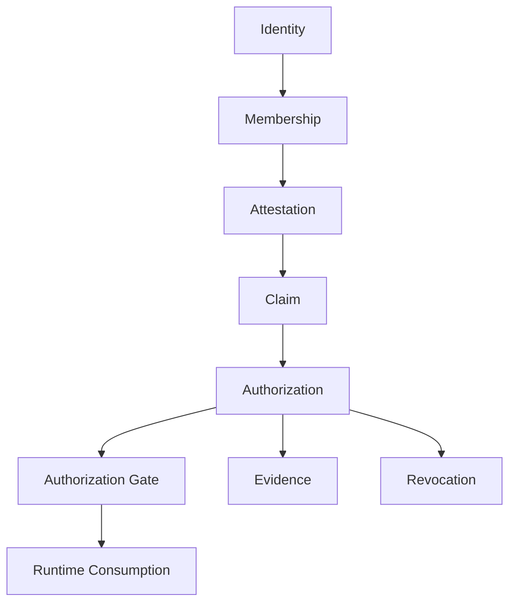

# Mental Smile Block 5 Constitutional Runtime Authorization Era Report

## Document Control

| Field | Value |
|---|---|
| Document ID | BLOCK_5_RUNTIME_AUTHORIZATION_REPORT |
| Block | BLOCK_5 |
| Era | CONSTITUTIONAL_RUNTIME_AUTHORIZATION_ERA |
| Scope | Runtime authorization doctrine, consumers, collection access, storage access, claim consumption, validation, gates |
| Firebase Claims Implementation | NONE |
| Firestore Rules Changes | NONE |
| Storage Rules Changes | NONE |
| Runtime Changes | NONE |
| Final Result | BLOCK_5_RUNTIME_AUTHORIZATION_COMPLETE |

## Block 5 Completion Report

| Block | File | Purpose | Status |
|---|---|---|---|
| Block 5A | CONSTITUTIONAL_AUTHORIZATION_CONSTITUTION_V1.md | Define authorization chain, classes, scopes, forbidden authorization patterns | COMPLETE |
| Block 5B | RUNTIME_CONSUMER_AUTHORIZATION_CONSTITUTION_V1.md | Define human/service/runtime/tool/registry/signal consumers | COMPLETE |
| Block 5C | COLLECTION_ACCESS_CONSTITUTION_V1.md | Prepare future Firestore authorization doctrine | COMPLETE |
| Block 5D | STORAGE_ACCESS_CONSTITUTION_V1.md | Prepare future Storage authorization doctrine | COMPLETE |
| Block 5E | CLAIM_CONSUMPTION_CONSTITUTION_V1.md | Define claim consumption lifecycle and restrictions | COMPLETE |
| Block 5F | AUTHORIZATION_VALIDATION_CONSTITUTION_V1.md | Define authorization validation, evidence, drift, mismatch, escalation | COMPLETE |
| Block 5G | AUTHORIZATION_GATE_CONSTITUTION_V1.md | Define runtime/storage/collection gates | COMPLETE |

## Authorization Topology

## Consumer Topology

| Consumer | Consumes | Requires |
|---|---|---|
| Human Consumer | Surfaces, records, tools within domain | Identity, membership, attestation, claim, authorization |
| Service Consumer | Approved service functions/signals/writes | Service identity, service claim, authorization evidence |
| Runtime Consumer | Activated routes/assets/localization/collections/signals | Runtime identity, registry binding, validation evidence |
| Tool Consumer | Tool-scoped resources | Tool identity, tool registry, tool authorization |
| Registry Consumer | Registry entries/evidence | Registry identity, registry stewardship claim |
| Signal Consumer | Signal streams | Signal identity, signal registry, signal authorization |

## Collection Access Topology

| Access Type | Required Source | Gate |
|---|---|---|
| Collection Read | Collection Registry + read authorization | Collection Authorization Gate |
| Collection Write | Collection Registry + write authorization | Collection Authorization Gate |
| Collection Review | Collection Registry + review authorization | Collection Authorization Gate |
| Collection Validation | Collection Registry + validation authorization | Collection Authorization Gate |
| Collection Archive | Collection Registry + custody/archive authorization | Collection Authorization Gate |

## Storage Access Topology

| Storage Class | Required Source | Gate |
|---|---|---|
| Identity Storage | Identity custody + storage authorization | Storage Authorization Gate |
| Evidence Storage | Evidence custody + archive authorization | Storage Authorization Gate |
| Archive Storage | Archive custody + archive authorization | Storage Authorization Gate |
| Registry Storage | Registry custody + registry authorization | Storage Authorization Gate |
| Asset Storage | Asset registry + asset authorization | Storage Authorization Gate |
| Sensitive Storage | Sensitive custody + legal/compliance authorization | Storage Authorization Gate |

## Claim Consumption Topology

| Stage | Meaning |
|---|---|
| Claim Declared | Claim comes from authority attestation |
| Claim Validated | Claim maps to identity, membership, attestation, authorization |
| Claim Consumable | Runtime may consume within scope |
| Claim Suspended | Temporary consumption block |
| Claim Expired | Validity ended |
| Claim Revoked | Trust removed |
| Claim Archived | Evidence preserved |

## Authorization Gate Topology

| Gate | Checks | Forbids |
|---|---|---|
| Runtime Authorization Gate | Identity, membership, attestation, claim, authorization | Gate bypass, hidden gate, admin override |
| Storage Authorization Gate | Custody, evidence, authorization | Generic admin storage access, runtime direct custody |
| Collection Authorization Gate | Registry, ownership, authorization | Unregistered collection, wildcard access, admin access |

## Phase 6 Firebase Rules Readiness

| Readiness Item | Block 5 Output | Status |
|---|---|---|
| Future claim consumption basis | Claim Consumption Constitution | READY AS DOCTRINE |
| Future Firestore access basis | Collection Access Constitution | READY AS DOCTRINE |
| Future Storage access basis | Storage Access Constitution | READY AS DOCTRINE |
| Gate model | Authorization Gate Constitution | READY AS DOCTRINE |
| Revocation model | Authorization Validation Constitution | READY AS DOCTRINE |
| No admin override | All Block 5 doctrines | READY AS DOCTRINE |
| No wildcard access | Authorization/claim/collection/storage/gate doctrines | READY AS DOCTRINE |
| Rules implementation | Not created by rule | NOT IMPLEMENTED |

## Block 5 Pass Conditions

| Pass Condition | Result |
|---|---|
| Authorization Defined | PASS |
| Consumers Defined | PASS |
| Collection Access Defined | PASS |
| Storage Access Defined | PASS |
| Claim Consumption Defined | PASS |
| Authorization Validation Defined | PASS |
| Authorization Gates Defined | PASS |
| No Admin Override Exists | PASS AS DOCTRINE |
| No Hidden Authority Exists | PASS AS DOCTRINE |
| No Wildcard Access Exists | PASS AS DOCTRINE |
| No Gate Bypass Exists | PASS AS DOCTRINE |
| Every Authorization Traces To Identity -> Membership -> Attestation -> Claim -> Authorization | PASS AS DOCTRINE |
| Firebase Claims implemented | NO, BY RULE |
| Firestore Rules changed | NO, BY RULE |
| Storage Rules changed | NO, BY RULE |
| Runtime modified | NO, BY RULE |

Final result: `BLOCK_5_RUNTIME_AUTHORIZATION_COMPLETE`.
