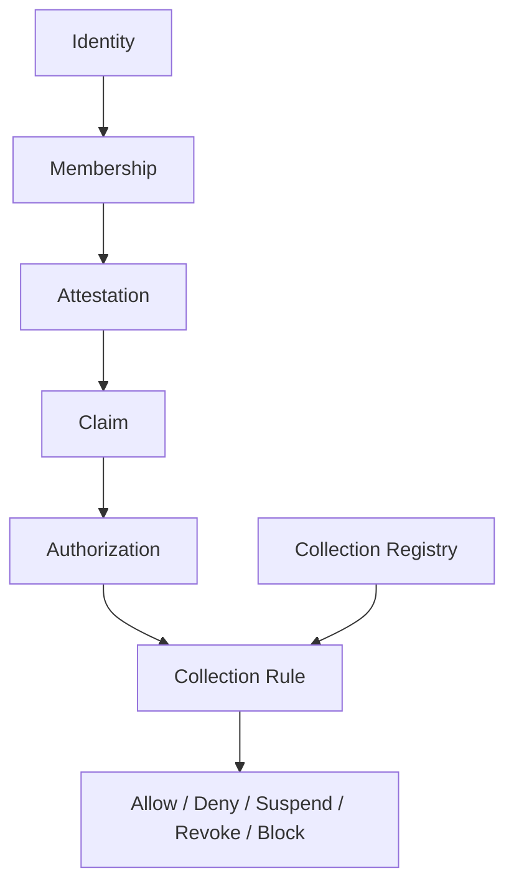
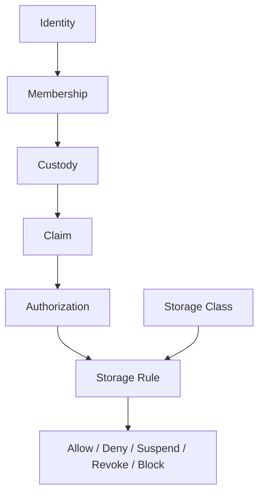

# Mental Smile Block 6 Constitutional Firebase Rules Era Report

## Document Control

| Field | Value |
|---|---|
| Document ID | BLOCK_6_FIREBASE_RULES_REPORT |
| Block | BLOCK_6 |
| Era | CONSTITUTIONAL_FIREBASE_RULES_ERA |
| Scope | Constitutional Firestore/Storage rules doctrine, claim evaluation, decision engine, topology, audit |
| Firestore Rules Changes | NONE |
| Storage Rules Changes | NONE |
| Claims Implementation | NONE |
| Firebase Deployment | NONE |
| Runtime Changes | NONE |
| Final Result | BLOCK_6_FIREBASE_RULES_COMPLETE |

## Block 6 Completion Report

| Block | File | Purpose | Status |
|---|---|---|---|
| Block 6A | FIRESTORE_RULES_CONSTITUTION_V1.md | Define constitutional Firestore rules model | COMPLETE |
| Block 6B | STORAGE_RULES_CONSTITUTION_V1.md | Define constitutional Storage rules model | COMPLETE |
| Block 6C | CLAIM_EVALUATION_CONSTITUTION_V1.md | Define claim evaluation states, inputs, outputs | COMPLETE |
| Block 6D | RULE_DECISION_ENGINE_CONSTITUTION_V1.md | Define allow/deny/suspend/revoke/block decisions | COMPLETE |
| Block 6E | COLLECTION_RULE_TOPOLOGY_CONSTITUTION_V1.md | Map collection classes to rule classes | COMPLETE |
| Block 6F | STORAGE_RULE_TOPOLOGY_CONSTITUTION_V1.md | Map storage classes to rule classes | COMPLETE |
| Block 6G | RULE_AUDIT_CONSTITUTION_V1.md | Define rule audit objects/results/evidence | COMPLETE |

## Firestore Rules Topology

## Storage Rules Topology

## Claim Evaluation Topology

| Claim State | Rule Effect |
|---|---|
| Claim Valid | Continue to rule decision |
| Claim Invalid | Deny |
| Claim Suspended | Suspend / Deny |
| Claim Revoked | Revoke / Deny |
| Claim Expired | Deny until renewal |

## Rule Decision Topology

| Decision | Meaning | Evidence |
|---|---|---|
| ALLOW | Permit scoped action | Rule evaluation + authorization + claim + registry evidence |
| DENY | Refuse action | Deny reason evidence |
| SUSPEND | Temporary block | Suspension evidence |
| REVOKE | Trust removed | Revocation evidence |
| BLOCK | Critical constitutional violation | Block and escalation evidence |

## Rule Audit Topology

| Audit Object | Result Set | Evidence |
|---|---|---|
| Rule Evaluation | PASS / FAIL / DRIFT / BLOCKED | Evaluation evidence |
| Rule Decision | PASS / FAIL / DRIFT / BLOCKED | Decision evidence |
| Rule Drift | DRIFT / BLOCKED | Drift evidence |
| Rule Mismatch | FAIL / BLOCKED | Violation evidence |
| Rule Violation | BLOCKED | Escalation evidence |

## Phase 7 Firebase Implementation Readiness

| Readiness Item | Block 6 Output | Status |
|---|---|---|
| Firestore rule doctrine | Firestore Rules Constitution | READY AS DOCTRINE |
| Storage rule doctrine | Storage Rules Constitution | READY AS DOCTRINE |
| Claim evaluation doctrine | Claim Evaluation Constitution | READY AS DOCTRINE |
| Rule decision doctrine | Rule Decision Engine Constitution | READY AS DOCTRINE |
| Collection rule topology | Collection Rule Topology Constitution | READY AS DOCTRINE |
| Storage rule topology | Storage Rule Topology Constitution | READY AS DOCTRINE |
| Rule audit doctrine | Rule Audit Constitution | READY AS DOCTRINE |
| Rules implementation | Not created by rule | NOT IMPLEMENTED |
| Claims implementation | Not created by rule | NOT IMPLEMENTED |
| Firebase deployment | Not performed by rule | NOT DEPLOYED |

## Block 6 Pass Conditions

| Pass Condition | Result |
|---|---|
| Firestore Rule Model Defined | PASS |
| Storage Rule Model Defined | PASS |
| Claim Evaluation Defined | PASS |
| Rule Decision Engine Defined | PASS |
| Collection Rule Topology Defined | PASS |
| Storage Rule Topology Defined | PASS |
| Rule Audit Defined | PASS |
| No Admin Override Exists | PASS AS DOCTRINE |
| No Hidden Access Exists | PASS AS DOCTRINE |
| No Wildcard Access Exists | PASS AS DOCTRINE |
| No Silent Decision Exists | PASS AS DOCTRINE |
| Every Rule Traces To Identity -> Membership -> Attestation -> Claim -> Authorization -> Rule Evaluation -> Decision | PASS AS DOCTRINE |
| Firestore Rules changed | NO, BY RULE |
| Storage Rules changed | NO, BY RULE |
| Claims implemented | NO, BY RULE |
| Firebase deployed | NO, BY RULE |

Final result: `BLOCK_6_FIREBASE_RULES_COMPLETE`.
