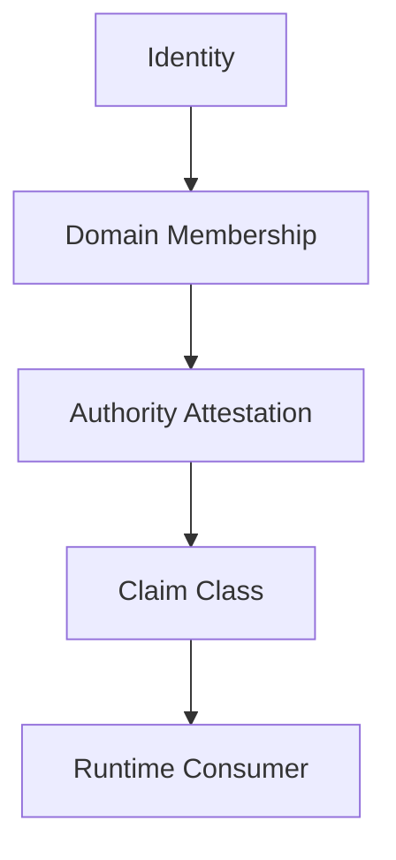

# Mental Smile Claims And Domain Mapping Constitution V1

## Document Control

| Field | Value |
|---|---|
| Document ID | CLAIMS_AND_DOMAIN_MAPPING_CONSTITUTION_V1 |
| Block | BLOCK_4D |
| Era | IDENTITY_AUTHORITY_CUSTODY_ERA |
| Scope | First constitutional bridge toward Firebase claims; no implementation |
| Firebase Claims Implementation | NONE |
| Runtime Changes | NONE |
| Version | v1.0.0 |
| Status | ACTIVE_CONSTITUTIONAL_SOURCE |

## Claims Doctrine

Claims are runtime-consumable representations of constitutional authority. Claims are not the source of authority.

The source chain is:

## Claim Classes

| Claim Class ID | Claim Class | Constitutional Source | Owner | Validator | Runtime Consumer |
|---|---|---|---|---|---|
| claim.owner_authorization | Owner Authorization Claim | Owner identity + authorization attestation | Owner | Compliance | Owner runtime surfaces |
| claim.legal_review | Legal Review Claim | Legal membership + review attestation | Legal Governance | Compliance | Legal governance surfaces |
| claim.compliance_validation | Compliance Validation Claim | Compliance membership + validation attestation | Compliance | Owner / Legal when needed | Compliance surfaces |
| claim.technical_verification | Technical Verification Claim | Technical membership + verification attestation | Technical Verification | Compliance | Technical verification surfaces |
| claim.monitoring_observation | Monitoring Observation Claim | Monitoring membership + observation attestation | Monitoring | Compliance | Monitoring surfaces |
| claim.archive_custody | Archive Custody Claim | Archive membership + custody attestation | Archive | Compliance / Legal | Archive surfaces |
| claim.registry_stewardship | Registry Stewardship Claim | Registry membership + stewardship attestation | Registry | Compliance | Registry surfaces |
| claim.declaration_review | Declaration Review Claim | Declaration membership + review attestation | Declaration Domain | Compliance | Declaration surfaces |
| claim.support_observation | Support Observation Claim | Support membership + support observer attestation | Support Domain | Compliance / Monitoring | Support surfaces |
| claim.service_execution | Service Execution Claim | Service identity + technical service attestation | Technical Verification | Compliance | Functions/service consumers |

## Claim Ownership

| Claim Class | Claim Owner | Claim Steward | Revocation Owner |
|---|---|---|---|
| Owner Authorization | Owner | Owner Steward | Owner + Compliance record |
| Legal Review | Legal Governance | Legal Steward | Legal Governance + Compliance |
| Compliance Validation | Compliance | Compliance Steward | Compliance + Owner escalation |
| Technical Verification | Technical Verification | Technical Steward | Compliance + Owner |
| Monitoring Observation | Monitoring | Monitoring Steward | Compliance |
| Archive Custody | Archive | Archive Steward | Archive + Compliance |
| Registry Stewardship | Registry | Registry Steward | Registry + Compliance |
| Declaration Review | Declaration Domain | Declaration Steward | Compliance |
| Support Observation | Support Domain | Support Steward | Compliance / Monitoring |
| Service Execution | Technical Verification | Technical Steward | Compliance / Owner |

## Claim Validation

| Validation Check | Pass Condition | Failure Result |
|---|---|---|
| Identity exists | Constitutional identity record exists | Claim invalid |
| Membership exists | Domain membership evidence exists | Claim invalid |
| Authority attested | Authority attestation evidence exists | Claim invalid |
| Scope defined | Claim scope is specific and non-wildcard | Claim invalid |
| Revocation path exists | Revocation owner and method defined | Claim invalid |
| Runtime consumer declared | Runtime consumer is listed | Consumption block |
| No admin claim | Claim is not generic admin | Critical block |
| No hidden claim | Claim is not fallback or implicit | Critical block |

## Claim Evidence

| Evidence Class | Required Fields |
|---|---|
| Claim creation evidence | Identity ID, domain ID, authority ID, claim class, scope |
| Claim validation evidence | Validator, checks, result, registry references |
| Claim revocation evidence | Revocation reason, revoker domain, archive scope |
| Claim drift evidence | Expected claim, observed claim, runtime consumer |
| Claim suspension evidence | Suspension reason, validator, recovery conditions |

## Claim Revocation

| Trigger | Revocation Path |
|---|---|
| Identity revoked | Identity Steward -> Compliance -> Claim revocation |
| Membership suspended | Domain Steward -> Compliance -> Claim suspension |
| Authority revoked | Authority owner -> Compliance -> Claim revocation |
| Hidden authority detected | Compliance -> Owner -> Critical claim revocation |
| Runtime drift | Monitoring -> Compliance -> Claim validation block |
| Custody breach | Legal/Compliance -> Owner -> Claim revocation |

## Forbidden Claim Patterns

| Forbidden Claim | Reason |
|---|---|
| Generic Admin Claim | Admin is not a constitutional authority |
| Wildcard Claim | Authority must be scoped |
| Hidden Claim | Claims must be explicit and evidenced |
| Fallback Authority Claim | Fallback authority bypasses attestation |
| Self Granted Claim | Claim must be attested |
| Runtime Generated Claim | Runtime consumes claims; runtime does not create authority |

## Block 4D Validation Result

| Pass Condition | Result |
|---|---|
| Claims defined | PASS |
| Identity to runtime chain defined | PASS |
| Claim classes defined | PASS |
| Claim ownership defined | PASS |
| Claim validation defined | PASS |
| Claim evidence defined | PASS |
| Claim revocation defined | PASS |
| Generic admin claim forbidden | PASS |
| Wildcard claim forbidden | PASS |
| Hidden/fallback claim forbidden | PASS |

Final result: `BLOCK_4D_CLAIMS_DOMAIN_MAPPING_COMPLETE`.
