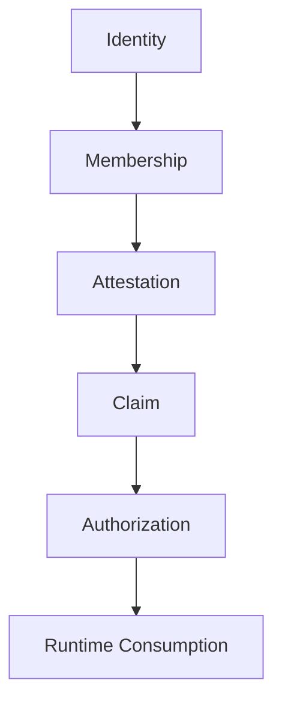

# Mental Smile Constitutional Authorization Constitution V1

## Document Control

| Field | Value |
|---|---|
| Document ID | CONSTITUTIONAL_AUTHORIZATION_CONSTITUTION_V1 |
| Block | BLOCK_5A |
| Era | CONSTITUTIONAL_RUNTIME_AUTHORIZATION_ERA |
| Scope | Runtime authorization doctrine only |
| Firebase Claims Implementation | NONE |
| Firestore Rules Changes | NONE |
| Storage Rules Changes | NONE |
| Runtime Changes | NONE |
| Version | v1.0.0 |
| Status | ACTIVE_CONSTITUTIONAL_SOURCE |

## Authorization Doctrine

Authorization answers: Who may consume, what may be consumed, under what authority, under what evidence, under what restrictions, and who may revoke.

Authorization is not identity, membership, attestation, or claim by itself. Authorization is the final governed permission state that runtime may consume only after the complete constitutional chain exists.

## Authorization Chain

| Chain Stage | Meaning | Required Evidence |
|---|---|---|
| Identity | Who the actor/object is | Identity evidence |
| Membership | Which constitutional domain recognizes identity | Membership evidence |
| Attestation | Why identity is trusted for a class of action | Authority attestation evidence |
| Claim | Runtime-consumable representation of attested authority | Claim evidence |
| Authorization | Permission to consume a specific resource/scope | Authorization evidence |
| Runtime Consumption | Actual read/write/review/observe/custody/distribute/activate consumption | Runtime validation evidence |

## Authorization Classes

| Authorization ID | Authorization Class | Purpose | Owner | Steward | Required Claim |
|---|---|---|---|---|---|
| auth.read | Read Authorization | Consume data or surface without mutation | Resource owner domain | Authorization Steward | Scoped read claim |
| auth.write | Write Authorization | Create/update approved resource | Resource owner domain | Authorization Steward | Scoped write claim |
| auth.review | Review Authorization | Review records, declarations, support, legal or governance object | Review domain | Domain Steward | Scoped review claim |
| auth.validation | Validation Authorization | Validate compliance, registry, runtime, claim, custody | Compliance | Compliance Steward | Validation claim |
| auth.observation | Observation Authorization | Observe signals, drift, monitoring state | Monitoring | Monitoring Steward | Observation claim |
| auth.custody | Custody Authorization | Hold or retrieve sensitive/archival/evidence material | Custody owner | Custody Steward | Custody claim |
| auth.distribution | Distribution Authorization | Distribute approved packs/cards to targets | Owner / Compliance | Distribution Steward | Distribution claim |
| auth.activation | Activation Authorization | Activate approved constitutional outputs | Owner / Compliance | Activation Steward | Activation claim |

## Authorization Scope

| Scope ID | Scope | Definition | Required Registry |
|---|---|---|---|
| scope.surface | Surface Scope | Which UI/governance surface may be consumed | Surface / Ownership Registry |
| scope.registry | Registry Scope | Which registry object may be consumed | Registry Grounding |
| scope.collection | Collection Scope | Which Firestore collection type may be consumed | Collection Registry |
| scope.signal | Signal Scope | Which signal may be produced/consumed | Signal Registry |
| scope.asset | Asset Scope | Which asset or storage object may be consumed | Asset Registry / Custody Registry |
| scope.tool | Tool Scope | Which tool may be consumed | Tool Registry |

## Authorization Evidence

| Evidence Class | Required Fields |
|---|---|
| Authorization creation evidence | Identity ID, membership ID, attestation ID, claim ID, authorization class, scope |
| Authorization validation evidence | Validator, source chain, registry match, pass/fail |
| Authorization consumption evidence | Runtime consumer, resource ID, authorization ID, timestamp/status |
| Authorization revocation evidence | Revoker domain, reason, affected claims/resources, archive scope |

## Forbidden Authorization Patterns

| Forbidden Pattern | Reason |
|---|---|
| Implicit Authorization | Permission must be explicit and evidenced |
| Wildcard Authorization | Scope must be bounded |
| Inherited Authorization | Authority cannot be inherited from generic role or admin era |
| Hidden Authorization | Authority must be traceable and revocable |
| Runtime-Created Authorization | Runtime consumes authorization only |
| Admin Override | Admin is not constitutional authority |

## Block 5A Validation Result

| Pass Condition | Result |
|---|---|
| Authorization defined | PASS |
| Authorization chain defined | PASS |
| Authorization classes defined | PASS |
| Authorization scope defined | PASS |
| Evidence defined | PASS |
| Implicit authorization forbidden | PASS |
| Wildcard authorization forbidden | PASS |
| Inherited authorization forbidden | PASS |
| Hidden authorization forbidden | PASS |

Final result: `BLOCK_5A_CONSTITUTIONAL_AUTHORIZATION_COMPLETE`.
