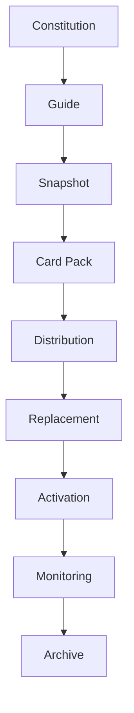

# Mental Smile Constitutional Operating System Review - Post Phase 10

Review Scope: `POST_PHASE_10`
Review Type: `CONSTITUTIONAL_ARCHITECTURE_REVIEW`
Execution Mode: `REVIEW_ONLY`
Runtime Status: `NOT_IMPLEMENTED_BY_THIS_REVIEW`
Phase Modification Status: `NO_PHASE_MODIFICATIONS`
Final Verdict: `PASS_WITH_GAPS`

---

## 1. CONSTITUTIONAL SYSTEM REVIEW REPORT

This report reviews the completed Mental Smile constitutional guide sequence after Phase 10. It does not create a new phase, does not rewrite any phase, does not implement runtime behavior, and does not distribute cards.

Reviewed phase documents:

| Phase | Domain | File | Review Result |
| --- | --- | --- | --- |
| Phase 1 | Departments Constitution | `MASTER_GUIDE_PHASE_1_CREATION_FREEZE.md` | COMPLETE WITH REPORTING FORMAT GAP |
| Phase 2 | Workforce Constitution | `MASTER_GUIDE_PHASE_2_CREATION_FREEZE.md` | PASS |
| Phase 3 | Card Constitution | `MASTER_GUIDE_PHASE_3_CREATION_FREEZE.md` | PASS |
| Phase 4 | Registry Constitution | `MASTER_GUIDE_PHASE_4_CREATION_FREEZE.md` | PASS |
| Phase 5 | Auditor & Compliance Constitution | `MASTER_GUIDE_PHASE_5_CREATION_FREEZE.md` | PASS |
| Phase 6A | Archive Constitution | `MASTER_GUIDE_PHASE_6A_CREATION_FREEZE.md` | PASS |
| Phase 7 | Snapshot Constitution | `MASTER_GUIDE_PHASE_7_CREATION_FREEZE.md` | PASS |
| Phase 8 | Card Pack Constitution | `MASTER_GUIDE_PHASE_8_CREATION_FREEZE.md` | PASS |
| Phase 9 | Distribution Constitution | `MASTER_GUIDE_PHASE_9_CREATION_FREEZE.md` | PASS |
| Phase 10 | Automatic Replacement & Activation Constitution | `MASTER_GUIDE_PHASE_10_CREATION_FREEZE.md` | PASS |

Card inventory observed in phase freeze files:

| Phase File | Unique Card IDs |
| --- | ---: |
| `MASTER_GUIDE_PHASE_1_CREATION_FREEZE.md` | 54 |
| `MASTER_GUIDE_PHASE_2_CREATION_FREEZE.md` | 76 |
| `MASTER_GUIDE_PHASE_3_CREATION_FREEZE.md` | 28 |
| `MASTER_GUIDE_PHASE_4_CREATION_FREEZE.md` | 50 |
| `MASTER_GUIDE_PHASE_5_CREATION_FREEZE.md` | 57 |
| `MASTER_GUIDE_PHASE_6A_CREATION_FREEZE.md` | 55 |
| `MASTER_GUIDE_PHASE_7_CREATION_FREEZE.md` | 47 |
| `MASTER_GUIDE_PHASE_8_CREATION_FREEZE.md` | 48 |
| `MASTER_GUIDE_PHASE_9_CREATION_FREEZE.md` | 72 |
| `MASTER_GUIDE_PHASE_10_CREATION_FREEZE.md` | 34 |
| Total | 521 |

System-level finding:

| Question | Finding |
| --- | --- |
| Is the Constitutional Operating System complete? | Constitutionally complete for the guide chain through activation governance. Not runtime complete. |
| Is the governance chain complete? | Yes, the chain from Department through Activation is present. |
| Are there missing constitutional layers? | Yes, several cross-cutting governance domains remain outside the Phase 1-10 chain. |
| Are there conflicting doctrines? | No direct blocking conflict, but some doctrine wording needs harmonization around archive retention versus operational purity. |
| Are there orphaned entities? | Yes, runtime-facing registries and ownership surfaces remain documented as missing or system-sync-pending. |
| Are there duplicated responsibilities? | Some intentional overlap exists across Owner, Compliance, Monitoring, Archive, and Technical. Boundaries are mostly defined but need operating procedures before runtime execution. |

---

## 2. CONSTITUTIONAL TOPOLOGY MAP

Primary topology:



Layer review:

| Layer | Source Phase | Ownership | Authority | Compliance | Evidence | Lifecycle | Signals | Registries | Archive Relationship | Review |
| --- | --- | --- | --- | --- | --- | --- | --- | --- | --- | --- |
| Constitution | Master Constitution / Phase 1-10 | Owner | Owner authorizes, Legal interprets | Compliance validates | Phase reports | Phase handoffs | Cross-phase signals | Master guide registries | Archive preserves evidence | READY |
| Guide | Master Guide System | Owner / Legal / Technical | Guide source of truth | Compliance agent read-only | Guide reports | Guide update flow | Guide update implied | Guide domain docs | Archive prior versions | READY WITH GAP |
| Snapshot | Phase 7 | Snapshot Owner / Steward | Validated constitutional state | Structural, dependency, card, registry, compliance, archive validation | Snapshot evidence | Requested to archived | Snapshot requested/generated/validated/approved/locked/archived | Snapshot registries | Snapshot archive registry | READY |
| Card Pack | Phase 8 | Pack Owner / Steward | Generated from snapshot only | Snapshot, card, dependency, registry, compliance, archive validation | Pack evidence | Requested to archived | Pack requested/generated/validated/approved/locked/archived | Card pack registries | Card pack archive registry | READY |
| Distribution | Phase 9 | Distribution Owner / Receiver Owner | Constitutional propagation | Pack, receiver, ownership, registry, compliance, archive validation | Request, approval, delivery, confirmation, failure evidence | Requested to archived | Distribution requested through archived | Distribution registries | Confirmed/failed archive evidence | READY AS GOVERNANCE |
| Replacement | Phase 10 | Owner / Compliance / Activation Steward | Automatic constitutional replacement | Guide change, snapshot, pack, distribution, block, activation validation | Replacement and block evidence | Guide change to replacement complete | Replacement started/completed | Replacement and block registries | Activation archive evidence | READY AS GOVERNANCE |
| Activation | Phase 10 | Owner / Compliance / Activation Steward | Single active version | Single-active, ownership, registry, compliance, block checks | Activation evidence | Requested to completed | Activation started/completed/failed | Activation registry | Activation archive evidence | READY AS GOVERNANCE |
| Monitoring | Phase 10 | Monitoring | Observe, verify, escalate | Monitoring does not modify | Monitoring evidence | Started/healthy/delayed/failed/completed | Uses flow signals | Activation evidence registry | Monitoring evidence to archive | READY AS GOVERNANCE |
| Archive | Phase 6A | Owner / Archive Steward / Compliance | Constitutional memory, not storage runtime | Access, retention, destruction, evidence validation | Archive evidence | Created to destroyed | Archive created/locked/accessed/expired/destruction/destroyed | Archive registries | Primary memory layer | READY WITH POLICY GAPS |

Topology verdict: `CHAIN_COMPLETE_AS_CONSTITUTIONAL_GOVERNANCE`.

---

## 3. OWNERSHIP REVIEW

| Role | Authority Boundary | Responsibility Boundary | Escalation Path | Approval Path | Review |
| --- | --- | --- | --- | --- | --- |
| Owner | Authorizes doctrine, phases, guide changes, emergency blocks | Does not execute technical replacement or runtime deployment | Receives escalations from Compliance, Monitoring, Legal | Final authorization for doctrine and exceptional blocks | CLEAR |
| Legal & Governance | Interprets policy, language, authority, legal/governance meaning | Does not execute runtime or technical changes | Escalates legal block and interpretation conflicts to Owner | Approves/interprets governance meaning | CLEAR |
| Compliance | Validates, audits, blocks, records gaps, raises findings | Does not modify, approve alone, execute, replace, or activate | Escalates unresolved mismatch/block to Owner or Legal | Validates readiness and evidence | CLEAR |
| Technical | Verifies and reports; creates incident evidence only after failure governance | Does not replace, activate, distribute, or execute in Phase 10 doctrine | Escalates verification failure to Compliance and Owner | No approval authority for doctrine | CLEAR |
| Monitoring | Observes, verifies flow health, escalates delays/failures | Does not modify, activate, or replace | Escalates delayed/failed flows to Compliance and Owner | No approval authority | CLEAR |
| Archive | Preserves constitutional memory and evidence relationship | Does not authorize, execute, or validate alone | Escalates access/destruction/retention issues to Compliance, Legal, Owner | Archive lock/access/destruction governed by policy | CLEAR WITH RETENTION GAP |

Authority overlap review:

| Area | Overlap | Classification | Finding |
| --- | --- | --- | --- |
| Owner and Legal | Legal interprets; Owner authorizes | INTENTIONAL | No hidden authority observed. |
| Compliance and Monitoring | Both verify; Compliance validates while Monitoring observes | INTENTIONAL | Boundary is present. Operational procedure not yet runtime-defined. |
| Technical and Activation | Technical verifies only; Activation is constitutional | CONTROLLED | No execution authority granted to Technical. |
| Archive and Compliance | Archive preserves; Compliance validates evidence | INTENTIONAL | Destruction/retention policies need future specificity. |

Ownership verdict: `READY_WITH_RUNTIME_PROCEDURE_GAPS`.

---

## 4. REGISTRY REVIEW

| Registry Domain | Current Constitutional Coverage | Runtime Reality / Gap | Dependency Risk | Review |
| --- | --- | --- | --- | --- |
| Ownership Registry | Phase 1, Phase 2, Phase 4, Phase 7-10 | Missing central runtime ownership registry noted | High for automation | IMPORTANT GAP |
| Surface Registry | Phase 1 and Master Surface Guide | No runtime surface registry noted | Medium | IMPORTANT GAP |
| Route Registry | Phase 1 registry cards, route department registry | Route metadata gaps noted | Medium | IMPORTANT GAP |
| Card Registry | Phase 3 and Master Card Guide | Missing runtime card registry noted | High for pack generation/distribution | CRITICAL GAP |
| Signal Registry | Phase 4/5/7/8/9/10 plus Master Signal Guide | Some runtime signal registries exist; option/chat signals not centralized | Medium | IMPORTANT GAP |
| Tool Registry | Master Tool Guide | Runtime tool registry deleted/frozen | Medium | IMPORTANT GAP |
| Collection Registry | Master Collection Guide | No central runtime collection registry | High for Firestore governance | CRITICAL GAP |
| Localization Registry | Phase 1 and Master Language Guide | Localization ownership registry missing | High for language governance | CRITICAL GAP |
| Archive Registry | Phase 6A | Constitutional registry only, no runtime archive store | Medium | IMPORTANT GAP |
| Snapshot Registry | Phase 7 | Constitutional registry only | Medium | IMPORTANT GAP |
| Activation Registry | Phase 10 | Constitutional registry only | Medium | IMPORTANT GAP |

Registry verdict: `CONSTITUTIONALLY_MAPPED_RUNTIME_INCOMPLETE`.

---

## 5. SIGNAL REVIEW

| Signal Domain | Coverage | Producers | Consumers | Archive Relationship | Review |
| --- | --- | --- | --- | --- |
| Department / Phase 1 Signals | Present | Phase 1 workflows | Phase 2 workforce, gap ledger | Department gap records | READY |
| Workforce Signals | Present | Phase 2 workflows | Authority, escalation, compliance | Workforce evidence | READY |
| Card Signals | Present | Phase 3 card workflows | Card lifecycle, replacement, registry | Card archive doctrine | READY |
| Registry Signals | Present | Phase 4 workflows | Registry lifecycle and validation | Registry evidence | READY |
| Auditor / Compliance Signals | Present | Phase 5 audits | Escalation, halt, evidence | Compliance archive | READY |
| Archive Signals | Present | Phase 6A workflows | Archive lifecycle | Archive evidence | READY |
| Snapshot Signals | Present | Phase 7 workflows | Snapshot validation/approval/archive | Snapshot archive registry | READY |
| Pack Signals | Present | Phase 8 workflows | Pack validation/approval/archive | Card pack archive | READY |
| Distribution Signals | Present | Phase 9 workflows | Receiver, confirmation, failure, archive | Distribution archive | READY |
| Activation Signals | Present | Phase 10 workflows | Monitoring, incident, verification, archive | Activation archive | READY |
| Runtime option/chat signals | Partially covered in Master Signal Guide as gaps | Runtime pages/services | Signal consumers | Not unified | IMPORTANT GAP |

Finding: all constitutional flows can be represented using signals. Missing domains are not constitutional signal types; they are runtime signal registry gaps.

Signal verdict: `CONSTITUTIONAL_SIGNAL_CHAIN_COMPLETE_WITH_RUNTIME_SIGNAL_GAPS`.

---

## 6. CARD REVIEW

| Review Area | Finding | Status |
| --- | --- | --- |
| Card lifecycle | Phase 3 defines lifecycle, versioning, replacement, blocking, archive, distribution, generation, validation. | READY |
| Card ownership | Phase 1/2/3 define ownership but runtime ownership remains incomplete for many cards. | READY WITH GAP |
| Card replacement | Phase 3 and Phase 10 align on replacement through governed flow. | READY |
| Card activation | Phase 10 defines single active constitutional version. | READY |
| Card archive relationship | Phase 3 and Phase 6A define archive relationship. | READY |
| Legacy doctrine | Purity doctrine removes legacy/frozen/deprecated active states from active constitutional system. | READY |
| Active duplicates | Phase 10 forbids parallel active versions. | READY |

Potential doctrine tension:

| Tension | Source | Interpretation | Risk |
| --- | --- | --- | --- |
| Master Guide V1 says archive preserves previous versions, while purity doctrine says previous cards cease operationally | Master Guide System and Phase 1 Purity | No conflict if archive is external to operational active scope | Wording harmonization recommended |

Card verdict: `READY_WITH_WORDING_HARMONIZATION_GAP`.

---

## 7. SNAPSHOT REVIEW

| Area | Finding | Review |
| --- | --- | --- |
| Ownership | Snapshot owner, steward, consumers, dependencies defined. | READY |
| Lifecycle | Requested, generated, validated, approved, locked, archived defined. | READY |
| Evidence | Snapshot, validation, approval, lock evidence defined. | READY |
| Archive relationship | Snapshot is not archive; locked snapshot may produce archive record. | READY |
| Role in constitutional flow | Connects Guide to Card Pack as frozen reference point. | READY |

Snapshot verdict: `READY_AS_CONSTITUTIONAL_REFERENCE_LAYER`.

---

## 8. CARD PACK REVIEW

| Area | Finding | Review |
| --- | --- | --- |
| Pack generation | Snapshot-only generation defined; manual addition forbidden. | READY |
| Pack validation | Snapshot, card, dependency, registry, compliance, archive validation defined. | READY |
| Pack ownership | Owner, steward, consumers, dependencies defined. | READY |
| Pack archive relationship | Locked pack archive relationship defined. | READY |
| Future distribution readiness | Phase 8 prepares Phase 9 without creating runtime distribution. | READY |

Card pack verdict: `READY_FOR_CONSTITUTIONAL_DISTRIBUTION`.

---

## 9. DISTRIBUTION REVIEW

| Area | Finding | Review |
| --- | --- | --- |
| Lifecycle | Requested, validated, approved, sent, received, confirmed, archived defined. | READY |
| Confirmation | Sent and received are explicitly not completed; confirmed equals completed. | READY |
| Failures | Receiver missing, rejected, outdated, unreachable, mismatch, blocked defined. | READY |
| Receiver governance | Receiver identity, ownership, validation, confirmation, failure defined. | READY |
| Propagation readiness | Constitutional propagation chain is ready. Runtime distribution remains reserved. | READY AS GOVERNANCE |

Distribution verdict: `CONSTITUTIONALLY_READY_NOT_RUNTIME_READY`.

---

## 10. ACTIVATION REVIEW

| Area | Finding | Review |
| --- | --- | --- |
| Automatic replacement | Defined as constitutional flow from approved guide change. | READY |
| Automatic blocking | Old card, pack, snapshot block states defined. | READY |
| Automatic activation | Activation requested through completed defined. | READY |
| Technical verification | Technical verifies only and does not replace/activate/distribute. | READY |
| Monitoring supervision | Monitoring observes, verifies, escalates only. | READY |
| Single active version doctrine | Explicitly enforced; parallel active versions forbidden. | READY |

Activation verdict: `READY_AS_CONSTITUTIONAL_GOVERNANCE`.

---

## 11. ARCHIVE REVIEW

| Area | Finding | Review |
| --- | --- | --- |
| Archive classes | Constitutional memory, compliance, operational, analytics, sovereign, reserved future defined. | READY |
| Archive ownership | Owner, Archive Steward, Compliance, Legal boundaries present. | READY |
| Archive retention | Permanent, long term, operational, temporary, scheduled destruction classes exist. No durations by design. | READY WITH POLICY GAP |
| Archive destruction | Request, validation, approval, evidence, completion defined. | READY |
| Sovereign archive | Separate sovereign memory recognized. | READY |
| Analytics archive | Analytics archive class recognized. | READY |
| Reserved domains | Capsules, replication, restoration, backup, research/strategy domains reserved only. | READY |

Archive verdict: `READY_WITH_RETENTION_SPECIFICATION_GAP`.

---

## 12. MISSING CONSTITUTIONAL DOMAINS

| Domain | Classification | Why It Matters | Current Review |
| --- | --- | --- | --- |
| Runtime Governance Bridge | Critical | The constitution repeatedly defines governance-only objects; a future bridge must define how runtime may consume without violating boundaries. | MISSING |
| Central Runtime Registry Alignment | Critical | Card, collection, localization, ownership, tool registries are not centrally runtime-backed. | MISSING |
| Identity and Authority Attestation | Critical | Owner, receiver, steward, and workforce authority need verifiable attestation before automation. | MISSING |
| Evidence Schema Canon | Critical | Evidence exists in every phase, but a cross-phase evidence schema is not yet canonicalized. | MISSING |
| Change Request Intake Constitution | Important | Guide change is a constitutional event, but intake triage and request admissibility need a unified layer. | MISSING |
| Incident Severity Constitution | Important | Incidents exist, but severity levels, response windows, and escalation tiers are not unified. | MISSING |
| Review Cadence Constitution | Important | Periodic review, audit windows, and owner review cycles are not yet governed. | MISSING |
| Runtime Boundary Enforcement Constitution | Important | Boundary doctrine exists, but enforcement gates are not governed as a domain. | MISSING |
| Data Custody and Privacy Constitution | Important | Collections and archive are governed, but privacy/custody doctrine is not unified. | MISSING |
| Localization Execution Readiness | Important | Language policy exists, but runtime localization ownership and validation registry are incomplete. | MISSING |
| Tenant / Federation Runtime Governance | Future Reserved | Reserved by distribution and archive phases. | RESERVED |
| Backup / Recovery / Capsule Systems | Future Reserved | Reserved but not implemented. | RESERVED |

---

## 13. RUNTIME BOUNDARY REPORT

| Belongs To Governance | Belongs To Runtime | Belongs To Archive | Belongs To Future Systems |
| --- | --- | --- | --- |
| Doctrines | Flutter implementation | Constitutional memory | Runtime distribution |
| Authority boundaries | Firebase / Firestore execution | Evidence preservation | Deployment engine |
| Card definitions | Cloud Functions | Snapshot/pack/archive records | Synchronization engine |
| Registries as constitutional maps | Runtime registries and services | Retention/destruction evidence | Auto-update engine |
| Signals as constitutional events | Actual event transport | Access/destruction audit trail | Capsule system |
| Workflow cards | Actual automation jobs | Sovereign archive evidence | Backup/recovery |
| Compliance checks | Runtime policy enforcement | Analytics/archive outputs | Federation distribution |
| Gaps and readiness reports | Production monitoring tools | Prior version preservation | External app integration |

Boundary verdict:

| Boundary | Review |
| --- | --- |
| Governance vs Runtime | Clear in doctrine. Runtime bridge missing. |
| Governance vs Archive | Mostly clear. Operational-active versus archived-history wording needs harmonization. |
| Runtime vs Future Systems | Clear reservations exist; no implementation authority granted. |

---

## 14. GOVERNANCE READINESS REPORT

| Readiness Dimension | Maturity | Finding |
| --- | --- | --- |
| Constitutional maturity | High | Phase chain is complete through activation governance. |
| Operational readiness | Medium-Low | Runtime registries, runtime engines, and enforcement bridges are not implemented by design. |
| Governance readiness | High | Ownership, lifecycle, registry, signal, evidence, and archive layers exist. |
| Compliance readiness | Medium-High | Compliance doctrine exists; cross-phase evidence schema and review cadence remain gaps. |
| Expansion readiness | High | Future reserved domains are consistently marked and bounded. |
| Runtime execution readiness | Low | The system is intentionally documentation/governance only. |

Readiness conclusion:

| Question | Answer |
| --- | --- |
| Can the constitutional guide system be reviewed? | Yes. |
| Can it govern future guide/card generation? | Yes, with runtime registry gaps tracked. |
| Can it safely execute automatic runtime replacement today? | No. Phase 10 is constitutional governance only. |
| Can it support future runtime design? | Yes, after bridge, evidence schema, identity, and registry alignment phases. |

---

## 15. FUTURE PHASE ROADMAP

Top 10 next constitutional phases:

| Rank | Future Phase | Priority | Purpose |
| ---: | --- | --- | --- |
| 1 | Runtime Boundary Enforcement Constitution | Critical | Define how governance outputs may or may not be consumed by runtime without creating hidden authority. |
| 2 | Evidence Schema & Chain-of-Custody Constitution | Critical | Canonicalize evidence fields, IDs, custody, integrity, and cross-phase references. |
| 3 | Identity, Authority & Attestation Constitution | Critical | Govern verifiable Owner, receiver, steward, workforce, and technical authority. |
| 4 | Runtime Registry Alignment Constitution | Critical | Define constitutional requirements for card, signal, route, tool, collection, localization, ownership runtime registries. |
| 5 | Change Request Intake Constitution | Recommended | Govern guide-change intake, admissibility, prioritization, and rejection. |
| 6 | Incident Severity & Response Constitution | Recommended | Define severity, escalation timing, criticality, and response ownership. |
| 7 | Review Cadence & Audit Calendar Constitution | Recommended | Define periodic constitutional review cycles and archive report timing. |
| 8 | Privacy, Data Custody & Firestore Authority Constitution | Recommended | Unify data custody, privacy, rules authority, and collection governance. |
| 9 | Localization Execution Readiness Constitution | Recommended | Bind language policies to runtime localization ownership without changing ARB yet. |
| 10 | Federation / Tenant / External Boundary Constitution | Reserved | Prepare reserved domains without implementation. |

---

## 16. FINAL VERDICT

Final verdict: `PASS_WITH_GAPS`

Reason:

The Constitutional Operating System is complete as a governance chain through Phase 10. The chain is coherent:

```text
Constitution -> Guide -> Snapshot -> Card Pack -> Distribution -> Replacement -> Activation -> Monitoring -> Archive
```

It is not yet a runtime operating system. Runtime execution, runtime registries, technical engines, deployment, synchronization, backup, capsule, federation, and external app systems remain intentionally unimplemented or reserved.

Blocking gaps before runtime execution:

| Gap | Severity |
| --- | --- |
| Runtime governance bridge missing | Critical |
| Runtime registry alignment missing | Critical |
| Evidence schema canon missing | Critical |
| Identity/authority attestation missing | Critical |
| Runtime localization ownership missing | Important |
| Review cadence and incident severity not unified | Important |

Final readiness:

| Area | Verdict |
| --- | --- |
| Constitutional chain | PASS |
| Governance map | PASS |
| Compliance doctrine | PASS WITH GAPS |
| Runtime boundary | PASS WITH GAPS |
| Runtime execution | NOT READY |
| Expansion roadmap | READY |

No phase files were modified during this review.
