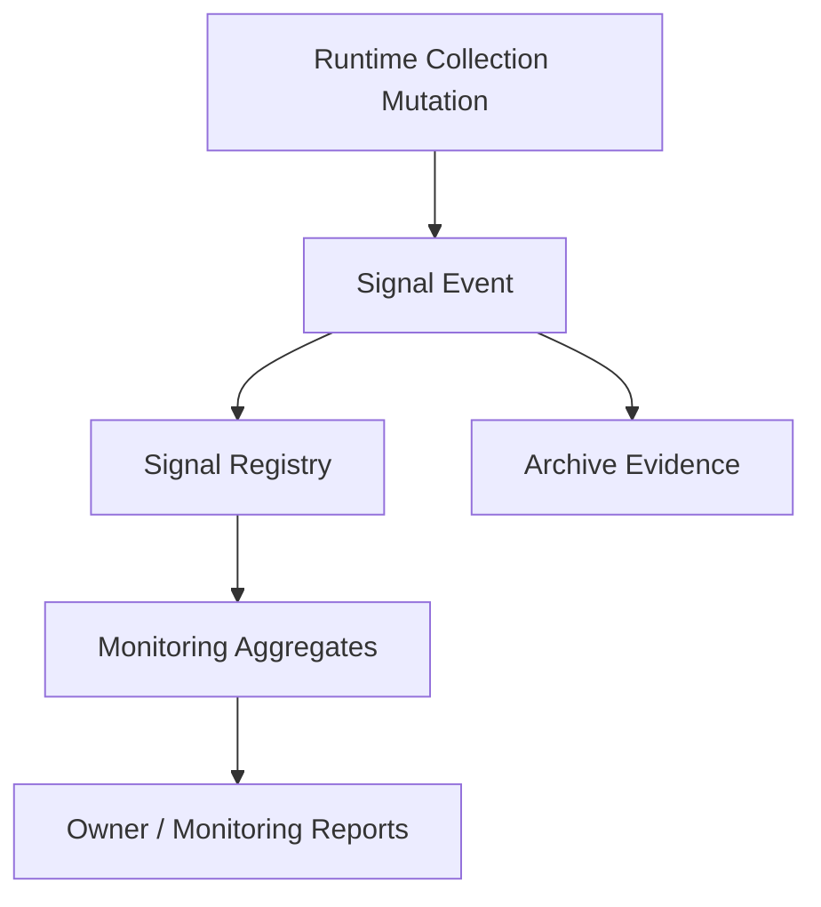
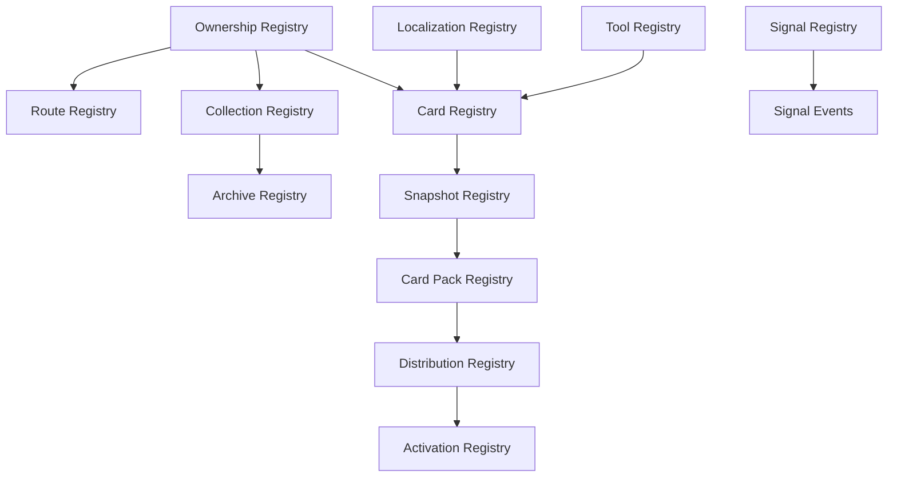
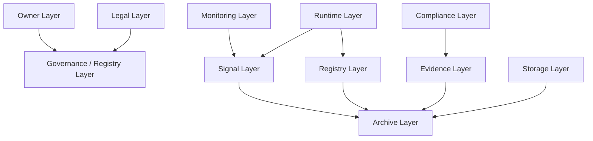

# Mental Smile Firebase Constitutional Transition Audit - Post Phase 10

Audit Mode: `REVIEW_ONLY`
Runtime Changes: `NONE`
Rules Changes: `NONE`
Migration Execution: `NONE`
Source Basis: repository Firebase config, Firestore rules, Storage rules, indexes, Cloud Functions, active Flutter Firestore references, legacy Firebase rule files, and existing governance docs.
Production Data Access: `NOT_PERFORMED`
Final Verdict: `PASS_WITH_DEBT`

---

## 1. CONSTITUTIONAL FIREBASE AUDIT REPORT

This audit reviews the current Firebase architecture after completion of the Phase 1 through Phase 10 constitutional system. It does not query live Firebase data, does not modify rules, does not modify code, and does not execute migrations.

The current Firebase architecture is not yet a constitutional runtime for:

```text
Guide -> Snapshot -> Pack -> Distribution -> Activation
```

It is a transitional Firebase architecture that supports the current app, current role-gated surfaces, declaration flows, support/signal flows, monitoring summaries, and legacy containment. It contains enough governance anchors to proceed with planning, but it cannot yet execute the Phase 10 automatic replacement/activation doctrine because the runtime registries and governance bridge do not exist.

Top-level finding:

| Area | Finding | Classification |
| --- | --- | --- |
| Firestore rules | Current active rules are restrictive and custom-claim centered. | ACTIVE / TRANSITIONAL |
| Storage rules | Storage still recognizes `admin` and Firestore `admins/{uid}` fallback. | TRANSITIONAL / ADMIN ERA DEBT |
| Cloud Functions | One scheduled analytics summary writer exists. | ACTIVE / TRANSITIONAL |
| Indexes | Indexes support profile requests, support requests, chat, messages, and signal events. | ACTIVE |
| Booking-era runtime | Not present in active Firestore rules or active `lib` references, but present in legacy docs/rules. | FROZEN / LEGACY |
| Constitutional registries | Mostly documented, not grounded as runtime Firebase collections. | MISSING RUNTIME GROUNDING |
| Signal stream | `signal_events` exists and is constitutionally aligned, but many status fields still behave like embedded signals. | ACTIVE / TRANSITIONAL |

---

## 2. CURRENT FIREBASE TOPOLOGY

### 2.1 Firebase Project Configuration

| Item | Current Reality | Status | Classification |
| --- | --- | --- | --- |
| Firebase project | `mental-smile-app-clean` in `.firebaserc` and `firebase.json` | ACTIVE | ACTIVE |
| Firestore rules file | `firestore.rules` | ACTIVE | ACTIVE |
| Firestore indexes file | `firestore.indexes.json` | ACTIVE | ACTIVE |
| Storage rules file | `storage.rules` | ACTIVE | TRANSITIONAL |
| Functions source | `functions` | ACTIVE | ACTIVE |
| Functions runtime | Node 20 | ACTIVE | ACTIVE |
| Flutter Firebase config | `lib/firebase_options.dart` generated target in `firebase.json` | ACTIVE | ACTIVE |

### 2.2 Firestore Collections And Subcollections

| Firebase Item | Type | Evidence | Current Role | Classification |
| --- | --- | --- | --- | --- |
| `clients` | Collection | Firestore rules and active Flutter reads/writes | Client account/profile, residential preferences, client signals fields | ACTIVE |
| `clinicians` | Collection | Firestore rules and active Flutter reads/writes | Provider declaration/profile visibility | ACTIVE |
| `centers` | Collection | Firestore rules and active Flutter reads/writes | Center declaration/profile visibility | ACTIVE |
| `clinician_profile_change_requests` | Collection | Firestore rules, indexes, active Flutter | Declaration/update request ledger | ACTIVE / TRANSITIONAL |
| `center_profile_change_requests` | Collection | Firestore rules, indexes, active Flutter | Declaration/update request ledger | ACTIVE / TRANSITIONAL |
| `support_requests` | Collection | Firestore rules, indexes, active Flutter | Structured support request intake | ACTIVE / TRANSITIONAL |
| `provider_contact_requests` | Collection | Firestore rules | Provider contact request record | ACTIVE / TRANSITIONAL |
| `center_contact_requests` | Collection | Firestore rules | Center contact request record | ACTIVE / TRANSITIONAL |
| `saved_destinations` | Collection | Firestore rules, active Flutter | Client saved provider/center/library destination | ACTIVE |
| `chat_threads` | Collection | Firestore rules, indexes, active Flutter | Participant chat thread and support safety metadata | ACTIVE / TRANSITIONAL |
| `chat_threads/{threadId}/messages` | Subcollection | Firestore rules, indexes, active Flutter | Chat messages | ACTIVE |
| `chat_escalations` | Collection | Firestore rules, active service | Safety escalation record | ACTIVE / TRANSITIONAL |
| `chat_escalations/{escalationId}/reports` | Subcollection | Firestore rules, active service | Escalation report record | ACTIVE / TRANSITIONAL |
| `system_domains` | Collection | Firestore rules, active service, dev seeder | Domain status registry-like collection | ACTIVE / REGISTRY CANDIDATE |
| `signal_events` | Collection | Firestore rules, indexes, active Flutter | Append-only signal stream | ACTIVE |
| `signal_aggregates` | Collection | Firestore rules | Monitoring aggregate read model; client writes disabled | TRANSITIONAL |
| `analytics_summaries` | Collection | Cloud Function writer | Hourly BigQuery-derived analytics summary docs | ACTIVE / RUNTIME CACHE |
| `ai_policies` | Collection | Dev seeder only | AI policy seed target; no active rule match observed | UNKNOWN / GOVERNANCE CANDIDATE |
| `admins` | Collection | Storage rules fallback only | Admin identity fallback for storage | LEGACY / ADMIN ERA DEBT |
| `booking_requests` | Collection | Legacy rules/docs; not active in current Firestore rules/lib scan | Booking-era legacy container | FROZEN / LEGACY |
| `bookingRequests` | Collection | Legacy docs/rules deny path | Old compatibility spelling | FROZEN / REMOVE CANDIDATE |
| `sessionRatings` | Collection | Legacy docs | Session/review bridge from booking era | FROZEN / ARCHIVE CANDIDATE |
| `resources` | Collection | Legacy rules only | Old public resource collection | LEGACY / UNKNOWN |
| `debug` | Collection | Legacy rules only | Dev/debug scratch path | FROZEN / REMOVE CANDIDATE |
| `users/{uid}/...` | Collection path | Legacy PROD rules file only | Old user-private path | LEGACY / UNKNOWN |

### 2.3 Custom Claims

| Claim | Current Evidence | Constitutional Fit | Classification |
| --- | --- | --- | --- |
| `owner` | Firestore rules, Master Role Guide, app role constants | Fits Owner doctrine | ACTIVE |
| `monitoring_operator` | Firestore rules, Master Role Guide, app role constants | Fits Monitoring doctrine | ACTIVE |
| `registry_steward` | Firestore rules, Master Role Guide, app role constants | Fits Registry doctrine | ACTIVE |
| `declaration_reviewer` | Firestore rules, Master Role Guide, app role constants | Fits Legal/Governance declaration review surface | ACTIVE |
| `support_observer` | Firestore rules, Master Role Guide, app role constants | Fits Monitoring/support observer boundary | ACTIVE / TRANSITIONAL |
| `client` | Firestore rules and app docs | Runtime role, not constitutional authority | ACTIVE |
| `clinician` | Firestore rules and app docs | Runtime provider role, not constitutional authority | ACTIVE |
| `center` | Firestore rules and app docs | Runtime commercial entity role, not constitutional authority | ACTIVE |
| `admin` | Storage rules only; legacy docs/rules | Conflicts with post-admin constitutional authority unless frozen | LEGACY / FROZEN |
| Future roles | Not active | Must be added only through authority constitution | FUTURE RESERVED |

### 2.4 Storage Structure

| Storage Path | Current Rule | Constitutional Classification |
| --- | --- | --- |
| `/centers/{uid}/...` | Center owner write, admin/owner read | ACTIVE / TRANSITIONAL |
| `/clinicians/{uid}/...` | Clinician owner write, admin/owner read | ACTIVE / TRANSITIONAL |
| `/clients/{uid}/...` | Owner write/read | ACTIVE |
| `/identity/{uid}/...` | Owner write/read, admin read | ACTIVE / SENSITIVE |
| `/certificates/{uid}/...` | Owner write/read, admin read | ACTIVE / SENSITIVE |
| `/licenses/{uid}/...` | Owner write/read, admin read | ACTIVE / SENSITIVE |
| `/national_ids/{uid}/...` | Owner write/read, admin read | ACTIVE / SENSITIVE |
| `/verification_docs/{uid}/...` | Owner write/read, admin read | ACTIVE / SENSITIVE |
| `/medical_docs/{uid}/...` | Owner write/read, admin read | ACTIVE / HIGH RISK |
| `/branding/...` | Public read, admin write | TRANSITIONAL / ADMIN ERA DEBT |
| `/public_gallery/...` | Public read, admin write | TRANSITIONAL / ADMIN ERA DEBT |
| `/public_images/...` | Public read, admin write | TRANSITIONAL / ADMIN ERA DEBT |
| `/marketing_assets/...` | Public read, admin write | TRANSITIONAL / ADMIN ERA DEBT |

### 2.5 Cloud Functions And Jobs

| Function / Job | Type | Reads | Writes | Status | Classification |
| --- | --- | --- | --- | --- | --- |
| `writeAnalyticsSummariesHourly` | Scheduled Cloud Function | BigQuery GA export tables | `analytics_summaries/top_entry_modules`, `top_selected_paths`, `chat_opens_by_context` | ACTIVE | MONITORING / RUNTIME CACHE |

No callable functions, trigger functions, deployment engines, synchronization engines, activation engines, or backup jobs were observed in active `functions/index.js`.

### 2.6 Indexes

| Collection Group | Fields | Purpose | Status |
| --- | --- | --- | --- |
| `center_profile_change_requests` | `centerId`, `status`, `createdAt` | Center request inbox/history | ACTIVE |
| `clinician_profile_change_requests` | `clinicianId`, `status`, `createdAt` | Clinician request inbox/history | ACTIVE |
| `support_requests` | `createdByUid`, `status`, `createdAt` | Client support request history | ACTIVE |
| `support_requests` | `status`, `createdAt` | Support observer queue | ACTIVE / TRANSITIONAL |
| `chat_threads` | `participantUid`, `updatedAt` | Participant chat list | ACTIVE |
| `messages` | `sequenceNumber` | Chat message ordering | ACTIVE |
| `signal_events` | `actorId`, `timestamp` | Signal stream actor history | ACTIVE |

---

## 3. CONSTITUTIONAL ALIGNMENT REVIEW

| Firebase Area | Phase 1-10 Alignment | Violation / Debt | Review |
| --- | --- | --- | --- |
| `clients` | Supports residential runtime state and client-owned data | Embedded `clientSignals` should be signalized or registry-mapped | TRANSITIONAL |
| `clinicians` | Supports commercial provider declarations | Visibility readiness and declaration fields are collection state, not governed registry entries | TRANSITIONAL |
| `centers` | Supports commercial center declarations | Same as clinicians; pricing/capability fields need registry/signal split | TRANSITIONAL |
| Profile change request collections | Align with declaration governance | They act as lifecycle ledgers but are not named as constitutional signals | TRANSITIONAL |
| `support_requests` | Aligns with support observer, no booking authority in current rules | Status lifecycle should become signal stream plus immutable request record | TRANSITIONAL |
| Contact request collections | Align with commercial contact, not booking | Should not become booking/payment workflow | ACTIVE WITH WATCH |
| `saved_destinations` | Aligns with residential/commercial discovery | Save/update behavior produces signal but collection remains mutable runtime preference | ACTIVE / SIGNAL CANDIDATE |
| `chat_threads` and messages | Supports support communication | Participant update path is broad compared with constitutional evidence doctrine | TRANSITIONAL |
| `chat_escalations` and reports | Aligns with safety/support escalation | Recommended clinician path must not become assignment authority | TRANSITIONAL RISK |
| `system_domains` | Already registry-like | Needs formal registry grounding under Phase 4 | REGISTRY CANDIDATE |
| `signal_events` | Strongest alignment with Signal Doctrine | Needs broader producer coverage and archive relationship | ACTIVE |
| `signal_aggregates` | Monitoring read model | No writer in rules; persistent writer gap remains | TRANSITIONAL |
| `analytics_summaries` | Monitoring/analytics cache | No explicit Firestore rules path; server-only by catch-all deny for clients | ACTIVE / RUNTIME CACHE |
| Storage admin fallback | Conflicts with Owner/Authority purification | `admin` and `/admins/{uid}` preserve Admin Era authority | DEBT |
| Legacy booking artifacts | Conflicts with no-booking/no-payment doctrine if revived | Currently frozen in docs/rules, not active app path | FROZEN |

Collections that violate doctrine if active:

| Item | Conflict |
| --- | --- |
| `booking_requests` | Booking, payment, approval, assignment, admin queue, accounting authority. |
| `bookingRequests` | Legacy duplicate spelling and resurrection risk. |
| `sessionRatings` | Session/review bridge tied to booking-era lifecycle. |
| `/admins/{uid}` storage fallback | Hidden Admin Era authority outside current Firestore custom-claim model. |
| `resources` and `debug` legacy rules | Old unrestricted/dev-era patterns. |

---

## 4. COLLECTION CLASSIFICATION MAP

| Collection | Remain Collection | Become Registry | Become Signal Stream | Become Archive | Runtime Cache | Remove | Freeze | Constitutional Decision |
| --- | --- | --- | --- | --- | --- | --- | --- | --- |
| `clients` | YES | PARTIAL ownership/client profile registry later | PARTIAL for `clientSignals`/preference mutations | NO | NO | NO | NO | Keep as runtime identity/profile collection; extract signals. |
| `clinicians` | YES | PARTIAL provider declaration registry later | PARTIAL for readiness/profile changes | NO | NO | NO | NO | Keep as commercial entity collection; ground declaration registry. |
| `centers` | YES | PARTIAL center declaration/capability registry later | PARTIAL for readiness/pricing/capability changes | NO | NO | NO | NO | Keep as commercial entity collection; ground capability registry. |
| `clinician_profile_change_requests` | YES | NO | YES, lifecycle events | ARCHIVE AFTER CLOSURE | NO | NO | NO | Remain request ledger; emit signals. |
| `center_profile_change_requests` | YES | NO | YES, lifecycle events | ARCHIVE AFTER CLOSURE | NO | NO | NO | Remain request ledger; emit signals. |
| `support_requests` | YES | NO | YES, status/lifecycle events | ARCHIVE AFTER CLOSURE | NO | NO | NO | Remain support request collection; signalize lifecycle. |
| `provider_contact_requests` | YES | NO | YES, contact started/confirmed events | ARCHIVE AFTER CLOSURE | NO | NO | NO | Remain lightweight request collection. |
| `center_contact_requests` | YES | NO | YES, contact started/confirmed events | ARCHIVE AFTER CLOSURE | NO | NO | NO | Remain lightweight request collection. |
| `saved_destinations` | YES | NO | YES, saved/updated events | NO | NO | NO | NO | Remain user preference collection; signalize writes. |
| `chat_threads` | YES | NO | YES, safety state changes | ARCHIVE AFTER CLOSURE | NO | NO | NO | Remain runtime communication collection. |
| `messages` | YES | NO | Optional message-created events | ARCHIVE BY THREAD | NO | NO | NO | Remain subcollection. |
| `chat_escalations` | YES | NO | YES, escalation lifecycle | ARCHIVE AFTER CLOSURE | NO | NO | NO | Remain escalation ledger; prevent assignment semantics. |
| `reports` | YES | NO | YES, report-created event | ARCHIVE BY ESCALATION | NO | NO | NO | Remain subcollection. |
| `system_domains` | PARTIAL | YES | NO | OPTIONAL | NO | NO | NO | Convert/govern as registry collection. |
| `signal_events` | NO | NO | YES | ARCHIVE BY RETENTION CLASS | NO | NO | NO | Canonical signal stream. |
| `signal_aggregates` | NO | NO | NO | OPTIONAL | YES | NO | NO | Runtime/monitoring cache; requires writer governance. |
| `analytics_summaries` | NO | NO | NO | OPTIONAL | YES | NO | NO | Runtime analytics cache from scheduled job. |
| `ai_policies` | NO | YES | NO | OPTIONAL | NO | NO | FREEZE UNTIL RULED | Governance registry candidate; currently under dev seeder only. |
| `admins` | NO | NO | NO | YES IF DATA EXISTS | NO | YES AFTER AUTHORITY SPLIT | YES | Freeze Admin Era identity fallback. |
| `booking_requests` | NO | NO | PARTIAL historical event extraction only | YES | NO | FUTURE AFTER ARCHIVE | YES | Frozen legacy debt. |
| `bookingRequests` | NO | NO | NO | YES IF DATA EXISTS | NO | YES | YES | Remove candidate after archive proof. |
| `sessionRatings` | NO | NO | PARTIAL historical event extraction only | YES | NO | FUTURE AFTER ARCHIVE | YES | Frozen booking-era bridge. |
| `resources` | UNKNOWN | POSSIBLE content registry | NO | UNKNOWN | NO | FUTURE | YES | Legacy rule-only debt. |
| `debug` | NO | NO | NO | NO | NO | YES | YES | Dev-only remove candidate. |

---

## 5. RULES AUDIT REPORT

### 5.1 Firestore Rules

| Rule Area | Required By Constitution | Transitional | Remove Candidate | Violation Risk |
| --- | --- | --- | --- | --- |
| Custom claim role model | YES | NO | NO | Low; aligns with role authority doctrine. |
| App-side role docs are not authoritative comment | YES | NO | NO | Positive alignment. |
| Duplicate `isMonitoringOperator()` function | NO | YES | FUTURE CLEANUP | Low technical hygiene risk. |
| `clients` own create/update with protected fields | YES | NO | NO | Low. |
| `clinicians`/`centers` visibility readiness | YES | YES | NO | Medium; readiness fields need registry/signal ownership. |
| Profile request create-only/update-denied | YES | YES | NO | Low; good immutable request behavior. |
| `support_requests` create-only/update-denied | YES | YES | NO | Low; lifecycle closure not yet represented. |
| Contact request create-only/update-denied | YES | YES | NO | Low. |
| `saved_destinations` client update allowed | PARTIAL | YES | NO | Medium; mutability should be signalized/audited. |
| `chat_threads` participant update allowed | PARTIAL | YES | NO | Medium; broad participant updates can blur evidence. |
| `chat_escalations` recommended clinician read/resolve | PARTIAL | YES | NO | Medium; must not become assignment authority. |
| `system_domains` read owner/registry steward, write false | YES | NO | NO | Good registry containment. |
| `signal_events` append-only | YES | NO | NO | Strong alignment. |
| `signal_aggregates` read-only to owner/monitoring | YES | YES | NO | Writer gap remains. |
| Catch-all deny | YES | NO | NO | Strong alignment. |

Firestore rule violations against future doctrine:

| Doctrine | Finding | Severity |
| --- | --- | --- |
| Registry Doctrine | Runtime registries are not represented as governed collections except `system_domains`. | Critical |
| Archive Doctrine | No archive collections/rules exist for constitutional archive classes. | Critical for future runtime |
| Activation Doctrine | No snapshot/pack/distribution/activation collections or rules exist. | Critical for future runtime |
| Signal Doctrine | `signal_events` exists, but many collection status mutations are not modeled as signals. | Important |
| Compliance Doctrine | No compliance case/evidence collection exists. | Critical for future runtime |

### 5.2 Storage Rules

| Rule Area | Finding | Constitutional Risk | Classification |
| --- | --- | --- | --- |
| `isAdmin()` custom claim | Admin Era authority persists in storage. | Conflicts with Owner/Legal/Compliance split if active. | FROZEN DEBT |
| `/admins/{uid}` Firestore fallback | Storage trusts a collection not governed in active Firestore rules. | Hidden authority path. | HIGH RISK DEBT |
| Sensitive docs paths | Identity, certificates, licenses, national IDs, verification docs, medical docs are accepted. | Needs data custody/privacy constitution. | IMPORTANT GAP |
| Public asset paths | Public read, admin write. | Asset registry/ownership not runtime-grounded. | TRANSITIONAL |
| Delete denied | Aligns with archive/preservation caution. | Positive. | ACTIVE |

### 5.3 Legacy Rule Files

| File | Status | Finding |
| --- | --- | --- |
| `firebase_rules/firestore.rules.DEV` | LEGACY | Fully open dev rule; must never become production. |
| `firebase_rules/firestore.rules.DEV_BOOKING` | LEGACY / FROZEN | Booking-era permissive dev rule. |
| `firebase_rules/firestore.rules.MIN_SAFE` | LEGACY | Public resources/debug pattern. |
| `firebase_rules/firestore.rules.MIN_SAFE_STAGE2` | LEGACY / FROZEN | Contains booking_requests transitional logic. |
| `firebase_rules/firestore.rules.PROD` | LEGACY | Old resources/users/debug rule set. |

---

## 6. CUSTOM CLAIM REVIEW

| Claim | Remain | Disappear | Split | Future Authority Model |
| --- | --- | --- | --- | --- |
| `owner` | YES | NO | POSSIBLE split into owner_authorizer and sovereign_owner later | Owner authorizes constitutional changes and sovereign operations. |
| `monitoring_operator` | YES | NO | POSSIBLE monitoring_observer / monitoring_verifier split | Monitoring observes, verifies, escalates only. |
| `registry_steward` | YES | NO | POSSIBLE per-registry stewardship later | Registry steward can read/verify governed registry surfaces. |
| `declaration_reviewer` | YES | NO | POSSIBLE legal_declaration_reviewer split | Reviews provider/center declaration readiness without platform approval doctrine. |
| `support_observer` | YES | NO | POSSIBLE support_observer / safety_observer split | Observes support/safety records without treatment or assignment authority. |
| `client` | YES | NO | NO | Runtime identity role, not governance authority. |
| `clinician` | YES | NO | NO | Runtime commercial/provider identity, not platform employee authority. |
| `center` | YES | NO | NO | Runtime commercial/entity identity, not platform operating authority. |
| `admin` | NO for future constitution | YES after storage migration | Split into Owner/Legal/Compliance/Technical/Monitoring/Archive if any function remains | Admin claim should disappear from active authority. |

Future role candidates:

| Future Claim | Source Need | Status |
| --- | --- | --- |
| `legal_governance` | Legal interpretation and block authority | FUTURE |
| `compliance_operator` | Compliance case/evidence validation | FUTURE |
| `archive_steward` | Archive access/retention/destruction governance | FUTURE |
| `technical_verifier` | Phase 10 verify-only role | FUTURE |
| `activation_steward` | Future activation governance bridge | FUTURE RESERVED |

---

## 7. BOOKING ERA DEBT REVIEW

| Item | Current Evidence | Decision | Rationale |
| --- | --- | --- | --- |
| `booking_requests` | Legacy docs/rules; not active current Firestore rule path | FREEZE -> ARCHIVE -> FUTURE REMOVAL | Conflicts with no booking/payment/assignment/admin queue doctrine. |
| `bookingRequests` | Legacy compatibility spelling | FREEZE -> REMOVE AFTER ARCHIVE PROOF | Duplicate legacy path with resurrection risk. |
| Payment proof flow | Legacy docs/assets/language findings | FREEZE -> ARCHIVE | Payment platform authority is forbidden by current doctrine. |
| Accounting flow | Legacy docs | FREEZE -> OPTIONAL MODULE ONLY BY FUTURE CONSTITUTION | Not core constitutional runtime. |
| Legacy queues | Legacy docs/admin-era references | FREEZE -> REMOVE | Queue ownership conflicts with governance doctrine. |
| Legacy approval chains | Legacy docs/language findings | FREEZE -> REMOVE | Approval doctrine conflicts with declaration/readiness language. |
| `sessionRatings` | Legacy docs | FREEZE -> ARCHIVE | Session lifecycle tied to booking era. |
| Admin booking/payment rules | Legacy rule files | FREEZE | Must not be redeployed. |

Booking-era verdict: `FROZEN_DEBT_NOT_ACTIVE_IN_CURRENT_RULES`.

---

## 8. SIGNAL MIGRATION MAP

Future signal topology:



Collections/events that should become or produce signals:

| Source | Signal Domain | Current Form | Future Signal |
| --- | --- | --- | --- |
| `clients.clientSignals` | Residential self-expression | Embedded map field | `client_signal_declared`, `client_signal_updated` |
| `clients.privacyPreferences` | Residential preference | Embedded map field | `client_privacy_preference_updated` |
| `saved_destinations` create/update | Residential/commercial intent | Collection mutation | `destination_saved`, `destination_updated` |
| `support_requests.status` | Support lifecycle | Status field | `support_request_created`, `support_request_closed`, `support_request_escalated` |
| `provider_contact_requests` create | Commercial contact | Collection create | `provider_contact_started` |
| `center_contact_requests` create | Commercial contact | Collection create | `center_contact_started` |
| `clinicians.visibilityReadiness` | Declaration readiness | Status field | `clinician_readiness_changed` |
| `centers.visibilityReadiness` | Declaration readiness | Status field | `center_readiness_changed` |
| `clinician_profile_change_requests.status` | Declaration lifecycle | Status field | `clinician_declaration_change_submitted` |
| `center_profile_change_requests.status` | Declaration lifecycle | Status field | `center_declaration_change_submitted` |
| `chat_threads.safetyState` | Safety monitoring | Thread field | `chat_safety_state_changed` |
| `chat_escalations.status` | Escalation lifecycle | Status field | `chat_escalation_opened`, `chat_escalation_resolved` |
| `analytics_summaries` writes | Monitoring analytics | Scheduled cache write | `analytics_summary_generated` |
| Legacy `booking_requests` fields | Historical only | Frozen legacy fields | Historical archive extraction only, not active signals |

Current canonical signal stream: `signal_events`.

Missing signal domains:

| Missing Signal Domain | Priority |
| --- | --- |
| Declaration readiness lifecycle signals | Critical |
| Contact request lifecycle signals | Important |
| Support request lifecycle signals | Critical |
| Chat safety state signals | Critical |
| Analytics summary generation signals | Important |
| Archive/retention/destruction signals in Firebase | Critical for future runtime |
| Snapshot/pack/distribution/activation signals in Firebase | Critical for future runtime |

---

## 9. REGISTRY MIGRATION MAP

Future registry topology:



Registry migration candidates:

| Future Registry | Current Source | Current Gap | Priority |
| --- | --- | --- | --- |
| Ownership Registry | Custom claims, role docs, Master Role Guide | No central Firestore ownership registry | Critical |
| Route Registry | Flutter routes/docs | No runtime route registry | Important |
| Card Registry | Master Card Guide docs | No runtime card registry | Critical |
| Tool Registry | Master Tool Guide; deleted runtime registry | No active runtime tool registry | Important |
| Collection Registry | Master Collection Guide; Firestore rules | No central collection registry | Critical |
| Localization Registry | Language policy docs | No runtime localization ownership registry | Critical |
| Signal Registry | Runtime signal registries in Dart; `signal_events` | Signal registry not grounded in Firestore | Important |
| Archive Registry | Phase 6A docs | No Firebase archive registry | Critical for future runtime |
| Snapshot Registry | Phase 7 docs | No Firebase snapshot registry | Critical for future runtime |
| Card Pack Registry | Phase 8 docs | No Firebase pack registry | Critical for future runtime |
| Distribution Registry | Phase 9 docs | No Firebase distribution registry | Critical for future runtime |
| Activation Registry | Phase 10 docs | No Firebase activation registry | Critical for future runtime |
| Domain Registry | `system_domains` | Exists but limited | Active candidate |

---

## 10. RUNTIME GOVERNANCE READINESS

Can current Firebase support:

```text
Guide -> Snapshot -> Pack -> Distribution -> Activation
```

Verdict: `NO`.

Blockers:

| Blocker | Impact | Severity |
| --- | --- | --- |
| No Firebase guide registry | Cannot ground guide state in runtime. | Critical |
| No snapshot registry/collection/rules | Cannot create or validate snapshots. | Critical |
| No card pack registry/collection/rules | Cannot generate or validate packs. | Critical |
| No distribution receiver registry/collection/rules | Cannot constitutionally distribute packs. | Critical |
| No activation registry/collection/rules | Cannot enforce single active version. | Critical |
| No archive registry/collection/rules | Cannot preserve runtime evidence under Phase 6A. | Critical |
| No compliance evidence collection/rules | Cannot validate audit evidence. | Critical |
| Storage still has admin fallback | Authority model not purified. | High |
| Signal coverage incomplete | Lifecycle mutations remain field-based. | High |
| Runtime bridge absent | Governance cannot safely drive runtime. | Critical |

Current Firebase can support:

| Capability | Readiness |
| --- | --- |
| Current app registration/profile flows | YES |
| Current declaration review | YES |
| Current support/contact/saved/chat/signal flows | YES |
| Current monitoring signal/event reads | PARTIAL |
| Current analytics summary write from scheduled function | YES |
| Constitutional automatic replacement/activation | NO |

---

## 11. FROZEN DEBT REGISTRY

| Debt Item | Debt Class | Impact | Risk | Priority |
| --- | --- | --- | --- | --- |
| `admin` storage claim | Frozen Debt | Preserves admin-era authority in Storage | High | Critical |
| `/admins/{uid}` storage fallback | Frozen Debt | Hidden authority source not governed by active Firestore rules | High | Critical |
| Legacy `firebase_rules/*` files | Accepted/Frozen Debt | Risk of redeploying old permissive or booking rules | High | Critical |
| `booking_requests` | Frozen Debt | Booking/payment/admin queue resurrection risk | High | Critical |
| `bookingRequests` | Future Removal | Duplicate legacy path | Medium | Important |
| `sessionRatings` | Frozen Debt | Session lifecycle bridge | Medium | Important |
| `resources` legacy path | Transitional Debt | Unknown old content behavior | Medium | Important |
| `debug` legacy path | Future Removal | Dev-open history | Medium | Important |
| Embedded status fields | Transitional Debt | Lifecycle not represented as signals | Medium | Important |
| `signal_aggregates` no writer rule | Transitional Debt | Persistent aggregate writer gap | Medium | Important |
| `analytics_summaries` no explicit client rule | Accepted Debt | Server-only by catch-all; unclear consumer surface | Low/Medium | Important |
| Missing runtime registries | Transitional Debt | Blocks constitutional runtime | High | Critical |
| Sensitive storage categories | Future Refactor | Needs privacy/data custody model | High | Critical |

---

## 12. FUTURE FIREBASE TOPOLOGY

Future constitutional Firebase layers:



Layer responsibilities:

| Layer | Firebase Shape | Responsibility |
| --- | --- | --- |
| Owner Layer | Owner authority claims and owner-governed registries | Authorize constitutional changes and emergency holds. |
| Legal Layer | Legal/governance claims and policy registries | Interpret doctrine and block authority conflicts. |
| Compliance Layer | Compliance cases, checks, evidence registries | Validate, audit, block, escalate. |
| Monitoring Layer | Signal aggregates, analytics summaries, monitoring reports | Observe, verify, escalate, never mutate active authority. |
| Runtime Layer | Current app collections: clients, clinicians, centers, support/contact/chat/saved | Serve app state without owning governance. |
| Signal Layer | `signal_events` plus signal registry | Represent lifecycle events and status changes. |
| Registry Layer | ownership, route, card, tool, collection, localization, signal, snapshot, pack, distribution, activation registries | Ground constitutional references. |
| Archive Layer | archive records, evidence records, retention/destruction governance | Preserve memory and evidence. |
| Storage Layer | user documents, public assets, governed uploads | Store files with owner/custody/registry links. |

---

## 13. EXECUTION ROADMAP

This roadmap is governance planning only. It is not implementation.

| Wave | Name | Purpose | Outputs |
| --- | --- | --- | --- |
| Wave 1 | Critical Constitutional Fixes | Freeze admin-era storage authority, classify legacy rule files, define no-redeploy guard. | Admin debt register, legacy rules quarantine policy, storage authority review. |
| Wave 2 | Registry Grounding | Define Firebase registry topology for ownership, collection, signal, localization, route, card, archive, activation. | Registry schema doctrine, ownership map, collection registry plan. |
| Wave 3 | Signal Grounding | Convert lifecycle/status mutations into signal doctrine mapped to `signal_events`. | Signal migration map, status-to-signal matrix, aggregate writer governance. |
| Wave 4 | Authority Purification | Split admin-era authority into Owner, Legal, Compliance, Technical, Monitoring, Archive. | Custom claim transition map, storage authority split, role attestation plan. |
| Wave 5 | Runtime Governance Bridge | Define how governance state may be consumed by runtime safely. | Bridge doctrine, read-only guide registry access rules, evidence gate map. |
| Wave 6 | Legacy Removal | Archive/freeze/remove booking-era and dev-era Firebase surfaces after proof. | Legacy archive plan, removal candidates, verification checklist. |

---

## 14. FINAL VERDICT

Final verdict: `PASS_WITH_DEBT`.

Reason:

The current Firebase architecture is reviewable, mostly restrictive, and partially aligned with the Phase 1 through Phase 10 constitutional direction. The active Firestore rules have already moved away from broad admin/booking authority and now rely on custom claims and append-only signal events. However, Firebase is not yet ready to act as the constitutional runtime for snapshots, packs, distribution, replacement, activation, archive, or compliance evidence.

Critical blockers before runtime constitutional execution:

| Blocker | Severity |
| --- | --- |
| Missing runtime registry grounding | Critical |
| Missing snapshot/pack/distribution/activation Firebase topology | Critical |
| Missing archive/compliance evidence collections and rules | Critical |
| Storage `admin` and `/admins/{uid}` fallback | Critical |
| Booking-era debt must remain frozen and non-redeployed | Critical |
| Signal coverage incomplete for lifecycle/status mutations | High |
| Sensitive storage custody model missing | High |

Readiness:

| Area | Verdict |
| --- | --- |
| Current app Firebase support | PASS |
| Constitutional governance alignment | PASS WITH DEBT |
| Runtime constitutional chain support | NOT READY |
| Booking-era containment | PASS WITH FROZEN DEBT |
| Storage authority purification | HIGH PRIORITY DEBT |
| Future topology clarity | READY FOR GOVERNANCE PLANNING |

No code, rules, runtime systems, Firebase config, migrations, or deployments were changed by this audit.
