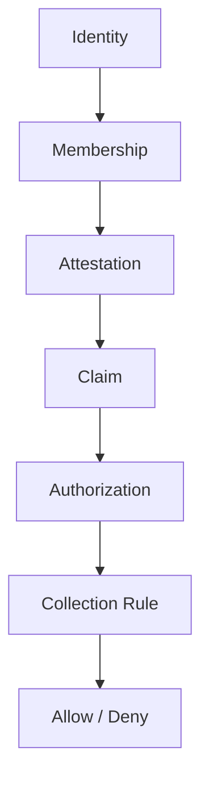

# Mental Smile Firestore Rules Constitution V1

## Document Control

| Field | Value |
|---|---|
| Document ID | FIRESTORE_RULES_CONSTITUTION_V1 |
| Block | BLOCK_6A |
| Era | CONSTITUTIONAL_FIREBASE_RULES_ERA |
| Scope | Firestore rules doctrine only |
| Firestore Rules Changes | NONE |
| Claims Implementation | NONE |
| Firebase Deployment | NONE |
| Version | v1.0.0 |
| Status | ACTIVE_CONSTITUTIONAL_SOURCE |

## Firestore Rules Doctrine

Firestore rules evaluate constitutional authorization. Rules do not create identity, membership, attestation, claims, authorization, ownership, registry truth, or evidence. Rules consume constitutional sources and return allow or deny.

## Rule Evaluation Chain

## Firestore Actions

| Action | Constitutional Meaning | Required Authorization | Required Evidence |
|---|---|---|---|
| Read | Consume collection data | Read Authorization | Rule evaluation + authorization evidence |
| Create | Create governed document | Write Authorization | Collection ownership + write authorization evidence |
| Update | Modify governed document | Write Authorization | Prior state, new state, authorization evidence |
| Delete | Remove governed document when permitted | Revocation/removal authorization | Removal and archive evidence |
| Review | Review document for governance/legal/support/declaration purpose | Review Authorization | Review scope evidence |
| Validate | Validate collection state/access/lifecycle | Validation Authorization | Validation evidence |
| Archive | Preserve collection evidence/records | Archive/Custody Authorization | Archive evidence |

## Rule Sources

| Rule Source | Purpose | Required By |
|---|---|---|
| Collection Registry | Confirms collection identity, owner, lifecycle, class | All collection rules |
| Ownership Registry | Confirms owner domain and steward | All owned access |
| Authorization Registry | Confirms authorization class and scope | Read/write/review/validate/archive |
| Claim Source | Confirms runtime-consumable authority representation | Rule evaluation |
| Evidence Source | Confirms evaluated action can be evidenced/archived | Rule decision |

## Firestore Rule Classes

| Rule Class | Applies To | Pass Condition | Deny Condition |
|---|---|---|---|
| rule.firestore.read | Read actions | Identity -> membership -> attestation -> claim -> read authorization passes | Missing chain, invalid claim, unregistered collection |
| rule.firestore.create | Create actions | Write authorization, collection ownership, registry status valid | Wildcard write, hidden authority, unowned collection |
| rule.firestore.update | Update actions | Write authorization and lifecycle allows update | Revoked/suspended/expired authorization |
| rule.firestore.delete | Delete actions | Explicit removal/revocation/retention authority | Silent delete, admin override |
| rule.firestore.review | Review actions | Review scope and evidence exist | Review without domain membership |
| rule.firestore.validate | Validation actions | Validation authority and registry source exist | Self-validation by runtime |
| rule.firestore.archive | Archive actions | Archive/custody authority exists | Archive without custody |

## Forbidden Firestore Rule Patterns

| Forbidden Pattern | Reason |
|---|---|
| Admin Override | Admin is not constitutional authority |
| Wildcard Collection Access | Scope must be bounded |
| Hidden Collection Access | Access must be explicit and evidenced |
| Unregistered Collection Access | Collection must trace to registry |
| Rule Without Ownership | Every governed collection needs owner/steward |
| Runtime-Created Rule Authority | Runtime cannot create governance |
| Silent Allow / Silent Deny | Decisions require evidence |

## Block 6A Validation Result

| Pass Condition | Result |
|---|---|
| Firestore rule model defined | PASS |
| Rule evaluation chain defined | PASS |
| Firestore actions defined | PASS |
| Rule sources defined | PASS |
| Forbidden patterns defined | PASS |
| No admin override exists as doctrine | PASS |

Final result: `BLOCK_6A_FIRESTORE_RULES_COMPLETE`.
