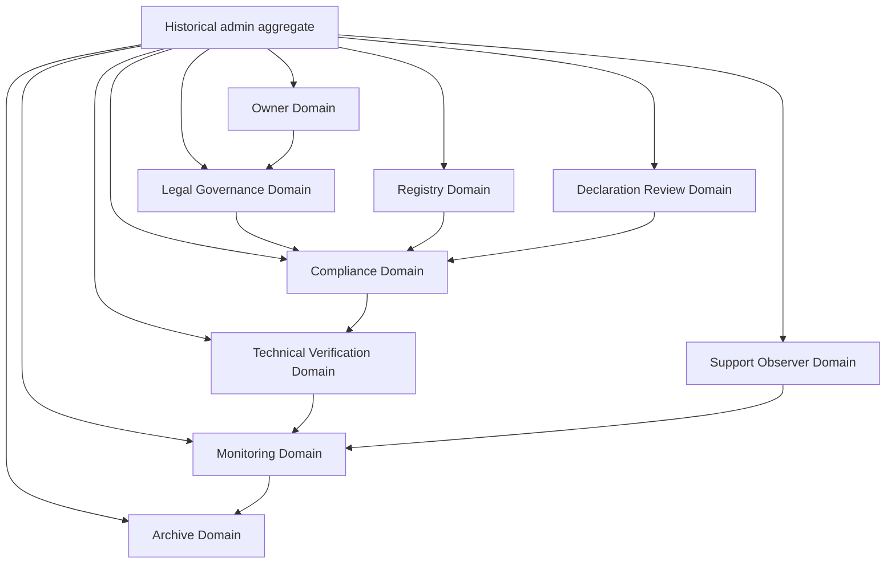

# Mental Smile Master Authority Decomposition Map V1

## Document Control

| Field | Value |
|---|---|
| Document ID | MASTER_AUTHORITY_DECOMPOSITION_MAP_V1 |
| Position | Post P0 Firebase Purification |
| Scope | Constitutional domain decomposition only |
| Runtime Implementation | NONE |
| Firebase Rules Changes | NONE |
| Code Changes | NONE |
| Deployment | NONE |
| Source Inputs | Master Guide Phase 1-10, P0 Firebase Purification Plan, P0 Firebase Purification Amendment |
| Final Verdict | PASS_WITH_RUNTIME_PREREQUISITES |

## Core Doctrine

`admin` is not a constitutional authority.

`admin` is a historical aggregation of ownership, legal interpretation, compliance review, technical verification, monitoring observation, archive custody, registry custody, declaration review, and support visibility. It must be decomposed into isolated constitutional domains before generic admin authority can be removed from runtime rules.

This document does not assign runtime roles, change claims, change rules, change Firestore, change Storage, deploy code, or create implementation logic. It maps authority domains only.

## 1. Authority Decomposition Report

### Admin Decomposition Analysis

Historically, `admin` represented a bundled ability to see, approve, modify, verify, configure, escalate, and operate across multiple surfaces. Constitutionally, those abilities cannot remain bundled because bundled authority hides responsibility, makes escalation ambiguous, and allows one actor to approve, execute, verify, and archive the same action.

The constitutional system requires:

| Requirement | Constitutional Rule |
|---|---|
| Domain isolation | Each authority domain owns a distinct responsibility class |
| Traceability | Every action must identify the domain that reviewed, approved, verified, observed, archived, or executed |
| Non-overlap | No domain may approve and verify its own governed action |
| Owner finality | Owner remains the final authorization domain |
| Technical boundary | Technical verifies and executes only when separately authorized; Technical does not govern |
| Monitoring boundary | Monitoring observes, reports, and escalates; Monitoring does not modify |
| Archive boundary | Archive preserves custody and retrieval; Archive does not approve live state |
| Registry boundary | Registry preserves system truth; Registry does not authorize business decisions |

### Admin Capability Map

| Capability ID | Historical Admin Capability | Constitutional Domain | Domain Action Type | New Boundary |
|---|---|---|---|---|
| ADM-CAP-001 | Final approval of platform direction | Owner | Authorize / Approve | Owner approves; no technical or monitoring override |
| ADM-CAP-002 | Legal interpretation of policy | Legal Governance | Interpret / Review | Legal interprets; Owner authorizes final business action |
| ADM-CAP-003 | Compliance validation | Compliance | Validate / Detect mismatch | Compliance validates; cannot deploy or self-authorize |
| ADM-CAP-004 | Technical correctness review | Technical Verification | Verify | Technical verifies; does not authorize |
| ADM-CAP-005 | Operational observation | Monitoring | Observe / Escalate | Monitoring reports; does not modify |
| ADM-CAP-006 | Record preservation | Archive | Custody / Retrieve | Archive preserves; does not approve current state |
| ADM-CAP-007 | Registry integrity | Registry | Validate registry truth | Registry validates registry entries; does not approve business logic |
| ADM-CAP-008 | Declaration intake review | Declaration Review | Review / Escalate | Declaration Review handles declaration path; cannot override Legal or Owner |
| ADM-CAP-009 | Support visibility | Support Observer | Observe / Report | Support sees and escalates; does not decide authority |
| ADM-CAP-010 | Sensitive storage access | Legal / Compliance / Archive / Technical Verification | Review / Custody / Verify | Access depends on document purpose and custody class |
| ADM-CAP-011 | Public asset write access | Owner / Registry / Technical Verification | Approve / Custody / Verify | Generic admin write is removed after role-specific custody exists |
| ADM-CAP-012 | Incident handling | Compliance / Technical / Monitoring | Validate / Verify / Observe | Incident actions split by responsibility |
| ADM-CAP-013 | Activation and replacement oversight | Owner / Compliance / Monitoring / Archive | Authorize / Validate / Observe / Preserve | No single admin controls activation lifecycle |
| ADM-CAP-014 | Rule change approval | Owner / Legal / Compliance / Technical Verification | Authorize / Interpret / Validate / Verify | Technical executes only after authorization |
| ADM-CAP-015 | Hidden fallback access | None | Forbidden | `/admins/{uid}` fallback is not constitutional authority |

### Admin Responsibility Map

| Responsibility ID | Historical Admin Responsibility | Decomposed Domain | Primary Output | Forbidden Overlap |
|---|---|---|---|---|
| ADM-RESP-001 | Decide what is allowed | Owner + Legal Governance | Authorization decision and legal interpretation | Technical cannot decide legality; Monitoring cannot authorize |
| ADM-RESP-002 | Decide whether process passed | Compliance | Compliance result | Compliance cannot execute remediation |
| ADM-RESP-003 | Confirm technical state | Technical Verification | Verification report | Technical cannot approve doctrine |
| ADM-RESP-004 | Watch active process | Monitoring | Monitoring report / alert | Monitoring cannot change records |
| ADM-RESP-005 | Preserve evidence | Archive | Archive record / retrieval proof | Archive cannot decide live validity |
| ADM-RESP-006 | Maintain registry truth | Registry | Registry validation report | Registry cannot approve policy |
| ADM-RESP-007 | Review declarations | Declaration Review | Declaration review record | Declaration Review cannot approve legal doctrine |
| ADM-RESP-008 | Observe support pathways | Support Observer | Support observation report | Support cannot adjudicate authority |
| ADM-RESP-009 | Access sensitive files | Purpose-specific domain | Custody access record | Generic admin access is forbidden |
| ADM-RESP-010 | Modify runtime rules | Owner-authorized Technical execution | Future execution evidence | No modification without Owner authorization and Compliance validation |

### Admin Authority Map

| Authority Area | Former Admin Assumption | Constitutional Owner | Supporting Domains | Status |
|---|---|---|---|---|
| Final authorization | Admin can approve broadly | Owner | Legal, Compliance | DECOMPOSED |
| Legal interpretation | Admin can interpret policy | Legal Governance | Owner, Compliance | DECOMPOSED |
| Compliance approval | Admin can mark okay | Compliance | Legal, Monitoring | DECOMPOSED |
| Technical changes | Admin can change system | Technical Verification only after authorization | Owner, Compliance | DECOMPOSED |
| Monitoring alerts | Admin watches/responds | Monitoring | Compliance, Owner | DECOMPOSED |
| Archive custody | Admin can retain/delete | Archive | Legal, Compliance | DECOMPOSED |
| Registry edits | Admin can manage registry | Registry | Compliance, Owner | DECOMPOSED |
| Declaration review | Admin can approve declarations | Declaration Review | Compliance, Legal | DECOMPOSED |
| Support moderation | Admin can see/support everything | Support Observer | Monitoring, Compliance | DECOMPOSED |
| Storage access | Admin can read/write broadly | Purpose-specific domains | Technical Verification, Archive | DECOMPOSED |

### Admin Execution Map

| Execution Case | Constitutional Chain | Execution Boundary |
|---|---|---|
| Rules update | Legal interprets -> Compliance validates -> Owner authorizes -> Technical verifies/executes future change -> Monitoring observes -> Archive preserves evidence | Technical execution is not authorization |
| Storage custody change | Owner/Legal defines custody -> Compliance validates -> Technical verifies rules shape -> Monitoring observes access anomaly -> Archive preserves custody record | Generic admin access removed after replacement |
| Card replacement | Owner authorizes doctrine -> Compliance validates pack/snapshot -> Activation Steward governs flow -> Technical verifies only -> Monitoring observes -> Archive preserves prior evidence | No manual admin replacement |
| Declaration case | Declaration Review intakes -> Compliance validates mismatch or status -> Legal interprets if needed -> Owner authorizes final action if business authority needed | Declaration Review cannot act as Owner |
| Support escalation | Support Observer reports -> Monitoring observes pattern -> Compliance validates risk -> Owner/Legal decide if action required | Support cannot authorize or modify governance |

## 2. Owner Domain

| Field | Definition |
|---|---|
| Purpose | Final constitutional authorization and ownership decision domain |
| Responsibilities | Authorize guide changes, authorize Firebase authority replacement direction, approve business-level decisions, accept or reject governance handoffs |
| Boundaries | Owner does not self-verify technical correctness, does not self-certify compliance, and does not act as archive custodian |
| Authority Scope | Final authorization, business ownership, governance acceptance |
| Approval Scope | Constitutional changes, authority model changes, guide/card/snapshot/pack approval, runtime bridge authorization |
| Forbidden Actions | Direct technical execution, hidden fallback access, unilateral compliance pass, silent archive modification |

| Interaction | Allowed | Forbidden |
|---|---|---|
| Legal | Request interpretation, receive legal review | Override legal meaning without record |
| Compliance | Receive validation, resolve blocked governance | Self-validate compliance |
| Technical | Authorize technical work, receive verification | Treat technical as policy authority |
| Monitoring | Receive alerts and reports | Ask Monitoring to modify records |
| Archive | Request retrieval, authorize archive policy direction | Modify archive custody directly |
| Registry | Authorize registry governance | Edit registry truth silently |

## 3. Legal Governance Domain

| Field | Definition |
|---|---|
| Purpose | Interpret constitutional, legal, language, privacy, authority, and governance doctrine |
| Responsibilities | Interpret rules, resolve policy ambiguity, review authority boundaries, determine legal meaning of sensitive custody |
| Boundaries | Legal interprets; Legal does not execute runtime, approve final business direction alone, or verify technical state |
| Review Scope | Language policy, authority policy, sensitive records, compliance interpretation, archive legality |
| Interpretation Scope | Meaning of doctrine, acceptable terms, privacy obligations, governance conflicts |
| Forbidden Actions | Runtime deployment, technical execution, monitoring mutation, archive alteration, silent approval without Owner |

| Interaction | Allowed | Forbidden |
|---|---|---|
| Owner | Advise and interpret for final authorization | Replace Owner final authorization |
| Compliance | Interpret compliance findings | Mark technical state verified |
| Technical | Clarify policy target for technical review | Directly implement runtime changes |
| Monitoring | Interpret alert significance | Suppress alerts |
| Archive | Define lawful custody interpretation | Alter archive evidence |
| Registry | Interpret registry authority terms | Rewrite registry truth without process |
| Declaration | Interpret declaration consequences | Bypass declaration review record |
| Support | Interpret support policy | Handle support as operational actor |

## 4. Compliance Domain

| Field | Definition |
|---|---|
| Purpose | Validate conformity between doctrine, guides, registries, cards, signals, Firebase authority, and runtime evidence |
| Responsibilities | Detect mismatches, detect missing ownership, validate guide/card sync, validate authority decomposition, raise alerts |
| Validation Scope | Guide to registry, registry to card, card to signal, Firebase authority to constitutional domain |
| Mismatch Detection | Outdated cards, generic admin authority, missing registries, hidden fallback authority, missing archive records |
| Compliance Review | Pass/fail/blocked evidence for constitutional processes |
| Forbidden Actions | Modify runtime, approve final authority, execute technical change, suppress monitoring alerts |

| Interaction | Allowed | Forbidden |
|---|---|---|
| Owner | Escalate block, request authorization decision | Act as Owner |
| Legal | Request interpretation | Override Legal interpretation |
| Technical | Request technical verification | Execute technical remediation |
| Monitoring | Consume alerts, validate anomaly | Modify monitored state |
| Archive | Require archive evidence | Alter archive records |
| Registry | Validate registry completeness | Rewrite registry silently |
| Declaration | Validate declaration mismatch | Decide final owner action |
| Support | Validate support escalation | Operate support channel |

## 5. Technical Verification Domain

| Field | Definition |
|---|---|
| Purpose | Verify technical state, feasibility, consistency, and incident evidence |
| Responsibilities | Confirm whether rules, code, claims, indexes, functions, and storage behavior match authorized doctrine |
| Verification Scope | Rules shape, storage access shape, function behavior, index requirements, code references, active dependency evidence |
| Incident Scope | Technical incidents after activation failure or verification failure |
| Technical Review Scope | Can confirm observable state; cannot authorize state |
| Forbidden Actions | Authorize policy, approve governance, replace cards, activate versions, modify without Owner authorization |

Technical verifies.

Technical does not authorize.

Technical does not govern.

| Interaction | Allowed | Forbidden |
|---|---|---|
| Owner | Receive authorized technical request | Create authority without Owner |
| Legal | Ask for interpretation of technical requirement | Interpret legal doctrine as final |
| Compliance | Provide verification evidence | Mark compliance passed |
| Monitoring | Provide incident evidence | Suppress monitoring |
| Archive | Provide technical evidence for archive | Rewrite archive custody |
| Registry | Verify registry-linked technical surface | Create unapproved registry authority |

## 6. Monitoring Domain

| Field | Definition |
|---|---|
| Purpose | Observe system and constitutional process state |
| Responsibilities | Observe signals, surface anomalies, escalate alerts, verify completion visibility |
| Observation Scope | Signals, activation, replacement, support patterns, declaration patterns, Firebase authority drift |
| Alert Scope | Mismatch, timeout, hidden authority, missing evidence, active/dead artifact drift |
| Escalation Scope | Compliance first for mismatch, Owner for unresolved critical issues |
| Forbidden Actions | Runtime modification, approval, archive alteration, registry edits, technical execution |

Monitoring observes.

Monitoring does not modify.

Monitoring does not authorize.

| Interaction | Allowed | Forbidden |
|---|---|---|
| Owner | Escalate critical unresolved alert | Authorize action |
| Compliance | Send anomaly for validation | Decide compliance result |
| Technical | Request verification evidence | Execute technical fix |
| Archive | Send completion evidence | Modify archive records |
| Support | Receive support patterns | Operate support authority |

## 7. Archive Domain

| Field | Definition |
|---|---|
| Purpose | Preserve constitutional records, prior evidence, completion records, and retrieval proof |
| Responsibilities | Archive custody, retrieval, integrity proof, record relationship preservation |
| Custody Scope | Snapshot evidence, pack evidence, activation evidence, compliance evidence, technical incident evidence, monitoring evidence |
| Retention Scope | Defined later by archive constitution; not implemented by this document |
| Retrieval Scope | Provides evidence without modifying active constitutional state |
| Forbidden Actions | Approve current action, execute runtime, validate compliance, modify active registries |

## 8. Registry Domain

| Field | Definition |
|---|---|
| Purpose | Maintain constitutional truth maps for routes, collections, cards, signals, tools, assets, localization, snapshots, packs, distribution, activation, and ownership |
| Responsibilities | Registry integrity, registry validation, registry custody, registry drift reporting |
| Registry Integrity | Ensure each governed object has one current constitutional registry entry |
| Registry Validation | Check required metadata, ownership, dependencies, consumers, and status |
| Registry Custody | Preserve registry identity and lifecycle records |
| Forbidden Actions | Final approval, runtime execution, legal interpretation, technical modification without authority |

## 9. Declaration Review Domain

| Field | Definition |
|---|---|
| Purpose | Intake and review declarations from governed residential/commercial/public or professional surfaces |
| Responsibilities | Declaration intake, completeness review, mismatch escalation, status reporting |
| Declaration Intake | Receive declaration object and attach review identity |
| Declaration Review | Validate required information and route to Compliance/Legal/Owner when needed |
| Declaration Escalation | Escalate mismatch, missing proof, authority conflict, or sensitive custody issue |
| Forbidden Actions | Owner authorization, legal final interpretation, technical execution, archive mutation |

## 10. Support Observer Domain

| Field | Definition |
|---|---|
| Purpose | Observe support surfaces and escalate support-related risk without acting as authority |
| Responsibilities | Support visibility, support escalation, support reporting, support pattern observation |
| Support Visibility | Read support/contact/chat escalation surfaces as permitted |
| Support Escalation | Raise issues to Monitoring and Compliance |
| Support Reporting | Produce support observation reports |
| Forbidden Actions | Resolve authority disputes, approve requests, change rules, modify archive, execute technical fixes |

## 11. Domain Relationship Map

| Relationship | Allowed Interactions | Forbidden Interactions |
|---|---|---|
| Owner <-> Legal | Owner requests legal interpretation; Legal advises on doctrine and policy meaning | Legal cannot replace Owner final authorization; Owner cannot erase Legal interpretation record |
| Owner <-> Compliance | Compliance reports pass/block/mismatch; Owner resolves authorization decisions | Owner cannot self-certify compliance; Compliance cannot authorize final business action |
| Compliance <-> Technical | Compliance requests verification; Technical provides technical evidence | Technical cannot pass compliance; Compliance cannot execute technical changes |
| Technical <-> Monitoring | Monitoring detects technical anomaly; Technical verifies observable state | Monitoring cannot modify; Technical cannot suppress alert |
| Monitoring <-> Archive | Monitoring supplies completion/alert evidence; Archive preserves records | Archive cannot decide live alert validity; Monitoring cannot edit archive |
| Registry <-> Compliance | Registry exposes truth map; Compliance validates completeness and drift | Registry cannot approve compliance; Compliance cannot silently rewrite registry |
| Support <-> Monitoring | Support Observer reports support patterns; Monitoring watches escalation trend | Support cannot authorize; Monitoring cannot resolve support decisions |
| Declaration <-> Compliance | Declaration Review escalates mismatch; Compliance validates doctrine alignment | Declaration Review cannot pass compliance; Compliance cannot intake without record |

## 12. Authority Matrix

| Domain | Can Review | Can Verify | Can Observe | Can Escalate | Can Approve | Can Archive | Can Modify | Can Authorize | Can Execute |
|---|---|---|---|---|---|---|---|---|---|
| Owner | YES | REVIEW_ONLY | YES | YES | YES | REQUEST_ONLY | NO_RUNTIME | YES | NO |
| Legal Governance | YES | NO | YES | YES | INTERPRET_ONLY | REQUEST_ONLY | NO | NO_FINAL | NO |
| Compliance | YES | VALIDATE_ONLY | YES | YES | COMPLIANCE_RESULT_ONLY | REQUEST_ONLY | NO | NO_FINAL | NO |
| Technical Verification | TECHNICAL_ONLY | YES | YES | YES | NO | EVIDENCE_ONLY | FUTURE_EXECUTION_ONLY_WITH_AUTHORIZATION | NO | FUTURE_ONLY_WITH_AUTHORIZATION |
| Monitoring | NO_DECISION | NO_TECHNICAL | YES | YES | NO | EVIDENCE_ONLY | NO | NO | NO |
| Archive | RECORD_REVIEW_ONLY | CUSTODY_VERIFY_ONLY | YES | YES | NO | YES | ARCHIVE_CUSTODY_ONLY | NO | NO |
| Registry | REGISTRY_REVIEW_ONLY | REGISTRY_VALIDATE_ONLY | YES | YES | NO | REGISTRY_RECORD_ONLY | REGISTRY_CUSTODY_ONLY | NO | NO |
| Declaration Review | DECLARATION_ONLY | COMPLETENESS_ONLY | YES | YES | NO_FINAL | REQUEST_ONLY | NO_RUNTIME | NO | NO |
| Support Observer | SUPPORT_ONLY | NO | YES | YES | NO | REQUEST_ONLY | NO | NO | NO |

## 13. Responsibility Matrix

| Responsibility | Owner | Legal | Compliance | Technical | Monitoring | Archive | Registry | Declaration | Support |
|---|---|---|---|---|---|---|---|---|---|
| Final constitutional authorization | PRIMARY | Consulted | Consulted | No | No | No | No | No | No |
| Legal interpretation | Consulted | PRIMARY | Consulted | No | No | Record only | No | Consulted | No |
| Compliance validation | Receives | Consulted | PRIMARY | Provides evidence | Provides alerts | Provides evidence | Provides registry truth | Provides input | Provides input |
| Technical verification | Receives | Consulted | Requests | PRIMARY | Provides signals | Receives evidence | Provides registry refs | No | No |
| Monitoring observation | Receives | Consulted | Receives | Receives | PRIMARY | Provides evidence | Receives registry refs | Escalates signals | Escalates signals |
| Archive custody | Authorizes policy direction | Interprets custody | Validates evidence need | Provides evidence | Provides evidence | PRIMARY | Links records | Provides records | Provides reports |
| Registry integrity | Authorizes governance | Interprets terms | Validates | Verifies technical refs | Observes drift | Archives snapshots | PRIMARY | Provides declaration refs | Provides support refs |
| Declaration intake | Receives escalations | Interprets conflicts | Validates mismatch | No | Observes patterns | Archives records | Links declaration refs | PRIMARY | No |
| Support visibility | Receives escalations | Interprets policy | Validates risk | No | Observes patterns | Archives records | Links support refs | No | PRIMARY |
| Firebase authority replacement | Authorizes | Interprets | Validates | Verifies/executes future authorized change | Observes | Preserves evidence | Records authority map | Provides declaration effect | Provides support effect |

## 14. Firebase Authority Decomposition Map

| Firebase Artifact | Current Meaning | Constitutional Domain Ownership | Supporting Domains | Implementation Status |
|---|---|---|---|---|
| `admin` claim | Generic historical authority | None as active constitutional authority | Owner, Legal, Compliance, Technical, Monitoring, Archive, Registry, Declaration, Support each absorb separate capabilities | Not implemented |
| `/admins/{uid}` | Hidden authority fallback | None as active constitutional authority | Registry may record future authority identity; Compliance validates no hidden fallback | Not implemented |
| `isAdmin()` | Helper that aggregates admin claim/fallback | None as active constitutional authority | Future role-specific helpers must be domain-scoped | Not implemented |
| Storage admin private read | Generic sensitive access | Purpose-specific: Owner, Legal, Compliance, Archive, Technical Verification | Monitoring observes access anomalies | Not implemented |
| Storage admin public write | Generic asset write access | Owner for approval, Registry for asset custody, Technical Verification for technical upload state | Monitoring observes | Not implemented |
| Legacy admin paths | Admin-era authority | None | Historical notes only if needed | Not implemented |
| Firebase Admin SDK in functions | Server SDK dependency | Technical service execution dependency, not human admin authority | Compliance and Monitoring review outputs | Existing runtime dependency; not changed |

### Storage Path Decomposition

| Storage Surface | Former Admin Capability | Constitutional Domain Split |
|---|---|---|
| `owners/{uid}` private files | Read sensitive owner files | Owner owns self-records; Legal interprets sensitivity; Compliance validates access; Archive preserves evidence; Technical verifies rules |
| Center documents | Read/write through admin fallback | Center owns submitted data; Compliance validates; Technical verifies; Archive preserves; Owner authorizes policy |
| Clinician documents | Read/write through admin fallback | Clinician owns submitted data; Declaration Review intakes; Compliance validates; Legal interprets licensing; Technical verifies |
| Public branding assets | Admin writes public content | Owner approves; Registry stewards asset identity; Technical verifies upload; Monitoring observes drift |
| Public gallery/images | Admin writes public content | Owner approves; Registry stewards asset identity; Technical verifies upload; Monitoring observes drift |

## 15. Runtime Readiness Report

| Question | Answer | Reason |
|---|---|---|
| Can generic admin authority now be removed? | NOT YET IN RUNTIME | Domain map exists, but runtime claims/rules/registries are not implemented in this task |
| Can domain-specific authority replace it? | CONSTITUTIONALLY YES, RUNTIME NO | Domains are defined, but claims, registries, custody rules, and validation flows remain prerequisites |
| What prerequisites remain? | Claims model, ownership registry, authority registry, storage custody registry, compliance validation registry, monitoring signal map, archive evidence map | Required before rules changes |
| Does this document implement replacement? | NO | It is mapping only |
| Does hidden authority remain accepted constitutionally? | NO | `admin`, `/admins/{uid}`, and `isAdmin()` are mapped to removal/replacement |
| Does hidden authority remain in current runtime files? | YES | `storage.rules` still contains generic admin authority until future authorized rules work |

### Runtime Prerequisites

| Prerequisite ID | Prerequisite | Owning Domain | Required Before |
|---|---|---|---|
| AUTH-PREQ-001 | Constitutional claims model | Owner / Legal / Compliance | Replacing `admin` claim |
| AUTH-PREQ-002 | Authority registry | Registry / Compliance | Removing `/admins/{uid}` fallback |
| AUTH-PREQ-003 | Storage custody registry | Registry / Archive / Compliance | Replacing storage admin read/write |
| AUTH-PREQ-004 | Sensitive access policy | Legal / Compliance | Granting document access |
| AUTH-PREQ-005 | Technical verification checklist | Technical Verification | Rules rewrite verification |
| AUTH-PREQ-006 | Monitoring signal map | Monitoring / Compliance | Detecting authority drift |
| AUTH-PREQ-007 | Archive evidence map | Archive / Compliance | Preserving replacement evidence |
| AUTH-PREQ-008 | Owner authorization record | Owner | Any future runtime authority change |

## Domain Topology Map

## Domain Interaction Map

| Flow | Relationship | Required Output |
|---|---|---|
| Owner -> Legal -> Compliance -> Technical -> Monitoring -> Archive | Constitutional change review | Authorization, interpretation, validation, verification, observation, archive record |
| Registry -> Compliance -> Owner | Registry drift handling | Registry issue, compliance result, owner decision |
| Declaration -> Compliance -> Legal -> Owner | Declaration conflict | Declaration record, mismatch review, interpretation, final authorization |
| Support -> Monitoring -> Compliance -> Owner | Support risk escalation | Support report, alert, compliance review, owner decision |
| Technical -> Compliance -> Archive | Technical verification evidence | Verification record, compliance result, archive custody |

## Final Verdict

| Pass Condition | Result |
|---|---|
| Admin is fully decomposed | PASS |
| Every responsibility has a domain | PASS |
| No hidden authority remains constitutionally accepted | PASS |
| No overlapping authority remains as doctrine | PASS |
| Technical is verification-only | PASS |
| Monitoring is observation-only | PASS |
| Archive is custody-only | PASS |
| Owner remains final authorization authority | PASS |
| Generic admin authority becomes constitutionally unnecessary | PASS |
| No runtime implementation exists | PASS |
| No rules changes exist | PASS |
| No code changes exist | PASS |

Final result: `PASS_WITH_RUNTIME_PREREQUISITES`.

Generic `admin` authority is constitutionally decomposed and no longer needed as a doctrine. It still requires future authorized runtime work before removal from active Firebase rules.
