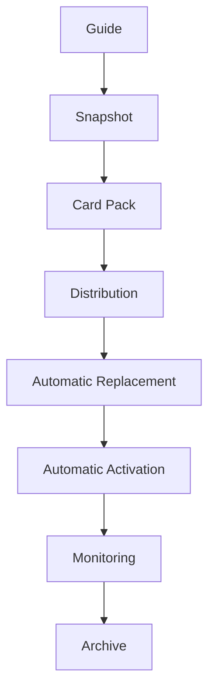

# Mental Smile Phase 10 Creation Freeze - Automatic Replacement & Activation Constitution

Scope: `MASTER_GUIDE_ONLY`
Phase: `PHASE_10`
Domain: `AUTOMATIC_REPLACEMENT_ACTIVATION_CONSTITUTION`
Current Status For All Cards: `ACTIVE_CONSTITUTIONAL_CARD`
Distribution Status For All Cards: `MASTER_GUIDE_ONLY`
Archive Scope For All Cards: `ACTIVATION_ARCHIVE`
Runtime Engine Status: `NO_RUNTIME_ENGINE`
Deployment Engine Status: `NO_DEPLOYMENT_ENGINE`
Technical Execution Logic Status: `NO_TECHNICAL_EXECUTION_LOGIC`
Previous Phase Modification Status: `NO_PREVIOUS_PHASE_MODIFICATIONS`

---

## 1. PHASE 10 CREATION FREEZE REPORT

Phase 10 creates constitutional governance for automatic replacement, automatic activation, automatic blocking, and automatic cutover. It does not create a runtime engine, deployment engine, synchronization engine, or technical execution logic.

Core doctrine:

| Doctrine ID | Doctrine |
| --- | --- |
| `doctrine.phase10.guide_change_event` | Guide change equals constitutional event. |
| `doctrine.phase10.approved_change_triggers_flow` | Approved guide change triggers automatic constitutional flow. |
| `doctrine.phase10.humans_supervise_constitution_executes` | Humans supervise; constitution executes. |
| `doctrine.phase10.no_manual_replacement` | Manual replacement is forbidden. |
| `doctrine.phase10.no_manual_activation` | Manual activation is forbidden. |
| `doctrine.phase10.single_active_version` | Only one active constitutional version may exist. |

| Output Domain | Created | Status |
| --- | ---: | --- |
| Replacement Constitution | 1 | COMPLETE |
| Automatic Replacement Constitution | 1 | COMPLETE |
| Automatic Block Constitution | 3 block states | COMPLETE |
| Activation Constitution | 5 states | COMPLETE |
| Cutover Constitution | 1 | COMPLETE |
| Activation Failure Constitution | 5 failure cards | COMPLETE |
| Technical Incident Constitution | 1 incident card | COMPLETE |
| Technical Verification Constitution | 2 verification states | COMPLETE |
| Monitoring Constitution | 5 monitoring states | COMPLETE |
| Alarm Constitution | 5 alarm cards | COMPLETE |
| Activation Registry Set | 5 | COMPLETE |
| Activation Signal Set | 8 | COMPLETE |
| Activation Workflow Set | 5 | COMPLETE |
| Activation Gap Set | 5 | COMPLETE |
| Activation Topology Map | 5 flows | COMPLETE |

Hard rule validation:

| Rule | Result |
| --- | --- |
| No code changes | PASS |
| No Firebase changes | PASS |
| No Firestore changes | PASS |
| No runtime engine | PASS |
| No deployment engine | PASS |
| No technical execution logic | PASS |
| No previous phase modifications | PASS |
| All outputs remain `MASTER_GUIDE_ONLY` | PASS |

---

## 2. REPLACEMENT CONSTITUTION

| Constitutional Area | Doctrine |
| --- | --- |
| Replacement Purpose | Replacement ensures that an approved guide change moves through snapshot, pack, distribution, blocking, activation, monitoring, and archive governance without manual replacement. |
| Replacement Ownership | Owner authorizes doctrine; Compliance validates; Distribution Steward and Activation Steward govern constitutional flow; Technical verifies only. |
| Replacement Validation | Replacement requires guide-change approval, snapshot validation, pack validation, distribution validation, old-version block, activation validation, confirmation, and archive relationship. |
| Replacement Evidence | Every replacement must produce request, validation, block, activation, confirmation, technical verification, monitoring, alarm if any, and archive evidence. |
| Replacement Lifecycle | Replacement starts after approved guide change and completes only after new version activation is confirmed and archived. |

Replacement rule:

| Rule ID | Rule |
| --- | --- |
| `rule.phase10.replacement_automatic` | Replacement is automatic under constitutional flow. |
| `rule.phase10.replacement_no_manual` | No manual replacement is allowed. |
| `rule.phase10.replacement_requires_evidence` | Replacement without evidence is invalid. |

---

## 3. AUTOMATIC REPLACEMENT CONSTITUTION

Automatic replacement chain:

| Step | Constitutional Event | Required Evidence |
| --- | --- | --- |
| 1 | Guide Updated | Approved guide change evidence |
| 2 | Snapshot Generated | Snapshot generation and validation evidence |
| 3 | Pack Generated | Pack generation and validation evidence |
| 4 | Distribution Started | Distribution approval and delivery evidence |
| 5 | Replacement Started | Replacement started signal and old-version block evidence |

Important rule:

| Rule ID | Rule |
| --- | --- |
| `rule.phase10.no_manual_replacement` | Cards, packs, and snapshots are never manually replaced. |
| `rule.phase10.approved_change_only` | Replacement begins only from an approved guide change. |

---

## 4. AUTOMATIC BLOCK CONSTITUTION

| Block State | Applies To | Entry Condition | Constitutional Effect | Forbidden State |
| --- | --- | --- | --- | --- |
| `OLD_CARD_BLOCKED` | Previous active card | Replacement started for governed card. | Old card cannot remain active. | Legacy Active, Frozen Active, Deprecated Active |
| `OLD_PACK_BLOCKED` | Previous active card pack | Replacement started for governed pack. | Old pack cannot remain active. | Legacy Active, Frozen Active, Deprecated Active |
| `OLD_SNAPSHOT_BLOCKED` | Previous active snapshot | Replacement started for governed snapshot. | Old snapshot cannot remain active. | Legacy Active, Frozen Active, Deprecated Active |

Block rule:

| Rule ID | Rule |
| --- | --- |
| `rule.phase10.old_versions_block_immediately` | Previous active versions must be blocked immediately when replacement starts. |
| `rule.phase10.no_legacy_active` | Legacy Active is forbidden. |
| `rule.phase10.no_frozen_active` | Frozen Active is forbidden. |
| `rule.phase10.no_deprecated_active` | Deprecated Active is forbidden. |

---

## 5. ACTIVATION CONSTITUTION

| Activation State | Entry Condition | Exit Condition | Evidence Requirement |
| --- | --- | --- | --- |
| `ACTIVATION_REQUESTED` | Replacement flow requests new version activation. | Activation validation begins. | Activation request evidence. |
| `ACTIVATION_VALIDATED` | Single-active, ownership, registry, compliance, and block checks pass. | Activation starts or blocks. | Activation validation evidence. |
| `ACTIVATION_STARTED` | Validated activation begins constitutionally. | Confirmation begins or failure occurs. | Activation start evidence. |
| `ACTIVATION_CONFIRMED` | New version is confirmed as active and old version is blocked. | Completion begins. | Activation confirmation evidence. |
| `ACTIVATION_COMPLETED` | Monitoring and archive relationship are complete. | Closed constitutional event. | Completion and archive evidence. |

Activation rule:

| Rule ID | Rule |
| --- | --- |
| `rule.phase10.one_active_version` | Only one active constitutional version may exist. |
| `rule.phase10.activation_automatic` | Activation is automatic under constitutional flow. |
| `rule.phase10.no_manual_activation` | No manual activation is allowed. |

---

## 6. CUTOVER CONSTITUTION

Cutover sequence:

| Step | Constitutional Action | Rule |
| --- | --- | --- |
| 1 | Old Version | Identify previous active version. |
| 2 | Blocked | Block old version immediately. |
| 3 | New Version | Validate replacement version from current approved flow. |
| 4 | Activated | Activate new version as sole active constitutional version. |

Cutover rule:

| Rule ID | Rule |
| --- | --- |
| `rule.phase10.cutover_automatic` | Cutover is automatic. |
| `rule.phase10.no_parallel_active_versions` | Parallel active versions are forbidden. |
| `rule.phase10.new_active_after_old_blocked` | New version becomes active only after old version is blocked. |

---

## 7. ACTIVATION FAILURE CONSTITUTION

| Card ID | Card Name | Card Type | Source Doctrine | Phase | Owner | Steward | Consumers | Dependencies | Inputs | Outputs | Consumed Signals | Produced Signals | Required Registries | Compliance Checks | Archive Scope | Current Status | Version | Distribution Status |
| --- | --- | --- | --- | --- | --- | --- | --- | --- | --- | --- | --- | --- | --- | --- | --- | --- | --- | --- |
| `card.phase10.failure.activation_failure` | Activation Failure Card | Activation Failure Card | `doctrine.phase10.activation_failure` | `PHASE_10` | Compliance | Activation Steward | Owner, Monitoring, Archive | Activation workflow | Failed activation condition | Activation failure record | `signal.activation.started` | `signal.activation.failed` | `registry.activation_evidence` | `check.phase10.failure_evidence_exists` | `ACTIVATION_ARCHIVE` | `ACTIVE_CONSTITUTIONAL_CARD` | `v1.0.0` | `MASTER_GUIDE_ONLY` |
| `card.phase10.failure.activation_timeout` | Activation Timeout Card | Activation Failure Card | `doctrine.phase10.activation_timeout` | `PHASE_10` | Monitoring | Activation Steward | Compliance, Owner | Monitoring workflow | Delayed activation | Timeout failure record | `signal.activation.started` | `signal.activation.failed` | `registry.activation_evidence` | `check.phase10.timeout_escalated` | `ACTIVATION_ARCHIVE` | `ACTIVE_CONSTITUTIONAL_CARD` | `v1.0.0` | `MASTER_GUIDE_ONLY` |
| `card.phase10.failure.activation_mismatch` | Activation Mismatch Card | Activation Failure Card | `doctrine.phase10.activation_mismatch` | `PHASE_10` | Compliance / Legal | Activation Steward | Owner, Technical, Archive | Activation registry | Active version mismatch | Mismatch failure record | `signal.activation.started` | `signal.activation.failed` | `registry.activation`, `registry.activation_evidence` | `check.phase10.no_parallel_active_versions` | `ACTIVATION_ARCHIVE` | `ACTIVE_CONSTITUTIONAL_CARD` | `v1.0.0` | `MASTER_GUIDE_ONLY` |
| `card.phase10.failure.activation_validation_failure` | Activation Validation Failure Card | Activation Failure Card | `doctrine.phase10.activation_validation` | `PHASE_10` | Compliance | Activation Steward | Owner, Monitoring | Activation validation | Failed validation result | Validation failure record | `signal.replacement.started` | `signal.activation.failed` | `registry.activation`, `registry.activation_evidence` | `check.phase10.activation_validation_passed` | `ACTIVATION_ARCHIVE` | `ACTIVE_CONSTITUTIONAL_CARD` | `v1.0.0` | `MASTER_GUIDE_ONLY` |
| `card.phase10.failure.activation_confirmation_failure` | Activation Confirmation Failure Card | Activation Failure Card | `doctrine.phase10.activation_confirmation` | `PHASE_10` | Monitoring / Compliance | Activation Steward | Owner, Archive | Activation confirmation | Missing or rejected confirmation | Confirmation failure record | `signal.activation.started` | `signal.activation.failed` | `registry.activation_evidence` | `check.phase10.activation_confirmation_exists` | `ACTIVATION_ARCHIVE` | `ACTIVE_CONSTITUTIONAL_CARD` | `v1.0.0` | `MASTER_GUIDE_ONLY` |

Failure handling:

| Failure | Detection | Evidence | Escalation | Recovery Requirement |
| --- | --- | --- | --- | --- |
| Activation Failure | Activation cannot complete. | Failure evidence. | Compliance then Owner. | Incident creation and investigation. |
| Activation Timeout | Activation exceeds constitutional tolerance. | Timeout evidence. | Monitoring then Owner. | Incident creation and delayed-flow review. |
| Activation Mismatch | Active version mismatch or parallel active risk. | Mismatch evidence. | Legal, Compliance, Owner. | Block, investigate, verify single-active state. |
| Activation Validation Failure | Required validation fails. | Validation failure evidence. | Compliance then Owner. | Correct governance gap before retry. |
| Activation Confirmation Failure | Confirmation missing or invalid. | Confirmation failure evidence. | Monitoring, Compliance, Owner. | Confirmation investigation before completion. |

---

## 8. TECHNICAL INCIDENT CONSTITUTION

| Card ID | Card Name | Card Type | Source Doctrine | Phase | Owner | Steward | Consumers | Dependencies | Inputs | Outputs | Consumed Signals | Produced Signals | Required Registries | Compliance Checks | Archive Scope | Current Status | Version | Distribution Status |
| --- | --- | --- | --- | --- | --- | --- | --- | --- | --- | --- | --- | --- | --- | --- | --- | --- | --- | --- |
| `card.phase10.technical.incident` | Technical Incident Card | Technical Incident Card | `doctrine.phase10.technical_locked_until_incident` | `PHASE_10` | Technical / Compliance | Activation Steward | Owner, Monitoring, Archive | Activation failure constitution | Automatic flow failed evidence | Technical incident record | `signal.activation.failed` | `signal.technical_incident.created` | `registry.technical_incident`, `registry.activation_evidence` | `check.phase10.technical_incident_created_before_tools` | `ACTIVATION_ARCHIVE` | `ACTIVE_CONSTITUTIONAL_CARD` | `v1.0.0` | `MASTER_GUIDE_ONLY` |

Technical incident rule:

| Rule ID | Rule |
| --- | --- |
| `rule.phase10.technical_incident_only_on_flow_failure` | Technical incident triggers only when automatic flow failed. |
| `rule.phase10.technical_tools_locked_until_incident` | Technical tools remain locked until incident creation. |
| `rule.phase10.technical_incident_not_execution` | Technical incident governance does not authorize runtime execution. |

---

## 9. TECHNICAL VERIFICATION CONSTITUTION

| Verification State | Meaning | Rule |
| --- | --- | --- |
| `TECHNICAL_VERIFICATION_SUCCESS` | Technical confirms the constitutional state is observable and consistent. | Technical verifies only. |
| `TECHNICAL_VERIFICATION_FAILED` | Technical cannot confirm the constitutional state. | Failure evidence and escalation required. |

Technical boundaries:

| Rule ID | Rule |
| --- | --- |
| `rule.phase10.technical_verifies_only` | Technical verifies. |
| `rule.phase10.technical_does_not_replace` | Technical does not replace. |
| `rule.phase10.technical_does_not_activate` | Technical does not activate. |
| `rule.phase10.technical_does_not_distribute` | Technical does not distribute. |

---

## 10. MONITORING CONSTITUTION

| Monitoring State | Meaning | Monitoring Responsibility |
| --- | --- | --- |
| `FLOW_STARTED` | Automatic flow has begun. | Observe and timestamp. |
| `FLOW_HEALTHY` | Flow is progressing normally. | Verify expected signals. |
| `FLOW_DELAYED` | Flow is slower than expected. | Escalate if delay persists. |
| `FLOW_FAILED` | Flow failed or produced failure signal. | Escalate and ensure evidence. |
| `FLOW_COMPLETED` | Flow completed with confirmed activation and archive relationship. | Verify completion report. |

Monitoring boundaries:

| Rule ID | Rule |
| --- | --- |
| `rule.phase10.monitoring_observes` | Monitoring observes. |
| `rule.phase10.monitoring_verifies` | Monitoring verifies. |
| `rule.phase10.monitoring_escalates` | Monitoring escalates. |
| `rule.phase10.monitoring_no_modify` | Monitoring must not modify. |
| `rule.phase10.monitoring_no_activate` | Monitoring must not activate. |
| `rule.phase10.monitoring_no_replace` | Monitoring must not replace. |

---

## 11. CONSTITUTIONAL ALARM CONSTITUTION

| Card ID | Card Name | Card Type | Source Doctrine | Phase | Owner | Steward | Consumers | Dependencies | Inputs | Outputs | Consumed Signals | Produced Signals | Required Registries | Compliance Checks | Archive Scope | Current Status | Version | Distribution Status |
| --- | --- | --- | --- | --- | --- | --- | --- | --- | --- | --- | --- | --- | --- | --- | --- | --- | --- | --- |
| `card.phase10.alarm.replacement` | Replacement Alarm Card | Constitutional Alarm Card | `doctrine.phase10.alarm_investigates_only` | `PHASE_10` | Monitoring / Compliance | Activation Steward | Owner, Archive | Replacement workflow | Replacement anomaly | Replacement alarm record | `signal.replacement.started` | `signal.activation.failed` | `registry.activation_evidence` | `check.phase10.alarm_evidence_exists` | `ACTIVATION_ARCHIVE` | `ACTIVE_CONSTITUTIONAL_CARD` | `v1.0.0` | `MASTER_GUIDE_ONLY` |
| `card.phase10.alarm.activation` | Activation Alarm Card | Constitutional Alarm Card | `doctrine.phase10.alarm_investigates_only` | `PHASE_10` | Monitoring / Compliance | Activation Steward | Owner, Technical | Activation workflow | Activation anomaly | Activation alarm record | `signal.activation.started` | `signal.activation.failed` | `registry.activation_evidence` | `check.phase10.alarm_evidence_exists` | `ACTIVATION_ARCHIVE` | `ACTIVE_CONSTITUTIONAL_CARD` | `v1.0.0` | `MASTER_GUIDE_ONLY` |
| `card.phase10.alarm.distribution` | Distribution Alarm Card | Constitutional Alarm Card | `doctrine.phase10.alarm_investigates_only` | `PHASE_10` | Monitoring / Compliance | Activation Steward | Distribution Steward, Owner | Phase 9 distribution | Distribution anomaly | Distribution alarm record | `signal.replacement.started` | `signal.activation.failed` | `registry.activation_evidence` | `check.phase10.alarm_evidence_exists` | `ACTIVATION_ARCHIVE` | `ACTIVE_CONSTITUTIONAL_CARD` | `v1.0.0` | `MASTER_GUIDE_ONLY` |
| `card.phase10.alarm.confirmation` | Confirmation Alarm Card | Constitutional Alarm Card | `doctrine.phase10.alarm_investigates_only` | `PHASE_10` | Monitoring / Compliance | Activation Steward | Owner, Archive | Activation confirmation | Missing confirmation | Confirmation alarm record | `signal.activation.started` | `signal.activation.failed` | `registry.activation_evidence` | `check.phase10.confirmation_alarm_investigated` | `ACTIVATION_ARCHIVE` | `ACTIVE_CONSTITUTIONAL_CARD` | `v1.0.0` | `MASTER_GUIDE_ONLY` |
| `card.phase10.alarm.timeout` | Timeout Alarm Card | Constitutional Alarm Card | `doctrine.phase10.alarm_investigates_only` | `PHASE_10` | Monitoring | Activation Steward | Compliance, Owner | Monitoring workflow | Timeout condition | Timeout alarm record | `signal.activation.started` | `signal.activation.failed` | `registry.activation_evidence` | `check.phase10.timeout_alarm_investigated` | `ACTIVATION_ARCHIVE` | `ACTIVE_CONSTITUTIONAL_CARD` | `v1.0.0` | `MASTER_GUIDE_ONLY` |

Alarm rule:

| Rule ID | Rule |
| --- | --- |
| `rule.phase10.alarm_requires_investigation` | Alarm requires investigation. |
| `rule.phase10.alarm_no_action` | Alarm does not perform actions. |

---

## 12. ACTIVATION REGISTRY SET

| Card ID | Card Name | Card Type | Source Doctrine | Phase | Owner | Steward | Consumers | Dependencies | Inputs | Outputs | Consumed Signals | Produced Signals | Required Registries | Compliance Checks | Archive Scope | Current Status | Version | Distribution Status |
| --- | --- | --- | --- | --- | --- | --- | --- | --- | --- | --- | --- | --- | --- | --- | --- | --- | --- | --- |
| `card.phase10.registry.activation` | Activation Registry Card | Activation Registry Card | `doctrine.phase10.activation_registry` | `PHASE_10` | Owner / Registry Authority | Activation Steward | Compliance, Monitoring | Activation constitution | Activation IDs and states | Activation registry governance | `signal.activation.started` | `signal.activation.completed` | `registry.activation` | `check.phase10.activation_registry_exists` | `ACTIVATION_ARCHIVE` | `ACTIVE_CONSTITUTIONAL_CARD` | `v1.0.0` | `MASTER_GUIDE_ONLY` |
| `card.phase10.registry.replacement` | Replacement Registry Card | Activation Registry Card | `doctrine.phase10.replacement_registry` | `PHASE_10` | Owner / Registry Authority | Activation Steward | Compliance, Archive | Replacement constitution | Replacement IDs and states | Replacement registry governance | `signal.replacement.started` | `signal.replacement.completed` | `registry.replacement` | `check.phase10.replacement_registry_exists` | `ACTIVATION_ARCHIVE` | `ACTIVE_CONSTITUTIONAL_CARD` | `v1.0.0` | `MASTER_GUIDE_ONLY` |
| `card.phase10.registry.block` | Block Registry Card | Activation Registry Card | `doctrine.phase10.block_registry` | `PHASE_10` | Compliance / Registry Authority | Activation Steward | Owner, Monitoring | Block constitution | Old-version block records | Block registry governance | `signal.old_version.blocked` | `signal.activation.started` | `registry.block` | `check.phase10.block_registry_exists` | `ACTIVATION_ARCHIVE` | `ACTIVE_CONSTITUTIONAL_CARD` | `v1.0.0` | `MASTER_GUIDE_ONLY` |
| `card.phase10.registry.technical_incident` | Technical Incident Registry Card | Activation Registry Card | `doctrine.phase10.technical_incident_registry` | `PHASE_10` | Technical / Compliance | Activation Steward | Owner, Archive | Technical incident constitution | Incident IDs and evidence | Technical incident registry governance | `signal.technical_incident.created` | `signal.technical_verification.completed` | `registry.technical_incident` | `check.phase10.technical_incident_registry_exists` | `ACTIVATION_ARCHIVE` | `ACTIVE_CONSTITUTIONAL_CARD` | `v1.0.0` | `MASTER_GUIDE_ONLY` |
| `card.phase10.registry.activation_evidence` | Activation Evidence Registry Card | Activation Registry Card | `doctrine.phase10.activation_evidence_registry` | `PHASE_10` | Compliance | Activation Steward | Owner, Legal, Archive | Evidence constitution | Replacement, block, activation, incident, verification, monitoring evidence | Activation evidence registry governance | `signal.replacement.started` | `signal.activation.completed` | `registry.activation_evidence` | `check.phase10.activation_evidence_registry_exists` | `ACTIVATION_ARCHIVE` | `ACTIVE_CONSTITUTIONAL_CARD` | `v1.0.0` | `MASTER_GUIDE_ONLY` |

---

## 13. ACTIVATION SIGNAL SET

| Card ID | Card Name | Card Type | Source Doctrine | Phase | Owner | Steward | Consumers | Dependencies | Inputs | Outputs | Consumed Signals | Produced Signals | Required Registries | Compliance Checks | Archive Scope | Current Status | Version | Distribution Status |
| --- | --- | --- | --- | --- | --- | --- | --- | --- | --- | --- | --- | --- | --- | --- | --- | --- | --- | --- |
| `card.phase10.signal.replacement_started` | Replacement Started Signal Card | Activation Signal Card | `doctrine.phase10.replacement_automatic` | `PHASE_10` | Activation Steward | Activation Steward | Block workflow | Approved guide change | Replacement start evidence | Replacement started signal | None | `signal.replacement.started` | `registry.replacement` | `check.phase10.replacement_started` | `ACTIVATION_ARCHIVE` | `ACTIVE_CONSTITUTIONAL_CARD` | `v1.0.0` | `MASTER_GUIDE_ONLY` |
| `card.phase10.signal.replacement_completed` | Replacement Completed Signal Card | Activation Signal Card | `doctrine.phase10.replacement_completed` | `PHASE_10` | Activation Steward | Activation Steward | Activation workflow | Replacement started and old version blocked | Replacement completion evidence | Replacement completed signal | `signal.replacement.started` | `signal.replacement.completed` | `registry.replacement` | `check.phase10.replacement_completed` | `ACTIVATION_ARCHIVE` | `ACTIVE_CONSTITUTIONAL_CARD` | `v1.0.0` | `MASTER_GUIDE_ONLY` |
| `card.phase10.signal.activation_started` | Activation Started Signal Card | Activation Signal Card | `doctrine.phase10.activation_automatic` | `PHASE_10` | Activation Steward | Activation Steward | Monitoring, Technical verification | Replacement completed | Activation start evidence | Activation started signal | `signal.replacement.completed` | `signal.activation.started` | `registry.activation` | `check.phase10.activation_started` | `ACTIVATION_ARCHIVE` | `ACTIVE_CONSTITUTIONAL_CARD` | `v1.0.0` | `MASTER_GUIDE_ONLY` |
| `card.phase10.signal.activation_completed` | Activation Completed Signal Card | Activation Signal Card | `doctrine.phase10.activation_completed` | `PHASE_10` | Owner / Compliance | Activation Steward | Archive, Monitoring | Activation confirmed | Completion evidence | Activation completed signal | `signal.activation.started` | `signal.activation.completed` | `registry.activation`, `registry.activation_evidence` | `check.phase10.activation_completed` | `ACTIVATION_ARCHIVE` | `ACTIVE_CONSTITUTIONAL_CARD` | `v1.0.0` | `MASTER_GUIDE_ONLY` |
| `card.phase10.signal.activation_failed` | Activation Failed Signal Card | Activation Signal Card | `doctrine.phase10.activation_failure` | `PHASE_10` | Compliance / Monitoring | Activation Steward | Technical incident workflow | Activation failure condition | Failure evidence | Activation failed signal | `signal.activation.started` | `signal.activation.failed` | `registry.activation_evidence` | `check.phase10.activation_failure_recorded` | `ACTIVATION_ARCHIVE` | `ACTIVE_CONSTITUTIONAL_CARD` | `v1.0.0` | `MASTER_GUIDE_ONLY` |
| `card.phase10.signal.old_version_blocked` | Old Version Blocked Signal Card | Activation Signal Card | `doctrine.phase10.old_versions_block_immediately` | `PHASE_10` | Compliance | Activation Steward | Replacement workflow | Replacement started | Block evidence | Old version blocked signal | `signal.replacement.started` | `signal.old_version.blocked` | `registry.block` | `check.phase10.old_version_blocked` | `ACTIVATION_ARCHIVE` | `ACTIVE_CONSTITUTIONAL_CARD` | `v1.0.0` | `MASTER_GUIDE_ONLY` |
| `card.phase10.signal.technical_incident_created` | Technical Incident Created Signal Card | Activation Signal Card | `doctrine.phase10.technical_locked_until_incident` | `PHASE_10` | Technical / Compliance | Activation Steward | Technical verification workflow | Activation failed | Incident evidence | Technical incident created signal | `signal.activation.failed` | `signal.technical_incident.created` | `registry.technical_incident` | `check.phase10.technical_incident_created` | `ACTIVATION_ARCHIVE` | `ACTIVE_CONSTITUTIONAL_CARD` | `v1.0.0` | `MASTER_GUIDE_ONLY` |
| `card.phase10.signal.technical_verification_completed` | Technical Verification Completed Signal Card | Activation Signal Card | `doctrine.phase10.technical_verifies_only` | `PHASE_10` | Technical | Activation Steward | Compliance, Owner | Technical incident or activation started | Verification result | Technical verification completed signal | `signal.technical_incident.created` | `signal.technical_verification.completed` | `registry.technical_incident`, `registry.activation_evidence` | `check.phase10.technical_verification_completed` | `ACTIVATION_ARCHIVE` | `ACTIVE_CONSTITUTIONAL_CARD` | `v1.0.0` | `MASTER_GUIDE_ONLY` |

---

## 14. ACTIVATION WORKFLOW SET

| Card ID | Card Name | Card Type | Source Doctrine | Phase | Owner | Steward | Consumers | Dependencies | Inputs | Outputs | Consumed Signals | Produced Signals | Required Registries | Compliance Checks | Archive Scope | Current Status | Version | Distribution Status |
| --- | --- | --- | --- | --- | --- | --- | --- | --- | --- | --- | --- | --- | --- | --- | --- | --- | --- | --- |
| `card.phase10.workflow.automatic_replacement` | Automatic Replacement Workflow Card | Activation Workflow Card | `doctrine.phase10.replacement_automatic` | `PHASE_10` | Owner / Compliance | Activation Steward | Activation workflow | Phase 7-9 flow | Approved guide change, snapshot, pack, distribution | Replacement result | `signal.replacement.started` | `signal.replacement.completed` | `registry.replacement`, `registry.block` | `check.phase10.no_manual_replacement` | `ACTIVATION_ARCHIVE` | `ACTIVE_CONSTITUTIONAL_CARD` | `v1.0.0` | `MASTER_GUIDE_ONLY` |
| `card.phase10.workflow.automatic_activation` | Automatic Activation Workflow Card | Activation Workflow Card | `doctrine.phase10.activation_automatic` | `PHASE_10` | Owner / Compliance | Activation Steward | Monitoring, Archive | Replacement completed | New version and old-version block | Activation result | `signal.replacement.completed` | `signal.activation.completed` | `registry.activation`, `registry.activation_evidence` | `check.phase10.only_one_active_version` | `ACTIVATION_ARCHIVE` | `ACTIVE_CONSTITUTIONAL_CARD` | `v1.0.0` | `MASTER_GUIDE_ONLY` |
| `card.phase10.workflow.technical_incident` | Technical Incident Workflow Card | Activation Workflow Card | `doctrine.phase10.technical_locked_until_incident` | `PHASE_10` | Technical / Compliance | Activation Steward | Owner, Archive | Activation failed | Failure evidence | Technical incident result | `signal.activation.failed` | `signal.technical_incident.created` | `registry.technical_incident` | `check.phase10.technical_incident_created_before_tools` | `ACTIVATION_ARCHIVE` | `ACTIVE_CONSTITUTIONAL_CARD` | `v1.0.0` | `MASTER_GUIDE_ONLY` |
| `card.phase10.workflow.technical_verification` | Technical Verification Workflow Card | Activation Workflow Card | `doctrine.phase10.technical_verifies_only` | `PHASE_10` | Technical | Activation Steward | Compliance, Monitoring | Technical incident or activation monitoring | Verification inputs | Technical verification result | `signal.technical_incident.created` | `signal.technical_verification.completed` | `registry.technical_incident`, `registry.activation_evidence` | `check.phase10.technical_verifies_only` | `ACTIVATION_ARCHIVE` | `ACTIVE_CONSTITUTIONAL_CARD` | `v1.0.0` | `MASTER_GUIDE_ONLY` |
| `card.phase10.workflow.monitoring` | Monitoring Workflow Card | Activation Workflow Card | `doctrine.phase10.monitoring_supervises_only` | `PHASE_10` | Monitoring | Activation Steward | Owner, Compliance | Replacement and activation workflows | Flow signals | Monitoring report | `signal.replacement.started` | `signal.activation.completed` | `registry.activation_evidence` | `check.phase10.monitoring_no_modify` | `ACTIVATION_ARCHIVE` | `ACTIVE_CONSTITUTIONAL_CARD` | `v1.0.0` | `MASTER_GUIDE_ONLY` |

---

## 15. ACTIVATION GAP SET

| Card ID | Card Name | Card Type | Source Doctrine | Phase | Owner | Steward | Consumers | Dependencies | Inputs | Outputs | Consumed Signals | Produced Signals | Required Registries | Compliance Checks | Archive Scope | Current Status | Version | Distribution Status |
| --- | --- | --- | --- | --- | --- | --- | --- | --- | --- | --- | --- | --- | --- | --- | --- | --- | --- | --- |
| `card.gap.phase10.replacement_governance_missing` | Missing Replacement Governance Gap Card | Activation Gap Card | `doctrine.phase10.replacement_automatic` | `PHASE_10` | Compliance | Activation Steward | Owner, Archive | Replacement constitution | Missing replacement governance | Replacement gap record | `signal.replacement.started` | `signal.activation.failed` | `registry.replacement` | `check.phase10.replacement_governance_exists` | `ACTIVATION_ARCHIVE` | `ACTIVE_CONSTITUTIONAL_CARD` | `v1.0.0` | `MASTER_GUIDE_ONLY` |
| `card.gap.phase10.activation_governance_missing` | Missing Activation Governance Gap Card | Activation Gap Card | `doctrine.phase10.activation_automatic` | `PHASE_10` | Compliance | Activation Steward | Owner, Monitoring | Activation constitution | Missing activation governance | Activation gap record | `signal.activation.started` | `signal.activation.failed` | `registry.activation` | `check.phase10.activation_governance_exists` | `ACTIVATION_ARCHIVE` | `ACTIVE_CONSTITUTIONAL_CARD` | `v1.0.0` | `MASTER_GUIDE_ONLY` |
| `card.gap.phase10.blocking_governance_missing` | Missing Blocking Governance Gap Card | Activation Gap Card | `doctrine.phase10.old_versions_block_immediately` | `PHASE_10` | Compliance | Activation Steward | Owner, Legal | Block constitution | Missing block governance | Blocking gap record | `signal.replacement.started` | `signal.activation.failed` | `registry.block` | `check.phase10.block_governance_exists` | `ACTIVATION_ARCHIVE` | `ACTIVE_CONSTITUTIONAL_CARD` | `v1.0.0` | `MASTER_GUIDE_ONLY` |
| `card.gap.phase10.technical_incident_governance_missing` | Missing Technical Incident Governance Gap Card | Activation Gap Card | `doctrine.phase10.technical_locked_until_incident` | `PHASE_10` | Technical / Compliance | Activation Steward | Owner, Archive | Technical incident constitution | Missing technical incident governance | Technical incident gap record | `signal.activation.failed` | `signal.technical_incident.created` | `registry.technical_incident` | `check.phase10.technical_incident_governance_exists` | `ACTIVATION_ARCHIVE` | `ACTIVE_CONSTITUTIONAL_CARD` | `v1.0.0` | `MASTER_GUIDE_ONLY` |
| `card.gap.phase10.monitoring_governance_missing` | Missing Monitoring Governance Gap Card | Activation Gap Card | `doctrine.phase10.monitoring_supervises_only` | `PHASE_10` | Monitoring / Compliance | Activation Steward | Owner, Archive | Monitoring constitution | Missing monitoring governance | Monitoring gap record | `signal.replacement.started` | `signal.activation.failed` | `registry.activation_evidence` | `check.phase10.monitoring_governance_exists` | `ACTIVATION_ARCHIVE` | `ACTIVE_CONSTITUTIONAL_CARD` | `v1.0.0` | `MASTER_GUIDE_ONLY` |

---

## 16. ACTIVATION TOPOLOGY MAP

Primary constitutional topology:

Replacement flow:

| Step | From | To | Signal | Evidence |
| --- | --- | --- | --- | --- |
| 1 | Approved Guide Change | Snapshot | `signal.replacement.started` | Guide change evidence |
| 2 | Snapshot | Card Pack | `signal.replacement.started` | Snapshot evidence |
| 3 | Card Pack | Distribution | `signal.replacement.started` | Pack evidence |
| 4 | Distribution | Automatic Replacement | `signal.replacement.started` | Distribution evidence |
| 5 | Automatic Replacement | Block Registry | `signal.old_version.blocked` | Block evidence |

Activation flow:

| Step | From | To | Signal | Evidence |
| --- | --- | --- | --- | --- |
| 1 | Replacement Completed | Activation Validation | `signal.replacement.completed` | Replacement evidence |
| 2 | Activation Validation | Activation Started | `signal.activation.started` | Validation evidence |
| 3 | Activation Started | Activation Confirmed | `signal.activation.completed` | Confirmation evidence |
| 4 | Activation Completed | Archive | `signal.activation.completed` | Archive relationship evidence |

Failure flow:

| Failure | Signal | Required Action |
| --- | --- | --- |
| Activation failure | `signal.activation.failed` | Create technical incident and archive failure evidence. |
| Timeout | `signal.activation.failed` | Escalate monitoring alarm and investigate. |
| Mismatch | `signal.activation.failed` | Block, investigate, and verify single-active state. |
| Validation failure | `signal.activation.failed` | Record compliance gap and stop activation. |
| Confirmation failure | `signal.activation.failed` | Escalate and investigate confirmation. |

Alarm flow:

| Alarm | Trigger | Boundary |
| --- | --- | --- |
| Replacement Alarm | Replacement anomaly | Alarm investigates only. |
| Activation Alarm | Activation anomaly | Alarm investigates only. |
| Distribution Alarm | Distribution anomaly | Alarm investigates only. |
| Confirmation Alarm | Confirmation missing | Alarm investigates only. |
| Timeout Alarm | Delay threshold reached | Alarm investigates only. |

Evidence flow:

| Evidence Type | Registry | Consumer |
| --- | --- | --- |
| Replacement evidence | `registry.replacement` | Compliance, Owner |
| Block evidence | `registry.block` | Compliance, Legal |
| Activation evidence | `registry.activation_evidence` | Monitoring, Archive |
| Technical incident evidence | `registry.technical_incident` | Technical, Compliance |
| Monitoring evidence | `registry.activation_evidence` | Owner, Archive |

---

## 17. PHASE 10 READINESS HANDOFF

| Handoff Object | Ready | Notes |
| --- | --- | --- |
| Automatic Replacement Constitution | YES | Defines approved guide change to replacement start. |
| Automatic Activation Constitution | YES | Defines activation states and single-active rule. |
| Automatic Block Constitution | YES | Defines old card, pack, and snapshot blocks. |
| Cutover Constitution | YES | Defines old blocked to new activated transition. |
| Activation Failure Constitution | YES | Defines failure, timeout, mismatch, validation failure, and confirmation failure. |
| Technical Incident Constitution | YES | Defines incident creation before technical tools. |
| Technical Verification Constitution | YES | Defines verify-only boundary. |
| Monitoring Constitution | YES | Defines observe, verify, escalate boundaries. |
| Alarm Constitution | YES | Defines investigation-only alarms. |
| Activation Registries | YES | Defines activation, replacement, block, incident, and evidence registries. |
| Activation Signals | YES | Defines replacement, activation, block, incident, and verification signals. |
| Activation Workflows | YES | Defines replacement, activation, incident, verification, and monitoring workflows. |
| Activation Gaps | YES | Defines missing governance gaps. |

Next constitutional work is blocked from treating Phase 10 as a runtime engine, deployment engine, or technical execution authority.

---

## 18. PHASE 10 VALIDATION RESULT

| Pass Condition | Result |
| --- | --- |
| Automatic replacement exists | PASS |
| Automatic activation exists | PASS |
| Automatic blocking exists | PASS |
| Technical incident handling exists | PASS |
| Technical verification exists | PASS |
| Monitoring governance exists | PASS |
| Alarm governance exists | PASS |
| Only one active version exists | PASS |
| No manual replacement exists | PASS |
| No manual activation exists | PASS |
| No parallel active versions exist | PASS |
| All outputs remain `MASTER_GUIDE_ONLY` | PASS |

Final Phase 10 creation freeze result: `PASS`.
