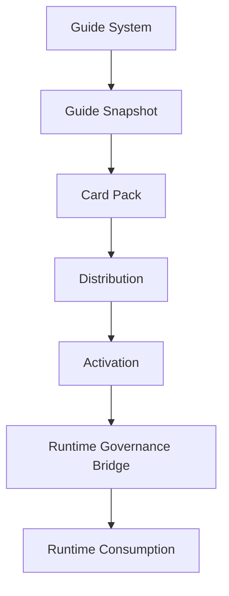
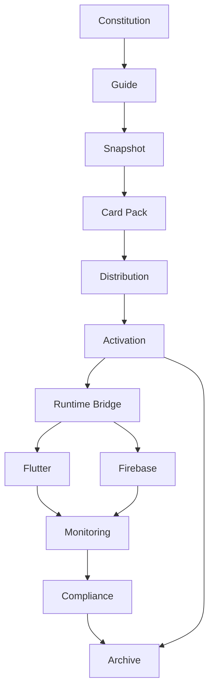

# Mental Smile Phase 11 Creation Freeze - Runtime Governance Bridge Constitution

## Document Control

| Field | Value |
|---|---|
| Document ID | MASTER_GUIDE_PHASE_11_CREATION_FREEZE |
| Phase | PHASE_11 |
| Domain | RUNTIME_GOVERNANCE_BRIDGE_CONSTITUTION |
| Runtime Implementation | NONE |
| Firebase Changes | NONE |
| Flutter Changes | NONE |
| Firestore Rules Changes | NONE |
| Archive Scope For All Cards | RUNTIME_BRIDGE_ARCHIVE |
| Card Status For Generated Cards | ACTIVE_CONSTITUTIONAL_CARD |
| Version | v1.0.0 |
| Distribution Status | MASTER_GUIDE_ONLY |

## 1. PHASE 11 CREATION FREEZE REPORT

Phase 11 creates the constitutional bridge between the Guide System and the Runtime System. It does not create runtime logic, Firebase rules, Flutter implementation, registries, signals, routes, tools, localization entries, assets, or deployment behavior.

| Creation Area | Output | Status |
|---|---|---|
| Runtime Governance Bridge | Guide-to-runtime doctrine | COMPLETE |
| Governance vs Runtime Boundary | Layer separation map | COMPLETE |
| Runtime Consumption Model | Guide -> Snapshot -> Card Pack -> Runtime model | COMPLETE |
| Card To Runtime Map | Runtime object traceability constitution | COMPLETE |
| Route Bridge | Route governance bridge | COMPLETE |
| Collection Bridge | Collection governance bridge | COMPLETE |
| Signal Bridge | Signal governance bridge | COMPLETE |
| Tool Bridge | Tool governance bridge | COMPLETE |
| Localization Bridge | Language governance bridge | COMPLETE |
| Asset Bridge | Asset governance bridge | COMPLETE |
| Runtime Validation | Validation/mismatch/block doctrine | COMPLETE |
| Runtime Drift | Drift detection/reporting/archive doctrine | COMPLETE |
| Runtime Registry Dependencies | Required registry dependency map | COMPLETE |
| Runtime Signal Set | 5 constitutional signal cards | COMPLETE |
| Runtime Evidence Model | Validation/drift/activation/block/verification evidence | COMPLETE |
| Flutter Bridge | Flutter constitutional relationship map | COMPLETE |
| Firebase Bridge | Firebase constitutional relationship map | COMPLETE |
| Runtime Topology Map | Consumption, validation, drift, evidence flows | COMPLETE |
| Runtime Gap Set | 6 gap cards | COMPLETE |
| Phase 12 Handoff | Identity Authority Attestation readiness | COMPLETE |

### Phase 11 Doctrine

| Doctrine ID | Rule |
|---|---|
| doctrine.phase11.runtime_consumes_truth | Runtime consumes constitutional truth. Runtime does not create truth. |
| doctrine.phase11.guides_govern_runtime | Guides, snapshots, packs, cards, and registries govern runtime objects. |
| doctrine.phase11.no_runtime_authority_creation | Runtime may not create authority. |
| doctrine.phase11.no_runtime_registry_creation | Runtime may not create registries. |
| doctrine.phase11.no_runtime_signal_creation | Runtime may not create signals. |
| doctrine.phase11.no_runtime_card_creation | Runtime may not create cards. |
| doctrine.phase11.no_admin_era_authority | Generic Admin authority is not permitted. |
| doctrine.phase11.no_hidden_authority | Hidden authority fallback is not permitted. |
| doctrine.phase11.no_orphan_runtime_object | Every runtime entity must trace to a constitutional source. |

## 2. RUNTIME GOVERNANCE BRIDGE

| Field | Definition |
|---|---|
| Purpose | Connect constitutional governance outputs to runtime consumption without allowing runtime to create truth or authority. |
| Scope | Cards, registries, signals, routes, collections, tools, assets, localization, Flutter surfaces, Firebase surfaces, monitoring, archive evidence. |
| Ownership | Owner authorizes bridge doctrine; Compliance validates bridge conformity; Technical verifies runtime traceability; Monitoring observes drift; Archive preserves evidence. |
| Consumers | Flutter runtime, Firebase runtime, Monitoring, Compliance, Owner, Archive, Registry Steward, Technical Verification. |
| Dependencies | Master Guide, snapshots, card packs, distribution constitution, activation constitution, authority decomposition map, P0 Firebase purification doctrine. |
| Boundaries | The bridge maps governance to runtime; it does not implement runtime, deploy rules, create data, create claims, or execute migrations. |

### Bridge Rule

| Source | Bridge | Runtime Consumer | Required Evidence |
|---|---|---|---|
| Guide | Snapshot | Runtime object | Snapshot ID and guide version |
| Snapshot | Card Pack | Runtime object | Pack ID and card IDs |
| Card Pack | Distribution | Runtime consumer | Distribution evidence |
| Distribution | Activation | Runtime active state | Activation evidence |
| Activation | Runtime Bridge | Flutter/Firebase | Runtime validation evidence |

## 3. GOVERNANCE VS RUNTIME BOUNDARY

| Layer | Purpose | Inputs | Outputs | Forbidden Actions |
|---|---|---|---|---|
| Governance Layer | Define constitutional truth | Master Guide, doctrine, cards, registries, policies | Approved constitutional source | Runtime execution, silent mutation, hidden fallback authority |
| Runtime Layer | Execute approved constitutional outputs | Activated card pack, active registries, approved signals, routes, assets, localization | Runtime behavior and runtime evidence | Creating truth, creating cards, creating authority, overriding governance |
| Archive Layer | Preserve evidence and prior constitutional records | Activation evidence, validation evidence, drift evidence, block evidence | Archive records and retrieval proof | Approving runtime, executing changes, modifying active state |
| Monitoring Layer | Observe and escalate runtime/governance state | Signals, logs, reports, validation evidence | Alerts, reports, escalation records | Modifying runtime, authorizing, suppressing evidence |
| Registry Layer | Maintain governed object maps | Guide doctrine, card definitions, ownership, dependencies | Registry entries and registry validation evidence | Final authorization, runtime execution, hidden authority |

## 4. RUNTIME CONSUMPTION MODEL

Runtime consumption chain:

| Constitutional Output | Runtime Consumer | Consumer Purpose | Required Trace |
|---|---|---|---|
| Cards | Flutter, Firebase, Monitoring, Compliance | Define governed runtime objects and workflows | Card ID, version, owner, registry links |
| Signals | Firebase, Monitoring, Compliance | Report events, drift, validation, activation, block | Signal card ID and signal registry ID |
| Registries | Flutter, Firebase, Compliance, Monitoring | Resolve approved routes, collections, tools, assets, terms | Registry ID and active version |
| Routes | Flutter | Navigate only to approved surfaces | Route card and route registry entry |
| Collections | Firebase | Store only approved runtime data classes | Collection card and collection registry entry |
| Assets | Flutter, Firebase Storage | Load approved asset objects | Asset card and asset registry entry |
| Localization | Flutter | Display approved terms | Localization registry entry and language policy |
| Tools | Technical/Runtime surfaces | Use approved operational tools only | Tool card and tool registry entry |

## 5. CARD TO RUNTIME MAP

### Runtime Mapping Constitution

| Runtime Object Type | Required Constitutional Source | Runtime May Consume | Runtime May Not Do |
|---|---|---|---|
| Route | Route Card + Route Registry | Path, owner, surface, status, consumers | Create runtime-only route |
| Collection | Collection Card + Collection Registry | Collection name, owner, access class, lifecycle | Create unregistered collection |
| Signal | Signal Card + Signal Registry | Signal ID, producer, consumer, lifecycle | Emit unregistered signal |
| Tool | Tool Card + Tool Registry | Tool ID, surface, owner, allowed operation | Expose unregistered tool |
| UI Surface | Surface/Card Registry | Surface name, role, owner, dependency | Create orphan surface |
| Workflow | Workflow Card + Required registries | Step definitions and evidence requirements | Execute undocumented authority |
| Asset | Asset Card + Asset Registry | Asset ID, path, custody, consumer | Load orphan asset |
| Localization Term | Localization Registry + Language Policy | Approved term and surface permission | Create runtime term |

### Card To Runtime Relationship

| Card -> Runtime Object | Required Validation | Produced Evidence |
|---|---|---|
| Card -> Route | Route exists in route registry and active pack | Runtime route validation evidence |
| Card -> Collection | Collection exists in collection registry and active pack | Runtime collection validation evidence |
| Card -> Signal | Signal exists in signal registry and active pack | Runtime signal validation evidence |
| Card -> Tool | Tool exists in tool registry and active pack | Runtime tool validation evidence |
| Card -> UI Surface | Surface exists in surface registry and active pack | Runtime UI validation evidence |
| Card -> Workflow | Workflow card exists and required signals/registries exist | Runtime workflow validation evidence |

## 6. ROUTE BRIDGE

| Element | Definition |
|---|---|
| Route Card | Constitutional definition of a runtime route, its surface, owner, consumer, and lifecycle. |
| Route Registry | Active map of approved route paths and route metadata. |
| Runtime Route | Flutter route consumed from the activated constitutional source. |
| Route Consumer | User role, domain surface, tool, monitoring surface, or workflow that can reach the route. |
| Route Status | Active, blocked, unknown, missing, or future as defined by registry. |
| Route Activation | Route becomes consumable only after card pack activation. |
| Route Validation | Runtime route must match route card and route registry entry. |

Forbidden: runtime-only routes.

| Route Bridge Rule | Requirement |
|---|---|
| route_bridge.trace_required | Every runtime route must trace to a Route Card and Route Registry entry. |
| route_bridge.no_orphan_route | A route without constitutional source is blocked. |
| route_bridge.activation_required | Route cannot be active unless included in active pack or approved registry. |
| route_bridge.owner_required | Route must have owner/domain ownership. |

## 7. COLLECTION BRIDGE

| Element | Definition |
|---|---|
| Collection Card | Constitutional definition of collection purpose, owner, consumers, sensitivity, and lifecycle. |
| Collection Registry | Active map of approved Firestore collection names and metadata. |
| Runtime Collection | Firestore collection consumed by runtime. |
| Collection Consumer | Flutter surface, function, signal writer, monitoring query, compliance process. |
| Collection Validation | Collection exists in registry and matches approved purpose/access class. |
| Collection Lifecycle | Proposed, active, blocked, archive candidate, remove candidate, future constitutional. |

Forbidden: unregistered collections.

| Collection Bridge Rule | Requirement |
|---|---|
| collection_bridge.registry_required | Every runtime collection must exist in Collection Registry. |
| collection_bridge.card_required | Every governed collection must have a Collection Card. |
| collection_bridge.no_admin_era_collection | Admin-era collections cannot be active without constitutional source. |
| collection_bridge.lifecycle_required | Collection lifecycle must be explicit. |

## 8. SIGNAL BRIDGE

| Element | Definition |
|---|---|
| Signal Card | Constitutional definition of signal purpose, producer, consumer, inputs, outputs, and lifecycle. |
| Signal Registry | Active signal catalog. |
| Runtime Signal | Event or state emitted by runtime after constitutional approval. |
| Signal Producer | Runtime object or governance workflow that emits the signal. |
| Signal Consumer | Monitoring, Compliance, Archive, Owner, Technical Verification, Flutter/Firebase surfaces. |
| Signal Validation | Signal must have registered producer, registered consumer, lifecycle, and evidence requirement. |
| Signal Lifecycle | Defined, produced, consumed, validated, archived, blocked. |

Forbidden: unregistered signals.

## 9. TOOL BRIDGE

| Element | Definition |
|---|---|
| Tool Card | Constitutional definition of a tool, its owner, surface, authority boundary, and consumers. |
| Tool Registry | Active catalog of approved tools. |
| Runtime Tool | Operational tool available to a runtime or workforce surface. |
| Tool Consumer | Technical, Monitoring, Compliance, Owner, Archive, Registry, or support surface. |
| Tool Validation | Tool must be listed in Tool Registry and bound to allowed domain. |
| Tool Lifecycle | Proposed, approved, active, blocked, removed, future constitutional. |

Forbidden: unregistered tools.

## 10. LOCALIZATION BRIDGE

| Element | Definition |
|---|---|
| Term | Approved word or phrase used by runtime. |
| Localization Registry | Active catalog of terms, surfaces, permissions, ownership, and language policy status. |
| Runtime Localization | Flutter runtime string consumed from approved localization source. |
| Language Ownership | Domain that owns term meaning and allowed surface use. |
| Language Validation | Term must comply with residential, commercial, administrative, and surface permission policies. |
| Language Activation | Term becomes runtime-valid only after registry approval and active pack inclusion. |

Forbidden: runtime-created terms.

## 11. ASSET BRIDGE

| Element | Definition |
|---|---|
| Asset Card | Constitutional definition of asset purpose, owner, sensitivity, path, and consumers. |
| Asset Registry | Active catalog of governed assets. |
| Runtime Asset | Flutter asset or Firebase Storage asset consumed by runtime. |
| Asset Ownership | Owner/domain custody for asset lifecycle. |
| Asset Validation | Asset must have path, owner, consumer, and sensitivity class. |
| Asset Activation | Asset becomes consumable after active registry and pack validation. |

Forbidden: orphan assets.

## 12. RUNTIME VALIDATION CONSTITUTION

| Runtime State | Meaning | Detection | Escalation | Resolution Path |
|---|---|---|---|---|
| Runtime Validated | Runtime object matches active card/registry/snapshot/pack | Registry comparison and technical verification | Monitoring records success | Archive validation evidence |
| Runtime Mismatch | Runtime object conflicts with constitutional source | Compliance or monitoring detects mismatch | Compliance -> Owner; Technical verifies | Block or correct through future authorized runtime work |
| Runtime Drift | Runtime object has diverged from current source | Drift scan, route/collection/signal/tool/localization/asset comparison | Monitoring -> Compliance -> Owner | Create drift evidence and block if critical |
| Runtime Unknown | Runtime object has no known constitutional source | Registry absence | Compliance -> Owner | Block until source is created or object removed |
| Runtime Block | Runtime object must not be consumed | Mismatch, unknown, hidden authority, admin-era artifact | Monitoring -> Compliance -> Owner | Archive evidence and prevent activation in future implementation |

## 13. RUNTIME DRIFT CONSTITUTION

| Drift Type | Detection | Reporting | Escalation | Archive Evidence |
|---|---|---|---|---|
| Guide Drift | Guide version differs from runtime pack | Compliance comparison | Compliance -> Owner | Guide drift report |
| Registry Drift | Runtime object missing or mismatched registry entry | Registry validation | Registry -> Compliance | Registry drift evidence |
| Signal Drift | Runtime emits unknown signal or signal has wrong consumer | Signal registry comparison | Monitoring -> Compliance | Signal drift evidence |
| Route Drift | Flutter route lacks current route card/registry | Route scan | Monitoring -> Compliance -> Owner | Route drift evidence |
| Localization Drift | Runtime term lacks approved policy/registry | Localization validation | Compliance -> Legal -> Owner | Localization drift evidence |
| Asset Drift | Runtime asset lacks ownership/registry | Asset registry scan | Registry -> Compliance | Asset drift evidence |

## 14. RUNTIME REGISTRY DEPENDENCIES

| Registry | Runtime Dependency | Required Before Runtime Bridge Activation |
|---|---|---|
| Ownership Registry | Resolves domain owner for every runtime object | YES |
| Route Registry | Resolves approved Flutter routes | YES |
| Collection Registry | Resolves approved Firestore collections | YES |
| Signal Registry | Resolves approved runtime/governance signals | YES |
| Tool Registry | Resolves approved tools | YES |
| Localization Registry | Resolves approved terms | YES |
| Asset Registry | Resolves approved assets | YES |
| Snapshot Registry | Resolves current guide snapshot | YES |
| Pack Registry | Resolves current card pack | YES |
| Distribution Registry | Resolves distribution status | YES |
| Activation Registry | Resolves active version | YES |

## 15. RUNTIME SIGNAL SET

| Card ID | Card Name | Card Type | Source Doctrine | Owner | Steward | Consumers | Dependencies | Inputs | Outputs | Consumed Signals | Produced Signals | Required Registries | Compliance Checks | Archive Scope | Current Status | Version |
|---|---|---|---|---|---|---|---|---|---|---|---|---|---|---|---|---|
| card.phase11.signal.runtime_validated | Runtime Validated Signal Card | Runtime Signal Card | doctrine.phase11.runtime_validation | Compliance | Runtime Bridge Steward | Owner, Monitoring, Archive, Technical | Active pack, registry map | Runtime validation pass | Runtime validated signal | signal.activation.completed | signal.runtime.validated | registry.activation, registry.runtime_validation | check.phase11.runtime_trace_exists | RUNTIME_BRIDGE_ARCHIVE | ACTIVE_CONSTITUTIONAL_CARD | v1.0.0 |
| card.phase11.signal.runtime_mismatch | Runtime Mismatch Signal Card | Runtime Signal Card | doctrine.phase11.runtime_mismatch | Compliance | Runtime Bridge Steward | Owner, Technical, Monitoring, Archive | Runtime validation | Mismatch evidence | Runtime mismatch signal | signal.runtime.validated | signal.runtime.mismatch | registry.runtime_validation, registry.activation | check.phase11.mismatch_evidence_exists | RUNTIME_BRIDGE_ARCHIVE | ACTIVE_CONSTITUTIONAL_CARD | v1.0.0 |
| card.phase11.signal.runtime_drift_detected | Runtime Drift Detected Signal Card | Runtime Signal Card | doctrine.phase11.runtime_drift | Monitoring | Runtime Bridge Steward | Compliance, Owner, Archive | Drift scan | Drift evidence | Runtime drift detected signal | signal.runtime.validated | signal.runtime.drift_detected | registry.runtime_validation, registry.signal | check.phase11.drift_report_exists | RUNTIME_BRIDGE_ARCHIVE | ACTIVE_CONSTITUTIONAL_CARD | v1.0.0 |
| card.phase11.signal.runtime_activation_confirmed | Runtime Activation Confirmed Signal Card | Runtime Signal Card | doctrine.phase11.runtime_consumes_truth | Owner / Compliance | Runtime Bridge Steward | Monitoring, Archive, Technical | Activation registry | Activation evidence | Runtime activation confirmed signal | signal.activation.completed | signal.runtime.activation_confirmed | registry.activation, registry.pack | check.phase11.activation_trace_exists | RUNTIME_BRIDGE_ARCHIVE | ACTIVE_CONSTITUTIONAL_CARD | v1.0.0 |
| card.phase11.signal.runtime_block_triggered | Runtime Block Triggered Signal Card | Runtime Signal Card | doctrine.phase11.runtime_block | Compliance | Runtime Bridge Steward | Owner, Monitoring, Technical, Archive | Mismatch, drift, unknown runtime object | Block reason | Runtime block triggered signal | signal.runtime.mismatch, signal.runtime.drift_detected | signal.runtime.block_triggered | registry.runtime_validation, registry.block | check.phase11.block_reason_exists | RUNTIME_BRIDGE_ARCHIVE | ACTIVE_CONSTITUTIONAL_CARD | v1.0.0 |

## 16. RUNTIME EVIDENCE MODEL

| Evidence Type | Producer | Consumer | Required Contents | Archive Scope |
|---|---|---|---|---|
| Runtime Validation Evidence | Compliance / Technical Verification | Owner, Monitoring, Archive | Object ID, source card, registry entry, validation result | RUNTIME_BRIDGE_ARCHIVE |
| Runtime Drift Evidence | Monitoring / Compliance | Owner, Archive, Technical | Drift type, observed runtime object, expected source, severity | RUNTIME_BRIDGE_ARCHIVE |
| Runtime Activation Evidence | Activation Steward / Compliance | Runtime Bridge, Monitoring, Archive | Active pack, activation ID, validation status | RUNTIME_BRIDGE_ARCHIVE |
| Runtime Block Evidence | Compliance | Owner, Technical, Monitoring, Archive | Block reason, source mismatch, affected object | RUNTIME_BRIDGE_ARCHIVE |
| Runtime Verification Evidence | Technical Verification | Compliance, Owner, Archive | Technical observation, file/rule/object reference, result | RUNTIME_BRIDGE_ARCHIVE |

## 17. FLUTTER GOVERNANCE BRIDGE

| Flutter Object | Constitutional Source | Runtime Consumer | Required Trace |
|---|---|---|---|
| Flutter Surface | Surface Card / Surface Registry | User-facing UI | Surface ID, owner, route links |
| Flutter Route | Route Card / Route Registry | Navigation system | Route path, role/domain, active status |
| Flutter Widget | Card/UI Registry | UI composition | Widget owner, consumer, surface |
| Flutter Tool | Tool Card / Tool Registry | Operational UI/tool surface | Tool ID and authority boundary |
| Flutter Localization | Localization Registry / Language Policy | Runtime text | Term ID, language owner, surface permission |
| Flutter Asset | Asset Card / Asset Registry | Runtime asset load | Asset ID, path, owner, sensitivity |
| Flutter Runtime Consumer | Active pack / registries | Runtime app | Snapshot ID, pack ID, card IDs |

Flutter may consume only activated constitutional outputs. Flutter may not create governance objects, routes, terms, authority, signals, registries, or cards.

## 18. FIREBASE GOVERNANCE BRIDGE

| Firebase Object | Constitutional Source | Runtime Consumer | Required Trace |
|---|---|---|---|
| Firestore | Collection Cards / Collection Registry | Runtime data persistence | Collection ID, owner, sensitivity, lifecycle |
| Storage | Asset Cards / Storage Custody Map | Runtime file storage | Asset/custody ID, owner, access class |
| Functions | Tool/Signal/Workflow Cards | Runtime service execution | Function purpose, produced signals, consumers |
| Auth | Authority Constitution / Identity Attestation future phase | Runtime identity | Claim/domain mapping and authority registry |
| Indexes | Collection Registry / Runtime Query Map | Query support | Collection/query dependency |
| Signals | Signal Cards / Signal Registry | Monitoring/Compliance | Signal ID, producer, consumer |
| Registries | Registry Cards / Registry Constitution | Runtime truth lookup | Registry ID and active version |

Firebase may store and execute approved runtime behavior. Firebase may not create constitutional authority, hidden admin fallback, unregistered collections, unregistered signals, or runtime-only truth.

## 19. RUNTIME TOPOLOGY MAP

| Flow | Path | Evidence |
|---|---|---|
| Consumption Flow | Guide -> Snapshot -> Pack -> Activation -> Runtime Bridge -> Flutter/Firebase | Runtime activation evidence |
| Validation Flow | Runtime Object -> Registry/Card comparison -> Compliance -> Technical verification when needed | Runtime validation evidence |
| Drift Flow | Runtime Observation -> Monitoring -> Compliance -> Owner | Drift evidence |
| Evidence Flow | Validation/Drift/Block/Activation -> Archive | Archive record |

## 20. RUNTIME GAP SET

| Card ID | Card Name | Card Type | Source Doctrine | Owner | Steward | Consumers | Dependencies | Inputs | Outputs | Consumed Signals | Produced Signals | Required Registries | Compliance Checks | Archive Scope | Current Status | Version |
|---|---|---|---|---|---|---|---|---|---|---|---|---|---|---|---|---|
| card.gap.phase11.missing_runtime_mapping | Missing Runtime Mapping Gap Card | Runtime Gap Card | doctrine.phase11.no_orphan_runtime_object | Compliance | Runtime Bridge Steward | Owner, Technical, Monitoring | Card-to-runtime constitution | Runtime object without mapping | Runtime mapping gap record | signal.runtime.validated | signal.runtime.mismatch | registry.runtime_validation | check.phase11.runtime_mapping_exists | RUNTIME_BRIDGE_ARCHIVE | ACTIVE_CONSTITUTIONAL_CARD | v1.0.0 |
| card.gap.phase11.missing_runtime_registry | Missing Runtime Registry Gap Card | Runtime Gap Card | doctrine.phase11.runtime_registry_required | Registry / Compliance | Runtime Bridge Steward | Owner, Technical, Monitoring | Registry dependency map | Missing registry entry | Runtime registry gap record | signal.runtime.validated | signal.runtime.mismatch | registry.ownership, registry.route, registry.collection, registry.signal, registry.tool, registry.localization, registry.asset | check.phase11.registry_entry_exists | RUNTIME_BRIDGE_ARCHIVE | ACTIVE_CONSTITUTIONAL_CARD | v1.0.0 |
| card.gap.phase11.missing_runtime_validation | Missing Runtime Validation Gap Card | Runtime Gap Card | doctrine.phase11.runtime_validation | Compliance | Runtime Bridge Steward | Owner, Monitoring, Archive | Validation constitution | Missing validation evidence | Runtime validation gap record | signal.activation.completed | signal.runtime.mismatch | registry.runtime_validation | check.phase11.validation_evidence_exists | RUNTIME_BRIDGE_ARCHIVE | ACTIVE_CONSTITUTIONAL_CARD | v1.0.0 |
| card.gap.phase11.missing_runtime_signal | Missing Runtime Signal Gap Card | Runtime Gap Card | doctrine.phase11.no_runtime_signal_creation | Monitoring / Compliance | Runtime Bridge Steward | Owner, Technical, Archive | Signal bridge | Unknown or missing runtime signal | Runtime signal gap record | signal.runtime.validated | signal.runtime.drift_detected | registry.signal | check.phase11.signal_registered | RUNTIME_BRIDGE_ARCHIVE | ACTIVE_CONSTITUTIONAL_CARD | v1.0.0 |
| card.gap.phase11.missing_runtime_evidence | Missing Runtime Evidence Gap Card | Runtime Gap Card | doctrine.phase11.runtime_evidence_required | Archive / Compliance | Runtime Bridge Steward | Owner, Monitoring, Technical | Evidence model | Missing archiveable evidence | Runtime evidence gap record | signal.runtime.mismatch | signal.runtime.block_triggered | registry.activation, registry.runtime_validation | check.phase11.evidence_archiveable | RUNTIME_BRIDGE_ARCHIVE | ACTIVE_CONSTITUTIONAL_CARD | v1.0.0 |
| card.gap.phase11.missing_runtime_consumer | Missing Runtime Consumer Gap Card | Runtime Gap Card | doctrine.phase11.runtime_consumes_truth | Registry / Compliance | Runtime Bridge Steward | Owner, Technical, Monitoring | Consumption model | Runtime object without consumer | Runtime consumer gap record | signal.runtime.validated | signal.runtime.mismatch | registry.ownership, registry.runtime_validation | check.phase11.consumer_declared | RUNTIME_BRIDGE_ARCHIVE | ACTIVE_CONSTITUTIONAL_CARD | v1.0.0 |

## 21. PHASE 12 HANDOFF

Phase 12 can begin only after Phase 11 establishes the constitutional bridge needed for Identity Authority Attestation.

| Phase 12 Requirement | Needed From Phase 11 | Readiness |
|---|---|---|
| Identity Authority Attestation Constitution | Runtime may not create authority | READY AS DOCTRINE |
| Claim/domain traceability | Authority must trace to domain source | READY AS DOCTRINE |
| No Admin Era authority | Generic admin forbidden by bridge | READY AS DOCTRINE |
| No hidden authority | Hidden fallback forbidden by bridge | READY AS DOCTRINE |
| Runtime consumption of authority | Runtime consumes approved authority outputs only | READY AS DOCTRINE |
| Registry dependency | Ownership/authority registries required | READY AS DOCTRINE |
| Evidence dependency | Runtime validation and block evidence required | READY AS DOCTRINE |

### Phase 12 Open Prerequisites

| Prerequisite | Current Status | Required In Phase 12 |
|---|---|---|
| Identity authority domains | Defined by authority decomposition map | Convert to attestation doctrine |
| Claim replacement direction | Defined as future constitutional | Define attestation relationship |
| Authority registry | Required, not implemented | Define constitutional registry model |
| Runtime authority validation | Defined by Phase 11 | Bind to identity attestation |
| Admin removal | Constitutionally required, not executed | Preserve as future runtime work after authorization |

## Phase 11 Validation Result

| Pass Condition | Result |
|---|---|
| Governance and Runtime are separated | PASS |
| Runtime consumes constitutional outputs | PASS |
| All runtime entities trace to constitutional sources | PASS AS DOCTRINE |
| Drift detection exists | PASS |
| Validation exists | PASS |
| Evidence exists | PASS |
| Registry dependencies exist | PASS |
| Flutter relationship exists | PASS |
| Firebase relationship exists | PASS |
| No Admin authority exists | PASS AS DOCTRINE |
| No hidden authority exists | PASS AS DOCTRINE |
| No runtime-created governance exists | PASS |
| Runtime implementation exists | NO, BY RULE |
| Rules changes exist | NO, BY RULE |
| Code changes exist | NO, BY RULE |

Final result: `PHASE_11_CREATION_FREEZE_COMPLETE`.
