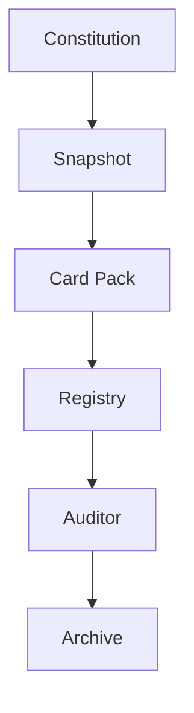

# Mental Smile Phase 7 Creation Freeze - Snapshot Constitution

Scope: `MASTER_GUIDE_ONLY`
Phase: `PHASE_7`
Domain: `SNAPSHOT_CONSTITUTION`
Current Status For All Cards: `ACTIVE_CONSTITUTIONAL_CARD`
Distribution Status For All Cards: `MASTER_GUIDE_ONLY`
Archive Scope For All Cards: `SNAPSHOT_ARCHIVE`
Runtime Status: `NO_RUNTIME_IMPLEMENTATION`
Backup Status: `NO_BACKUP_IMPLEMENTATION`
Database Snapshot Status: `NO_DATABASE_SNAPSHOT_IMPLEMENTATION`
Restoration Status: `NO_RESTORATION_IMPLEMENTATION`
Previous Phase Modification Status: `NO_PREVIOUS_PHASE_MODIFICATIONS`

---

## 1. PHASE 7 CREATION FREEZE REPORT

Phase 7 completes the constitutional governance layer for snapshots. A snapshot is a frozen constitutional state, validated as a reference point for future card packs, registries, audits, and archive records.

Phase 7 does not create runtime snapshots, backup snapshots, Firestore snapshots, deployment snapshots, or restoration snapshots.

| Output Domain | Created | Status |
| --- | ---: | --- |
| Snapshot Constitution | 1 | COMPLETE |
| Snapshot Type Set | 7 | COMPLETE |
| Snapshot Lifecycle Set | 6 | COMPLETE |
| Snapshot Ownership Set | 4 | COMPLETE |
| Snapshot Validation Set | 6 | COMPLETE |
| Snapshot Evidence Set | 4 | COMPLETE |
| Snapshot Registry Set | 5 | COMPLETE |
| Snapshot Signal Set | 6 | COMPLETE |
| Snapshot Workflow Set | 5 | COMPLETE |
| Snapshot Gap Set | 6 | COMPLETE |
| Future Snapshot Reservation Set | 4 | COMPLETE |
| Snapshot Topology Map | 4 flows | COMPLETE |

Hard rule validation:

| Rule | Result |
| --- | --- |
| No code changes | PASS |
| No Firebase changes | PASS |
| No Firestore changes | PASS |
| No runtime snapshot implementation | PASS |
| No backup snapshot implementation | PASS |
| No restoration snapshot implementation | PASS |
| No distribution implementation | PASS |
| No deployment implementation | PASS |
| No previous phase modifications | PASS |
| All outputs remain `MASTER_GUIDE_ONLY` | PASS |

---

## 2. SNAPSHOT CONSTITUTION

| Constitutional Area | Doctrine |
| --- | --- |
| Purpose | A snapshot freezes a constitutional state so future guides, card packs, registries, auditors, and archives can reference a known validated point. |
| Ownership | Every snapshot must have an owner. A snapshot without ownership is constitutionally invalid. |
| Stewardship | Snapshot stewardship belongs to the constitutional guide function until a future distribution engine assigns governed package stewardship. |
| Validation | Every snapshot must pass structural, dependency, card, registry, compliance, and archive validation before approval. |
| Compliance | Snapshot compliance confirms that the snapshot represents constitutional doctrine only and does not imply runtime execution. |
| Lifecycle | A snapshot moves through requested, generated, validated, approved, locked, and archived states. |
| Archive Relationship | A snapshot is not an archive. A validated and locked snapshot may produce an archive record through the Phase 6A archive constitution. |

Snapshot doctrine:

| Rule ID | Rule |
| --- | --- |
| `rule.snapshot.constitutional_state` | Snapshot is a constitutional state. |
| `rule.snapshot.not_runtime` | Snapshot is not runtime. |
| `rule.snapshot.not_backup` | Snapshot is not backup. |
| `rule.snapshot.not_archive` | Snapshot is not archive. |
| `rule.snapshot.validated` | Snapshot must be validated. |
| `rule.snapshot.evidence_backed` | Snapshot must be evidence-backed. |
| `rule.snapshot.lockable` | Snapshot must be lockable. |
| `rule.snapshot.archivable` | Snapshot must be archivable after lock. |
| `rule.snapshot.owned` | Every snapshot must have ownership. |
| `rule.snapshot.reserved_not_active` | Reserved snapshot domains are not active domains. |

---

## 3. SNAPSHOT TYPE SET

| Card ID | Card Name | Card Type | Source Doctrine | Phase | Owner | Steward | Consumers | Dependencies | Inputs | Outputs | Consumed Signals | Produced Signals | Required Registries | Compliance Checks | Archive Scope | Current Status | Version | Distribution Status |
| --- | --- | --- | --- | --- | --- | --- | --- | --- | --- | --- | --- | --- | --- | --- | --- | --- | --- | --- |
| `card.phase7.snapshot.type.constitution` | Constitution Snapshot Card | Snapshot Type Card | `doctrine.snapshot.constitutional_state` | `PHASE_7` | Owner | Snapshot Steward | Owner, Legal, Compliance, Archive | Master Constitution, Phase 1-6A freezes | Master constitution state | Constitution snapshot definition | `signal.snapshot.requested` | `signal.snapshot.generated` | `registry.snapshot`, `registry.snapshot_ownership` | `check.phase7.snapshot_type_exists` | `SNAPSHOT_ARCHIVE` | `ACTIVE_CONSTITUTIONAL_CARD` | `v1.0.0` | `MASTER_GUIDE_ONLY` |
| `card.phase7.snapshot.type.guide` | Guide Snapshot Card | Snapshot Type Card | `doctrine.snapshot.guide_state` | `PHASE_7` | Owner / Technical | Snapshot Steward | Guide consumers, Compliance | Master Guide files | Guide state | Guide snapshot definition | `signal.snapshot.requested` | `signal.snapshot.generated` | `registry.snapshot`, `registry.snapshot_validation` | `check.phase7.guide_snapshot_validatable` | `SNAPSHOT_ARCHIVE` | `ACTIVE_CONSTITUTIONAL_CARD` | `v1.0.0` | `MASTER_GUIDE_ONLY` |
| `card.phase7.snapshot.type.department` | Department Snapshot Card | Snapshot Type Card | `doctrine.snapshot.department_state` | `PHASE_7` | Department Authority | Snapshot Steward | Department guides, Owner | Phase 1 Department Constitution | Department constitutional state | Department snapshot definition | `signal.snapshot.requested` | `signal.snapshot.generated` | `registry.snapshot`, `registry.snapshot_ownership` | `check.phase7.department_snapshot_owned` | `SNAPSHOT_ARCHIVE` | `ACTIVE_CONSTITUTIONAL_CARD` | `v1.0.0` | `MASTER_GUIDE_ONLY` |
| `card.phase7.snapshot.type.workforce` | Workforce Snapshot Card | Snapshot Type Card | `doctrine.snapshot.workforce_state` | `PHASE_7` | Owner / Compliance | Snapshot Steward | Workforce governance, Auditors | Phase 2 Workforce Constitution | Workforce constitutional state | Workforce snapshot definition | `signal.snapshot.requested` | `signal.snapshot.generated` | `registry.snapshot`, `registry.snapshot_ownership` | `check.phase7.workforce_snapshot_owned` | `SNAPSHOT_ARCHIVE` | `ACTIVE_CONSTITUTIONAL_CARD` | `v1.0.0` | `MASTER_GUIDE_ONLY` |
| `card.phase7.snapshot.type.card` | Card Snapshot Card | Snapshot Type Card | `doctrine.snapshot.card_state` | `PHASE_7` | Card Authority | Snapshot Steward | Card packs, Distribution future domain | Phase 3 Card Constitution | Card constitutional state | Card snapshot definition | `signal.snapshot.requested` | `signal.snapshot.generated` | `registry.snapshot`, `registry.snapshot_validation` | `check.phase7.card_snapshot_validatable` | `SNAPSHOT_ARCHIVE` | `ACTIVE_CONSTITUTIONAL_CARD` | `v1.0.0` | `MASTER_GUIDE_ONLY` |
| `card.phase7.snapshot.type.registry` | Registry Snapshot Card | Snapshot Type Card | `doctrine.snapshot.registry_state` | `PHASE_7` | Registry Authority | Snapshot Steward | Registry consumers, Auditors | Phase 4 Registry Constitution | Registry constitutional state | Registry snapshot definition | `signal.snapshot.requested` | `signal.snapshot.generated` | `registry.snapshot`, `registry.snapshot_validation` | `check.phase7.registry_snapshot_validatable` | `SNAPSHOT_ARCHIVE` | `ACTIVE_CONSTITUTIONAL_CARD` | `v1.0.0` | `MASTER_GUIDE_ONLY` |
| `card.phase7.snapshot.type.compliance` | Compliance Snapshot Card | Snapshot Type Card | `doctrine.snapshot.compliance_state` | `PHASE_7` | Compliance | Snapshot Steward | Legal, Owner, Archive | Phase 5 Auditor & Compliance Constitution | Compliance constitutional state | Compliance snapshot definition | `signal.snapshot.requested` | `signal.snapshot.generated` | `registry.snapshot`, `registry.snapshot_evidence` | `check.phase7.compliance_snapshot_evidence_backed` | `SNAPSHOT_ARCHIVE` | `ACTIVE_CONSTITUTIONAL_CARD` | `v1.0.0` | `MASTER_GUIDE_ONLY` |

---

## 4. SNAPSHOT LIFECYCLE SET

| Lifecycle State | Entry Conditions | Exit Conditions | Validation Requirements | Evidence Requirements |
| --- | --- | --- | --- | --- |
| `SNAPSHOT_REQUESTED` | Authorized constitutional need is recorded. | Snapshot generation begins or request is rejected. | Ownership and purpose check. | Request evidence. |
| `SNAPSHOT_GENERATED` | Snapshot content is created inside Master Guide scope. | Validation begins. | Structural completeness check. | Generation evidence. |
| `SNAPSHOT_VALIDATED` | Required validations pass. | Approval begins or validation blocks. | Structural, dependency, card, registry, compliance, archive validation. | Validation evidence. |
| `SNAPSHOT_APPROVED` | Owner or delegated authority approves validated snapshot. | Snapshot lock begins. | Approval authority check. | Approval evidence. |
| `SNAPSHOT_LOCKED` | Approved snapshot is locked against silent mutation. | Archive relationship begins. | Lock integrity check. | Lock evidence. |
| `SNAPSHOT_ARCHIVED` | Locked snapshot is handed to archive governance. | Archive record remains under Phase 6A rules. | Archive relationship check. | Archive evidence. |

Lifecycle rule:

| Rule ID | Rule |
| --- | --- |
| `rule.snapshot.lifecycle_ordered` | Snapshot lifecycle must not skip validation or approval. |
| `rule.snapshot.lock_after_approval` | Snapshot lock is allowed only after approval. |
| `rule.snapshot.archive_after_lock` | Snapshot archive relationship is allowed only after lock. |

---

## 5. SNAPSHOT OWNERSHIP SET

| Card ID | Card Name | Card Type | Source Doctrine | Phase | Owner | Steward | Consumers | Dependencies | Inputs | Outputs | Consumed Signals | Produced Signals | Required Registries | Compliance Checks | Archive Scope | Current Status | Version | Distribution Status |
| --- | --- | --- | --- | --- | --- | --- | --- | --- | --- | --- | --- | --- | --- | --- | --- | --- | --- | --- |
| `card.phase7.ownership.owner` | Snapshot Owner Card | Snapshot Ownership Card | `doctrine.snapshot.owned` | `PHASE_7` | Owner | Snapshot Steward | All snapshot consumers | Snapshot constitution | Owner authority | Snapshot owner definition | `signal.snapshot.requested` | `signal.snapshot.generated` | `registry.snapshot_ownership` | `check.phase7.snapshot_owner_exists` | `SNAPSHOT_ARCHIVE` | `ACTIVE_CONSTITUTIONAL_CARD` | `v1.0.0` | `MASTER_GUIDE_ONLY` |
| `card.phase7.ownership.steward` | Snapshot Steward Card | Snapshot Ownership Card | `doctrine.snapshot.stewardship` | `PHASE_7` | Owner | Snapshot Steward | Compliance, Archive | Snapshot constitution | Steward assignment | Snapshot stewardship definition | `signal.snapshot.requested` | `signal.snapshot.generated` | `registry.snapshot_ownership` | `check.phase7.snapshot_steward_exists` | `SNAPSHOT_ARCHIVE` | `ACTIVE_CONSTITUTIONAL_CARD` | `v1.0.0` | `MASTER_GUIDE_ONLY` |
| `card.phase7.ownership.consumers` | Snapshot Consumers Card | Snapshot Ownership Card | `doctrine.snapshot.consumer_mapping` | `PHASE_7` | Snapshot Owner | Snapshot Steward | Guide, Card, Registry, Auditor, Archive consumers | Snapshot type set | Consumer list | Snapshot consumer definition | `signal.snapshot.generated` | `signal.snapshot.validated` | `registry.snapshot_ownership` | `check.phase7.snapshot_consumers_mapped` | `SNAPSHOT_ARCHIVE` | `ACTIVE_CONSTITUTIONAL_CARD` | `v1.0.0` | `MASTER_GUIDE_ONLY` |
| `card.phase7.ownership.dependencies` | Snapshot Dependencies Card | Snapshot Ownership Card | `doctrine.snapshot.dependency_mapping` | `PHASE_7` | Snapshot Owner | Snapshot Steward | Validation, Compliance | Prior phase freezes | Dependency list | Snapshot dependency definition | `signal.snapshot.generated` | `signal.snapshot.validated` | `registry.snapshot_validation` | `check.phase7.snapshot_dependencies_mapped` | `SNAPSHOT_ARCHIVE` | `ACTIVE_CONSTITUTIONAL_CARD` | `v1.0.0` | `MASTER_GUIDE_ONLY` |

Constitutional ownership rule:

| Rule ID | Rule |
| --- | --- |
| `rule.snapshot.must_have_ownership` | Every snapshot must have ownership. |
| `rule.snapshot.owner_required_before_generation` | Snapshot owner must be known before generation. |
| `rule.snapshot.steward_required_before_validation` | Snapshot steward must be known before validation. |

---

## 6. SNAPSHOT VALIDATION SET

| Card ID | Card Name | Card Type | Source Doctrine | Phase | Owner | Steward | Consumers | Dependencies | Inputs | Outputs | Consumed Signals | Produced Signals | Required Registries | Compliance Checks | Archive Scope | Current Status | Version | Distribution Status |
| --- | --- | --- | --- | --- | --- | --- | --- | --- | --- | --- | --- | --- | --- | --- | --- | --- | --- | --- |
| `card.phase7.validation.structural` | Structural Validation Card | Snapshot Validation Card | `doctrine.snapshot.validation_required` | `PHASE_7` | Compliance | Snapshot Steward | Auditor, Owner | Snapshot generated state | Snapshot sections and required fields | Structural validation result | `signal.snapshot.generated` | `signal.snapshot.validated` | `registry.snapshot_validation` | `check.phase7.structural_validation_passed` | `SNAPSHOT_ARCHIVE` | `ACTIVE_CONSTITUTIONAL_CARD` | `v1.0.0` | `MASTER_GUIDE_ONLY` |
| `card.phase7.validation.dependency` | Dependency Validation Card | Snapshot Validation Card | `doctrine.snapshot.dependency_validation` | `PHASE_7` | Compliance | Snapshot Steward | Auditor, Technical | Prior phase dependencies | Dependency map | Dependency validation result | `signal.snapshot.generated` | `signal.snapshot.validated` | `registry.snapshot_validation` | `check.phase7.dependency_validation_passed` | `SNAPSHOT_ARCHIVE` | `ACTIVE_CONSTITUTIONAL_CARD` | `v1.0.0` | `MASTER_GUIDE_ONLY` |
| `card.phase7.validation.card` | Card Validation Card | Snapshot Validation Card | `doctrine.snapshot.card_validation` | `PHASE_7` | Card Authority / Compliance | Snapshot Steward | Card pack future domain | Phase 3 card constitution | Card state | Card validation result | `signal.snapshot.generated` | `signal.snapshot.validated` | `registry.snapshot_validation` | `check.phase7.card_validation_passed` | `SNAPSHOT_ARCHIVE` | `ACTIVE_CONSTITUTIONAL_CARD` | `v1.0.0` | `MASTER_GUIDE_ONLY` |
| `card.phase7.validation.registry` | Registry Validation Card | Snapshot Validation Card | `doctrine.snapshot.registry_validation` | `PHASE_7` | Registry Authority / Compliance | Snapshot Steward | Registry consumers | Phase 4 registry constitution | Registry state | Registry validation result | `signal.snapshot.generated` | `signal.snapshot.validated` | `registry.snapshot_validation` | `check.phase7.registry_validation_passed` | `SNAPSHOT_ARCHIVE` | `ACTIVE_CONSTITUTIONAL_CARD` | `v1.0.0` | `MASTER_GUIDE_ONLY` |
| `card.phase7.validation.compliance` | Compliance Validation Card | Snapshot Validation Card | `doctrine.snapshot.compliance_validation` | `PHASE_7` | Compliance | Snapshot Steward | Owner, Legal | Phase 5 compliance constitution | Compliance state | Compliance validation result | `signal.snapshot.generated` | `signal.snapshot.validated` | `registry.snapshot_validation`, `registry.snapshot_evidence` | `check.phase7.compliance_validation_passed` | `SNAPSHOT_ARCHIVE` | `ACTIVE_CONSTITUTIONAL_CARD` | `v1.0.0` | `MASTER_GUIDE_ONLY` |
| `card.phase7.validation.archive` | Archive Validation Card | Snapshot Validation Card | `doctrine.snapshot.archive_relationship` | `PHASE_7` | Archive / Compliance | Snapshot Steward | Archive consumers | Phase 6A archive constitution | Archive relationship requirements | Archive validation result | `signal.snapshot.generated` | `signal.snapshot.validated` | `registry.snapshot_archive`, `registry.snapshot_evidence` | `check.phase7.archive_validation_passed` | `SNAPSHOT_ARCHIVE` | `ACTIVE_CONSTITUTIONAL_CARD` | `v1.0.0` | `MASTER_GUIDE_ONLY` |

---

## 7. SNAPSHOT EVIDENCE SET

| Card ID | Card Name | Card Type | Source Doctrine | Phase | Owner | Steward | Consumers | Dependencies | Inputs | Outputs | Consumed Signals | Produced Signals | Required Registries | Compliance Checks | Archive Scope | Current Status | Version | Distribution Status |
| --- | --- | --- | --- | --- | --- | --- | --- | --- | --- | --- | --- | --- | --- | --- | --- | --- | --- | --- |
| `card.phase7.evidence.snapshot` | Snapshot Evidence Card | Snapshot Evidence Card | `doctrine.snapshot.evidence_backed` | `PHASE_7` | Compliance | Snapshot Steward | Owner, Archive | Snapshot generated state | Snapshot metadata and source references | Snapshot evidence record | `signal.snapshot.generated` | `signal.snapshot.validated` | `registry.snapshot_evidence` | `check.phase7.snapshot_evidence_exists` | `SNAPSHOT_ARCHIVE` | `ACTIVE_CONSTITUTIONAL_CARD` | `v1.0.0` | `MASTER_GUIDE_ONLY` |
| `card.phase7.evidence.validation` | Snapshot Validation Evidence Card | Snapshot Evidence Card | `doctrine.snapshot.validation_evidence` | `PHASE_7` | Compliance | Snapshot Steward | Auditor, Archive | Validation set | Validation results | Validation evidence record | `signal.snapshot.generated` | `signal.snapshot.validated` | `registry.snapshot_evidence`, `registry.snapshot_validation` | `check.phase7.validation_evidence_exists` | `SNAPSHOT_ARCHIVE` | `ACTIVE_CONSTITUTIONAL_CARD` | `v1.0.0` | `MASTER_GUIDE_ONLY` |
| `card.phase7.evidence.approval` | Snapshot Approval Evidence Card | Snapshot Evidence Card | `doctrine.snapshot.approval_evidence` | `PHASE_7` | Owner | Snapshot Steward | Legal, Archive | Validated snapshot | Approval authority and reason | Approval evidence record | `signal.snapshot.validated` | `signal.snapshot.approved` | `registry.snapshot_evidence` | `check.phase7.approval_evidence_exists` | `SNAPSHOT_ARCHIVE` | `ACTIVE_CONSTITUTIONAL_CARD` | `v1.0.0` | `MASTER_GUIDE_ONLY` |
| `card.phase7.evidence.lock` | Snapshot Lock Evidence Card | Snapshot Evidence Card | `doctrine.snapshot.lock_evidence` | `PHASE_7` | Compliance / Archive | Snapshot Steward | Owner, Archive | Approved snapshot | Lock reason and integrity reference | Lock evidence record | `signal.snapshot.approved` | `signal.snapshot.locked` | `registry.snapshot_evidence`, `registry.snapshot_archive` | `check.phase7.lock_evidence_exists` | `SNAPSHOT_ARCHIVE` | `ACTIVE_CONSTITUTIONAL_CARD` | `v1.0.0` | `MASTER_GUIDE_ONLY` |

---

## 8. SNAPSHOT REGISTRY SET

| Card ID | Card Name | Card Type | Source Doctrine | Phase | Owner | Steward | Consumers | Dependencies | Inputs | Outputs | Consumed Signals | Produced Signals | Required Registries | Compliance Checks | Archive Scope | Current Status | Version | Distribution Status |
| --- | --- | --- | --- | --- | --- | --- | --- | --- | --- | --- | --- | --- | --- | --- | --- | --- | --- | --- |
| `card.phase7.registry.snapshot` | Snapshot Registry Card | Snapshot Registry Card | `doctrine.snapshot.registry_required` | `PHASE_7` | Owner / Registry Authority | Snapshot Steward | All snapshot consumers | Snapshot constitution | Snapshot IDs and types | Snapshot registry governance | `signal.snapshot.generated` | `signal.snapshot.validated` | `registry.snapshot` | `check.phase7.snapshot_registry_exists` | `SNAPSHOT_ARCHIVE` | `ACTIVE_CONSTITUTIONAL_CARD` | `v1.0.0` | `MASTER_GUIDE_ONLY` |
| `card.phase7.registry.ownership` | Snapshot Ownership Registry Card | Snapshot Registry Card | `doctrine.snapshot.owned` | `PHASE_7` | Owner | Snapshot Steward | Compliance, Archive | Ownership set | Owner/steward/consumer map | Ownership registry governance | `signal.snapshot.requested` | `signal.snapshot.generated` | `registry.snapshot_ownership` | `check.phase7.snapshot_owner_exists` | `SNAPSHOT_ARCHIVE` | `ACTIVE_CONSTITUTIONAL_CARD` | `v1.0.0` | `MASTER_GUIDE_ONLY` |
| `card.phase7.registry.validation` | Snapshot Validation Registry Card | Snapshot Registry Card | `doctrine.snapshot.validation_required` | `PHASE_7` | Compliance | Snapshot Steward | Auditor, Owner | Validation set | Validation requirements and results | Validation registry governance | `signal.snapshot.generated` | `signal.snapshot.validated` | `registry.snapshot_validation` | `check.phase7.snapshot_validation_registry_exists` | `SNAPSHOT_ARCHIVE` | `ACTIVE_CONSTITUTIONAL_CARD` | `v1.0.0` | `MASTER_GUIDE_ONLY` |
| `card.phase7.registry.evidence` | Snapshot Evidence Registry Card | Snapshot Registry Card | `doctrine.snapshot.evidence_backed` | `PHASE_7` | Compliance | Snapshot Steward | Legal, Archive | Evidence set | Evidence records | Evidence registry governance | `signal.snapshot.generated` | `signal.snapshot.locked` | `registry.snapshot_evidence` | `check.phase7.snapshot_evidence_registry_exists` | `SNAPSHOT_ARCHIVE` | `ACTIVE_CONSTITUTIONAL_CARD` | `v1.0.0` | `MASTER_GUIDE_ONLY` |
| `card.phase7.registry.archive` | Snapshot Archive Registry Card | Snapshot Registry Card | `doctrine.snapshot.archive_relationship` | `PHASE_7` | Archive / Compliance | Snapshot Steward | Archive, Owner | Phase 6A archive constitution | Locked snapshot references | Snapshot archive registry governance | `signal.snapshot.locked` | `signal.snapshot.archived` | `registry.snapshot_archive` | `check.phase7.snapshot_archive_registry_exists` | `SNAPSHOT_ARCHIVE` | `ACTIVE_CONSTITUTIONAL_CARD` | `v1.0.0` | `MASTER_GUIDE_ONLY` |

---

## 9. SNAPSHOT SIGNAL SET

| Card ID | Card Name | Card Type | Source Doctrine | Phase | Owner | Steward | Consumers | Dependencies | Inputs | Outputs | Consumed Signals | Produced Signals | Required Registries | Compliance Checks | Archive Scope | Current Status | Version | Distribution Status |
| --- | --- | --- | --- | --- | --- | --- | --- | --- | --- | --- | --- | --- | --- | --- | --- | --- | --- | --- |
| `card.phase7.signal.requested` | Snapshot Requested Signal Card | Snapshot Signal Card | `doctrine.snapshot.lifecycle_ordered` | `PHASE_7` | Snapshot Owner | Snapshot Steward | Creation workflow | Snapshot need | Request reason | Requested signal | None | `signal.snapshot.requested` | `registry.snapshot` | `check.phase7.snapshot_request_has_owner` | `SNAPSHOT_ARCHIVE` | `ACTIVE_CONSTITUTIONAL_CARD` | `v1.0.0` | `MASTER_GUIDE_ONLY` |
| `card.phase7.signal.generated` | Snapshot Generated Signal Card | Snapshot Signal Card | `doctrine.snapshot.lifecycle_ordered` | `PHASE_7` | Snapshot Steward | Snapshot Steward | Validation workflow | Snapshot request | Generated snapshot metadata | Generated signal | `signal.snapshot.requested` | `signal.snapshot.generated` | `registry.snapshot` | `check.phase7.snapshot_generated_in_master_scope` | `SNAPSHOT_ARCHIVE` | `ACTIVE_CONSTITUTIONAL_CARD` | `v1.0.0` | `MASTER_GUIDE_ONLY` |
| `card.phase7.signal.validated` | Snapshot Validated Signal Card | Snapshot Signal Card | `doctrine.snapshot.validation_required` | `PHASE_7` | Compliance | Snapshot Steward | Approval workflow | Generated snapshot | Validation result | Validated signal | `signal.snapshot.generated` | `signal.snapshot.validated` | `registry.snapshot_validation` | `check.phase7.snapshot_validation_passed` | `SNAPSHOT_ARCHIVE` | `ACTIVE_CONSTITUTIONAL_CARD` | `v1.0.0` | `MASTER_GUIDE_ONLY` |
| `card.phase7.signal.approved` | Snapshot Approved Signal Card | Snapshot Signal Card | `doctrine.snapshot.approval_required` | `PHASE_7` | Owner | Snapshot Steward | Lock workflow | Validated snapshot | Approval evidence | Approved signal | `signal.snapshot.validated` | `signal.snapshot.approved` | `registry.snapshot_evidence` | `check.phase7.snapshot_approval_evidence_exists` | `SNAPSHOT_ARCHIVE` | `ACTIVE_CONSTITUTIONAL_CARD` | `v1.0.0` | `MASTER_GUIDE_ONLY` |
| `card.phase7.signal.locked` | Snapshot Locked Signal Card | Snapshot Signal Card | `doctrine.snapshot.lockable` | `PHASE_7` | Compliance / Archive | Snapshot Steward | Archive workflow | Approved snapshot | Lock evidence | Locked signal | `signal.snapshot.approved` | `signal.snapshot.locked` | `registry.snapshot_evidence`, `registry.snapshot_archive` | `check.phase7.snapshot_lock_evidence_exists` | `SNAPSHOT_ARCHIVE` | `ACTIVE_CONSTITUTIONAL_CARD` | `v1.0.0` | `MASTER_GUIDE_ONLY` |
| `card.phase7.signal.archived` | Snapshot Archived Signal Card | Snapshot Signal Card | `doctrine.snapshot.archivable` | `PHASE_7` | Archive | Snapshot Steward | Archive constitution | Locked snapshot | Archive relationship evidence | Archived signal | `signal.snapshot.locked` | `signal.snapshot.archived` | `registry.snapshot_archive` | `check.phase7.snapshot_archive_relationship_exists` | `SNAPSHOT_ARCHIVE` | `ACTIVE_CONSTITUTIONAL_CARD` | `v1.0.0` | `MASTER_GUIDE_ONLY` |

---

## 10. SNAPSHOT WORKFLOW SET

| Card ID | Card Name | Card Type | Source Doctrine | Phase | Owner | Steward | Consumers | Dependencies | Inputs | Outputs | Consumed Signals | Produced Signals | Required Registries | Compliance Checks | Archive Scope | Current Status | Version | Distribution Status |
| --- | --- | --- | --- | --- | --- | --- | --- | --- | --- | --- | --- | --- | --- | --- | --- | --- | --- | --- |
| `card.phase7.workflow.creation` | Snapshot Creation Workflow Card | Snapshot Workflow Card | `doctrine.snapshot.constitutional_state` | `PHASE_7` | Snapshot Owner | Snapshot Steward | Validation workflow | Snapshot request | Snapshot type and source state | Generated snapshot | `signal.snapshot.requested` | `signal.snapshot.generated` | `registry.snapshot`, `registry.snapshot_ownership` | `check.phase7.snapshot_creation_owned` | `SNAPSHOT_ARCHIVE` | `ACTIVE_CONSTITUTIONAL_CARD` | `v1.0.0` | `MASTER_GUIDE_ONLY` |
| `card.phase7.workflow.validation` | Snapshot Validation Workflow Card | Snapshot Workflow Card | `doctrine.snapshot.validation_required` | `PHASE_7` | Compliance | Snapshot Steward | Approval workflow | Generated snapshot | Validation set | Validated snapshot or blocked report | `signal.snapshot.generated` | `signal.snapshot.validated` | `registry.snapshot_validation`, `registry.snapshot_evidence` | `check.phase7.snapshot_validation_complete` | `SNAPSHOT_ARCHIVE` | `ACTIVE_CONSTITUTIONAL_CARD` | `v1.0.0` | `MASTER_GUIDE_ONLY` |
| `card.phase7.workflow.approval` | Snapshot Approval Workflow Card | Snapshot Workflow Card | `doctrine.snapshot.approval_required` | `PHASE_7` | Owner | Snapshot Steward | Lock workflow | Validated snapshot | Approval authority and evidence | Approved snapshot | `signal.snapshot.validated` | `signal.snapshot.approved` | `registry.snapshot_evidence` | `check.phase7.snapshot_approval_complete` | `SNAPSHOT_ARCHIVE` | `ACTIVE_CONSTITUTIONAL_CARD` | `v1.0.0` | `MASTER_GUIDE_ONLY` |
| `card.phase7.workflow.lock` | Snapshot Lock Workflow Card | Snapshot Workflow Card | `doctrine.snapshot.lockable` | `PHASE_7` | Compliance / Archive | Snapshot Steward | Archive workflow | Approved snapshot | Lock evidence | Locked snapshot | `signal.snapshot.approved` | `signal.snapshot.locked` | `registry.snapshot_evidence` | `check.phase7.snapshot_lock_complete` | `SNAPSHOT_ARCHIVE` | `ACTIVE_CONSTITUTIONAL_CARD` | `v1.0.0` | `MASTER_GUIDE_ONLY` |
| `card.phase7.workflow.archive` | Snapshot Archive Workflow Card | Snapshot Workflow Card | `doctrine.snapshot.archive_relationship` | `PHASE_7` | Archive | Snapshot Steward | Phase 6A archive governance | Locked snapshot | Archive relationship evidence | Archived snapshot reference | `signal.snapshot.locked` | `signal.snapshot.archived` | `registry.snapshot_archive` | `check.phase7.snapshot_archive_complete` | `SNAPSHOT_ARCHIVE` | `ACTIVE_CONSTITUTIONAL_CARD` | `v1.0.0` | `MASTER_GUIDE_ONLY` |

---

## 11. SNAPSHOT GAP SET

| Card ID | Card Name | Card Type | Source Doctrine | Phase | Owner | Steward | Consumers | Dependencies | Inputs | Outputs | Consumed Signals | Produced Signals | Required Registries | Compliance Checks | Archive Scope | Current Status | Version | Distribution Status |
| --- | --- | --- | --- | --- | --- | --- | --- | --- | --- | --- | --- | --- | --- | --- | --- | --- | --- | --- |
| `card.gap.phase7.snapshot_governance_missing` | Missing Snapshot Governance Gap Card | Snapshot Gap Card | `doctrine.snapshot.constitutional_state` | `PHASE_7` | Owner / Compliance | Snapshot Steward | Owner, Legal | Snapshot constitution | Missing governance finding | Governance gap record | `signal.snapshot.requested` | `signal.snapshot.generated` | `registry.snapshot` | `check.phase7.snapshot_governance_exists` | `SNAPSHOT_ARCHIVE` | `ACTIVE_CONSTITUTIONAL_CARD` | `v1.0.0` | `MASTER_GUIDE_ONLY` |
| `card.gap.phase7.snapshot_validation_missing` | Missing Snapshot Validation Gap Card | Snapshot Gap Card | `doctrine.snapshot.validation_required` | `PHASE_7` | Compliance | Snapshot Steward | Auditor | Snapshot validation set | Missing validation finding | Validation gap record | `signal.snapshot.generated` | `signal.snapshot.validated` | `registry.snapshot_validation` | `check.phase7.snapshot_validation_exists` | `SNAPSHOT_ARCHIVE` | `ACTIVE_CONSTITUTIONAL_CARD` | `v1.0.0` | `MASTER_GUIDE_ONLY` |
| `card.gap.phase7.snapshot_ownership_missing` | Missing Snapshot Ownership Gap Card | Snapshot Gap Card | `doctrine.snapshot.owned` | `PHASE_7` | Owner | Snapshot Steward | Compliance, Archive | Snapshot ownership set | Missing ownership finding | Ownership gap record | `signal.snapshot.requested` | `signal.snapshot.generated` | `registry.snapshot_ownership` | `check.phase7.snapshot_owner_exists` | `SNAPSHOT_ARCHIVE` | `ACTIVE_CONSTITUTIONAL_CARD` | `v1.0.0` | `MASTER_GUIDE_ONLY` |
| `card.gap.phase7.snapshot_archive_relationship_missing` | Missing Snapshot Archive Relationship Gap Card | Snapshot Gap Card | `doctrine.snapshot.archive_relationship` | `PHASE_7` | Archive / Compliance | Snapshot Steward | Owner, Legal | Phase 6A archive constitution | Missing archive relationship finding | Archive relationship gap record | `signal.snapshot.locked` | `signal.snapshot.archived` | `registry.snapshot_archive` | `check.phase7.snapshot_archive_relationship_exists` | `SNAPSHOT_ARCHIVE` | `ACTIVE_CONSTITUTIONAL_CARD` | `v1.0.0` | `MASTER_GUIDE_ONLY` |
| `card.gap.phase7.snapshot_evidence_missing` | Missing Snapshot Evidence Gap Card | Snapshot Gap Card | `doctrine.snapshot.evidence_backed` | `PHASE_7` | Compliance | Snapshot Steward | Legal, Archive | Snapshot evidence set | Missing evidence finding | Evidence gap record | `signal.snapshot.generated` | `signal.snapshot.validated` | `registry.snapshot_evidence` | `check.phase7.snapshot_evidence_exists` | `SNAPSHOT_ARCHIVE` | `ACTIVE_CONSTITUTIONAL_CARD` | `v1.0.0` | `MASTER_GUIDE_ONLY` |
| `card.gap.phase7.snapshot_lifecycle_missing` | Missing Snapshot Lifecycle Gap Card | Snapshot Gap Card | `doctrine.snapshot.lifecycle_ordered` | `PHASE_7` | Compliance | Snapshot Steward | Owner, Auditor | Snapshot lifecycle set | Missing lifecycle finding | Lifecycle gap record | `signal.snapshot.requested` | `signal.snapshot.archived` | `registry.snapshot` | `check.phase7.snapshot_lifecycle_exists` | `SNAPSHOT_ARCHIVE` | `ACTIVE_CONSTITUTIONAL_CARD` | `v1.0.0` | `MASTER_GUIDE_ONLY` |

---

## 12. SNAPSHOT TOPOLOGY MAP

Primary constitutional topology:

Snapshot flow:

| Step | From | To | Signal | Evidence |
| --- | --- | --- | --- | --- |
| 1 | Snapshot Owner | Snapshot Creation Workflow | `signal.snapshot.requested` | Request evidence |
| 2 | Snapshot Creation Workflow | Snapshot Validation Workflow | `signal.snapshot.generated` | Generation evidence |
| 3 | Snapshot Validation Workflow | Snapshot Approval Workflow | `signal.snapshot.validated` | Validation evidence |
| 4 | Snapshot Approval Workflow | Snapshot Lock Workflow | `signal.snapshot.approved` | Approval evidence |
| 5 | Snapshot Lock Workflow | Snapshot Archive Workflow | `signal.snapshot.locked` | Lock evidence |
| 6 | Snapshot Archive Workflow | Phase 6A Archive Governance | `signal.snapshot.archived` | Archive relationship evidence |

Validation flow:

| Validation | Consumer | Registry | Blocking Condition |
| --- | --- | --- | --- |
| Structural Validation | Compliance | `registry.snapshot_validation` | Required section missing |
| Dependency Validation | Compliance / Technical | `registry.snapshot_validation` | Prior phase dependency missing |
| Card Validation | Card Authority | `registry.snapshot_validation` | Card state cannot be referenced |
| Registry Validation | Registry Authority | `registry.snapshot_validation` | Registry state missing or unowned |
| Compliance Validation | Compliance | `registry.snapshot_evidence` | Evidence missing |
| Archive Validation | Archive | `registry.snapshot_archive` | Archive relationship missing |

Evidence flow:

| Evidence Type | Created By | Consumed By | Registry |
| --- | --- | --- | --- |
| Snapshot Evidence | Snapshot Steward | Compliance | `registry.snapshot_evidence` |
| Validation Evidence | Compliance | Owner, Auditor | `registry.snapshot_evidence` |
| Approval Evidence | Owner | Lock Workflow | `registry.snapshot_evidence` |
| Lock Evidence | Compliance / Archive | Archive Workflow | `registry.snapshot_evidence` |

Archive flow:

| From | To | Rule |
| --- | --- | --- |
| Locked Snapshot | Snapshot Archive Registry | Snapshot must be locked first. |
| Snapshot Archive Registry | Phase 6A Archive Constitution | Snapshot remains distinct from archive. |
| Phase 6A Archive Constitution | Archive Evidence | Archive stores evidence relationship, not runtime snapshot implementation. |

---

## 13. FUTURE SNAPSHOT RESERVATION SET

Reserved snapshot domains are constitutional placeholders only. They do not authorize runtime design, runtime implementation, backups, database snapshots, restoration systems, or capsule systems.

| Card ID | Card Name | Card Type | Source Doctrine | Phase | Owner | Steward | Consumers | Dependencies | Inputs | Outputs | Consumed Signals | Produced Signals | Required Registries | Compliance Checks | Archive Scope | Current Status | Version | Distribution Status | Reservation Status |
| --- | --- | --- | --- | --- | --- | --- | --- | --- | --- | --- | --- | --- | --- | --- | --- | --- | --- | --- | --- |
| `card.reserved.phase7.runtime_snapshot` | Runtime Snapshot Reservation Card | Reserved Snapshot Card | `doctrine.snapshot.reserved_not_active` | `PHASE_7` | Owner | Snapshot Steward | Future phases | None active | Reservation name | Reserved marker | None | `signal.snapshot.requested` | `registry.snapshot` | `check.phase7.reserved_snapshot_not_active` | `SNAPSHOT_ARCHIVE` | `ACTIVE_CONSTITUTIONAL_CARD` | `v1.0.0` | `MASTER_GUIDE_ONLY` | `RESERVED` |
| `card.reserved.phase7.backup_snapshot` | Backup Snapshot Reservation Card | Reserved Snapshot Card | `doctrine.snapshot.reserved_not_active` | `PHASE_7` | Owner | Snapshot Steward | Future phases | None active | Reservation name | Reserved marker | None | `signal.snapshot.requested` | `registry.snapshot` | `check.phase7.reserved_snapshot_not_active` | `SNAPSHOT_ARCHIVE` | `ACTIVE_CONSTITUTIONAL_CARD` | `v1.0.0` | `MASTER_GUIDE_ONLY` | `RESERVED` |
| `card.reserved.phase7.restoration_snapshot` | Restoration Snapshot Reservation Card | Reserved Snapshot Card | `doctrine.snapshot.reserved_not_active` | `PHASE_7` | Owner | Snapshot Steward | Future phases | None active | Reservation name | Reserved marker | None | `signal.snapshot.requested` | `registry.snapshot` | `check.phase7.reserved_snapshot_not_active` | `SNAPSHOT_ARCHIVE` | `ACTIVE_CONSTITUTIONAL_CARD` | `v1.0.0` | `MASTER_GUIDE_ONLY` | `RESERVED` |
| `card.reserved.phase7.capsule_snapshot` | Capsule Snapshot Reservation Card | Reserved Snapshot Card | `doctrine.snapshot.reserved_not_active` | `PHASE_7` | Owner | Snapshot Steward | Future phases | None active | Reservation name | Reserved marker | None | `signal.snapshot.requested` | `registry.snapshot` | `check.phase7.reserved_snapshot_not_active` | `SNAPSHOT_ARCHIVE` | `ACTIVE_CONSTITUTIONAL_CARD` | `v1.0.0` | `MASTER_GUIDE_ONLY` | `RESERVED` |

---

## 14. PHASE 7 TO PHASE 8 READINESS HANDOFF

Phase 7 hands forward a governed constitutional snapshot layer. Phase 8 may consume the following only as doctrine:

| Handoff Object | Ready For Phase 8 | Notes |
| --- | --- | --- |
| Snapshot constitution | YES | Defines snapshot purpose, ownership, validation, compliance, lifecycle, and archive relationship. |
| Snapshot types | YES | Defines constitution, guide, department, workforce, card, registry, and compliance snapshots. |
| Snapshot lifecycle | YES | Defines requested through archived states. |
| Snapshot ownership | YES | Enforces owner/steward/consumer/dependency mapping. |
| Snapshot validation | YES | Defines structural, dependency, card, registry, compliance, and archive validation. |
| Snapshot evidence | YES | Defines snapshot, validation, approval, and lock evidence. |
| Snapshot registries | YES | Defines snapshot, ownership, validation, evidence, and archive registries. |
| Snapshot signals | YES | Defines requested, generated, validated, approved, locked, and archived signals. |
| Snapshot workflows | YES | Defines creation, validation, approval, lock, and archive workflows. |
| Snapshot gaps | YES | Records missing governance, validation, ownership, archive relationship, evidence, and lifecycle. |
| Future snapshot reservations | YES | Reserved only; no implementation authority. |

Phase 8 is blocked from treating Phase 7 as runtime authority. Phase 7 authorizes constitutional snapshot governance only.

---

## 15. PHASE 7 VALIDATION RESULT

| Pass Condition | Result |
| --- | --- |
| Snapshot types exist | PASS |
| Snapshot lifecycle exists | PASS |
| Snapshot ownership exists | PASS |
| Snapshot validation exists | PASS |
| Snapshot evidence exists | PASS |
| Snapshot registry exists | PASS |
| Snapshot archive relationship exists | PASS |
| Reserved snapshot domains exist | PASS |
| No runtime implementation exists | PASS |
| No backup implementation exists | PASS |
| No previous phase modifications exist | PASS |
| All outputs remain `MASTER_GUIDE_ONLY` | PASS |

Final Phase 7 creation freeze result: `PASS`.
