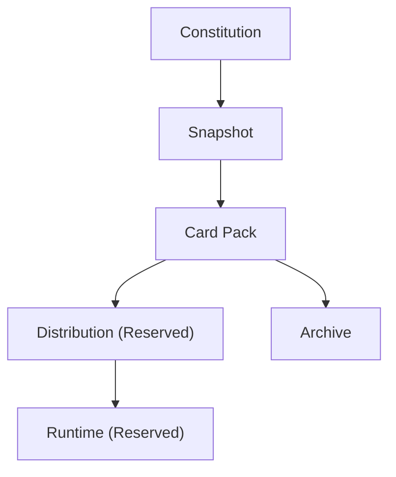
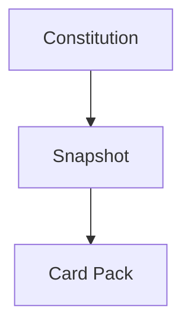

# Mental Smile Phase 8 Creation Freeze - Card Pack Constitution

Scope: `MASTER_GUIDE_ONLY`
Phase: `PHASE_8`
Domain: `CARD_PACK_CONSTITUTION`
Current Status For All Cards: `ACTIVE_CONSTITUTIONAL_CARD`
Distribution Status For All Cards: `MASTER_GUIDE_ONLY`
Archive Scope For All Cards: `CARD_PACK_ARCHIVE`
Runtime Status: `NO_RUNTIME_IMPLEMENTATION`
Distribution Engine Status: `NO_DISTRIBUTION_IMPLEMENTATION`
Deployment Status: `NO_DEPLOYMENT_IMPLEMENTATION`
Synchronization Status: `NO_SYNCHRONIZATION_IMPLEMENTATION`
Previous Phase Modification Status: `NO_PREVIOUS_PHASE_MODIFICATIONS`

---

## 1. PHASE 8 CREATION FREEZE REPORT

Phase 8 creates constitutional governance for card packs. A card pack is a governed collection of cards generated from a validated snapshot. It is a constitutional package, not runtime, not deployment, not distribution, and not a guide.

| Output Domain | Created | Status |
| --- | ---: | --- |
| Card Pack Constitution | 1 | COMPLETE |
| Card Pack Type Set | 7 | COMPLETE |
| Card Pack Lifecycle Set | 6 | COMPLETE |
| Card Pack Ownership Set | 4 | COMPLETE |
| Card Pack Validation Set | 6 | COMPLETE |
| Card Pack Evidence Set | 4 | COMPLETE |
| Card Pack Registry Set | 5 | COMPLETE |
| Card Pack Signal Set | 6 | COMPLETE |
| Card Pack Workflow Set | 5 | COMPLETE |
| Card Pack Gap Set | 6 | COMPLETE |
| Pack Generation Constitution | 1 | COMPLETE |
| Pack Replacement Constitution | 1 | COMPLETE |
| Future Pack Reservation Set | 5 | COMPLETE |
| Card Pack Topology Map | 4 flows | COMPLETE |

Hard rule validation:

| Rule | Result |
| --- | --- |
| No code changes | PASS |
| No Firebase changes | PASS |
| No Firestore changes | PASS |
| No runtime card pack implementation | PASS |
| No distribution engine implementation | PASS |
| No deployment engine implementation | PASS |
| No synchronization engine implementation | PASS |
| No previous phase modifications | PASS |
| All outputs remain `MASTER_GUIDE_ONLY` | PASS |

---

## 2. CARD PACK CONSTITUTION

| Constitutional Area | Doctrine |
| --- | --- |
| Purpose | A card pack groups constitutional cards from a validated snapshot so future systems can consume a known governed package. |
| Ownership | Every pack must have an owner. A pack without ownership is constitutionally invalid. |
| Stewardship | Pack stewardship governs assembly, validation, locking, and archive relationship inside Master Guide scope. |
| Validation | Every pack must pass snapshot, card, dependency, registry, compliance, and archive validation before approval. |
| Compliance | Compliance confirms that the pack contains constitutional cards only and was generated from snapshot state only. |
| Lifecycle | A pack moves through requested, generated, validated, approved, locked, and archived states. |
| Archive Relationship | A pack is not an archive. A locked pack may produce an archive relationship through Phase 6A archive governance. |

Constitutional rules:

| Rule ID | Rule |
| --- | --- |
| `rule.card_pack.from_snapshot` | Card packs originate from validated snapshots. |
| `rule.card_pack.governed` | Card packs are governed constitutional objects. |
| `rule.card_pack.validated` | Card packs must be validated. |
| `rule.card_pack.evidence_backed` | Card packs must be evidence-backed. |
| `rule.card_pack.lockable` | Card packs must be lockable. |
| `rule.card_pack.archivable` | Card packs must be archivable. |
| `rule.card_pack.not_runtime` | Card packs are not runtime. |
| `rule.card_pack.not_deployment` | Card packs are not deployment. |
| `rule.card_pack.not_distribution` | Card packs are not distribution. |
| `rule.card_pack.not_guide` | Card packs are not guides. |
| `rule.card_pack.reserved_not_active` | Reserved pack domains are not active domains. |

---

## 3. CARD PACK TYPE SET

| Card ID | Card Name | Card Type | Source Doctrine | Phase | Owner | Steward | Consumers | Dependencies | Inputs | Outputs | Consumed Signals | Produced Signals | Required Registries | Compliance Checks | Archive Scope | Current Status | Version | Distribution Status |
| --- | --- | --- | --- | --- | --- | --- | --- | --- | --- | --- | --- | --- | --- | --- | --- | --- | --- | --- |
| `card.phase8.pack.type.constitutional` | Constitutional Card Pack Card | Card Pack Type Card | `doctrine.card_pack.from_snapshot` | `PHASE_8` | Owner | Pack Steward | Owner, Legal, Compliance | Phase 7 Constitution Snapshot | Master Constitution cards | Constitutional card pack definition | `signal.pack.requested` | `signal.pack.generated` | `registry.card_pack`, `registry.card_pack_ownership` | `check.phase8.pack_type_exists` | `CARD_PACK_ARCHIVE` | `ACTIVE_CONSTITUTIONAL_CARD` | `v1.0.0` | `MASTER_GUIDE_ONLY` |
| `card.phase8.pack.type.department` | Department Card Pack Card | Card Pack Type Card | `doctrine.card_pack.department_cards` | `PHASE_8` | Department Authority | Pack Steward | Department guides future domain | Phase 1 Department Snapshot | Department cards | Department card pack definition | `signal.pack.requested` | `signal.pack.generated` | `registry.card_pack`, `registry.card_pack_ownership` | `check.phase8.department_pack_owned` | `CARD_PACK_ARCHIVE` | `ACTIVE_CONSTITUTIONAL_CARD` | `v1.0.0` | `MASTER_GUIDE_ONLY` |
| `card.phase8.pack.type.workforce` | Workforce Card Pack Card | Card Pack Type Card | `doctrine.card_pack.workforce_cards` | `PHASE_8` | Owner / Compliance | Pack Steward | Workforce governance | Phase 2 Workforce Snapshot | Role cards, authority cards, responsibility cards | Workforce card pack definition | `signal.pack.requested` | `signal.pack.generated` | `registry.card_pack`, `registry.card_pack_validation` | `check.phase8.workforce_pack_validatable` | `CARD_PACK_ARCHIVE` | `ACTIVE_CONSTITUTIONAL_CARD` | `v1.0.0` | `MASTER_GUIDE_ONLY` |
| `card.phase8.pack.type.registry` | Registry Card Pack Card | Card Pack Type Card | `doctrine.card_pack.registry_cards` | `PHASE_8` | Registry Authority | Pack Steward | Registry consumers, Auditors | Phase 4 Registry Snapshot | Registry governance cards | Registry card pack definition | `signal.pack.requested` | `signal.pack.generated` | `registry.card_pack`, `registry.card_pack_validation` | `check.phase8.registry_pack_validatable` | `CARD_PACK_ARCHIVE` | `ACTIVE_CONSTITUTIONAL_CARD` | `v1.0.0` | `MASTER_GUIDE_ONLY` |
| `card.phase8.pack.type.compliance` | Compliance Card Pack Card | Card Pack Type Card | `doctrine.card_pack.compliance_cards` | `PHASE_8` | Compliance | Pack Steward | Legal, Owner, Archive | Phase 5 Compliance Snapshot | Compliance, audit, evidence, escalation cards | Compliance card pack definition | `signal.pack.requested` | `signal.pack.generated` | `registry.card_pack`, `registry.card_pack_evidence` | `check.phase8.compliance_pack_evidence_backed` | `CARD_PACK_ARCHIVE` | `ACTIVE_CONSTITUTIONAL_CARD` | `v1.0.0` | `MASTER_GUIDE_ONLY` |
| `card.phase8.pack.type.archive` | Archive Card Pack Card | Card Pack Type Card | `doctrine.card_pack.archive_cards` | `PHASE_8` | Archive / Compliance | Pack Steward | Archive governance | Phase 6A Archive Snapshot | Archive governance cards | Archive card pack definition | `signal.pack.requested` | `signal.pack.generated` | `registry.card_pack`, `registry.card_pack_archive` | `check.phase8.archive_pack_relationship_exists` | `CARD_PACK_ARCHIVE` | `ACTIVE_CONSTITUTIONAL_CARD` | `v1.0.0` | `MASTER_GUIDE_ONLY` |
| `card.phase8.pack.type.reserved_future` | Reserved Future Card Pack Card | Card Pack Type Card | `doctrine.card_pack.reserved_not_active` | `PHASE_8` | Owner | Pack Steward | Future phases only | Reserved future domains | Runtime packs, capsule packs, distribution packs | Reserved future pack definition | `signal.pack.requested` | `signal.pack.generated` | `registry.card_pack` | `check.phase8.reserved_packs_not_active` | `CARD_PACK_ARCHIVE` | `ACTIVE_CONSTITUTIONAL_CARD` | `v1.0.0` | `MASTER_GUIDE_ONLY` |

---

## 4. CARD PACK LIFECYCLE SET

| Lifecycle State | Entry Conditions | Exit Conditions | Evidence Requirements | Compliance Requirements |
| --- | --- | --- | --- | --- |
| `PACK_REQUESTED` | Authorized need for a pack is recorded against a validated snapshot. | Pack generation begins or request is rejected. | Pack request evidence. | Pack owner and snapshot source must exist. |
| `PACK_GENERATED` | Cards are selected from snapshot state and assembled as a pack. | Pack validation begins. | Generation evidence. | Manual card insertion must be absent. |
| `PACK_VALIDATED` | Required validations pass. | Approval begins or validation blocks. | Validation evidence. | Snapshot, card, dependency, registry, compliance, and archive checks must pass. |
| `PACK_APPROVED` | Owner or delegated authority approves the validated pack. | Lock begins. | Approval evidence. | Approval authority must be recorded. |
| `PACK_LOCKED` | Approved pack is locked against silent mutation. | Archive relationship begins. | Lock evidence. | Locked pack must be immutable inside active Master Guide scope. |
| `PACK_ARCHIVED` | Locked pack is handed to archive governance. | Archive record remains under Phase 6A rules. | Archive relationship evidence. | Pack remains distinct from archive. |

---

## 5. CARD PACK OWNERSHIP SET

| Card ID | Card Name | Card Type | Source Doctrine | Phase | Owner | Steward | Consumers | Dependencies | Inputs | Outputs | Consumed Signals | Produced Signals | Required Registries | Compliance Checks | Archive Scope | Current Status | Version | Distribution Status |
| --- | --- | --- | --- | --- | --- | --- | --- | --- | --- | --- | --- | --- | --- | --- | --- | --- | --- | --- |
| `card.phase8.ownership.owner` | Pack Owner Card | Card Pack Ownership Card | `doctrine.card_pack.owned` | `PHASE_8` | Owner | Pack Steward | All pack consumers | Card Pack Constitution | Owner authority | Pack owner definition | `signal.pack.requested` | `signal.pack.generated` | `registry.card_pack_ownership` | `check.phase8.pack_owner_exists` | `CARD_PACK_ARCHIVE` | `ACTIVE_CONSTITUTIONAL_CARD` | `v1.0.0` | `MASTER_GUIDE_ONLY` |
| `card.phase8.ownership.steward` | Pack Steward Card | Card Pack Ownership Card | `doctrine.card_pack.stewardship` | `PHASE_8` | Owner | Pack Steward | Compliance, Archive | Card Pack Constitution | Steward assignment | Pack stewardship definition | `signal.pack.requested` | `signal.pack.generated` | `registry.card_pack_ownership` | `check.phase8.pack_steward_exists` | `CARD_PACK_ARCHIVE` | `ACTIVE_CONSTITUTIONAL_CARD` | `v1.0.0` | `MASTER_GUIDE_ONLY` |
| `card.phase8.ownership.consumers` | Pack Consumers Card | Card Pack Ownership Card | `doctrine.card_pack.consumer_mapping` | `PHASE_8` | Pack Owner | Pack Steward | Future distribution, auditors, archive | Pack type set | Consumer list | Pack consumer definition | `signal.pack.generated` | `signal.pack.validated` | `registry.card_pack_ownership` | `check.phase8.pack_consumers_mapped` | `CARD_PACK_ARCHIVE` | `ACTIVE_CONSTITUTIONAL_CARD` | `v1.0.0` | `MASTER_GUIDE_ONLY` |
| `card.phase8.ownership.dependencies` | Pack Dependencies Card | Card Pack Ownership Card | `doctrine.card_pack.dependency_mapping` | `PHASE_8` | Pack Owner | Pack Steward | Validation, Compliance | Phase 7 snapshot constitution | Dependency list | Pack dependency definition | `signal.pack.generated` | `signal.pack.validated` | `registry.card_pack_validation` | `check.phase8.pack_dependencies_mapped` | `CARD_PACK_ARCHIVE` | `ACTIVE_CONSTITUTIONAL_CARD` | `v1.0.0` | `MASTER_GUIDE_ONLY` |

Rule: every pack must have ownership before generation.

---

## 6. CARD PACK VALIDATION SET

| Card ID | Card Name | Card Type | Source Doctrine | Phase | Owner | Steward | Consumers | Dependencies | Inputs | Outputs | Consumed Signals | Produced Signals | Required Registries | Compliance Checks | Archive Scope | Current Status | Version | Distribution Status |
| --- | --- | --- | --- | --- | --- | --- | --- | --- | --- | --- | --- | --- | --- | --- | --- | --- | --- | --- |
| `card.phase8.validation.snapshot` | Snapshot Validation Card | Card Pack Validation Card | `doctrine.card_pack.from_snapshot` | `PHASE_8` | Compliance | Pack Steward | Owner, Auditor | Phase 7 Snapshot Constitution | Snapshot reference | Snapshot validation result | `signal.pack.generated` | `signal.pack.validated` | `registry.card_pack_validation` | `check.phase8.snapshot_validation_passed` | `CARD_PACK_ARCHIVE` | `ACTIVE_CONSTITUTIONAL_CARD` | `v1.0.0` | `MASTER_GUIDE_ONLY` |
| `card.phase8.validation.card` | Card Validation Card | Card Pack Validation Card | `doctrine.card_pack.card_validation` | `PHASE_8` | Card Authority / Compliance | Pack Steward | Pack consumers | Phase 3 Card Constitution | Card list from snapshot | Card validation result | `signal.pack.generated` | `signal.pack.validated` | `registry.card_pack_validation` | `check.phase8.card_validation_passed` | `CARD_PACK_ARCHIVE` | `ACTIVE_CONSTITUTIONAL_CARD` | `v1.0.0` | `MASTER_GUIDE_ONLY` |
| `card.phase8.validation.dependency` | Dependency Validation Card | Card Pack Validation Card | `doctrine.card_pack.dependency_validation` | `PHASE_8` | Compliance | Pack Steward | Technical, Auditor | Prior phase dependencies | Dependency map | Dependency validation result | `signal.pack.generated` | `signal.pack.validated` | `registry.card_pack_validation` | `check.phase8.dependency_validation_passed` | `CARD_PACK_ARCHIVE` | `ACTIVE_CONSTITUTIONAL_CARD` | `v1.0.0` | `MASTER_GUIDE_ONLY` |
| `card.phase8.validation.registry` | Registry Validation Card | Card Pack Validation Card | `doctrine.card_pack.registry_validation` | `PHASE_8` | Registry Authority / Compliance | Pack Steward | Registry consumers | Phase 4 Registry Constitution | Registry references | Registry validation result | `signal.pack.generated` | `signal.pack.validated` | `registry.card_pack_validation` | `check.phase8.registry_validation_passed` | `CARD_PACK_ARCHIVE` | `ACTIVE_CONSTITUTIONAL_CARD` | `v1.0.0` | `MASTER_GUIDE_ONLY` |
| `card.phase8.validation.compliance` | Compliance Validation Card | Card Pack Validation Card | `doctrine.card_pack.compliance_validation` | `PHASE_8` | Compliance | Pack Steward | Owner, Legal | Phase 5 Auditor & Compliance Constitution | Compliance checks | Compliance validation result | `signal.pack.generated` | `signal.pack.validated` | `registry.card_pack_validation`, `registry.card_pack_evidence` | `check.phase8.compliance_validation_passed` | `CARD_PACK_ARCHIVE` | `ACTIVE_CONSTITUTIONAL_CARD` | `v1.0.0` | `MASTER_GUIDE_ONLY` |
| `card.phase8.validation.archive` | Archive Validation Card | Card Pack Validation Card | `doctrine.card_pack.archive_relationship` | `PHASE_8` | Archive / Compliance | Pack Steward | Archive consumers | Phase 6A Archive Constitution | Archive relationship requirements | Archive validation result | `signal.pack.generated` | `signal.pack.validated` | `registry.card_pack_archive`, `registry.card_pack_evidence` | `check.phase8.archive_validation_passed` | `CARD_PACK_ARCHIVE` | `ACTIVE_CONSTITUTIONAL_CARD` | `v1.0.0` | `MASTER_GUIDE_ONLY` |

---

## 7. CARD PACK EVIDENCE SET

| Card ID | Card Name | Card Type | Source Doctrine | Phase | Owner | Steward | Consumers | Dependencies | Inputs | Outputs | Consumed Signals | Produced Signals | Required Registries | Compliance Checks | Archive Scope | Current Status | Version | Distribution Status |
| --- | --- | --- | --- | --- | --- | --- | --- | --- | --- | --- | --- | --- | --- | --- | --- | --- | --- | --- |
| `card.phase8.evidence.pack` | Pack Evidence Card | Card Pack Evidence Card | `doctrine.card_pack.evidence_backed` | `PHASE_8` | Compliance | Pack Steward | Owner, Archive | Generated pack | Pack metadata and source snapshot | Pack evidence record | `signal.pack.generated` | `signal.pack.validated` | `registry.card_pack_evidence` | `check.phase8.pack_evidence_exists` | `CARD_PACK_ARCHIVE` | `ACTIVE_CONSTITUTIONAL_CARD` | `v1.0.0` | `MASTER_GUIDE_ONLY` |
| `card.phase8.evidence.validation` | Pack Validation Evidence Card | Card Pack Evidence Card | `doctrine.card_pack.validation_evidence` | `PHASE_8` | Compliance | Pack Steward | Auditor, Archive | Validation set | Validation results | Validation evidence record | `signal.pack.generated` | `signal.pack.validated` | `registry.card_pack_evidence`, `registry.card_pack_validation` | `check.phase8.validation_evidence_exists` | `CARD_PACK_ARCHIVE` | `ACTIVE_CONSTITUTIONAL_CARD` | `v1.0.0` | `MASTER_GUIDE_ONLY` |
| `card.phase8.evidence.approval` | Pack Approval Evidence Card | Card Pack Evidence Card | `doctrine.card_pack.approval_evidence` | `PHASE_8` | Owner | Pack Steward | Legal, Archive | Validated pack | Approval authority and reason | Approval evidence record | `signal.pack.validated` | `signal.pack.approved` | `registry.card_pack_evidence` | `check.phase8.approval_evidence_exists` | `CARD_PACK_ARCHIVE` | `ACTIVE_CONSTITUTIONAL_CARD` | `v1.0.0` | `MASTER_GUIDE_ONLY` |
| `card.phase8.evidence.lock` | Pack Lock Evidence Card | Card Pack Evidence Card | `doctrine.card_pack.lock_evidence` | `PHASE_8` | Compliance / Archive | Pack Steward | Owner, Archive | Approved pack | Lock reason and integrity reference | Lock evidence record | `signal.pack.approved` | `signal.pack.locked` | `registry.card_pack_evidence`, `registry.card_pack_archive` | `check.phase8.lock_evidence_exists` | `CARD_PACK_ARCHIVE` | `ACTIVE_CONSTITUTIONAL_CARD` | `v1.0.0` | `MASTER_GUIDE_ONLY` |

---

## 8. CARD PACK REGISTRY SET

| Card ID | Card Name | Card Type | Source Doctrine | Phase | Owner | Steward | Consumers | Dependencies | Inputs | Outputs | Consumed Signals | Produced Signals | Required Registries | Compliance Checks | Archive Scope | Current Status | Version | Distribution Status |
| --- | --- | --- | --- | --- | --- | --- | --- | --- | --- | --- | --- | --- | --- | --- | --- | --- | --- | --- |
| `card.phase8.registry.card_pack` | Card Pack Registry Card | Card Pack Registry Card | `doctrine.card_pack.registry_required` | `PHASE_8` | Owner / Registry Authority | Pack Steward | All pack consumers | Card Pack Constitution | Pack IDs and types | Card pack registry governance | `signal.pack.generated` | `signal.pack.validated` | `registry.card_pack` | `check.phase8.card_pack_registry_exists` | `CARD_PACK_ARCHIVE` | `ACTIVE_CONSTITUTIONAL_CARD` | `v1.0.0` | `MASTER_GUIDE_ONLY` |
| `card.phase8.registry.ownership` | Card Pack Ownership Registry Card | Card Pack Registry Card | `doctrine.card_pack.owned` | `PHASE_8` | Owner | Pack Steward | Compliance, Archive | Ownership set | Owner/steward/consumer map | Ownership registry governance | `signal.pack.requested` | `signal.pack.generated` | `registry.card_pack_ownership` | `check.phase8.pack_owner_exists` | `CARD_PACK_ARCHIVE` | `ACTIVE_CONSTITUTIONAL_CARD` | `v1.0.0` | `MASTER_GUIDE_ONLY` |
| `card.phase8.registry.validation` | Card Pack Validation Registry Card | Card Pack Registry Card | `doctrine.card_pack.validated` | `PHASE_8` | Compliance | Pack Steward | Auditor, Owner | Validation set | Validation requirements and results | Validation registry governance | `signal.pack.generated` | `signal.pack.validated` | `registry.card_pack_validation` | `check.phase8.card_pack_validation_registry_exists` | `CARD_PACK_ARCHIVE` | `ACTIVE_CONSTITUTIONAL_CARD` | `v1.0.0` | `MASTER_GUIDE_ONLY` |
| `card.phase8.registry.evidence` | Card Pack Evidence Registry Card | Card Pack Registry Card | `doctrine.card_pack.evidence_backed` | `PHASE_8` | Compliance | Pack Steward | Legal, Archive | Evidence set | Evidence records | Evidence registry governance | `signal.pack.generated` | `signal.pack.locked` | `registry.card_pack_evidence` | `check.phase8.card_pack_evidence_registry_exists` | `CARD_PACK_ARCHIVE` | `ACTIVE_CONSTITUTIONAL_CARD` | `v1.0.0` | `MASTER_GUIDE_ONLY` |
| `card.phase8.registry.archive` | Card Pack Archive Registry Card | Card Pack Registry Card | `doctrine.card_pack.archive_relationship` | `PHASE_8` | Archive / Compliance | Pack Steward | Archive, Owner | Phase 6A Archive Constitution | Locked pack references | Card pack archive registry governance | `signal.pack.locked` | `signal.pack.archived` | `registry.card_pack_archive` | `check.phase8.card_pack_archive_registry_exists` | `CARD_PACK_ARCHIVE` | `ACTIVE_CONSTITUTIONAL_CARD` | `v1.0.0` | `MASTER_GUIDE_ONLY` |

---

## 9. CARD PACK SIGNAL SET

| Card ID | Card Name | Card Type | Source Doctrine | Phase | Owner | Steward | Consumers | Dependencies | Inputs | Outputs | Consumed Signals | Produced Signals | Required Registries | Compliance Checks | Archive Scope | Current Status | Version | Distribution Status |
| --- | --- | --- | --- | --- | --- | --- | --- | --- | --- | --- | --- | --- | --- | --- | --- | --- | --- | --- |
| `card.phase8.signal.requested` | Pack Requested Signal Card | Card Pack Signal Card | `doctrine.card_pack.lifecycle_ordered` | `PHASE_8` | Pack Owner | Pack Steward | Creation workflow | Validated snapshot need | Request reason | Requested signal | None | `signal.pack.requested` | `registry.card_pack` | `check.phase8.pack_request_has_owner` | `CARD_PACK_ARCHIVE` | `ACTIVE_CONSTITUTIONAL_CARD` | `v1.0.0` | `MASTER_GUIDE_ONLY` |
| `card.phase8.signal.generated` | Pack Generated Signal Card | Card Pack Signal Card | `doctrine.card_pack.from_snapshot` | `PHASE_8` | Pack Steward | Pack Steward | Validation workflow | Pack request | Generated pack metadata | Generated signal | `signal.pack.requested` | `signal.pack.generated` | `registry.card_pack` | `check.phase8.pack_generated_from_snapshot` | `CARD_PACK_ARCHIVE` | `ACTIVE_CONSTITUTIONAL_CARD` | `v1.0.0` | `MASTER_GUIDE_ONLY` |
| `card.phase8.signal.validated` | Pack Validated Signal Card | Card Pack Signal Card | `doctrine.card_pack.validated` | `PHASE_8` | Compliance | Pack Steward | Approval workflow | Generated pack | Validation result | Validated signal | `signal.pack.generated` | `signal.pack.validated` | `registry.card_pack_validation` | `check.phase8.pack_validation_passed` | `CARD_PACK_ARCHIVE` | `ACTIVE_CONSTITUTIONAL_CARD` | `v1.0.0` | `MASTER_GUIDE_ONLY` |
| `card.phase8.signal.approved` | Pack Approved Signal Card | Card Pack Signal Card | `doctrine.card_pack.approval_required` | `PHASE_8` | Owner | Pack Steward | Lock workflow | Validated pack | Approval evidence | Approved signal | `signal.pack.validated` | `signal.pack.approved` | `registry.card_pack_evidence` | `check.phase8.pack_approval_evidence_exists` | `CARD_PACK_ARCHIVE` | `ACTIVE_CONSTITUTIONAL_CARD` | `v1.0.0` | `MASTER_GUIDE_ONLY` |
| `card.phase8.signal.locked` | Pack Locked Signal Card | Card Pack Signal Card | `doctrine.card_pack.lockable` | `PHASE_8` | Compliance / Archive | Pack Steward | Archive workflow | Approved pack | Lock evidence | Locked signal | `signal.pack.approved` | `signal.pack.locked` | `registry.card_pack_evidence`, `registry.card_pack_archive` | `check.phase8.pack_lock_evidence_exists` | `CARD_PACK_ARCHIVE` | `ACTIVE_CONSTITUTIONAL_CARD` | `v1.0.0` | `MASTER_GUIDE_ONLY` |
| `card.phase8.signal.archived` | Pack Archived Signal Card | Card Pack Signal Card | `doctrine.card_pack.archivable` | `PHASE_8` | Archive | Pack Steward | Archive constitution | Locked pack | Archive relationship evidence | Archived signal | `signal.pack.locked` | `signal.pack.archived` | `registry.card_pack_archive` | `check.phase8.pack_archive_relationship_exists` | `CARD_PACK_ARCHIVE` | `ACTIVE_CONSTITUTIONAL_CARD` | `v1.0.0` | `MASTER_GUIDE_ONLY` |

---

## 10. CARD PACK WORKFLOW SET

| Card ID | Card Name | Card Type | Source Doctrine | Phase | Owner | Steward | Consumers | Dependencies | Inputs | Outputs | Consumed Signals | Produced Signals | Required Registries | Compliance Checks | Archive Scope | Current Status | Version | Distribution Status |
| --- | --- | --- | --- | --- | --- | --- | --- | --- | --- | --- | --- | --- | --- | --- | --- | --- | --- | --- |
| `card.phase8.workflow.creation` | Pack Creation Workflow Card | Card Pack Workflow Card | `doctrine.card_pack.from_snapshot` | `PHASE_8` | Pack Owner | Pack Steward | Validation workflow | Validated snapshot | Pack type and snapshot state | Generated pack | `signal.pack.requested` | `signal.pack.generated` | `registry.card_pack`, `registry.card_pack_ownership` | `check.phase8.pack_creation_owned` | `CARD_PACK_ARCHIVE` | `ACTIVE_CONSTITUTIONAL_CARD` | `v1.0.0` | `MASTER_GUIDE_ONLY` |
| `card.phase8.workflow.validation` | Pack Validation Workflow Card | Card Pack Workflow Card | `doctrine.card_pack.validated` | `PHASE_8` | Compliance | Pack Steward | Approval workflow | Generated pack | Validation set | Validated pack or blocked report | `signal.pack.generated` | `signal.pack.validated` | `registry.card_pack_validation`, `registry.card_pack_evidence` | `check.phase8.pack_validation_complete` | `CARD_PACK_ARCHIVE` | `ACTIVE_CONSTITUTIONAL_CARD` | `v1.0.0` | `MASTER_GUIDE_ONLY` |
| `card.phase8.workflow.approval` | Pack Approval Workflow Card | Card Pack Workflow Card | `doctrine.card_pack.approval_required` | `PHASE_8` | Owner | Pack Steward | Lock workflow | Validated pack | Approval authority and evidence | Approved pack | `signal.pack.validated` | `signal.pack.approved` | `registry.card_pack_evidence` | `check.phase8.pack_approval_complete` | `CARD_PACK_ARCHIVE` | `ACTIVE_CONSTITUTIONAL_CARD` | `v1.0.0` | `MASTER_GUIDE_ONLY` |
| `card.phase8.workflow.lock` | Pack Lock Workflow Card | Card Pack Workflow Card | `doctrine.card_pack.lockable` | `PHASE_8` | Compliance / Archive | Pack Steward | Archive workflow | Approved pack | Lock evidence | Locked pack | `signal.pack.approved` | `signal.pack.locked` | `registry.card_pack_evidence` | `check.phase8.pack_lock_complete` | `CARD_PACK_ARCHIVE` | `ACTIVE_CONSTITUTIONAL_CARD` | `v1.0.0` | `MASTER_GUIDE_ONLY` |
| `card.phase8.workflow.archive` | Pack Archive Workflow Card | Card Pack Workflow Card | `doctrine.card_pack.archive_relationship` | `PHASE_8` | Archive | Pack Steward | Phase 6A archive governance | Locked pack | Archive relationship evidence | Archived pack reference | `signal.pack.locked` | `signal.pack.archived` | `registry.card_pack_archive` | `check.phase8.pack_archive_complete` | `CARD_PACK_ARCHIVE` | `ACTIVE_CONSTITUTIONAL_CARD` | `v1.0.0` | `MASTER_GUIDE_ONLY` |

---

## 11. CARD PACK GAP SET

| Card ID | Card Name | Card Type | Source Doctrine | Phase | Owner | Steward | Consumers | Dependencies | Inputs | Outputs | Consumed Signals | Produced Signals | Required Registries | Compliance Checks | Archive Scope | Current Status | Version | Distribution Status |
| --- | --- | --- | --- | --- | --- | --- | --- | --- | --- | --- | --- | --- | --- | --- | --- | --- | --- | --- |
| `card.gap.phase8.pack_governance_missing` | Missing Pack Governance Gap Card | Card Pack Gap Card | `doctrine.card_pack.governed` | `PHASE_8` | Owner / Compliance | Pack Steward | Owner, Legal | Card Pack Constitution | Missing governance finding | Governance gap record | `signal.pack.requested` | `signal.pack.generated` | `registry.card_pack` | `check.phase8.pack_governance_exists` | `CARD_PACK_ARCHIVE` | `ACTIVE_CONSTITUTIONAL_CARD` | `v1.0.0` | `MASTER_GUIDE_ONLY` |
| `card.gap.phase8.pack_validation_missing` | Missing Pack Validation Gap Card | Card Pack Gap Card | `doctrine.card_pack.validated` | `PHASE_8` | Compliance | Pack Steward | Auditor | Pack validation set | Missing validation finding | Validation gap record | `signal.pack.generated` | `signal.pack.validated` | `registry.card_pack_validation` | `check.phase8.pack_validation_exists` | `CARD_PACK_ARCHIVE` | `ACTIVE_CONSTITUTIONAL_CARD` | `v1.0.0` | `MASTER_GUIDE_ONLY` |
| `card.gap.phase8.pack_ownership_missing` | Missing Pack Ownership Gap Card | Card Pack Gap Card | `doctrine.card_pack.owned` | `PHASE_8` | Owner | Pack Steward | Compliance, Archive | Pack ownership set | Missing ownership finding | Ownership gap record | `signal.pack.requested` | `signal.pack.generated` | `registry.card_pack_ownership` | `check.phase8.pack_owner_exists` | `CARD_PACK_ARCHIVE` | `ACTIVE_CONSTITUTIONAL_CARD` | `v1.0.0` | `MASTER_GUIDE_ONLY` |
| `card.gap.phase8.pack_archive_relationship_missing` | Missing Pack Archive Relationship Gap Card | Card Pack Gap Card | `doctrine.card_pack.archive_relationship` | `PHASE_8` | Archive / Compliance | Pack Steward | Owner, Legal | Phase 6A archive constitution | Missing archive relationship finding | Archive relationship gap record | `signal.pack.locked` | `signal.pack.archived` | `registry.card_pack_archive` | `check.phase8.pack_archive_relationship_exists` | `CARD_PACK_ARCHIVE` | `ACTIVE_CONSTITUTIONAL_CARD` | `v1.0.0` | `MASTER_GUIDE_ONLY` |
| `card.gap.phase8.pack_evidence_missing` | Missing Pack Evidence Gap Card | Card Pack Gap Card | `doctrine.card_pack.evidence_backed` | `PHASE_8` | Compliance | Pack Steward | Legal, Archive | Pack evidence set | Missing evidence finding | Evidence gap record | `signal.pack.generated` | `signal.pack.validated` | `registry.card_pack_evidence` | `check.phase8.pack_evidence_exists` | `CARD_PACK_ARCHIVE` | `ACTIVE_CONSTITUTIONAL_CARD` | `v1.0.0` | `MASTER_GUIDE_ONLY` |
| `card.gap.phase8.pack_lifecycle_missing` | Missing Pack Lifecycle Gap Card | Card Pack Gap Card | `doctrine.card_pack.lifecycle_ordered` | `PHASE_8` | Compliance | Pack Steward | Owner, Auditor | Pack lifecycle set | Missing lifecycle finding | Lifecycle gap record | `signal.pack.requested` | `signal.pack.archived` | `registry.card_pack` | `check.phase8.pack_lifecycle_exists` | `CARD_PACK_ARCHIVE` | `ACTIVE_CONSTITUTIONAL_CARD` | `v1.0.0` | `MASTER_GUIDE_ONLY` |

---

## 12. CARD PACK TOPOLOGY MAP

Primary constitutional topology:

Generation flow:

| Step | From | To | Signal | Evidence |
| --- | --- | --- | --- | --- |
| 1 | Validated Snapshot | Pack Creation Workflow | `signal.pack.requested` | Request evidence |
| 2 | Pack Creation Workflow | Pack Validation Workflow | `signal.pack.generated` | Generation evidence |
| 3 | Pack Validation Workflow | Pack Approval Workflow | `signal.pack.validated` | Validation evidence |
| 4 | Pack Approval Workflow | Pack Lock Workflow | `signal.pack.approved` | Approval evidence |
| 5 | Pack Lock Workflow | Pack Archive Workflow | `signal.pack.locked` | Lock evidence |
| 6 | Pack Archive Workflow | Phase 6A Archive Governance | `signal.pack.archived` | Archive relationship evidence |

Validation flow:

| Validation | Consumer | Registry | Blocking Condition |
| --- | --- | --- | --- |
| Snapshot Validation | Compliance | `registry.card_pack_validation` | Pack has no validated snapshot source |
| Card Validation | Card Authority | `registry.card_pack_validation` | Pack contains invalid card reference |
| Dependency Validation | Compliance / Technical | `registry.card_pack_validation` | Required dependency missing |
| Registry Validation | Registry Authority | `registry.card_pack_validation` | Required registry missing |
| Compliance Validation | Compliance | `registry.card_pack_evidence` | Evidence missing |
| Archive Validation | Archive | `registry.card_pack_archive` | Archive relationship missing |

Evidence flow:

| Evidence Type | Created By | Consumed By | Registry |
| --- | --- | --- | --- |
| Pack Evidence | Pack Steward | Compliance | `registry.card_pack_evidence` |
| Validation Evidence | Compliance | Owner, Auditor | `registry.card_pack_evidence` |
| Approval Evidence | Owner | Lock Workflow | `registry.card_pack_evidence` |
| Lock Evidence | Compliance / Archive | Archive Workflow | `registry.card_pack_evidence` |

Archive flow:

| From | To | Rule |
| --- | --- | --- |
| Locked Pack | Card Pack Archive Registry | Pack must be locked first. |
| Card Pack Archive Registry | Phase 6A Archive Constitution | Pack remains distinct from archive. |
| Phase 6A Archive Constitution | Archive Evidence | Archive stores evidence relationship, not runtime pack implementation. |

---

## 13. PACK GENERATION CONSTITUTION

Pack generation sequence:

| Step | Constitutional Action | Rule |
| --- | --- | --- |
| 1 | Snapshot | Source snapshot must be validated and owned. |
| 2 | Card Selection | Cards are selected from snapshot state only. |
| 3 | Pack Assembly | Pack is assembled under Pack Steward control. |
| 4 | Pack Validation | Pack must pass required validations. |
| 5 | Pack Approval | Owner or delegated authority approves. |
| 6 | Pack Lock | Pack is locked after approval. |
| 7 | Pack Archive | Locked pack receives archive relationship. |

Important generation rule:

| Rule ID | Rule |
| --- | --- |
| `rule.card_pack.no_manual_add` | Cards are never manually added to packs. |
| `rule.card_pack.snapshot_only` | Packs are generated from snapshot state only. |
| `rule.card_pack.no_runtime_generation` | Phase 8 does not create a runtime generator. |

---

## 14. PACK REPLACEMENT CONSTITUTION

Pack replacement sequence:

| Step | Constitutional Action | Rule |
| --- | --- | --- |
| 1 | Old Pack | Old pack may not be modified. |
| 2 | Replacement Request | Replacement request records reason and evidence. |
| 3 | New Pack | Replacement produces a new pack from current validated snapshot state. |
| 4 | Validation | New pack must pass all required validations. |
| 5 | Approval | New pack requires approval. |
| 6 | Lock | New pack is locked after approval. |
| 7 | Archive | Old pack and new pack relationship is archived as evidence. |

Replacement rules:

| Rule ID | Rule |
| --- | --- |
| `rule.card_pack.old_pack_not_modified` | Old pack may not be modified. |
| `rule.card_pack.replacement_new_pack` | Replacement produces a new pack. |
| `rule.card_pack.newest_approved_eligible` | Only the newest approved pack may become eligible for future distribution. |
| `rule.card_pack.no_active_distribution` | Phase 8 does not distribute any pack. |

---

## 15. FUTURE PACK RESERVATION SET

Reserved pack domains are constitutional placeholders only. They do not authorize runtime, distribution, capsule, recovery, backup, deployment, or synchronization implementation.

| Card ID | Card Name | Card Type | Source Doctrine | Phase | Owner | Steward | Consumers | Dependencies | Inputs | Outputs | Consumed Signals | Produced Signals | Required Registries | Compliance Checks | Archive Scope | Current Status | Version | Distribution Status | Reservation Status |
| --- | --- | --- | --- | --- | --- | --- | --- | --- | --- | --- | --- | --- | --- | --- | --- | --- | --- | --- | --- |
| `card.reserved.phase8.runtime_pack` | Runtime Pack Reservation Card | Reserved Pack Card | `doctrine.card_pack.reserved_not_active` | `PHASE_8` | Owner | Pack Steward | Future phases | None active | Reservation name | Reserved marker | None | `signal.pack.requested` | `registry.card_pack` | `check.phase8.reserved_pack_not_active` | `CARD_PACK_ARCHIVE` | `ACTIVE_CONSTITUTIONAL_CARD` | `v1.0.0` | `MASTER_GUIDE_ONLY` | `RESERVED` |
| `card.reserved.phase8.distribution_pack` | Distribution Pack Reservation Card | Reserved Pack Card | `doctrine.card_pack.reserved_not_active` | `PHASE_8` | Owner | Pack Steward | Future phases | None active | Reservation name | Reserved marker | None | `signal.pack.requested` | `registry.card_pack` | `check.phase8.reserved_pack_not_active` | `CARD_PACK_ARCHIVE` | `ACTIVE_CONSTITUTIONAL_CARD` | `v1.0.0` | `MASTER_GUIDE_ONLY` | `RESERVED` |
| `card.reserved.phase8.capsule_pack` | Capsule Pack Reservation Card | Reserved Pack Card | `doctrine.card_pack.reserved_not_active` | `PHASE_8` | Owner | Pack Steward | Future phases | None active | Reservation name | Reserved marker | None | `signal.pack.requested` | `registry.card_pack` | `check.phase8.reserved_pack_not_active` | `CARD_PACK_ARCHIVE` | `ACTIVE_CONSTITUTIONAL_CARD` | `v1.0.0` | `MASTER_GUIDE_ONLY` | `RESERVED` |
| `card.reserved.phase8.recovery_pack` | Recovery Pack Reservation Card | Reserved Pack Card | `doctrine.card_pack.reserved_not_active` | `PHASE_8` | Owner | Pack Steward | Future phases | None active | Reservation name | Reserved marker | None | `signal.pack.requested` | `registry.card_pack` | `check.phase8.reserved_pack_not_active` | `CARD_PACK_ARCHIVE` | `ACTIVE_CONSTITUTIONAL_CARD` | `v1.0.0` | `MASTER_GUIDE_ONLY` | `RESERVED` |
| `card.reserved.phase8.backup_pack` | Backup Pack Reservation Card | Reserved Pack Card | `doctrine.card_pack.reserved_not_active` | `PHASE_8` | Owner | Pack Steward | Future phases | None active | Reservation name | Reserved marker | None | `signal.pack.requested` | `registry.card_pack` | `check.phase8.reserved_pack_not_active` | `CARD_PACK_ARCHIVE` | `ACTIVE_CONSTITUTIONAL_CARD` | `v1.0.0` | `MASTER_GUIDE_ONLY` | `RESERVED` |

---

## 16. PHASE 8 TO PHASE 9 READINESS HANDOFF

Phase 8 closes the constitutional chain:

| Handoff Object | Ready For Phase 9 | Notes |
| --- | --- | --- |
| Card Pack Constitution | YES | Defines purpose, ownership, stewardship, validation, compliance, lifecycle, and archive relationship. |
| Card Pack Types | YES | Defines constitutional, department, workforce, registry, compliance, archive, and reserved future packs. |
| Card Pack Lifecycle | YES | Defines requested through archived states. |
| Card Pack Ownership | YES | Enforces owner/steward/consumer/dependency mapping. |
| Card Pack Validation | YES | Defines snapshot, card, dependency, registry, compliance, and archive validation. |
| Card Pack Evidence | YES | Defines pack, validation, approval, and lock evidence. |
| Card Pack Registries | YES | Defines pack, ownership, validation, evidence, and archive registries. |
| Card Pack Signals | YES | Defines requested, generated, validated, approved, locked, and archived signals. |
| Card Pack Workflows | YES | Defines creation, validation, approval, lock, and archive workflows. |
| Pack Generation Doctrine | YES | Enforces snapshot-only generation and no manual card insertion. |
| Pack Replacement Doctrine | YES | Enforces old pack immutability and new-pack replacement. |
| Future Pack Reservations | YES | Reserved only; no implementation authority. |

Phase 9 is blocked from treating Phase 8 as runtime, distribution, deployment, synchronization, backup, recovery, or capsule authority.

---

## 17. PHASE 8 VALIDATION RESULT

| Pass Condition | Result |
| --- | --- |
| Card pack types exist | PASS |
| Card pack lifecycle exists | PASS |
| Card pack ownership exists | PASS |
| Card pack validation exists | PASS |
| Card pack evidence exists | PASS |
| Card pack registry exists | PASS |
| Card pack archive relationship exists | PASS |
| Pack generation doctrine exists | PASS |
| Pack replacement doctrine exists | PASS |
| Reserved pack domains exist | PASS |
| No runtime implementation exists | PASS |
| No distribution implementation exists | PASS |
| No previous phase modifications exist | PASS |
| All outputs remain `MASTER_GUIDE_ONLY` | PASS |

Final Phase 8 creation freeze result: `PASS`.
