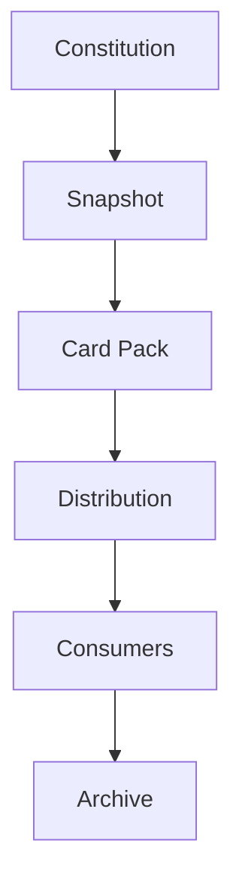

# Mental Smile Phase 9 Creation Freeze - Distribution Constitution

Scope: `MASTER_GUIDE_ONLY`
Phase: `PHASE_9`
Domain: `DISTRIBUTION_CONSTITUTION`
Current Status For All Cards: `ACTIVE_CONSTITUTIONAL_CARD`
Distribution Status For All Cards: `MASTER_GUIDE_ONLY`
Archive Scope For All Cards: `DISTRIBUTION_ARCHIVE`
Runtime Status: `NO_RUNTIME_IMPLEMENTATION`
Deployment Status: `NO_DEPLOYMENT_IMPLEMENTATION`
Synchronization Status: `NO_SYNCHRONIZATION_IMPLEMENTATION`
Auto Update Status: `NO_AUTO_UPDATE_IMPLEMENTATION`
Previous Phase Modification Status: `NO_PREVIOUS_PHASE_MODIFICATIONS`

---

## 1. PHASE 9 CREATION FREEZE REPORT

Phase 9 creates constitutional governance for distribution. Distribution is constitutional propagation: it moves approved card packs to approved constitutional consumers. Distribution is not deployment, not runtime execution, not synchronization, and not auto-update.

| Output Domain | Created | Status |
| --- | ---: | --- |
| Distribution Constitution | 1 | COMPLETE |
| Distribution Target Set | 17 | COMPLETE |
| Distribution Receiver Set | 5 | COMPLETE |
| Distribution Lifecycle Set | 7 | COMPLETE |
| Distribution Validation Set | 6 | COMPLETE |
| Distribution Evidence Set | 5 | COMPLETE |
| Distribution Failure Set | 6 | COMPLETE |
| Distribution Registry Set | 6 | COMPLETE |
| Distribution Signal Set | 8 | COMPLETE |
| Distribution Workflow Set | 7 | COMPLETE |
| Distribution Gap Set | 6 | COMPLETE |
| Distribution Topology Map | 5 flows | COMPLETE |
| Distribution Completion Constitution | 1 | COMPLETE |
| Distribution Block Constitution | 4 | COMPLETE |
| Future Distribution Reservation Set | 6 | COMPLETE |

Hard rule validation:

| Rule | Result |
| --- | --- |
| No code changes | PASS |
| No Firebase changes | PASS |
| No Firestore changes | PASS |
| No runtime distribution implementation | PASS |
| No synchronization engine implementation | PASS |
| No deployment engine implementation | PASS |
| No auto-update engine implementation | PASS |
| No previous phase modifications | PASS |
| All outputs remain `MASTER_GUIDE_ONLY` | PASS |

---

## 2. DISTRIBUTION CONSTITUTION

| Constitutional Area | Doctrine |
| --- | --- |
| Purpose | Distribution propagates an approved card pack to an approved constitutional consumer. |
| Ownership | Every distribution must have an owner and receiver ownership before validation. |
| Stewardship | Distribution stewardship governs request, validation, approval, delivery, confirmation, failure handling, and archive relationship. |
| Validation | Distribution must validate the pack, receiver, ownership, registry, compliance, and archive relationship. |
| Compliance | Compliance confirms that distribution is constitutional propagation only and does not imply deployment or runtime execution. |
| Lifecycle | Distribution moves through requested, validated, approved, sent, received, confirmed, and archived. |
| Archive Relationship | Distribution is not archive. Confirmed or failed distribution produces archive evidence under Phase 6A governance. |

Constitutional rules:

| Rule ID | Rule |
| --- | --- |
| `rule.distribution.requires_ownership` | Distribution requires ownership. |
| `rule.distribution.requires_validation` | Distribution requires validation. |
| `rule.distribution.requires_evidence` | Distribution requires evidence. |
| `rule.distribution.requires_confirmation` | Distribution requires receiver confirmation. |
| `rule.distribution.not_deployment` | Distribution is not deployment. |
| `rule.distribution.not_runtime` | Distribution is not runtime. |
| `rule.distribution.failures_recorded` | Distribution failures must be recorded. |
| `rule.distribution.failures_auditable` | Distribution failures must be auditable. |
| `rule.distribution.reserved_not_active` | Reserved distribution domains are not active domains. |

---

## 3. DISTRIBUTION TARGET SET

| Card ID | Card Name | Card Type | Source Doctrine | Phase | Owner | Steward | Consumers | Dependencies | Inputs | Outputs | Consumed Signals | Produced Signals | Required Registries | Compliance Checks | Archive Scope | Current Status | Version | Distribution Status |
| --- | --- | --- | --- | --- | --- | --- | --- | --- | --- | --- | --- | --- | --- | --- | --- | --- | --- | --- |
| `card.phase9.target.department.residential` | Residential Distribution Target Card | Distribution Target Card | `doctrine.distribution.approved_consumer` | `PHASE_9` | Residential Department | Distribution Steward | Residential guide future domain | Phase 1/8 | Approved pack, residential receiver | Residential target definition | `signal.distribution.requested` | `signal.distribution.validated` | `registry.distribution`, `registry.distribution_receiver` | `check.phase9.receiver_validated` | `DISTRIBUTION_ARCHIVE` | `ACTIVE_CONSTITUTIONAL_CARD` | `v1.0.0` | `MASTER_GUIDE_ONLY` |
| `card.phase9.target.department.commercial` | Commercial Distribution Target Card | Distribution Target Card | `doctrine.distribution.approved_consumer` | `PHASE_9` | Commercial Department | Distribution Steward | Commercial guide future domain | Phase 1/8 | Approved pack, commercial receiver | Commercial target definition | `signal.distribution.requested` | `signal.distribution.validated` | `registry.distribution`, `registry.distribution_receiver` | `check.phase9.receiver_validated` | `DISTRIBUTION_ARCHIVE` | `ACTIVE_CONSTITUTIONAL_CARD` | `v1.0.0` | `MASTER_GUIDE_ONLY` |
| `card.phase9.target.department.administrative` | Administrative Distribution Target Card | Distribution Target Card | `doctrine.distribution.approved_consumer` | `PHASE_9` | Administrative Department | Distribution Steward | Administrative guide future domain | Phase 1/8 | Approved pack, administrative receiver | Administrative target definition | `signal.distribution.requested` | `signal.distribution.validated` | `registry.distribution`, `registry.distribution_receiver` | `check.phase9.receiver_validated` | `DISTRIBUTION_ARCHIVE` | `ACTIVE_CONSTITUTIONAL_CARD` | `v1.0.0` | `MASTER_GUIDE_ONLY` |
| `card.phase9.target.department.monitoring` | Monitoring Distribution Target Card | Distribution Target Card | `doctrine.distribution.approved_consumer` | `PHASE_9` | Monitoring Department | Distribution Steward | Monitoring guide future domain | Phase 1/8 | Approved pack, monitoring receiver | Monitoring target definition | `signal.distribution.requested` | `signal.distribution.validated` | `registry.distribution`, `registry.distribution_receiver` | `check.phase9.receiver_validated` | `DISTRIBUTION_ARCHIVE` | `ACTIVE_CONSTITUTIONAL_CARD` | `v1.0.0` | `MASTER_GUIDE_ONLY` |
| `card.phase9.target.department.owner` | Owner Department Distribution Target Card | Distribution Target Card | `doctrine.distribution.approved_consumer` | `PHASE_9` | Owner Department | Distribution Steward | Owner guide future domain | Phase 1/8 | Approved pack, owner receiver | Owner department target definition | `signal.distribution.requested` | `signal.distribution.validated` | `registry.distribution`, `registry.distribution_receiver` | `check.phase9.receiver_validated` | `DISTRIBUTION_ARCHIVE` | `ACTIVE_CONSTITUTIONAL_CARD` | `v1.0.0` | `MASTER_GUIDE_ONLY` |
| `card.phase9.target.workforce.owner` | Owner Workforce Distribution Target Card | Distribution Target Card | `doctrine.distribution.workforce_target` | `PHASE_9` | Owner | Distribution Steward | Owner role governance | Phase 2/8 | Approved workforce pack | Owner workforce target definition | `signal.distribution.requested` | `signal.distribution.validated` | `registry.distribution_receiver` | `check.phase9.receiver_ownership_exists` | `DISTRIBUTION_ARCHIVE` | `ACTIVE_CONSTITUTIONAL_CARD` | `v1.0.0` | `MASTER_GUIDE_ONLY` |
| `card.phase9.target.workforce.legal` | Legal Workforce Distribution Target Card | Distribution Target Card | `doctrine.distribution.workforce_target` | `PHASE_9` | Legal & Governance | Distribution Steward | Legal role governance | Phase 2/8 | Approved workforce pack | Legal workforce target definition | `signal.distribution.requested` | `signal.distribution.validated` | `registry.distribution_receiver` | `check.phase9.receiver_ownership_exists` | `DISTRIBUTION_ARCHIVE` | `ACTIVE_CONSTITUTIONAL_CARD` | `v1.0.0` | `MASTER_GUIDE_ONLY` |
| `card.phase9.target.workforce.technical` | Technical Workforce Distribution Target Card | Distribution Target Card | `doctrine.distribution.workforce_target` | `PHASE_9` | Technical | Distribution Steward | Technical role governance | Phase 2/8 | Approved workforce pack | Technical workforce target definition | `signal.distribution.requested` | `signal.distribution.validated` | `registry.distribution_receiver` | `check.phase9.receiver_ownership_exists` | `DISTRIBUTION_ARCHIVE` | `ACTIVE_CONSTITUTIONAL_CARD` | `v1.0.0` | `MASTER_GUIDE_ONLY` |
| `card.phase9.target.workforce.monitoring` | Monitoring Workforce Distribution Target Card | Distribution Target Card | `doctrine.distribution.workforce_target` | `PHASE_9` | Monitoring | Distribution Steward | Monitoring role governance | Phase 2/8 | Approved workforce pack | Monitoring workforce target definition | `signal.distribution.requested` | `signal.distribution.validated` | `registry.distribution_receiver` | `check.phase9.receiver_ownership_exists` | `DISTRIBUTION_ARCHIVE` | `ACTIVE_CONSTITUTIONAL_CARD` | `v1.0.0` | `MASTER_GUIDE_ONLY` |
| `card.phase9.target.workforce.compliance` | Compliance Workforce Distribution Target Card | Distribution Target Card | `doctrine.distribution.workforce_target` | `PHASE_9` | Compliance | Distribution Steward | Compliance role governance | Phase 2/8 | Approved workforce pack | Compliance workforce target definition | `signal.distribution.requested` | `signal.distribution.validated` | `registry.distribution_receiver` | `check.phase9.receiver_ownership_exists` | `DISTRIBUTION_ARCHIVE` | `ACTIVE_CONSTITUTIONAL_CARD` | `v1.0.0` | `MASTER_GUIDE_ONLY` |
| `card.phase9.target.workforce.archive` | Archive Workforce Distribution Target Card | Distribution Target Card | `doctrine.distribution.workforce_target` | `PHASE_9` | Archive | Distribution Steward | Archive role governance | Phase 2/8 | Approved workforce pack | Archive workforce target definition | `signal.distribution.requested` | `signal.distribution.validated` | `registry.distribution_receiver` | `check.phase9.receiver_ownership_exists` | `DISTRIBUTION_ARCHIVE` | `ACTIVE_CONSTITUTIONAL_CARD` | `v1.0.0` | `MASTER_GUIDE_ONLY` |
| `card.phase9.target.registry.consumers` | Registry Consumers Distribution Target Card | Distribution Target Card | `doctrine.distribution.registry_target` | `PHASE_9` | Registry Authority | Distribution Steward | Registry consumers | Phase 4/8 | Approved registry pack | Registry consumer target definition | `signal.distribution.requested` | `signal.distribution.validated` | `registry.distribution`, `registry.distribution_receiver` | `check.phase9.registry_receiver_validated` | `DISTRIBUTION_ARCHIVE` | `ACTIVE_CONSTITUTIONAL_CARD` | `v1.0.0` | `MASTER_GUIDE_ONLY` |
| `card.phase9.target.reserved.runtime` | Runtime Distribution Target Reservation Card | Reserved Distribution Target Card | `doctrine.distribution.reserved_not_active` | `PHASE_9` | Owner | Distribution Steward | Future phases | None active | Reservation name | Reserved target marker | None | `signal.distribution.requested` | `registry.distribution` | `check.phase9.reserved_target_not_active` | `DISTRIBUTION_ARCHIVE` | `ACTIVE_CONSTITUTIONAL_CARD` | `v1.0.0` | `MASTER_GUIDE_ONLY` |
| `card.phase9.target.reserved.capsules` | Capsules Distribution Target Reservation Card | Reserved Distribution Target Card | `doctrine.distribution.reserved_not_active` | `PHASE_9` | Owner | Distribution Steward | Future phases | None active | Reservation name | Reserved target marker | None | `signal.distribution.requested` | `registry.distribution` | `check.phase9.reserved_target_not_active` | `DISTRIBUTION_ARCHIVE` | `ACTIVE_CONSTITUTIONAL_CARD` | `v1.0.0` | `MASTER_GUIDE_ONLY` |
| `card.phase9.target.reserved.recovery` | Recovery Distribution Target Reservation Card | Reserved Distribution Target Card | `doctrine.distribution.reserved_not_active` | `PHASE_9` | Owner | Distribution Steward | Future phases | None active | Reservation name | Reserved target marker | None | `signal.distribution.requested` | `registry.distribution` | `check.phase9.reserved_target_not_active` | `DISTRIBUTION_ARCHIVE` | `ACTIVE_CONSTITUTIONAL_CARD` | `v1.0.0` | `MASTER_GUIDE_ONLY` |
| `card.phase9.target.reserved.backup` | Backup Distribution Target Reservation Card | Reserved Distribution Target Card | `doctrine.distribution.reserved_not_active` | `PHASE_9` | Owner | Distribution Steward | Future phases | None active | Reservation name | Reserved target marker | None | `signal.distribution.requested` | `registry.distribution` | `check.phase9.reserved_target_not_active` | `DISTRIBUTION_ARCHIVE` | `ACTIVE_CONSTITUTIONAL_CARD` | `v1.0.0` | `MASTER_GUIDE_ONLY` |
| `card.phase9.target.reserved.external_systems` | External Systems Distribution Target Reservation Card | Reserved Distribution Target Card | `doctrine.distribution.reserved_not_active` | `PHASE_9` | Owner | Distribution Steward | Future phases | None active | Reservation name | Reserved target marker | None | `signal.distribution.requested` | `registry.distribution` | `check.phase9.reserved_target_not_active` | `DISTRIBUTION_ARCHIVE` | `ACTIVE_CONSTITUTIONAL_CARD` | `v1.0.0` | `MASTER_GUIDE_ONLY` |

---

## 4. DISTRIBUTION RECEIVER SET

| Card ID | Card Name | Card Type | Source Doctrine | Phase | Owner | Steward | Consumers | Dependencies | Inputs | Outputs | Consumed Signals | Produced Signals | Required Registries | Compliance Checks | Archive Scope | Current Status | Version | Distribution Status |
| --- | --- | --- | --- | --- | --- | --- | --- | --- | --- | --- | --- | --- | --- | --- | --- | --- | --- | --- |
| `card.phase9.receiver.identity` | Receiver Identity Card | Distribution Receiver Card | `doctrine.distribution.receiver_required` | `PHASE_9` | Receiver Owner | Distribution Steward | Validation workflow | Distribution target | Receiver identity | Receiver identity definition | `signal.distribution.requested` | `signal.distribution.validated` | `registry.distribution_receiver` | `check.phase9.receiver_identity_exists` | `DISTRIBUTION_ARCHIVE` | `ACTIVE_CONSTITUTIONAL_CARD` | `v1.0.0` | `MASTER_GUIDE_ONLY` |
| `card.phase9.receiver.ownership` | Receiver Ownership Card | Distribution Receiver Card | `doctrine.distribution.requires_ownership` | `PHASE_9` | Receiver Owner | Distribution Steward | Compliance | Receiver identity | Receiver owner/steward | Receiver ownership definition | `signal.distribution.requested` | `signal.distribution.validated` | `registry.distribution_receiver` | `check.phase9.receiver_ownership_exists` | `DISTRIBUTION_ARCHIVE` | `ACTIVE_CONSTITUTIONAL_CARD` | `v1.0.0` | `MASTER_GUIDE_ONLY` |
| `card.phase9.receiver.validation` | Receiver Validation Card | Distribution Receiver Card | `doctrine.distribution.receiver_validation` | `PHASE_9` | Compliance | Distribution Steward | Approval workflow | Receiver registry | Receiver eligibility | Receiver validation result | `signal.distribution.requested` | `signal.distribution.validated` | `registry.distribution_validation`, `registry.distribution_receiver` | `check.phase9.receiver_validated` | `DISTRIBUTION_ARCHIVE` | `ACTIVE_CONSTITUTIONAL_CARD` | `v1.0.0` | `MASTER_GUIDE_ONLY` |
| `card.phase9.receiver.confirmation` | Receiver Confirmation Card | Distribution Receiver Card | `doctrine.distribution.requires_confirmation` | `PHASE_9` | Receiver Owner | Distribution Steward | Completion workflow | Sent distribution | Confirmation evidence | Receiver confirmation result | `signal.distribution.received` | `signal.distribution.confirmed` | `registry.distribution_evidence` | `check.phase9.receiver_confirmation_exists` | `DISTRIBUTION_ARCHIVE` | `ACTIVE_CONSTITUTIONAL_CARD` | `v1.0.0` | `MASTER_GUIDE_ONLY` |
| `card.phase9.receiver.failure` | Receiver Failure Card | Distribution Receiver Card | `doctrine.distribution.failures_recorded` | `PHASE_9` | Compliance | Distribution Steward | Failure workflow | Receiver failure condition | Failure evidence | Receiver failure record | `signal.distribution.sent` | `signal.distribution.failed` | `registry.distribution_failure` | `check.phase9.failure_recorded` | `DISTRIBUTION_ARCHIVE` | `ACTIVE_CONSTITUTIONAL_CARD` | `v1.0.0` | `MASTER_GUIDE_ONLY` |

Rule: no distribution is complete without receiver confirmation.

---

## 5. DISTRIBUTION LIFECYCLE SET

| Lifecycle State | Entry Conditions | Exit Conditions | Evidence Requirements | Compliance Requirements |
| --- | --- | --- | --- | --- |
| `DISTRIBUTION_REQUESTED` | Pack owner requests propagation to an approved target. | Validation begins or request is rejected. | Request evidence. | Pack, target, and owner must exist. |
| `DISTRIBUTION_VALIDATED` | Pack, receiver, ownership, registry, compliance, and archive checks pass. | Approval begins or validation blocks. | Validation evidence. | All validation cards must pass. |
| `DISTRIBUTION_APPROVED` | Owner or delegated authority approves distribution. | Delivery begins or block occurs. | Approval evidence. | Approval authority must be recorded. |
| `DISTRIBUTION_SENT` | Approved distribution is sent constitutionally. | Received, failed, or blocked. | Delivery evidence. | Sent is not completed. |
| `DISTRIBUTION_RECEIVED` | Receiver records receipt. | Confirmed, failed, or blocked. | Receipt evidence. | Received is not completed. |
| `DISTRIBUTION_CONFIRMED` | Receiver confirms accepted distribution. | Archive relationship begins. | Confirmation evidence. | Confirmed equals completed. |
| `DISTRIBUTION_ARCHIVED` | Confirmed or failed distribution is archived as evidence. | Archive record remains under Phase 6A rules. | Archive evidence. | Archive relationship must exist. |

---

## 6. DISTRIBUTION VALIDATION SET

| Card ID | Card Name | Card Type | Source Doctrine | Phase | Owner | Steward | Consumers | Dependencies | Inputs | Outputs | Consumed Signals | Produced Signals | Required Registries | Compliance Checks | Archive Scope | Current Status | Version | Distribution Status |
| --- | --- | --- | --- | --- | --- | --- | --- | --- | --- | --- | --- | --- | --- | --- | --- | --- | --- | --- |
| `card.phase9.validation.pack` | Pack Validation Card | Distribution Validation Card | `doctrine.distribution.pack_validation` | `PHASE_9` | Compliance | Distribution Steward | Owner, Auditor | Phase 8 Card Pack Constitution | Approved pack | Pack validation result | `signal.distribution.requested` | `signal.distribution.validated` | `registry.distribution_validation` | `check.phase9.pack_validated` | `DISTRIBUTION_ARCHIVE` | `ACTIVE_CONSTITUTIONAL_CARD` | `v1.0.0` | `MASTER_GUIDE_ONLY` |
| `card.phase9.validation.receiver` | Receiver Validation Card | Distribution Validation Card | `doctrine.distribution.receiver_validation` | `PHASE_9` | Compliance | Distribution Steward | Approval workflow | Receiver registry | Receiver identity and eligibility | Receiver validation result | `signal.distribution.requested` | `signal.distribution.validated` | `registry.distribution_validation`, `registry.distribution_receiver` | `check.phase9.receiver_validated` | `DISTRIBUTION_ARCHIVE` | `ACTIVE_CONSTITUTIONAL_CARD` | `v1.0.0` | `MASTER_GUIDE_ONLY` |
| `card.phase9.validation.ownership` | Ownership Validation Card | Distribution Validation Card | `doctrine.distribution.requires_ownership` | `PHASE_9` | Owner / Compliance | Distribution Steward | Legal, Archive | Ownership registry | Distribution and receiver ownership | Ownership validation result | `signal.distribution.requested` | `signal.distribution.validated` | `registry.distribution_receiver` | `check.phase9.ownership_validated` | `DISTRIBUTION_ARCHIVE` | `ACTIVE_CONSTITUTIONAL_CARD` | `v1.0.0` | `MASTER_GUIDE_ONLY` |
| `card.phase9.validation.registry` | Registry Validation Card | Distribution Validation Card | `doctrine.distribution.registry_validation` | `PHASE_9` | Registry Authority / Compliance | Distribution Steward | Registry consumers | Distribution registries | Registry references | Registry validation result | `signal.distribution.requested` | `signal.distribution.validated` | `registry.distribution_validation` | `check.phase9.registry_validated` | `DISTRIBUTION_ARCHIVE` | `ACTIVE_CONSTITUTIONAL_CARD` | `v1.0.0` | `MASTER_GUIDE_ONLY` |
| `card.phase9.validation.compliance` | Compliance Validation Card | Distribution Validation Card | `doctrine.distribution.requires_evidence` | `PHASE_9` | Compliance | Distribution Steward | Owner, Legal | Compliance constitution | Compliance checks and evidence | Compliance validation result | `signal.distribution.requested` | `signal.distribution.validated` | `registry.distribution_validation`, `registry.distribution_evidence` | `check.phase9.compliance_validated` | `DISTRIBUTION_ARCHIVE` | `ACTIVE_CONSTITUTIONAL_CARD` | `v1.0.0` | `MASTER_GUIDE_ONLY` |
| `card.phase9.validation.archive` | Archive Validation Card | Distribution Validation Card | `doctrine.distribution.archive_relationship` | `PHASE_9` | Archive / Compliance | Distribution Steward | Archive consumers | Phase 6A Archive Constitution | Archive relationship requirements | Archive validation result | `signal.distribution.requested` | `signal.distribution.validated` | `registry.distribution_archive` | `check.phase9.archive_validated` | `DISTRIBUTION_ARCHIVE` | `ACTIVE_CONSTITUTIONAL_CARD` | `v1.0.0` | `MASTER_GUIDE_ONLY` |

---

## 7. DISTRIBUTION EVIDENCE SET

| Card ID | Card Name | Card Type | Source Doctrine | Phase | Owner | Steward | Consumers | Dependencies | Inputs | Outputs | Consumed Signals | Produced Signals | Required Registries | Compliance Checks | Archive Scope | Current Status | Version | Distribution Status |
| --- | --- | --- | --- | --- | --- | --- | --- | --- | --- | --- | --- | --- | --- | --- | --- | --- | --- | --- |
| `card.phase9.evidence.request` | Distribution Request Evidence Card | Distribution Evidence Card | `doctrine.distribution.requires_evidence` | `PHASE_9` | Distribution Owner | Distribution Steward | Compliance | Distribution request | Request reason and source pack | Request evidence record | `signal.distribution.requested` | `signal.distribution.validated` | `registry.distribution_evidence` | `check.phase9.request_evidence_exists` | `DISTRIBUTION_ARCHIVE` | `ACTIVE_CONSTITUTIONAL_CARD` | `v1.0.0` | `MASTER_GUIDE_ONLY` |
| `card.phase9.evidence.approval` | Distribution Approval Evidence Card | Distribution Evidence Card | `doctrine.distribution.approval_evidence` | `PHASE_9` | Owner | Distribution Steward | Legal, Archive | Validated distribution | Approval authority and reason | Approval evidence record | `signal.distribution.validated` | `signal.distribution.approved` | `registry.distribution_evidence` | `check.phase9.approval_evidence_exists` | `DISTRIBUTION_ARCHIVE` | `ACTIVE_CONSTITUTIONAL_CARD` | `v1.0.0` | `MASTER_GUIDE_ONLY` |
| `card.phase9.evidence.delivery` | Distribution Delivery Evidence Card | Distribution Evidence Card | `doctrine.distribution.delivery_evidence` | `PHASE_9` | Distribution Steward | Distribution Steward | Receiver, Compliance | Approved distribution | Delivery metadata | Delivery evidence record | `signal.distribution.approved` | `signal.distribution.sent` | `registry.distribution_evidence` | `check.phase9.delivery_evidence_exists` | `DISTRIBUTION_ARCHIVE` | `ACTIVE_CONSTITUTIONAL_CARD` | `v1.0.0` | `MASTER_GUIDE_ONLY` |
| `card.phase9.evidence.confirmation` | Distribution Confirmation Evidence Card | Distribution Evidence Card | `doctrine.distribution.requires_confirmation` | `PHASE_9` | Receiver Owner | Distribution Steward | Owner, Archive | Received distribution | Receiver confirmation | Confirmation evidence record | `signal.distribution.received` | `signal.distribution.confirmed` | `registry.distribution_evidence` | `check.phase9.confirmation_evidence_exists` | `DISTRIBUTION_ARCHIVE` | `ACTIVE_CONSTITUTIONAL_CARD` | `v1.0.0` | `MASTER_GUIDE_ONLY` |
| `card.phase9.evidence.failure` | Distribution Failure Evidence Card | Distribution Evidence Card | `doctrine.distribution.failures_recorded` | `PHASE_9` | Compliance | Distribution Steward | Owner, Legal, Archive | Failure condition | Failure reason and detection | Failure evidence record | `signal.distribution.failed` | `signal.distribution.archived` | `registry.distribution_evidence`, `registry.distribution_failure` | `check.phase9.failure_evidence_exists` | `DISTRIBUTION_ARCHIVE` | `ACTIVE_CONSTITUTIONAL_CARD` | `v1.0.0` | `MASTER_GUIDE_ONLY` |

---

## 8. DISTRIBUTION FAILURE SET

| Card ID | Card Name | Card Type | Detection | Escalation | Recovery Requirement | Source Doctrine | Phase | Owner | Steward | Consumers | Dependencies | Inputs | Outputs | Consumed Signals | Produced Signals | Required Registries | Compliance Checks | Archive Scope | Current Status | Version | Distribution Status |
| --- | --- | --- | --- | --- | --- | --- | --- | --- | --- | --- | --- | --- | --- | --- | --- | --- | --- | --- | --- | --- | --- |
| `card.phase9.failure.receiver_missing` | Receiver Missing Failure Card | Distribution Failure Card | Receiver identity absent. | Compliance then Owner. | Receiver governance must be created before retry. | `doctrine.distribution.failures_recorded` | `PHASE_9` | Compliance | Distribution Steward | Owner, Archive | Receiver registry | Missing receiver finding | Receiver missing record | `signal.distribution.requested` | `signal.distribution.failed` | `registry.distribution_failure` | `check.phase9.failure_recorded` | `DISTRIBUTION_ARCHIVE` | `ACTIVE_CONSTITUTIONAL_CARD` | `v1.0.0` | `MASTER_GUIDE_ONLY` |
| `card.phase9.failure.receiver_rejected` | Receiver Rejected Failure Card | Distribution Failure Card | Receiver rejects distribution. | Owner and Legal. | Rejection reason must be resolved before retry. | `doctrine.distribution.failures_recorded` | `PHASE_9` | Compliance | Distribution Steward | Owner, Legal | Receiver confirmation | Rejection evidence | Receiver rejected record | `signal.distribution.received` | `signal.distribution.failed` | `registry.distribution_failure` | `check.phase9.failure_recorded` | `DISTRIBUTION_ARCHIVE` | `ACTIVE_CONSTITUTIONAL_CARD` | `v1.0.0` | `MASTER_GUIDE_ONLY` |
| `card.phase9.failure.receiver_outdated` | Receiver Outdated Failure Card | Distribution Failure Card | Receiver state cannot consume current pack. | Technical and Compliance. | Receiver must be revalidated before retry. | `doctrine.distribution.failures_recorded` | `PHASE_9` | Technical / Compliance | Distribution Steward | Owner, Monitoring | Receiver validation | Outdated receiver evidence | Receiver outdated record | `signal.distribution.validated` | `signal.distribution.failed` | `registry.distribution_failure` | `check.phase9.failure_recorded` | `DISTRIBUTION_ARCHIVE` | `ACTIVE_CONSTITUTIONAL_CARD` | `v1.0.0` | `MASTER_GUIDE_ONLY` |
| `card.phase9.failure.receiver_unreachable` | Receiver Unreachable Failure Card | Distribution Failure Card | Receiver cannot be reached by constitutional delivery process. | Monitoring then Owner. | Reachability must be restored or receiver replaced. | `doctrine.distribution.failures_recorded` | `PHASE_9` | Monitoring | Distribution Steward | Owner, Compliance | Delivery workflow | Unreachable evidence | Receiver unreachable record | `signal.distribution.sent` | `signal.distribution.failed` | `registry.distribution_failure` | `check.phase9.failure_recorded` | `DISTRIBUTION_ARCHIVE` | `ACTIVE_CONSTITUTIONAL_CARD` | `v1.0.0` | `MASTER_GUIDE_ONLY` |
| `card.phase9.failure.receiver_mismatch` | Receiver Mismatch Failure Card | Distribution Failure Card | Sent target differs from approved receiver. | Compliance, Legal, Owner. | Distribution must be blocked and investigated. | `doctrine.distribution.failures_recorded` | `PHASE_9` | Compliance / Legal | Distribution Steward | Owner, Archive | Receiver validation | Mismatch evidence | Receiver mismatch record | `signal.distribution.sent` | `signal.distribution.failed` | `registry.distribution_failure` | `check.phase9.failure_recorded` | `DISTRIBUTION_ARCHIVE` | `ACTIVE_CONSTITUTIONAL_CARD` | `v1.0.0` | `MASTER_GUIDE_ONLY` |
| `card.phase9.failure.receiver_blocked` | Receiver Blocked Failure Card | Distribution Failure Card | Receiver is blocked by compliance, legal, owner, or receiver block. | Block owner and Compliance. | Block must be cleared with evidence before retry. | `doctrine.distribution.block_required` | `PHASE_9` | Compliance / Owner | Distribution Steward | Legal, Archive | Block constitution | Block evidence | Receiver blocked record | `signal.distribution.validated` | `signal.distribution.failed` | `registry.distribution_failure` | `check.phase9.block_evidence_exists` | `DISTRIBUTION_ARCHIVE` | `ACTIVE_CONSTITUTIONAL_CARD` | `v1.0.0` | `MASTER_GUIDE_ONLY` |

---

## 9. DISTRIBUTION REGISTRY SET

| Card ID | Card Name | Card Type | Source Doctrine | Phase | Owner | Steward | Consumers | Dependencies | Inputs | Outputs | Consumed Signals | Produced Signals | Required Registries | Compliance Checks | Archive Scope | Current Status | Version | Distribution Status |
| --- | --- | --- | --- | --- | --- | --- | --- | --- | --- | --- | --- | --- | --- | --- | --- | --- | --- | --- |
| `card.phase9.registry.distribution` | Distribution Registry Card | Distribution Registry Card | `doctrine.distribution.registry_required` | `PHASE_9` | Owner / Registry Authority | Distribution Steward | All distribution consumers | Distribution constitution | Distribution IDs and targets | Distribution registry governance | `signal.distribution.requested` | `signal.distribution.validated` | `registry.distribution` | `check.phase9.distribution_registry_exists` | `DISTRIBUTION_ARCHIVE` | `ACTIVE_CONSTITUTIONAL_CARD` | `v1.0.0` | `MASTER_GUIDE_ONLY` |
| `card.phase9.registry.receiver` | Distribution Receiver Registry Card | Distribution Registry Card | `doctrine.distribution.receiver_required` | `PHASE_9` | Receiver Owner / Registry Authority | Distribution Steward | Validation workflow | Receiver constitution | Receiver identities and ownership | Receiver registry governance | `signal.distribution.requested` | `signal.distribution.validated` | `registry.distribution_receiver` | `check.phase9.receiver_registry_exists` | `DISTRIBUTION_ARCHIVE` | `ACTIVE_CONSTITUTIONAL_CARD` | `v1.0.0` | `MASTER_GUIDE_ONLY` |
| `card.phase9.registry.validation` | Distribution Validation Registry Card | Distribution Registry Card | `doctrine.distribution.requires_validation` | `PHASE_9` | Compliance | Distribution Steward | Auditor, Owner | Validation set | Validation requirements and results | Validation registry governance | `signal.distribution.requested` | `signal.distribution.validated` | `registry.distribution_validation` | `check.phase9.validation_registry_exists` | `DISTRIBUTION_ARCHIVE` | `ACTIVE_CONSTITUTIONAL_CARD` | `v1.0.0` | `MASTER_GUIDE_ONLY` |
| `card.phase9.registry.evidence` | Distribution Evidence Registry Card | Distribution Registry Card | `doctrine.distribution.requires_evidence` | `PHASE_9` | Compliance | Distribution Steward | Legal, Archive | Evidence set | Evidence records | Evidence registry governance | `signal.distribution.requested` | `signal.distribution.archived` | `registry.distribution_evidence` | `check.phase9.evidence_registry_exists` | `DISTRIBUTION_ARCHIVE` | `ACTIVE_CONSTITUTIONAL_CARD` | `v1.0.0` | `MASTER_GUIDE_ONLY` |
| `card.phase9.registry.failure` | Distribution Failure Registry Card | Distribution Registry Card | `doctrine.distribution.failures_recorded` | `PHASE_9` | Compliance / Monitoring | Distribution Steward | Owner, Legal, Archive | Failure set | Failure records | Failure registry governance | `signal.distribution.failed` | `signal.distribution.archived` | `registry.distribution_failure` | `check.phase9.failure_registry_exists` | `DISTRIBUTION_ARCHIVE` | `ACTIVE_CONSTITUTIONAL_CARD` | `v1.0.0` | `MASTER_GUIDE_ONLY` |
| `card.phase9.registry.archive` | Distribution Archive Registry Card | Distribution Registry Card | `doctrine.distribution.archive_relationship` | `PHASE_9` | Archive / Compliance | Distribution Steward | Archive, Owner | Phase 6A Archive Constitution | Confirmed or failed distribution references | Distribution archive registry governance | `signal.distribution.confirmed` | `signal.distribution.archived` | `registry.distribution_archive` | `check.phase9.archive_registry_exists` | `DISTRIBUTION_ARCHIVE` | `ACTIVE_CONSTITUTIONAL_CARD` | `v1.0.0` | `MASTER_GUIDE_ONLY` |

---

## 10. DISTRIBUTION SIGNAL SET

| Card ID | Card Name | Card Type | Source Doctrine | Phase | Owner | Steward | Consumers | Dependencies | Inputs | Outputs | Consumed Signals | Produced Signals | Required Registries | Compliance Checks | Archive Scope | Current Status | Version | Distribution Status |
| --- | --- | --- | --- | --- | --- | --- | --- | --- | --- | --- | --- | --- | --- | --- | --- | --- | --- | --- |
| `card.phase9.signal.requested` | Distribution Requested Signal Card | Distribution Signal Card | `doctrine.distribution.lifecycle_ordered` | `PHASE_9` | Distribution Owner | Distribution Steward | Validation workflow | Approved pack | Request reason | Requested signal | None | `signal.distribution.requested` | `registry.distribution` | `check.phase9.request_evidence_exists` | `DISTRIBUTION_ARCHIVE` | `ACTIVE_CONSTITUTIONAL_CARD` | `v1.0.0` | `MASTER_GUIDE_ONLY` |
| `card.phase9.signal.validated` | Distribution Validated Signal Card | Distribution Signal Card | `doctrine.distribution.requires_validation` | `PHASE_9` | Compliance | Distribution Steward | Approval workflow | Distribution request | Validation result | Validated signal | `signal.distribution.requested` | `signal.distribution.validated` | `registry.distribution_validation` | `check.phase9.validation_passed` | `DISTRIBUTION_ARCHIVE` | `ACTIVE_CONSTITUTIONAL_CARD` | `v1.0.0` | `MASTER_GUIDE_ONLY` |
| `card.phase9.signal.approved` | Distribution Approved Signal Card | Distribution Signal Card | `doctrine.distribution.approval_required` | `PHASE_9` | Owner | Distribution Steward | Delivery workflow | Validated distribution | Approval evidence | Approved signal | `signal.distribution.validated` | `signal.distribution.approved` | `registry.distribution_evidence` | `check.phase9.approval_evidence_exists` | `DISTRIBUTION_ARCHIVE` | `ACTIVE_CONSTITUTIONAL_CARD` | `v1.0.0` | `MASTER_GUIDE_ONLY` |
| `card.phase9.signal.sent` | Distribution Sent Signal Card | Distribution Signal Card | `doctrine.distribution.sent_not_complete` | `PHASE_9` | Distribution Steward | Distribution Steward | Receiver | Approved distribution | Delivery evidence | Sent signal | `signal.distribution.approved` | `signal.distribution.sent` | `registry.distribution_evidence` | `check.phase9.delivery_evidence_exists` | `DISTRIBUTION_ARCHIVE` | `ACTIVE_CONSTITUTIONAL_CARD` | `v1.0.0` | `MASTER_GUIDE_ONLY` |
| `card.phase9.signal.received` | Distribution Received Signal Card | Distribution Signal Card | `doctrine.distribution.received_not_complete` | `PHASE_9` | Receiver Owner | Distribution Steward | Confirmation workflow | Sent distribution | Receipt evidence | Received signal | `signal.distribution.sent` | `signal.distribution.received` | `registry.distribution_evidence` | `check.phase9.receipt_evidence_exists` | `DISTRIBUTION_ARCHIVE` | `ACTIVE_CONSTITUTIONAL_CARD` | `v1.0.0` | `MASTER_GUIDE_ONLY` |
| `card.phase9.signal.confirmed` | Distribution Confirmed Signal Card | Distribution Signal Card | `doctrine.distribution.requires_confirmation` | `PHASE_9` | Receiver Owner | Distribution Steward | Archive workflow | Received distribution | Confirmation evidence | Confirmed signal | `signal.distribution.received` | `signal.distribution.confirmed` | `registry.distribution_evidence` | `check.phase9.confirmation_evidence_exists` | `DISTRIBUTION_ARCHIVE` | `ACTIVE_CONSTITUTIONAL_CARD` | `v1.0.0` | `MASTER_GUIDE_ONLY` |
| `card.phase9.signal.failed` | Distribution Failed Signal Card | Distribution Signal Card | `doctrine.distribution.failures_recorded` | `PHASE_9` | Compliance | Distribution Steward | Failure workflow | Failure condition | Failure evidence | Failed signal | `signal.distribution.requested` | `signal.distribution.failed` | `registry.distribution_failure` | `check.phase9.failure_evidence_exists` | `DISTRIBUTION_ARCHIVE` | `ACTIVE_CONSTITUTIONAL_CARD` | `v1.0.0` | `MASTER_GUIDE_ONLY` |
| `card.phase9.signal.archived` | Distribution Archived Signal Card | Distribution Signal Card | `doctrine.distribution.archive_relationship` | `PHASE_9` | Archive | Distribution Steward | Archive constitution | Confirmed or failed distribution | Archive relationship evidence | Archived signal | `signal.distribution.confirmed` | `signal.distribution.archived` | `registry.distribution_archive` | `check.phase9.archive_relationship_exists` | `DISTRIBUTION_ARCHIVE` | `ACTIVE_CONSTITUTIONAL_CARD` | `v1.0.0` | `MASTER_GUIDE_ONLY` |

---

## 11. DISTRIBUTION WORKFLOW SET

| Card ID | Card Name | Card Type | Source Doctrine | Phase | Owner | Steward | Consumers | Dependencies | Inputs | Outputs | Consumed Signals | Produced Signals | Required Registries | Compliance Checks | Archive Scope | Current Status | Version | Distribution Status |
| --- | --- | --- | --- | --- | --- | --- | --- | --- | --- | --- | --- | --- | --- | --- | --- | --- | --- | --- |
| `card.phase9.workflow.request` | Distribution Request Workflow Card | Distribution Workflow Card | `doctrine.distribution.requires_ownership` | `PHASE_9` | Distribution Owner | Distribution Steward | Validation workflow | Approved card pack | Pack, target, reason | Distribution request | None | `signal.distribution.requested` | `registry.distribution` | `check.phase9.request_complete` | `DISTRIBUTION_ARCHIVE` | `ACTIVE_CONSTITUTIONAL_CARD` | `v1.0.0` | `MASTER_GUIDE_ONLY` |
| `card.phase9.workflow.validation` | Distribution Validation Workflow Card | Distribution Workflow Card | `doctrine.distribution.requires_validation` | `PHASE_9` | Compliance | Distribution Steward | Approval workflow | Request workflow | Validation set | Validated distribution or blocked report | `signal.distribution.requested` | `signal.distribution.validated` | `registry.distribution_validation` | `check.phase9.validation_complete` | `DISTRIBUTION_ARCHIVE` | `ACTIVE_CONSTITUTIONAL_CARD` | `v1.0.0` | `MASTER_GUIDE_ONLY` |
| `card.phase9.workflow.approval` | Distribution Approval Workflow Card | Distribution Workflow Card | `doctrine.distribution.approval_required` | `PHASE_9` | Owner | Distribution Steward | Delivery workflow | Validated distribution | Approval authority and evidence | Approved distribution | `signal.distribution.validated` | `signal.distribution.approved` | `registry.distribution_evidence` | `check.phase9.approval_complete` | `DISTRIBUTION_ARCHIVE` | `ACTIVE_CONSTITUTIONAL_CARD` | `v1.0.0` | `MASTER_GUIDE_ONLY` |
| `card.phase9.workflow.delivery` | Distribution Delivery Workflow Card | Distribution Workflow Card | `doctrine.distribution.sent_not_complete` | `PHASE_9` | Distribution Steward | Distribution Steward | Receiver | Approved distribution | Delivery evidence | Sent distribution | `signal.distribution.approved` | `signal.distribution.sent` | `registry.distribution_evidence` | `check.phase9.delivery_complete` | `DISTRIBUTION_ARCHIVE` | `ACTIVE_CONSTITUTIONAL_CARD` | `v1.0.0` | `MASTER_GUIDE_ONLY` |
| `card.phase9.workflow.confirmation` | Distribution Confirmation Workflow Card | Distribution Workflow Card | `doctrine.distribution.requires_confirmation` | `PHASE_9` | Receiver Owner | Distribution Steward | Archive workflow | Sent/received distribution | Receiver confirmation evidence | Confirmed distribution | `signal.distribution.received` | `signal.distribution.confirmed` | `registry.distribution_evidence` | `check.phase9.confirmation_complete` | `DISTRIBUTION_ARCHIVE` | `ACTIVE_CONSTITUTIONAL_CARD` | `v1.0.0` | `MASTER_GUIDE_ONLY` |
| `card.phase9.workflow.failure` | Distribution Failure Workflow Card | Distribution Workflow Card | `doctrine.distribution.failures_recorded` | `PHASE_9` | Compliance / Monitoring | Distribution Steward | Owner, Legal, Archive | Failure condition | Failure evidence | Failure report and escalation | `signal.distribution.failed` | `signal.distribution.archived` | `registry.distribution_failure`, `registry.distribution_evidence` | `check.phase9.failure_complete` | `DISTRIBUTION_ARCHIVE` | `ACTIVE_CONSTITUTIONAL_CARD` | `v1.0.0` | `MASTER_GUIDE_ONLY` |
| `card.phase9.workflow.archive` | Distribution Archive Workflow Card | Distribution Workflow Card | `doctrine.distribution.archive_relationship` | `PHASE_9` | Archive | Distribution Steward | Phase 6A Archive Governance | Confirmed or failed distribution | Archive relationship evidence | Archived distribution reference | `signal.distribution.confirmed` | `signal.distribution.archived` | `registry.distribution_archive` | `check.phase9.archive_complete` | `DISTRIBUTION_ARCHIVE` | `ACTIVE_CONSTITUTIONAL_CARD` | `v1.0.0` | `MASTER_GUIDE_ONLY` |

---

## 12. DISTRIBUTION GAP SET

| Card ID | Card Name | Card Type | Source Doctrine | Phase | Owner | Steward | Consumers | Dependencies | Inputs | Outputs | Consumed Signals | Produced Signals | Required Registries | Compliance Checks | Archive Scope | Current Status | Version | Distribution Status |
| --- | --- | --- | --- | --- | --- | --- | --- | --- | --- | --- | --- | --- | --- | --- | --- | --- | --- | --- |
| `card.gap.phase9.distribution_governance_missing` | Missing Distribution Governance Gap Card | Distribution Gap Card | `doctrine.distribution.constitutional_propagation` | `PHASE_9` | Owner / Compliance | Distribution Steward | Owner, Legal | Distribution constitution | Missing governance finding | Governance gap record | `signal.distribution.requested` | `signal.distribution.failed` | `registry.distribution` | `check.phase9.governance_exists` | `DISTRIBUTION_ARCHIVE` | `ACTIVE_CONSTITUTIONAL_CARD` | `v1.0.0` | `MASTER_GUIDE_ONLY` |
| `card.gap.phase9.receiver_governance_missing` | Missing Receiver Governance Gap Card | Distribution Gap Card | `doctrine.distribution.receiver_required` | `PHASE_9` | Receiver Owner / Compliance | Distribution Steward | Owner, Archive | Receiver constitution | Missing receiver governance | Receiver gap record | `signal.distribution.requested` | `signal.distribution.failed` | `registry.distribution_receiver` | `check.phase9.receiver_governance_exists` | `DISTRIBUTION_ARCHIVE` | `ACTIVE_CONSTITUTIONAL_CARD` | `v1.0.0` | `MASTER_GUIDE_ONLY` |
| `card.gap.phase9.distribution_validation_missing` | Missing Distribution Validation Gap Card | Distribution Gap Card | `doctrine.distribution.requires_validation` | `PHASE_9` | Compliance | Distribution Steward | Auditor | Validation set | Missing validation finding | Validation gap record | `signal.distribution.requested` | `signal.distribution.failed` | `registry.distribution_validation` | `check.phase9.validation_exists` | `DISTRIBUTION_ARCHIVE` | `ACTIVE_CONSTITUTIONAL_CARD` | `v1.0.0` | `MASTER_GUIDE_ONLY` |
| `card.gap.phase9.distribution_evidence_missing` | Missing Distribution Evidence Gap Card | Distribution Gap Card | `doctrine.distribution.requires_evidence` | `PHASE_9` | Compliance | Distribution Steward | Legal, Archive | Evidence set | Missing evidence finding | Evidence gap record | `signal.distribution.requested` | `signal.distribution.failed` | `registry.distribution_evidence` | `check.phase9.evidence_exists` | `DISTRIBUTION_ARCHIVE` | `ACTIVE_CONSTITUTIONAL_CARD` | `v1.0.0` | `MASTER_GUIDE_ONLY` |
| `card.gap.phase9.distribution_confirmation_missing` | Missing Distribution Confirmation Gap Card | Distribution Gap Card | `doctrine.distribution.requires_confirmation` | `PHASE_9` | Receiver Owner / Compliance | Distribution Steward | Owner, Archive | Confirmation workflow | Missing confirmation finding | Confirmation gap record | `signal.distribution.received` | `signal.distribution.failed` | `registry.distribution_evidence` | `check.phase9.confirmation_exists` | `DISTRIBUTION_ARCHIVE` | `ACTIVE_CONSTITUTIONAL_CARD` | `v1.0.0` | `MASTER_GUIDE_ONLY` |
| `card.gap.phase9.distribution_failure_handling_missing` | Missing Distribution Failure Handling Gap Card | Distribution Gap Card | `doctrine.distribution.failures_recorded` | `PHASE_9` | Compliance / Monitoring | Distribution Steward | Owner, Legal, Archive | Failure set | Missing failure handling | Failure handling gap record | `signal.distribution.failed` | `signal.distribution.archived` | `registry.distribution_failure` | `check.phase9.failure_handling_exists` | `DISTRIBUTION_ARCHIVE` | `ACTIVE_CONSTITUTIONAL_CARD` | `v1.0.0` | `MASTER_GUIDE_ONLY` |

---

## 13. DISTRIBUTION TOPOLOGY MAP

Primary constitutional topology:

Delivery flow:

| Step | From | To | Signal | Evidence |
| --- | --- | --- | --- | --- |
| 1 | Approved Card Pack | Request Workflow | `signal.distribution.requested` | Request evidence |
| 2 | Request Workflow | Validation Workflow | `signal.distribution.validated` | Validation evidence |
| 3 | Validation Workflow | Approval Workflow | `signal.distribution.approved` | Approval evidence |
| 4 | Approval Workflow | Delivery Workflow | `signal.distribution.sent` | Delivery evidence |
| 5 | Receiver | Confirmation Workflow | `signal.distribution.received` | Receipt evidence |
| 6 | Confirmation Workflow | Archive Workflow | `signal.distribution.confirmed` | Confirmation evidence |

Confirmation flow:

| State | Meaning | Completion Status |
| --- | --- | --- |
| Sent | Distribution was sent constitutionally. | Not completed |
| Received | Receiver recorded receipt. | Not completed |
| Confirmed | Receiver accepted and confirmed. | Completed |

Failure flow:

| Failure | Detection | Escalation | Archive Requirement |
| --- | --- | --- | --- |
| Receiver Missing | No receiver identity. | Compliance then Owner. | Failure evidence required. |
| Receiver Rejected | Receiver rejects. | Owner and Legal. | Rejection evidence required. |
| Receiver Outdated | Receiver cannot consume pack. | Technical and Compliance. | Outdated evidence required. |
| Receiver Unreachable | Delivery cannot reach receiver. | Monitoring then Owner. | Reachability evidence required. |
| Receiver Mismatch | Target differs from receiver. | Compliance, Legal, Owner. | Mismatch evidence required. |
| Receiver Blocked | Block applies. | Block owner and Compliance. | Block evidence required. |

Evidence flow:

| Evidence Type | Created By | Consumed By | Registry |
| --- | --- | --- | --- |
| Request Evidence | Distribution Owner | Compliance | `registry.distribution_evidence` |
| Approval Evidence | Owner | Delivery Workflow | `registry.distribution_evidence` |
| Delivery Evidence | Distribution Steward | Receiver, Compliance | `registry.distribution_evidence` |
| Confirmation Evidence | Receiver Owner | Archive Workflow | `registry.distribution_evidence` |
| Failure Evidence | Compliance / Monitoring | Owner, Legal, Archive | `registry.distribution_failure` |

Archive flow:

| From | To | Rule |
| --- | --- | --- |
| Confirmed Distribution | Distribution Archive Registry | Confirmed distribution must be archived. |
| Failed Distribution | Distribution Archive Registry | Failed distribution must be archived as evidence. |
| Distribution Archive Registry | Phase 6A Archive Constitution | Archive stores evidence relationship only. |

---

## 14. DISTRIBUTION COMPLETION CONSTITUTION

Completion sequence:

| Step | Constitutional Meaning | Completion Rule |
| --- | --- | --- |
| Requested | Distribution need exists. | Not completed |
| Validated | Distribution checks passed. | Not completed |
| Approved | Owner approved distribution. | Not completed |
| Sent | Distribution was sent. | Not completed |
| Received | Receiver recorded receipt. | Not completed |
| Confirmed | Receiver confirmed acceptance. | Completed |
| Archived | Completion evidence preserved. | Post-completion evidence state |

Important rule:

| Rule ID | Rule |
| --- | --- |
| `rule.distribution.sent_not_completed` | Sent does not equal completed. |
| `rule.distribution.received_not_completed` | Received does not equal completed. |
| `rule.distribution.confirmed_completed` | Only confirmed equals completed. |

---

## 15. DISTRIBUTION BLOCK CONSTITUTION

| Block ID | Block Name | Detection | Required Evidence | Constitutional Effect |
| --- | --- | --- | --- | --- |
| `block.phase9.compliance` | Compliance Block | Compliance validation fails or evidence is missing. | Compliance block evidence. | Distribution cannot continue. |
| `block.phase9.receiver` | Receiver Block | Receiver identity, ownership, eligibility, or confirmation fails. | Receiver block evidence. | Distribution cannot continue. |
| `block.phase9.legal` | Legal Block | Legal or governance authority blocks propagation. | Legal block evidence. | Distribution cannot continue. |
| `block.phase9.owner_emergency` | Owner Emergency Block | Owner issues emergency halt. | Owner emergency block evidence. | Distribution cannot continue. |

Block rules:

| Rule ID | Rule |
| --- | --- |
| `rule.distribution.blocked_stops` | Blocked distribution cannot continue. |
| `rule.distribution.blocked_investigation` | Blocked distribution requires investigation. |
| `rule.distribution.blocked_evidence` | Blocked distribution must produce evidence. |

---

## 16. FUTURE DISTRIBUTION RESERVATION SET

Reserved distribution domains are constitutional placeholders only. They do not authorize runtime distribution, capsule distribution, cross-system distribution, external app distribution, tenant distribution, federation distribution, deployment, synchronization, or auto-update implementation.

| Card ID | Card Name | Card Type | Source Doctrine | Phase | Owner | Steward | Consumers | Dependencies | Inputs | Outputs | Consumed Signals | Produced Signals | Required Registries | Compliance Checks | Archive Scope | Current Status | Version | Distribution Status | Reservation Status |
| --- | --- | --- | --- | --- | --- | --- | --- | --- | --- | --- | --- | --- | --- | --- | --- | --- | --- | --- | --- |
| `card.reserved.phase9.runtime_distribution` | Runtime Distribution Reservation Card | Reserved Distribution Card | `doctrine.distribution.reserved_not_active` | `PHASE_9` | Owner | Distribution Steward | Future phases | None active | Reservation name | Reserved marker | None | `signal.distribution.requested` | `registry.distribution` | `check.phase9.reserved_distribution_not_active` | `DISTRIBUTION_ARCHIVE` | `ACTIVE_CONSTITUTIONAL_CARD` | `v1.0.0` | `MASTER_GUIDE_ONLY` | `RESERVED` |
| `card.reserved.phase9.capsule_distribution` | Capsule Distribution Reservation Card | Reserved Distribution Card | `doctrine.distribution.reserved_not_active` | `PHASE_9` | Owner | Distribution Steward | Future phases | None active | Reservation name | Reserved marker | None | `signal.distribution.requested` | `registry.distribution` | `check.phase9.reserved_distribution_not_active` | `DISTRIBUTION_ARCHIVE` | `ACTIVE_CONSTITUTIONAL_CARD` | `v1.0.0` | `MASTER_GUIDE_ONLY` | `RESERVED` |
| `card.reserved.phase9.cross_system_distribution` | Cross-System Distribution Reservation Card | Reserved Distribution Card | `doctrine.distribution.reserved_not_active` | `PHASE_9` | Owner | Distribution Steward | Future phases | None active | Reservation name | Reserved marker | None | `signal.distribution.requested` | `registry.distribution` | `check.phase9.reserved_distribution_not_active` | `DISTRIBUTION_ARCHIVE` | `ACTIVE_CONSTITUTIONAL_CARD` | `v1.0.0` | `MASTER_GUIDE_ONLY` | `RESERVED` |
| `card.reserved.phase9.external_app_distribution` | External App Distribution Reservation Card | Reserved Distribution Card | `doctrine.distribution.reserved_not_active` | `PHASE_9` | Owner | Distribution Steward | Future phases | None active | Reservation name | Reserved marker | None | `signal.distribution.requested` | `registry.distribution` | `check.phase9.reserved_distribution_not_active` | `DISTRIBUTION_ARCHIVE` | `ACTIVE_CONSTITUTIONAL_CARD` | `v1.0.0` | `MASTER_GUIDE_ONLY` | `RESERVED` |
| `card.reserved.phase9.tenant_distribution` | Tenant Distribution Reservation Card | Reserved Distribution Card | `doctrine.distribution.reserved_not_active` | `PHASE_9` | Owner | Distribution Steward | Future phases | None active | Reservation name | Reserved marker | None | `signal.distribution.requested` | `registry.distribution` | `check.phase9.reserved_distribution_not_active` | `DISTRIBUTION_ARCHIVE` | `ACTIVE_CONSTITUTIONAL_CARD` | `v1.0.0` | `MASTER_GUIDE_ONLY` | `RESERVED` |
| `card.reserved.phase9.federation_distribution` | Federation Distribution Reservation Card | Reserved Distribution Card | `doctrine.distribution.reserved_not_active` | `PHASE_9` | Owner | Distribution Steward | Future phases | None active | Reservation name | Reserved marker | None | `signal.distribution.requested` | `registry.distribution` | `check.phase9.reserved_distribution_not_active` | `DISTRIBUTION_ARCHIVE` | `ACTIVE_CONSTITUTIONAL_CARD` | `v1.0.0` | `MASTER_GUIDE_ONLY` | `RESERVED` |

---

## 17. PHASE 9 TO PHASE 10 READINESS HANDOFF

| Handoff Object | Ready For Phase 10 | Notes |
| --- | --- | --- |
| Distribution Constitution | YES | Defines purpose, ownership, stewardship, validation, compliance, lifecycle, and archive relationship. |
| Distribution Targets | YES | Defines department, workforce, registry, and reserved targets. |
| Distribution Receivers | YES | Defines identity, ownership, validation, confirmation, and failure. |
| Distribution Lifecycle | YES | Defines requested through archived states. |
| Distribution Validation | YES | Defines pack, receiver, ownership, registry, compliance, and archive validation. |
| Distribution Evidence | YES | Defines request, approval, delivery, confirmation, and failure evidence. |
| Distribution Failure Handling | YES | Defines receiver missing, rejected, outdated, unreachable, mismatch, and blocked. |
| Distribution Registries | YES | Defines distribution, receiver, validation, evidence, failure, and archive registries. |
| Distribution Signals | YES | Defines requested, validated, approved, sent, received, confirmed, failed, and archived signals. |
| Distribution Workflows | YES | Defines request, validation, approval, delivery, confirmation, failure, and archive workflows. |
| Completion Doctrine | YES | Enforces confirmed-only completion. |
| Block Doctrine | YES | Enforces block stop, investigation, and evidence. |
| Future Reservations | YES | Reserved only; no implementation authority. |

Phase 10 is blocked from treating Phase 9 as runtime, deployment, synchronization, auto-update, capsule, tenant, federation, or external-system authority.

---

## 18. PHASE 9 VALIDATION RESULT

| Pass Condition | Result |
| --- | --- |
| Distribution targets exist | PASS |
| Distribution receivers exist | PASS |
| Distribution lifecycle exists | PASS |
| Distribution validation exists | PASS |
| Distribution evidence exists | PASS |
| Distribution failure handling exists | PASS |
| Distribution confirmation exists | PASS |
| Distribution registries exist | PASS |
| Distribution archive relationship exists | PASS |
| Future distribution reservations exist | PASS |
| No runtime implementation exists | PASS |
| No deployment implementation exists | PASS |
| No previous phase modifications exist | PASS |
| All outputs remain `MASTER_GUIDE_ONLY` | PASS |

Final Phase 9 creation freeze result: `PASS`.
