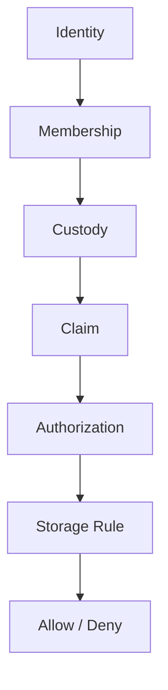

# Mental Smile Storage Rules Constitution V1

## Document Control

| Field | Value |
|---|---|
| Document ID | STORAGE_RULES_CONSTITUTION_V1 |
| Block | BLOCK_6B |
| Era | CONSTITUTIONAL_FIREBASE_RULES_ERA |
| Scope | Storage rules doctrine only |
| Storage Rules Changes | NONE |
| Claims Implementation | NONE |
| Firebase Deployment | NONE |
| Version | v1.0.0 |
| Status | ACTIVE_CONSTITUTIONAL_SOURCE |

## Storage Rules Doctrine

Storage rules evaluate identity, membership, custody, claim, authorization, and storage class before allowing storage consumption. Storage rules do not create custody or authority.

## Storage Evaluation Chain

## Storage Classes

| Storage Class | Purpose | Required Custody |
|---|---|---|
| Identity Storage | Identity documents and identity evidence | Identity Custody |
| Evidence Storage | Validation, decision, drift, escalation evidence | Evidence Custody |
| Archive Storage | Preserved records and retrieval proof | Archive Custody |
| Registry Storage | Registry files/exports/evidence | Registry Custody |
| Asset Storage | Public/private assets and metadata-linked files | Asset Custody |
| Sensitive Storage | IDs, medical, legal, licenses, certificates, owner records | Legal/Sensitive Storage Custody |

## Storage Decisions

| Decision Action | Meaning | Required Authorization |
|---|---|---|
| Read | Consume storage object | Read/Custody authorization |
| Write | Create/update storage object | Write/Custody authorization |
| Retrieve | Retrieve archived or custody-protected object | Archive/Custody authorization |
| Archive | Preserve storage object/evidence | Archive authorization |
| Destroy | Destroy under future retention doctrine | Explicit destruction authorization and archive evidence |

## Forbidden Storage Rule Patterns

| Forbidden Pattern | Reason |
|---|---|
| Generic Admin Storage Access | Admin is not constitutional |
| Hidden Storage Access | Access must be explicit and evidenced |
| Technical Direct Custody | Technical verifies, does not hold custody |
| Runtime Direct Custody | Runtime consumes approved outputs only |
| Wildcard Storage Access | Scope must be bounded |
| Storage Rule Without Custody | Sensitive storage requires custodian |

## Block 6B Validation Result

| Pass Condition | Result |
|---|---|
| Storage rule model defined | PASS |
| Storage evaluation chain defined | PASS |
| Storage classes defined | PASS |
| Storage decisions defined | PASS |
| Forbidden patterns defined | PASS |
| No generic admin storage access exists as doctrine | PASS |

Final result: `BLOCK_6B_STORAGE_RULES_COMPLETE`.
